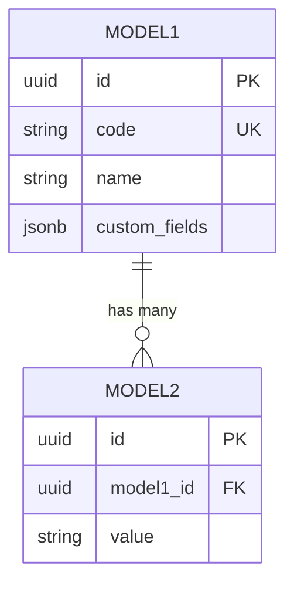

# PRD 文档模板

> 本模板适用于 GZEAMS 平台功能模块的 PRD 编写
> 使用前请仔细阅读 [prd_writing_guide.md](../prd_writing_guide.md)

---

## PRD 文档结构模型

### 必需章节清单

| 章节号 | 章节名称 | 必需性 | 说明 |
|--------|---------|--------|------|
| 1 | 需求概述 | ✅ 必需 | 业务背景、用户角色、功能范围 |
| 2 | 后端实现 | ✅ 必需 | 数据模型、序列化器、ViewSet、Service |
| 3 | 前端实现 | ✅ 必需 | 页面组件、API封装、路由配置 |
| 4 | API接口 | ✅ 必需 | CRUD端点、请求响应示例 |
| 5 | 权限设计 | ✅ 必需 | 权限定义、角色矩阵 |
| 6 | 测试用例 | ✅ 必需 | 后端单元测试、前端组件测试 |
| 7 | 实施计划 | ✅ 必需 | 任务分解、里程碑、风险评估 |
| 8 | 附录 | ⚪ 可选 | 相关文档、变更历史 |

### PRD 质量检查模型

| 检查项 | 标准 | 验证方法 |
|--------|------|----------|
| 公共模型引用 | 包含2.1节公共模型引用表 | 人工审查 |
| 完整性 | 所有必需章节齐全 | 自动化检查 |
| 一致性 | 前后端定义一致 | 人工审查 |
| 可测试性 | 包含测试用例 | 人工审查 |
| 可实施性 | 包含实施计划 | 人工审查 |

---

## 文档信息

| 字段 | 说明 |
|------|------|
| **功能名称** | [功能中文名称] |
| **功能代码** | [feature_code] |
| **文档版本** | 1.0.0 |
| **创建日期** | YYYY-MM-DD |
| **维护人** | [姓名] |
| **审核状态** | ✅ 草稿 / ⏳ 审核中 / ✅ 已审核 |

---

## 目录

1. [需求概述](#1-需求概述)
2. [后端实现](#2-后端实现)
3. [前端实现](#3-前端实现)
4. [API接口](#4-api接口)
5. [权限设计](#5-权限设计)
6. [测试用例](#6-测试用例)
7. [实施计划](#7-实施计划)
8. [附录](#8-附录)

---

## 1. 需求概述

### 1.1 业务背景

**业务场景**:
- 描述当前的业务痛点
- 说明为什么需要这个功能
- 说明业务价值

**现状分析**:
| 现状 | 问题 | 影响 |
|------|------|------|
| 现状1 | 问题描述 | 影响范围 |
| 现状2 | 问题描述 | 影响范围 |

### 1.2 目标用户

| 用户角色 | 使用场景 | 核心需求 |
|---------|---------|----------|
| 系统管理员 | 管理配置 | 需求描述 |
| 普通用户 | 日常使用 | 需求描述 |

### 1.3 功能范围

#### 1.3.1 本次实现范围

- ✅ 功能点1
- ✅ 功能点2
- ✅ 功能点3

#### 1.3.2 未来规划范围

- ⏳ 功能点4 (Phase 2)
- ⏳ 功能点5 (Phase 3)

#### 1.3.3 不在范围内

- ❌ 非目标功能1
- ❌ 非目标功能2

### 1.4 相关文档

| 文档 | 说明 | 关键章节 |
|------|------|----------|
| [文档名](./link.md) | 说明 | §章节号 |

---

## 2. 后端实现

### 2.1 公共模型引用

> ✅ 本模块所有组件必须继承以下公共基类

| 组件类型 | 基类 | 引用路径 | 自动获得功能 |
|---------|------|---------|-------------|
| **Model** | `BaseModel` | `apps.common.models.BaseModel` | 组织隔离、软删除、审计字段、custom_fields |
| **Serializer** | `BaseModelSerializer` | `apps.common.serializers.base.BaseModelSerializer` | 公共字段序列化、custom_fields序列化 |
| **ViewSet** | `BaseModelViewSetWithBatch` | `apps.common.viewsets.base.BaseModelViewSetWithBatch` | 组织过滤、软删除、批量操作 |
| **Filter** | `BaseModelFilter` | `apps.common.filters.base.BaseModelFilter` | 时间范围过滤、用户过滤 |
| **Service** | `BaseCRUDService` | `apps.common.services.base_crud.BaseCRUDService` | 统一CRUD方法 |

### 2.2 数据模型设计

#### 2.2.1 ER图



#### 2.2.2 模型定义

```python
# backend/apps/feature_module/models.py

from django.db import models
from apps.common.models import BaseModel

class FeatureModel(BaseModel):
    """
    功能模型

    继承自 BaseModel,自动获得:
    - organization: 组织外键
    - is_deleted: 软删除标记
    - deleted_at: 删除时间
    - created_at: 创建时间
    - updated_at: 更新时间
    - created_by: 创建人
    - custom_fields: 动态字段(JSONB)
    """

    # 业务字段
    code = models.CharField(max_length=50, unique=True, verbose_name='编码')
    name = models.CharField(max_length=200, verbose_name='名称')
    status = models.CharField(max_length=20, default='active', verbose_name='状态')

    class Meta:
        db_table = 'feature_model'
        verbose_name = '功能模型'
        verbose_name_plural = '功能模型列表'
        ordering = ['-created_at']

    def __str__(self):
        return f"{self.code} - {self.name}"
```

#### 2.2.3 序列化器

```python
# backend/apps/feature_module/serializers.py

from rest_framework import serializers
from apps.common.serializers.base import BaseModelSerializer
from .models import FeatureModel

class FeatureModelSerializer(BaseModelSerializer):
    """
    功能模型序列化器

    继承自 BaseModelSerializer,自动序列化:
    - id, organization, is_deleted, deleted_at
    - created_at, updated_at, created_by
    - custom_fields
    """

    class Meta(BaseModelSerializer.Meta):
        model = FeatureModel
        fields = BaseModelSerializer.Meta.fields + [
            'code', 'name', 'status'
        ]
```

#### 2.2.4 过滤器

```python
# backend/apps/feature_module/filters.py

from django_filters import rest_framework as filters
from apps.common.filters.base import BaseModelFilter
from .models import FeatureModel

class FeatureModelFilter(BaseModelFilter):
    """
    功能模型过滤器

    继承自 BaseModelFilter,自动支持:
    - created_at: 时间范围过滤
    - updated_at: 时间范围过滤
    - created_by: 用户过滤
    - is_deleted: 状态过滤
    """

    # 业务字段过滤
    code = filters.CharFilter(lookup_expr='icontains', label='编码')
    name = filters.CharFilter(lookup_expr='icontains', label='名称')
    status = filters.ChoiceFilter(choices=FeatureModel.STATUS_CHOICES, label='状态')

    class Meta(BaseModelFilter.Meta):
        model = FeatureModel
        fields = BaseModelFilter.Meta.fields + [
            'code', 'name', 'status'
        ]
```

#### 2.2.5 ViewSet

```python
# backend/apps/feature_module/viewsets.py

from rest_framework import viewsets
from apps.common.viewsets.base import BaseModelViewSetWithBatch
from .models import FeatureModel
from .serializers import FeatureModelSerializer
from .filters import FeatureModelFilter

class FeatureModelViewSet(BaseModelViewSetWithBatch):
    """
    功能模型 ViewSet

    继承自 BaseModelViewSetWithBatch,自动获得:
    - 组织隔离自动过滤
    - 软删除记录自动过滤
    - 审计字段自动设置
    - 批量操作接口: /batch-delete/, /batch-restore/, /batch-update/
    - 软删除接口: DELETE 软删除, /deleted/ 查看已删除, /{id}/restore/ 恢复
    """

    queryset = FeatureModel.objects.all()
    serializer_class = FeatureModelSerializer
    filterset_class = FeatureModelFilter
```

### 2.3 Service层

```python
# backend/apps/feature_module/services.py

from apps.common.services.base_crud import BaseCRUDService
from .models import FeatureModel

class FeatureModelService(BaseCRUDService):
    """
    功能模型服务

    继承自 BaseCRUDService,自动获得:
    - create(data, user): 创建记录
    - update(instance_id, data, user): 更新记录
    - delete(instance_id, user): 软删除记录
    - restore(instance_id): 恢复记录
    - get(instance_id): 获取单条记录
    - query(filters): 查询记录
    - paginate(page, page_size, filters): 分页查询
    """

    def __init__(self):
        super().__init__(FeatureModel)

    def get_by_code(self, code: str):
        """根据编码查询"""
        return self.model_class.objects.get(code=code)
```

### 2.4 文件结构

```
backend/apps/feature_module/
├── __init__.py
├── models.py              # 继承 BaseModel
├── serializers.py         # 继承 BaseModelSerializer
├── viewsets.py            # 继承 BaseModelViewSetWithBatch
├── filters.py             # 继承 BaseModelFilter
├── services.py            # 继承 BaseCRUDService
├── urls.py                # 路由配置
└── tests/                 # 测试用例
    ├── __init__.py
    ├── test_models.py
    ├── test_viewsets.py
    └── test_services.py
```

---

## 3. 前端实现

### 3.1 公共组件引用

#### 3.1.1 页面组件清单

| 组件名 | 组件路径 | 用途 | Props | Events |
|--------|---------|------|-------|--------|
| BaseListPage | @/components/common/BaseListPage.vue | 列表页面 | title, fetchMethod, columns | row-click, create |
| BaseFormPage | @/components/common/BaseFormPage.vue | 表单页面 | title, submitMethod, rules | submit-success |
| BaseDetailPage | @/components/common/BaseDetailPage.vue | 详情页面 | title, data, fields | - |

#### 3.1.2 布局组件

| 组件 | 用途 | 引用文档 |
|------|------|---------|
| DynamicTabs | 动态标签页 | [tab_configuration.md](./tab_configuration.md) |
| SectionBlock | 区块容器 | [section_block_layout.md](./section_block_layout.md) |
| FieldRenderer | 字段渲染 | [field_configuration_layout.md](./field_configuration_layout.md) |

#### 3.1.3 Hooks

| Hook | 用途 | 引用路径 |
|------|------|---------|
| useListPage | 列表页面逻辑 | @/composables/useListPage.js |
| useFormPage | 表单页面逻辑 | @/composables/useFormPage.js |
| usePermission | 权限检查 | @/composables/usePermission.js |

### 3.2 页面布局

#### 3.2.1 列表页

```vue
<!-- frontend/src/views/feature_module/FeatureModelList.vue -->

<template>
    <BaseListPage
        title="功能模型列表"
        :fetch-method="fetchData"
        :batch-delete-method="batchDelete"
        :columns="columns"
        :search-fields="searchFields"
        :filter-fields="filterFields"
        :custom-slots="['status', 'actions']"
        @row-click="handleRowClick"
        @create="handleCreate"
    >
        <!-- 状态列插槽 -->
        <template #status="{ row }">
            <el-tag :type="getStatusType(row.status)">
                {{ getStatusLabel(row.status) }}
            </el-tag>
        </template>

        <!-- 操作列插槽 -->
        <template #actions="{ row }">
            <el-button link type="primary" @click.stop="handleEdit(row)">
                编辑
            </el-button>
            <el-button link type="danger" @click.stop="handleDelete(row)">
                删除
            </el-button>
        </template>
    </BaseListPage>
</template>

<script setup>
import { ref } from 'vue'
import { useRouter } from 'vue-router'
import BaseListPage from '@/components/common/BaseListPage.vue'
import { featureApi } from '@/api/feature_module'

const router = useRouter()

const columns = [
    { prop: 'code', label: '编码', width: 150 },
    { prop: 'name', label: '名称', minWidth: 200 },
    { prop: 'status', label: '状态', width: 100, slot: true },
    { prop: 'created_at', label: '创建时间', width: 180 },
    { prop: 'actions', label: '操作', width: 150, slot: true, fixed: 'right' }
]

const searchFields = [
    { prop: 'keyword', label: '搜索', placeholder: '编码/名称' }
]

const filterFields = [
    { prop: 'status', label: '状态', options: [...] }
]

const fetchData = (params) => featureApi.list(params)
const batchDelete = (data) => featureApi.batchDelete(data)

const handleRowClick = (row) => {
    router.push(`/feature-module/${row.id}`)
}

const handleCreate = () => {
    router.push('/feature-module/create')
}

const handleEdit = (row) => {
    router.push(`/feature-module/${row.id}/edit`)
}

const handleDelete = async (row) => {
    await featureApi.delete(row.id)
    // 刷新列表
}
</script>
```

#### 3.2.2 表单页

```vue
<!-- frontend/src/views/feature_module/FeatureModelForm.vue -->

<template>
    <BaseFormPage
        title="新建功能模型"
        :submit-method="handleSubmit"
        :rules="rules"
        :initial-data="initialData"
        redirect-path="/feature-module"
    >
        <template #default="{ data }">
            <el-form-item label="编码" prop="code">
                <el-input v-model="data.code" placeholder="请输入编码" />
            </el-form-item>

            <el-form-item label="名称" prop="name">
                <el-input v-model="data.name" placeholder="请输入名称" />
            </el-form-item>

            <el-form-item label="状态" prop="status">
                <el-select v-model="data.status" placeholder="请选择状态">
                    <el-option label="启用" value="active" />
                    <el-option label="禁用" value="inactive" />
                </el-select>
            </el-form-item>
        </template>
    </BaseFormPage>
</template>

<script setup>
import { ref, onMounted } from 'vue'
import { useRoute } from 'vue-router'
import BaseFormPage from '@/components/common/BaseFormPage.vue'
import { featureApi } from '@/api/feature_module'

const route = useRoute()
const initialData = ref({})

const rules = {
    code: [
        { required: true, message: '请输入编码', trigger: 'blur' }
    ],
    name: [
        { required: true, message: '请输入名称', trigger: 'blur' }
    ],
    status: [
        { required: true, message: '请选择状态', trigger: 'change' }
    ]
}

const handleSubmit = async (data) => {
    const id = route.params.id
    if (id) {
        return await featureApi.update(id, data)
    } else {
        return await featureApi.create(data)
    }
}

onMounted(async () => {
    const id = route.params.id
    if (id) {
        const response = await featureApi.get(id)
        initialData.value = response.data
    }
})
</script>
```

### 3.3 API封装

```javascript
// frontend/src/api/feature_module.js

import request from '@/utils/request'

export const featureApi = {
    /**
     * 获取列表
     */
    list(params) {
        return request({
            url: '/api/feature-models/',
            method: 'get',
            params
        })
    },

    /**
     * 获取详情
     */
    get(id) {
        return request({
            url: `/api/feature-models/${id}/`,
            method: 'get'
        })
    },

    /**
     * 创建
     */
    create(data) {
        return request({
            url: '/api/feature-models/',
            method: 'post',
            data
        })
    },

    /**
     * 更新
     */
    update(id, data) {
        return request({
            url: `/api/feature-models/${id}/`,
            method: 'put',
            data
        })
    },

    /**
     * 删除
     */
    delete(id) {
        return request({
            url: `/api/feature-models/${id}/`,
            method: 'delete'
        })
    },

    /**
     * 批量删除
     */
    batchDelete(data) {
        return request({
            url: '/api/feature-models/batch-delete/',
            method: 'post',
            data
        })
    }
}
```

### 3.4 路由配置

```javascript
// frontend/src/router/index.js

{
    path: '/feature-module',
    name: 'FeatureModule',
    component: () => import('@/layouts/MainLayout.vue'),
    meta: { title: '功能模块', icon: 'feature' },
    children: [
        {
            path: '',
            name: 'FeatureModelList',
            component: () => import('@/views/feature_module/FeatureModelList.vue'),
            meta: { title: '功能模型列表' }
        },
        {
            path: 'create',
            name: 'FeatureModelCreate',
            component: () => import('@/views/feature_module/FeatureModelForm.vue'),
            meta: { title: '新建功能模型' }
        },
        {
            path: ':id',
            name: 'FeatureModelDetail',
            component: () => import('@/views/feature_module/FeatureModelDetail.vue'),
            meta: { title: '功能模型详情' }
        },
        {
            path: ':id/edit',
            name: 'FeatureModelEdit',
            component: () => import('@/views/feature_module/FeatureModelForm.vue'),
            meta: { title: '编辑功能模型' }
        }
    ]
}
```

---

## 4. API接口

### 4.1 标准CRUD端点

继承 `BaseModelViewSet` 后,自动提供以下端点:

| 方法 | 端点 | 说明 | 请求示例 |
|------|------|------|----------|
| GET | `/api/feature-models/` | 列表查询(分页、过滤、搜索) | `?page=1&page_size=20&status=active` |
| GET | `/api/feature-models/{id}/` | 获取单条记录 | - |
| POST | `/api/feature-models/` | 创建新记录 | 见下方请求示例 |
| PUT | `/api/feature-models/{id}/` | 完整更新 | 见下方请求示例 |
| PATCH | `/api/feature-models/{id}/` | 部分更新 | 见下方请求示例 |
| DELETE | `/api/feature-models/{id}/` | 软删除 | - |
| GET | `/api/feature-models/deleted/` | 查看已删除记录 | - |
| POST | `/api/feature-models/{id}/restore/` | 恢复已删除记录 | - |
| POST | `/api/feature-models/batch-delete/` | 批量软删除 | 见下方请求示例 |
| POST | `/api/feature-models/batch-restore/` | 批量恢复 | - |
| POST | `/api/feature-models/batch-update/` | 批量更新 | - |

### 4.2 请求/响应示例

#### 4.2.1 创建记录

**请求**:

```http
POST /api/feature-models/ HTTP/1.1
Content-Type: application/json
X-Organization-Id: {org_id}

{
    "code": "FEATURE001",
    "name": "功能模型示例",
    "status": "active"
}
```

**响应**:

```http
HTTP/1.1 201 Created
Content-Type: application/json

{
    "success": true,
    "message": "创建成功",
    "data": {
        "id": "550e8400-e29b-41d4-a716-446655440000",
        "code": "FEATURE001",
        "name": "功能模型示例",
        "status": "active",
        "organization": {
            "id": "org-id",
            "name": "组织名称"
        },
        "created_at": "2026-01-15T10:30:00Z",
        "created_by": {
            "id": "user-id",
            "username": "admin"
        }
    }
}
```

#### 4.2.2 批量删除

**请求**:

```http
POST /api/feature-models/batch-delete/ HTTP/1.1
Content-Type: application/json

{
    "ids": [
        "550e8400-e29b-41d4-a716-446655440000",
        "550e8400-e29b-41d4-a716-446655440001"
    ]
}
```

**响应(全部成功)**:

```http
HTTP/1.1 200 OK
Content-Type: application/json

{
    "success": true,
    "message": "批量删除完成",
    "summary": {
        "total": 2,
        "succeeded": 2,
        "failed": 0
    },
    "results": [
        {"id": "550e8400-e29b-41d4-a716-446655440000", "success": true},
        {"id": "550e8400-e29b-41d4-a716-446655440001", "success": true}
    ]
}
```

**响应(部分失败)**:

```http
HTTP/1.1 207 Multi-Status
Content-Type: application/json

{
    "success": false,
    "message": "批量删除完成(部分失败)",
    "summary": {
        "total": 2,
        "succeeded": 1,
        "failed": 1
    },
    "results": [
        {"id": "550e8400-e29b-41d4-a716-446655440000", "success": true},
        {
            "id": "550e8400-e29b-41d4-a716-446655440001",
            "success": false,
            "error": "记录不存在"
        }
    ]
}
```

### 4.3 错误响应

遵循 [api.md](./api.md) 中定义的标准错误码:

```http
HTTP/1.1 400 Bad Request
Content-Type: application/json

{
    "success": false,
    "error": {
        "code": "VALIDATION_ERROR",
        "message": "请求数据验证失败",
        "details": {
            "code": ["该字段不能为空"],
            "status": ["请选择有效状态"]
        }
    }
}
```

---

## 5. 权限设计

### 5.1 权限定义

| 权限代码 | 说明 | 角色 |
|---------|------|------|
| `feature_model.view` | 查看权限 | 所有用户 |
| `feature_model.add` | 创建权限 | 管理员 |
| `feature_model.change` | 编辑权限 | 管理员 |
| `feature_model.delete` | 删除权限 | 管理员 |

### 5.2 权限配置

在 ViewSet 中配置权限:

```python
from apps.common.permissions.base import BasePermission, IsOrganizationMember

class FeatureModelViewSet(BaseModelViewSetWithBatch):
    queryset = FeatureModel.objects.all()
    serializer_class = FeatureModelSerializer
    filterset_class = FeatureModelFilter

    # 权限配置
    permission_classes = [
        IsOrganizationMember,  # 必须是组织成员
        BasePermission,         # 基础权限检查
    ]
```

---

## 6. 测试用例

### 6.1 后端单元测试

```python
# backend/apps/feature_module/tests/test_viewsets.py

import pytest
from django.test import TestCase
from rest_framework.test import APIClient
from apps.feature_module.models import FeatureModel
from apps.accounts.models import User

class FeatureModelViewSetTest(TestCase):
    """功能模型 ViewSet 测试"""

    def setUp(self):
        """测试前准备"""
        self.client = APIClient()
        self.user = User.objects.create_user(
            username='testuser',
            password='testpass123'
        )
        self.client.force_authenticate(user=self.user)

    def test_list_should_return_active_records_only(self):
        """测试列表接口只返回未删除记录"""
        # Arrange
        FeatureModel.objects.create(code='TEST001', name='测试1')
        deleted_model = FeatureModel.objects.create(code='TEST002', name='测试2')
        deleted_model.soft_delete()

        # Act
        response = self.client.get('/api/feature-models/')

        # Assert
        self.assertEqual(response.status_code, 200)
        self.assertEqual(len(response.data['results']), 1)
        self.assertEqual(response.data['results'][0]['code'], 'TEST001')

    def test_create_should_set_organization_automatically(self):
        """测试创建时自动设置组织"""
        # Arrange
        data = {
            'code': 'TEST003',
            'name': '测试3',
            'status': 'active'
        }

        # Act
        response = self.client.post('/api/feature-models/', data)

        # Assert
        self.assertEqual(response.status_code, 201)
        model = FeatureModel.objects.get(code='TEST003')
        self.assertIsNotNone(model.organization_id)

    def test_delete_should_soft_delete(self):
        """测试删除应为软删除"""
        # Arrange
        model = FeatureModel.objects.create(code='TEST004', name='测试4')

        # Act
        response = self.client.delete(f'/api/feature-models/{model.id}/')

        # Assert
        self.assertEqual(response.status_code, 200)
        model.refresh_from_db()
        self.assertTrue(model.is_deleted)
        self.assertIsNotNone(model.deleted_at)
```

### 6.2 前端组件测试

```javascript
// frontend/src/views/feature_module/__tests__/FeatureModelList.spec.js

import { describe, it, expect, vi, beforeEach } from 'vitest'
import { mount } from '@vue/test-utils'
import FeatureModelList from '../FeatureModelList.vue'
import { featureApi } from '@/api/feature_module'

vi.mock('@/api/feature_module')

describe('FeatureModelList', () => {
    beforeEach(() => {
        vi.clearAllMocks()
    })

    it('should render table with data', async () => {
        // Arrange
        const mockData = {
            success: true,
            data: {
                count: 1,
                results: [
                    { id: '1', code: 'TEST001', name: '测试1', status: 'active' }
                ]
            }
        }
        featureApi.list.mockResolvedValue(mockData)

        // Act
        const wrapper = mount(FeatureModelList)
        await wrapper.vm.$nextTick()

        // Assert
        expect(wrapper.find('.base-table').exists()).toBe(true)
    })

    it('should call create API when create button clicked', async () => {
        // Arrange
        const routerPush = vi.spyOn(wrapper.vm.$router, 'push')

        // Act
        await wrapper.vm.handleCreate()

        // Assert
        expect(routerPush).toHaveBeenCalledWith('/feature-module/create')
    })
})
```

### 6.3 集成测试

```python
# backend/apps/feature_module/tests/test_integration.py

import pytest
from rest_framework.test import APIClient
from apps.feature_module.models import FeatureModel
from apps.accounts.models import User

@pytest.mark.django_db
class FeatureModelIntegrationTest:
    """功能模型集成测试"""

    def test_full_crud_workflow(self):
        """测试完整CRUD流程"""
        client = APIClient()
        user = User.objects.create_user(username='test', password='test')
        client.force_authenticate(user=user)

        # 1. 创建
        response = client.post('/api/feature-models/', {
            'code': 'INT001',
            'name': '集成测试',
            'status': 'active'
        })
        assert response.status_code == 201
        model_id = response.data['data']['id']

        # 2. 查询
        response = client.get(f'/api/feature-models/{model_id}/')
        assert response.status_code == 200
        assert response.data['data']['code'] == 'INT001'

        # 3. 更新
        response = client.put(f'/api/feature-models/{model_id}/', {
            'code': 'INT001',
            'name': '集成测试-已更新',
            'status': 'inactive'
        })
        assert response.status_code == 200

        # 4. 删除
        response = client.delete(f'/api/feature-models/{model_id}/')
        assert response.status_code == 200

        # 5. 验证软删除
        model = FeatureModel.all_objects.get(id=model_id)
        assert model.is_deleted is True

        # 6. 恢复
        response = client.post(f'/api/feature-models/{model_id}/restore/')
        assert response.status_code == 200
        model.refresh_from_db()
        assert model.is_deleted is False
```

### 6.4 E2E测试

```javascript
// tests/e2e/feature_module.spec.js

import { test, expect } from '@playwright/test'

test.describe('功能模块 E2E 测试', () => {
    test.beforeEach(async ({ page }) => {
        // 登录
        await page.goto('/login')
        await page.fill('input[name="username"]', 'admin')
        await page.fill('input[name="password"]', 'admin123')
        await page.click('button[type="submit"]')
        await page.waitForURL('/dashboard')
    })

    test('创建功能模型完整流程', async ({ page }) => {
        // 导航到列表页
        await page.goto('/feature-module')
        await expect(page).toHaveTitle(/功能模型列表/)

        // 点击新建按钮
        await page.click('button:has-text("新建")')
        await expect(page).toHaveURL(/\/feature-module\/create/)

        // 填写表单
        await page.fill('input[name="code"]', 'E2E001')
        await page.fill('input[name="name"]', 'E2E测试')
        await page.selectOption('select[name="status"]', 'active')

        // 提交
        await page.click('button:has-text("提交")')

        // 验证成功
        await expect(page).toHaveURL(/\/feature-module\/E2E001/)
        await expect(page.locator('text=创建成功')).toBeVisible()
    })
})
```

---

## 7. 实施计划

### 7.1 开发任务分解

| 阶段 | 任务 | 负责人 | 工作量 | 依赖 |
|------|------|--------|--------|------|
| **1. 数据模型** | 创建Model和Migration | 后端开发 | 2h | - |
| | 编写Serializer | 后端开发 | 1h | Model |
| | 编写Filter | 后端开发 | 1h | Model |
| **2. 业务逻辑** | 实现Service | 后端开发 | 2h | Serializer |
| | 实现ViewSet | 后端开发 | 2h | Service |
| | 编写单元测试 | 后端开发 | 3h | ViewSet |
| **3. API集成** | 配置URL | 后端开发 | 0.5h | ViewSet |
| | API测试 | 测试工程师 | 2h | ViewSet |
| **4. 前端页面** | 列表页开发 | 前端开发 | 4h | API |
| | 表单页开发 | 前端开发 | 3h | API |
| | 详情页开发 | 前端开发 | 2h | API |
| | 前端组件测试 | 前端开发 | 2h | 页面 |
| **5. 联调测试** | 前后端联调 | 全栈 | 4h | 全部 |
| | 集成测试 | 测试工程师 | 3h | 全部 |
| | E2E测试 | 测试工程师 | 2h | 全部 |
| **6. 上线部署** | 代码审查 | Team | 2h | 全部 |
| | 部署上线 | 运维 | 1h | 审查通过 |
| | 验收测试 | 产品+测试 | 2h | 部署完成 |

**总工作量**: 约 38.5 小时

### 7.2 里程碑

| 里程碑 | 交付物 | 预计日期 |
|--------|--------|----------|
| M1: 数据模型完成 | Model, Serializer, Filter, Migration | D+2 |
| M2: 后端API完成 | ViewSet, Service, 单元测试 | D+5 |
| M3: 前端页面完成 | 列表、表单、详情页 | D+9 |
| M4: 联调测试完成 | 集成测试、E2E测试 | D+12 |
| M5: 上线 | 生产环境部署 | D+13 |

### 7.3 风险与对策

| 风险 | 概率 | 影响 | 对策 |
|------|------|------|------|
| 公共基类不兼容 | 低 | 高 | 提前验证公共基类功能 |
| 前后端接口不一致 | 中 | 中 | 使用OpenAPI文档明确接口 |
| 测试覆盖不足 | 中 | 中 | 强制要求单元测试覆盖率>80% |
| 性能问题 | 低 | 中 | 使用Django Debug Toolbar监控 |

---

## 8. 附录

### 8.1 相关文档

| 文档 | 说明 | 关键章节 |
|------|------|----------|
| [prd_writing_guide.md](./prd_writing_guide.md) | PRD编写指南 | 全部 |
| [backend.md](./backend.md) | 后端基类实现 | §2-5 |
| [frontend.md](./frontend.md) | 前端公共组件 | §2-3 |
| [api.md](./api.md) | API规范 | §1-2 |

### 8.2 变更历史

| 版本 | 日期 | 变更内容 | 作者 |
|------|------|----------|------|
| 1.0.0 | YYYY-MM-DD | 初始版本 | [姓名] |

### 8.3 审核记录

| 角色 | 姓名 | 审核意见 | 日期 |
|------|------|----------|------|
| 产品经理 | | | |
| 技术主管 | | | |
| 测试主管 | | | |

### 8.4 快速检查清单

#### 后端检查清单

- [ ] Model 继承 BaseModel
- [ ] Serializer 继承 BaseModelSerializer
- [ ] ViewSet 继承 BaseModelViewSetWithBatch
- [ ] Filter 继承 BaseModelFilter
- [ ] Service 继承 BaseCRUDService
- [ ] 单元测试覆盖率 > 80%
- [ ] API 响应格式符合 api.md 规范

#### 前端检查清单

- [ ] 使用公共页面组件(BaseListPage/BaseFormPage)
- [ ] API 调用封装在 @/api/ 目录
- [ ] 组件测试覆盖率 > 80%
- [ ] 全局错误处理正常工作
- [ ] 布局响应式适配

#### 文档检查清单

- [ ] 包含公共模型引用声明
- [ ] 包含公共组件引用清单
- [ ] 包含测试用例
- [ ] 包含实施计划
- [ ] 代码示例完整可运行

---

**文档结束**

如需帮助,请参考:
- [PRD编写指南](./prd_writing_guide.md)
- [后端实现参考](./backend.md)
- [前端实现参考](./frontend.md)
- [API规范参考](./api.md)
