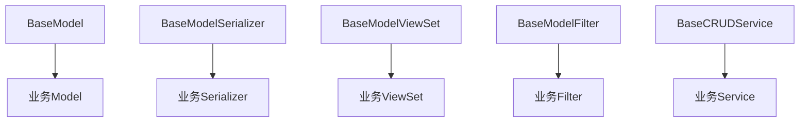

# Common Base Features: 公共功能模块 - 总览

## 概述

基于 `BaseModel` 构建统一的公共功能层，为所有业务模块提供标准化的基类、服务、API 规范和前端组件，消除重复代码，确保系统行为一致性。

---

## 架构层次模型

### 系统分层架构

| 层级 | 名称 | 说明 | 组件 |
|------|------|------|------|
| Layer 1 | 核心层 | 数据模型与基础服务 | BaseModel, BaseResponse, ExceptionHandler |
| Layer 2 | 传统模式层 | 代码继承模式基类 | BaseModelSerializer, ViewSet, CRUDService |
| Layer 3 | 元数据驱动层 | 配置驱动的低代码模式 | MetadataDrivenSerializer, ViewSet, Service |
| Layer 4 | 扩展层 | 高级功能扩展 | 工作流集成、动态报表、数据迁移 |

### 传统模式 vs 元数据驱动模式对比

| 对比维度 | 传统模式 | 元数据驱动模式 |
|---------|---------|---------------|
| **定义方式** | 代码定义 | 配置定义 |
| **适用场景** | 核心实体、复杂业务逻辑 | 动态表单、可配置业务对象 |
| **开发效率** | 需编写代码 | 无代码/低代码配置 |
| **灵活性** | 编译时确定 | 运行时动态修改 |
| **性能** | 略高（直接ORM） | 略低（动态解析） |
| **维护成本** | 代码维护 | 配置维护 |
| **学习曲线** | 需Django/DRF基础 | 需理解元数据概念 |

### 公共基类继承关系



### 核心功能清单

| 功能类别 | 组件名 | 优先级 | 状态 | 文档 |
|---------|--------|--------|------|------|
| 后端基类 | BaseModelSerializer | P0 | ✅ 已设计 | backend.md |
| 后端基类 | BaseModelViewSet | P0 | ✅ 已设计 | backend.md |
| 后端基类 | BaseCRUDService | P0 | ✅ 已设计 | backend.md |
| 后端基类 | BaseModelFilter | P0 | ✅ 已设计 | backend.md |
| API规范 | BaseResponse | P1 | ✅ 已设计 | api.md |
| API规范 | ExceptionHandler | P1 | ✅ 已设计 | api.md |
| API规范 | 批量操作 | P1 | ✅ 已设计 | api.md |
| 前端组件 | BaseListPage | P2 | ✅ 已设计 | frontend.md |
| 前端组件 | BaseFormPage | P2 | ✅ 已设计 | frontend.md |
| 前端组件 | BaseDetailPage | P2 | ✅ 已设计 | frontend.md |
| 元数据驱动 | MetadataDrivenSerializer | P0 | ✅ 已设计 | metadata_driven.md |
| 元数据驱动 | MetadataDrivenViewSet | P0 | ✅ 已设计 | metadata_driven.md |
| 元数据驱动 | MetadataDrivenService | P0 | ✅ 已设计 | dynamic_data_service.md |

---

## 1. 业务背景

### 1.1 现状分析

| 现状 | 问题 |
|------|------|
| **各模块独立实现序列化器** | 公共字段（id, organization, created_at 等）序列化逻辑重复 |
| **各模块独立实现 ViewSet** | 软删除、组织过滤、审计字段设置逻辑重复 |
| **各模块独立实现 Service** | CRUD 操作模式重复，没有统一规范 |
| **各模块独立实现 Filter** | 时间范围、创建人等公共过滤逻辑重复 |
| **批量操作不统一** | 接口格式、错误处理方式不一致 |
| **API 响应格式不统一** | 成功/错误响应结构略有差异 |

### 1.2 核心目标

1. **消除重复代码** - 将公共逻辑提取到基类中
2. **统一行为规范** - 所有模块遵循相同的数据处理方式
3. **提升开发效率** - 新模块只需继承基类即可获得完整功能
4. **降低维护成本** - 公共逻辑修改一处即可全局生效

---

## 2. 架构设计

```
┌─────────────────────────────────────────────────────────────────────────┐
│                        Common Base Features 架构                         │
├─────────────────────────────────────────────────────────────────────────┤
│                                                                           │
│  ┌───────────────────────────────────────────────────────────────────┐  │
│  │                        Backend Layer                              │  │
│  ├───────────────────────────────────────────────────────────────────┤  │
│  │                                                                   │  │
│  │  ┌──────────────────┐  ┌──────────────────┐  ┌────────────────┐ │  │
│  │  │ BaseModelViewSet │  │ BaseSerializer   │  │  BaseFilter    │ │  │
│  │  │                  │  │                  │  │                │ │  │
│  │  │ - get_queryset   │  │ - 公共字段序列化  │  │ - 时间过滤     │ │  │
│  │  │ - perform_create │  │ - custom_fields  │  │ - 用户过滤     │ │  │
│  │  │ - perform_update │  │ - 审计字段用户   │  │ - 组织过滤     │ │  │
│  │  │ - perform_destroy│  │                  │  │                │ │  │
│  │  │ - batch_* actions│  │                  │  │                │ │  │
│  │  └────────┬─────────┘  └────────┬─────────┘  └────────┬───────┘ │  │
│  │           │                     │                     │          │  │
│  │           └─────────────────────┼─────────────────────┘          │  │
│  │                                 ▼                                │  │
│  │                    ┌───────────────────────┐                     │  │
│  │                    │   BaseCRUDService      │                     │  │
│  │                    │                        │                     │  │
│  │                    │ - create()            │                     │  │
│  │                    │ - update()            │                     │  │
│  │                    │ - delete() (soft)     │                     │  │
│  │                    │ - restore()           │                     │  │
│  │                    │ - query()             │                     │  │
│  │                    └───────────────────────┘                     │  │
│  └───────────────────────────────────────────────────────────────────┘  │
│                                 │                                        │
│                                 ▼                                        │
│  ┌───────────────────────────────────────────────────────────────────┐  │
│  │                        API Layer                                  │  │
│  ├───────────────────────────────────────────────────────────────────┤  │
│  │                                                                   │  │
│  │  ┌────────────────────────┐  ┌────────────────────────────────┐  │  │
│  │  │   BaseResponse         │  │   BaseExceptionHandler          │  │  │
│  │  │                        │  │                                │  │  │
│  │  │ - success()            │  │ - 统一错误码                    │  │  │
│  │  │ - error()              │  │ - 统一错误响应                  │  │  │
│  │  │ - paginated()          │  │ - 自动日志记录                  │  │  │
│  │  └────────────────────────┘  └────────────────────────────────┘  │  │
│  │                                                                   │  │
│  │  ┌────────────────────────────────────────────────────────────┐  │  │
│  │  │              批量操作 API 规范                              │  │  │
│  │  │  POST /api/{resource}/batch-delete/                        │  │  │
│  │  │  POST /api/{resource}/batch-restore/                       │  │  │
│  │  │  POST /api/{resource}/batch-update/                        │  │  │
│  │  └────────────────────────────────────────────────────────────┘  │  │
│  └───────────────────────────────────────────────────────────────────┘  │
│                                 │                                        │
│                                 ▼                                        │
│  ┌───────────────────────────────────────────────────────────────────┐  │
│  │                        Frontend Layer                             │  │
│  ├───────────────────────────────────────────────────────────────────┤  │
│  │                                                                   │  │
│  │  ┌──────────────────┐  ┌──────────────────┐  ┌────────────────┐  │  │
│  │  │  BaseListPage    │  │  BaseFormPage    │  │ BaseDetailPage │  │  │
│  │  │                  │  │                  │  │                │  │  │
│  │  │ - 统一列表布局    │  │ - 统一表单布局    │  │ - 统一详情布局  │  │  │
│  │  │ - 内置搜索筛选    │  │ - 统一验证处理    │  │ - 审计信息展示  │  │  │
│  │  │ - 内置分页组件    │  │ - 统一提交处理    │  │ - 变更历史     │  │  │
│  │  └──────────────────┘  └──────────────────┘  └────────────────┘  │  │
│  └───────────────────────────────────────────────────────────────────┘  │
│                                                                           │
└───────────────────────────────────────────────────────────────────────────┘
```

---

## 3. 功能清单

### 3.1 后端基类（传统模式 - P0）

| 基类 | 功能说明 | 优先级 | 状态 |
|------|---------|--------|------|
| **BaseModelSerializer** | 自动序列化 BaseModel 公共字段 | P0 | ✅ 已设计 |
| **BaseModelViewSet** | 自动处理组织隔离、软删除、审计字段 | P0 | ✅ 已设计 |
| **BaseCRUDService** | 统一 CRUD 操作方法 | P0 | ✅ 已设计 |
| **BaseModelFilter** | 公共字段过滤器 | P0 | ✅ 已设计 |
| **批量操作 Mixin** | 统一的批量删除/恢复/更新接口 | P0 | ✅ 已设计 |
| **BasePermission** | 基于角色的动态权限控制 | P0 | ✅ 已设计 |
| **BaseCacheMixin** | 缓存基类 Mixin | P0 | ✅ 已设计 |

### 3.2 元数据驱动核心（低代码模式 - P0）

| 组件 | 功能说明 | 优先级 | 状态 |
|------|---------|--------|------|
| **MetadataDrivenSerializer** | 基于 BusinessObject/FieldDefinition 动态生成序列化器 | P0 | ✅ 已设计 |
| **MetadataDrivenViewSet** | 动态路由与权限控制 | P0 | ✅ 已设计 |
| **MetadataDrivenService** | DynamicData CRUD 服务，支持 custom_fields | P0 | ✅ 已设计 |
| **DynamicFieldValidator** | 基于 FieldDefinition 的动态验证 | P0 | ✅ 已设计 |
| **useMetadata/useValidation/useFormula** | Vue3 元数据驱动 Hooks | P0 | ✅ 已设计 |

### 3.3 元数据驱动扩展（低代码增强 - P0）

| 功能 | 功能说明 | 优先级 | 状态 |
|------|---------|--------|------|
| **工作流配置驱动集成** | PageLayout.workflow_actions + 字段级权限 | P0 | ✅ 已设计 |
| **ReportLayout 动态报表** | 独立报表模型，支持图表/透视/导出 | P0 | ✅ 已设计 |
| **字段级联配置** | cascade_config 支持 visibility/options/value | P0 | ✅ 已设计 |
| **Schema 版本化** | FieldDefinition.version + 数据迁移服务 | P0 | ✅ 已设计 |

### 3.4 API 层规范（P1）

| 组件 | 功能说明 | 优先级 | 状态 |
|------|---------|--------|------|
| **BaseResponse** | 统一的 API 响应格式 | P1 | ✅ 已设计 |
| **BaseExceptionHandler** | 统一的异常处理机制 | P1 | ✅ 已设计 |
| **批量操作 API 规范** | 标准化的批量操作接口 | P1 | ✅ 已设计 |
| **API 版本控制** | URL 路径版本化策略 | P1 | ✅ 已设计 |
| **导入导出 API** | 数据批量导入导出 | P1 | ✅ 已设计 |

### 3.5 前端公共组件（P2）

| 组件 | 功能说明 | 优先级 | 状态 |
|------|---------|--------|------|
| **BaseListPage** | 标准列表页面组件 | P2 | ✅ 已设计 |
| **BaseFormPage** | 标准表单页面组件 | P2 | ✅ 已设计 |
| **BaseDetailPage** | 标准详情页面组件 | P2 | ✅ 已设计 |
| **BaseAuditInfo** | 审计信息展示组件 | P2 | ✅ 已设计 |
| **BaseSearchBar** | 搜索栏组件 | P2 | ✅ 已设计 |
| **BaseTable** | 表格组件 | P2 | ✅ 已设计 |
| **BasePagination** | 分页组件 | P2 | ✅ 已设计 |
| **BaseFileUpload** | 文件上传组件 | P2 | ✅ 已设计 |
| **全局错误处理** | 统一错误处理机制 | P2 | ✅ 已设计 |
| **MetadataDrivenList** | 元数据驱动列表 | P2 | ✅ 已设计 |
| **MetadataDrivenForm** | 元数据驱动表单 | P2 | ✅ 已设计 |
| **useMetadata** | 元数据Hook | P2 | ✅ 已设计 |
| **useValidation** | 验证规则Hook | P2 | ✅ 已设计 |
| **useFormula** | 公式计算Hook | P2 | ✅ 已设计 |

### 3.6 增强功能（P2）

| 功能 | 功能说明 | 优先级 |
|------|---------|--------|
| **AuditLog** | 统一的审计日志模型 | P2 |
| **BaseCache** | 统一的缓存策略 | P2 |
| **BaseSearch** | 统一的全文搜索 | P2 |

---

## 4. 设计原则

### 4.1 约定优于配置

- 继承基类即获得默认行为
- 特殊需求可通过重写方法实现

### 4.2 单一职责

- 每个基类只负责一类功能
- 序列化、视图、服务分离

### 4.3 开放封闭

- 对扩展开放 - 支持方法重写
- 对修改封闭 - 默认行为稳定

### 4.4 向后兼容

- 不影响现有代码
- 逐步迁移到新基类

---

## 5. 性能优化策略

### 5.1 后端性能优化

#### 5.1.1 查询优化
- **select_related/prefetch_related**: 自动应用以减少N+1查询
- **数据库索引**: 为常用过滤字段自动添加索引
- **查询缓存**: 对频繁访问的只读数据启用缓存

#### 5.1.2 缓存策略
- **BaseCacheMixin**: 提供5层缓存策略
  1. **L1缓存**: 内存缓存（请求级别）
  2. **L2缓存**: Redis缓存（分布式共享）
  3. **查询缓存**: 缓存常用查询结果
  4. **对象缓存**: 缓存序列化后的对象
  5. **页面缓存**: 缓存渲染后的响应

```python
# 缓存使用示例
class AssetViewSet(BaseModelViewSet, BaseCacheMixin):
    cache_timeout = 300  # 5分钟
    cache_key_prefix = 'asset'

    def list(self, request, *args, **kwargs):
        # 尝试从缓存获取
        cache_key = self.get_cache_key('list', request.query_params)
        cached_data = self.cache_get(cache_key)
        if cached_data:
            return Response(cached_data)

        # 缓存未命中，执行查询
        response = super().list(request, *args, **kwargs)

        # 存入缓存
        self.cache_set(cache_key, response.data)

        return response
```

#### 5.1.3 批量操作优化
- **批量创建**: 使用 bulk_create 代替循环 create
- **批量更新**: 使用 bulk_update 代替循环 update
- **批量删除**: 使用 QuerySet 批量操作

### 5.2 前端性能优化

#### 5.2.1 渲染优化
- **虚拟滚动**: 大列表使用虚拟滚动组件
- **懒加载**: 组件和数据按需加载
- **防抖节流**: 搜索和输入使用防抖处理

#### 5.2.2 数据优化
- **请求合并**: 合并多个相关API请求
- **本地缓存**: 使用 localStorage/IndexedDB 缓存静态数据
- **分页加载**: 列表数据分页加载

#### 5.2.3 包体积优化
- **按需引入**: Element Plus 按需引入
- **代码分割**: 路由级别代码分割
- **Tree Shaking**: 移除未使用代码

### 5.3 元数据驱动性能优化

#### 5.3.1 元数据缓存
```python
class MetadataCacheService:
    """元数据缓存服务"""

    def get_field_definitions(self, business_object_id: int) -> List[FieldDefinition]:
        cache_key = f'metadata:fields:{business_object_id}'

        # 尝试从Redis获取
        cached = cache.get(cache_key)
        if cached:
            return json.loads(cached)

        # 查询数据库
        fields = FieldDefinition.objects.filter(
            business_object_id=business_object_object_id
        ).select_related('business_object')

        # 缓存结果
        cache.set(cache_key, json.dumps(fields), timeout=3600)

        return fields
```

#### 5.3.2 级联计算优化
- **规则预编译**: 提前编译级联规则表达式
- **增量计算**: 只重新计算受影响的字段
- **计算缓存**: 缓存值级联计算结果

#### 5.3.3 表单渲染优化
- **字段虚拟化**: 只渲染可见区域内的表单字段
- **延迟验证**: 字段失焦时才执行验证
- **异步计算**: 公式计算使用 Web Worker

### 5.4 监控指标

| 指标 | 目标值 | 监控方式 |
|------|--------|----------|
| API响应时间 | < 200ms | APM工具 |
| 数据库查询时间 | < 50ms | 慢查询日志 |
| 缓存命中率 | > 80% | Redis监控 |
| 前端FCP | < 1s | Lighthouse |
| 前端LCP | < 2.5s | Lighthouse |

---

## 6. 与现有代码的关系

### 6.1 已有功能

| 功能 | 现状 | 处理方式 |
|------|------|---------|
| BaseModel | ✅ 已实现 | 保持不变 |
| OrganizationManager | ✅ 已实现 | 保持不变 |
| 软删除方法 | ✅ 已实现 | 保持不变 |
| 审计字段自动填充 | ✅ 已实现 | 保持不变 |

### 6.2 新增功能

| 功能 | 现状 | 目标 |
|------|------|------|
| BaseModelSerializer | ❌ 缺失 | 新增 |
| BaseModelViewSet | ❌ 缺失 | 新增 |
| BaseCRUDService | ❌ 缺失 | 新增 |
| BaseModelFilter | ❌ 缺失 | 新增 |
| BaseResponse | ❌ 缺失 | 新增 |
| BaseExceptionHandler | ❌ 缺失 | 新增 |

---

## 7. 子文档索引

### 7.1 核心文档（传统模式）

| 文档 | 说明 |
|------|------|
| [backend.md](./backend.md) | 后端基类实现详情 |
| [api.md](./api.md) | API 响应格式与批量操作规范 |
| [frontend.md](./frontend.md) | 前端公共组件设计 |
| [implementation.md](./implementation.md) | 实施步骤与迁移指南 |

### 7.2 元数据驱动扩展（低代码模式）

| 文档 | 说明 |
|------|------|
| [metadata_driven.md](./metadata_driven.md) | 元数据驱动核心架构 - MetadataDrivenSerializer/ViewSet/Filter |
| [dynamic_data_service.md](./dynamic_data_service.md) | 动态数据服务 - MetadataDrivenService CRUD |
| [metadata_validators.md](./metadata_validators.md) | 动态验证器 - DynamicFieldValidator |
| [metadata_frontend.md](./metadata_frontend.md) | 元数据前端 - Vue3 组件与 Hooks |
| [workflow_integration.md](./workflow_integration.md) | 工作流集成 - 配置驱动审批流程 |
| [reporting.md](./reporting.md) | 动态报表 - ReportLayout 与 ECharts |
| [field_cascade.md](./field_cascade.md) | 字段级联 - visibility/options/value |
| [data_migration.md](./data_migration.md) | 数据迁移 - Schema 版本化 |
| [data_change_approval.md](./data_change_approval.md) | 变更审批 - 已审核单据编辑流转 |

### 7.3 前端公共组件（传统模式 + 元数据驱动）

| 文档 | 说明 |
|------|------|
| [frontend.md](./frontend.md) | 前端公共组件 - BaseListPage/BaseFormPage/BaseDetailPage + 元数据驱动组件 |

---

## 8. 架构分层与使用指南

### 8.1 分层架构

```
┌─────────────────────────────────────────────────────────────────────────┐
│                         GZEAMS 公共功能分层架构                          │
├─────────────────────────────────────────────────────────────────────────┤
│                                                                           │
│  ┌───────────────────────────────────────────────────────────────────┐  │
│  │                   Layer 4: 扩展层 (Extension)                     │  │
│  │  - 工作流集成 (workflow_integration.md)                           │  │
│  │  - 动态报表 (reporting.md)                                        │  │
│  │  - 数据迁移 (data_migration.md)                                   │  │
│  │  - 变更审批 (data_change_approval.md)                             │  │
│  └───────────────────────────────────────────────────────────────────┘  │
│                                 │                                        │
│  ┌───────────────────────────────────────────────────────────────────┐  │
│  │              Layer 3: 元数据驱动层 (Metadata-Driven)               │  │
│  │  - MetadataDrivenSerializer/ViewSet/Service                       │  │
│  │  - DynamicFieldValidator                                          │  │
│  │  - 字段级联 (field_cascade.md)                                    │  │
│  │  - 元数据前端组件 (metadata_frontend.md)                           │  │
│  └───────────────────────────────────────────────────────────────────┘  │
│                                 │                                        │
│  ┌───────────────────────────────────────────────────────────────────┐  │
│  │                  Layer 2: 传统模式层 (Traditional)                 │  │
│  │  - BaseModelSerializer/ViewSet/CRUDService/Filter                 │  │
│  │  - BasePermission / BaseCacheMixin                                │  │
│  │  - BaseListPage/FormPage/DetailPage                               │  │
│  └───────────────────────────────────────────────────────────────────┘  │
│                                 │                                        │
│  ┌───────────────────────────────────────────────────────────────────┐  │
│  │                     Layer 1: 核心层 (Core)                         │  │
│  │  - BaseModel (组织隔离、软删除、审计字段)                          │  │
│  │  - BaseResponse / BaseExceptionHandler                            │  │
│  │  - 统一API规范                                                     │  │
│  └───────────────────────────────────────────────────────────────────┘  │
│                                                                           │
└───────────────────────────────────────────────────────────────────────────┘
```

### 8.2 传统模式 vs 元数据驱动模式

| 对比维度 | 传统模式 | 元数据驱动模式 |
|---------|---------|---------------|
| **定义方式** | 代码定义 | 配置定义 |
| **适用场景** | 核心实体、复杂业务逻辑 | 动态表单、可配置业务对象 |
| **开发效率** | 需编写代码 | 无代码/低代码配置 |
| **灵活性** | 编译时确定 | 运行时动态修改 |
| **性能** | 略高（直接ORM） | 略低（动态解析） |
| **维护成本** | 代码维护 | 配置维护 |
| **学习曲线** | 需Django/DRF基础 | 需理解元数据概念 |

### 8.3 使用场景选择指南

#### 8.3.1 选择传统模式的场景

**适合场景：**
1. **核心业务实体** - 资产、用户、组织等固定模型
2. **复杂业务逻辑** - 需要复杂计算、事务处理的功能
3. **性能敏感** - 高频访问、大数据量查询
4. **固定数据结构** - 字段变更不频繁的模型

**示例：**
```python
# 资产核心实体 - 使用传统模式
class Asset(BaseModel):
    code = models.CharField(max_length=50, unique=True)
    name = models.CharField(max_length=200)
    category = models.ForeignKey('AssetCategory', on_delete=models.PROTECT)
    status = models.CharField(max_length=20, choices=ASSET_STATUS_CHOICES)

class AssetSerializer(BaseModelSerializer):
    class Meta(BaseModelSerializer.Meta):
        model = Asset
        fields = BaseModelSerializer.Meta.fields + ['code', 'name', 'category', 'status']
```

#### 8.3.2 选择元数据驱动模式的场景

**适合场景：**
1. **动态表单** - 用户可自定义字段的单据类型
2. **多租户定制** - 不同组织需要不同字段
3. **快速原型** - 需要快速创建业务对象
4. **频繁变更** - 字段定义经常调整的功能

**示例：**
```python
# 自定义单据 - 使用元数据驱动
# 配置定义，无需编写代码
business_object = BusinessObject.objects.create(
    name="CustomRequest",
    table_name="custom_request",
    api_endpoint="/api/custom-requests/"
)

FieldDefinition.objects.create(
    business_object=business_object,
    name="request_type",
    field_type="select",
    options={"choices": ["采购", "维修", "调拨"]}
)

# 前端自动生成表单，后端自动处理CRUD
```

#### 8.3.3 混合使用场景

**场景：资产盘点任务**
- **传统模式**：核心模型（Asset、InventoryTask）
- **元数据驱动**：盘点单自定义字段（不同企业可能需要不同的盘点属性）

```python
# 核心：使用传统模式
class InventoryTask(BaseModel):
    task_no = models.CharField(max_length=50, unique=True)
    status = models.CharField(max_length=20)
    planned_date = models.DateField()

# 扩展：使用元数据驱动
# 企业A需要：区域、责任人、天气
# 企业B需要：部门、预算、审批人
# 通过FieldDefinition配置，无需修改代码
```

### 8.4 迁移路径

```
┌─────────────────┐      ┌─────────────────┐      ┌─────────────────┐
│  传统模式开发    │ ───> │  功能稳定后     │ ───> │  评估是否需要   │
│  (快速实现)     │      │  (观察变化频率) │      │  动态扩展       │
└─────────────────┘      └─────────────────┘      └─────────────────┘
                                                            │
                                    ┌───────────────────────┼───────────────────────┐
                                    ▼                       ▼                       ▼
                            ┌───────────────┐       ┌───────────────┐       ┌───────────────┐
                            │  保持传统模式  │       │  添加自定义   │       │  完全迁移到   │
                            │  (性能优先)   │       │  字段扩展     │       │  元数据驱动   │
                            └───────────────┘       └───────────────┘       └───────────────┘
```

---

## 9. 使用示例

### 9.1 使用前（重复代码）

```python
# 每个模块都要重复实现
class AssetViewSet(viewsets.ModelViewSet):
    def get_queryset(self):
        return Asset.objects.filter(is_deleted=False)

    def perform_create(self, serializer):
        serializer.save(
            organization_id=get_current_org(),
            created_by=self.request.user
        )

    def perform_destroy(self, instance):
        instance.soft_delete()
```

### 9.2 使用后（简洁代码）

```python
# 只需继承，自动获得所有功能
class AssetViewSet(BaseModelViewSet):
    queryset = Asset.objects.all()
    serializer_class = AssetSerializer
```

---

## 10. 后续任务

1. 实现 BaseModelSerializer
2. 实现 BaseModelViewSet
3. 实现 BaseCRUDService
4. 实现 BaseModelFilter
5. 实现批量操作 Mixin
6. 实现 BaseResponse
7. 实现 BaseExceptionHandler
8. 编写单元测试
9. 更新开发文档
