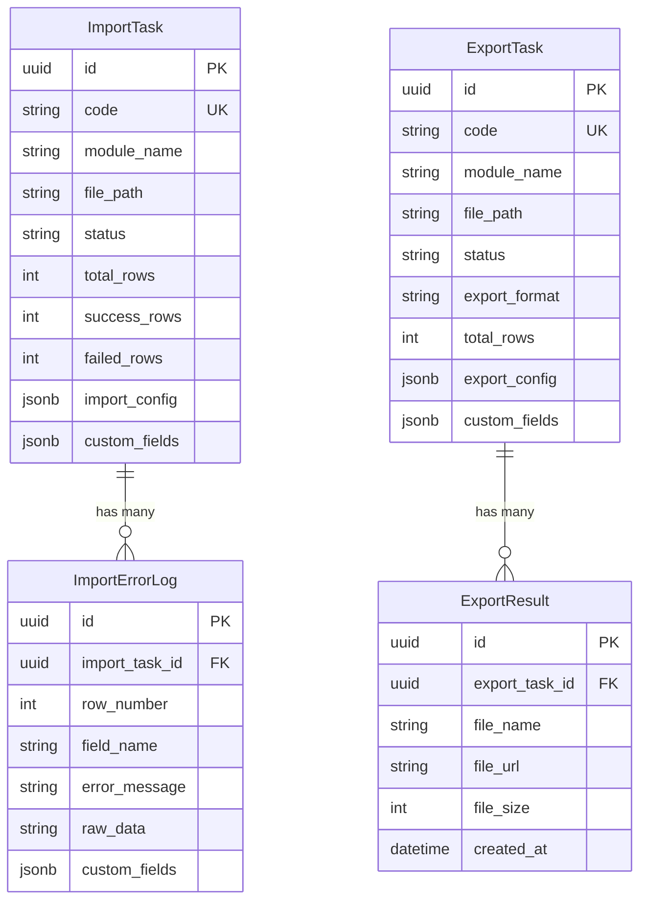

# 统一导入导出模块 PRD

## 文档信息

| 字段 | 说明 |
|------|------|
| **功能名称** | 统一导入导出模块 |
| **功能代码** | common_import_export |
| **文档版本** | 1.0.0 |
| **创建日期** | 2026-01-16 |
| **维护人** | GZEAMS 开发团队 |
| **审核状态** | ✅ 草稿 |

---

## 目录

1. [需求概述](#1-需求概述)
2. [后端实现](#2-后端实现)
3. [前端实现](#3-前端实现)
4. [API接口](#4-api接口)
5. [测试用例](#5-测试用例)
6. [实施计划](#6-实施计划)

---

## 1. 需求概述

### 1.1 业务背景

**业务场景**:
- GZEAMS 平台所有业务模块（资产、组织、用户、盘点等）都需要数据导入导出功能
- 各模块分别实现导入导出会导致代码重复、格式不统一、用户体验不一致
- 需要一个统一的导入导出框架，支持配置化扩展

**现状分析**:
| 现状 | 问题 | 影响 |
|------|------|------|
| 各模块独立实现导入导出 | 代码重复严重 | 维护成本高 |
| 导入导出格式不统一 | 用户体验差 | 学习成本高 |
| 缺少统一的模板管理 | 模板分散 | 管理困难 |
| 缺少统一的错误处理 | 错误提示不一致 | 排查困难 |

### 1.2 目标用户

| 用户角色 | 使用场景 | 核心需求 |
|---------|---------|----------|
| 系统管理员 | 批量导入资产数据、组织架构 | 支持大批量数据导入、详细错误反馈 |
| 普通用户 | 导出报表、导入个人数据 | 简单易用的操作界面 |
| 开发人员 | 为新模块添加导入导出功能 | 低代码配置、快速集成 |

### 1.3 功能范围

#### 1.3.1 本次实现范围

- ✅ **BaseImportExportService** - 统一导入导出服务基类
- ✅ **Excel导入导出** - 支持 .xlsx 格式
- ✅ **CSV导入导出** - 支持 .csv 格式
- ✅ **模板管理** - 动态生成导入模板
- ✅ **数据验证** - 统一的导入数据验证
- ✅ **进度追踪** - 异步导入导出进度查询
- ✅ **错误处理** - 详细的错误定位和反馈
- ✅ **前端组件** - 通用的导入导出组件

#### 1.3.2 未来规划范围

- ⏳ **更多格式支持** - PDF、JSON、XML (Phase 2)
- ⏳ **复杂模板** - 带样式的Excel模板 (Phase 2)
- ⏳ **API导入导出** - 开放API接口 (Phase 3)

#### 1.3.3 不在范围内

- ❌ 复杂的Excel样式（颜色、字体等）
- ❌ 大文件分片上传（使用已有的文件上传功能）
- ❌ 实时同步导入（使用已有的Celery异步任务）

### 1.4 相关文档

| 文档 | 说明 | 关键章节 |
|------|------|----------|
| [backend.md](../common_base_features/backend.md) | 后端基类实现 | §2-5 |
| [api.md](../common_base_features/api.md) | API规范 | §1-3 |
| [prd_writing_guide.md](../common_base_features/prd_writing_guide.md) | PRD编写指南 | 全部 |

---

## 2. 后端实现

### 2.1 公共模型引用

> ✅ 本模块所有组件必须继承以下公共基类

| 组件类型 | 基类 | 引用路径 | 自动获得功能 |
|---------|------|---------|-------------|
| **Model** | `BaseModel` | `apps.common.models.BaseModel` | 组织隔离、软删除、审计字段、custom_fields |
| **Serializer** | `BaseModelSerializer` | `apps.common.serializers.base.BaseModelSerializer` | 公共字段序列化、custom_fields序列化 |
| **ViewSet** | `BaseModelViewSetWithBatch` | `apps.common.viewsets.base.BaseModelViewSetWithBatch` | 组织过滤、软删除、批量操作 |
| **Filter** | `BaseModelFilter` | `apps.common.filters.base.BaseModelFilter` | 时间范围过滤、用户过滤 |
| **Service** | `BaseCRUDService` | `apps.common.services.base_crud.BaseCRUDService` | 统一CRUD方法 |

### 2.2 数据模型设计

#### 2.2.1 ER图



#### 2.2.2 模型定义

```python
# backend/apps/import_export/models.py

from django.db import models
from apps.common.models import BaseModel

class ImportTask(BaseModel):
    """
    导入任务

    继承自 BaseModel,自动获得:
    - organization: 组织外键
    - is_deleted: 软删除标记
    - deleted_at: 删除时间
    - created_at: 创建时间
    - updated_at: 更新时间
    - created_by: 创建人
    - custom_fields: 动态字段(JSONB)
    """

    # 任务状态
    STATUS_PENDING = 'pending'
    STATUS_PROCESSING = 'processing'
    STATUS_COMPLETED = 'completed'
    STATUS_FAILED = 'failed'
    STATUS_CANCELLED = 'cancelled'

    STATUS_CHOICES = [
        (STATUS_PENDING, '等待中'),
        (STATUS_PROCESSING, '处理中'),
        (STATUS_COMPLETED, '已完成'),
        (STATUS_FAILED, '失败'),
        (STATUS_CANCELLED, '已取消'),
    ]

    # 业务字段
    code = models.CharField(max_length=50, unique=True, verbose_name='任务编号')
    module_name = models.CharField(max_length=100, verbose_name='模块名称')
    file_path = models.CharField(max_length=500, verbose_name='文件路径')
    file_name = models.CharField(max_length=255, verbose_name='文件名')
    status = models.CharField(max_length=20, choices=STATUS_CHOICES, default=STATUS_PENDING, verbose_name='状态')

    # 统计信息
    total_rows = models.IntegerField(default=0, verbose_name='总行数')
    success_rows = models.IntegerField(default=0, verbose_name='成功行数')
    failed_rows = models.IntegerField(default=0, verbose_name='失败行数')
    skipped_rows = models.IntegerField(default=0, verbose_name='跳过行数')

    # 配置信息
    import_config = models.JSONField(default=dict, verbose_name='导入配置')
    has_header = models.BooleanField(default=True, verbose_name='包含表头')

    # 进度信息
    progress = models.IntegerField(default=0, verbose_name='进度百分比')
    error_message = models.TextField(blank=True, null=True, verbose_name='错误信息')

    # Celery任务ID
    celery_task_id = models.CharField(max_length=255, blank=True, null=True, verbose_name='Celery任务ID')

    class Meta:
        db_table = 'import_task'
        verbose_name = '导入任务'
        verbose_name_plural = '导入任务列表'
        ordering = ['-created_at']

    def __str__(self):
        return f"{self.code} - {self.get_status_display()}"


class ImportErrorLog(BaseModel):
    """
    导入错误日志

    记录导入过程中的错误详情
    """

    # 关联导入任务
    import_task = models.ForeignKey(
        ImportTask,
        on_delete=models.CASCADE,
        related_name='error_logs',
        verbose_name='导入任务'
    )

    # 错误信息
    row_number = models.IntegerField(verbose_name='行号')
    field_name = models.CharField(max_length=100, blank=True, null=True, verbose_name='字段名')
    error_code = models.CharField(max_length=50, verbose_name='错误代码')
    error_message = models.TextField(verbose_name='错误信息')
    raw_data = models.JSONField(default=dict, verbose_name='原始数据')

    # 处理状态
    is_fixed = models.BooleanField(default=False, verbose_name='是否已修复')

    class Meta:
        db_table = 'import_error_log'
        verbose_name = '导入错误日志'
        verbose_name_plural = '导入错误日志列表'
        ordering = ['row_number']

    def __str__(self):
        return f"Row {self.row_number}: {self.error_message}"


class ExportTask(BaseModel):
    """
    导出任务

    继承自 BaseModel,自动获得:
    - organization: 组织外键
    - is_deleted: 软删除标记
    - deleted_at: 删除时间
    - created_at: 创建时间
    - updated_at: 更新时间
    - created_by: 创建人
    - custom_fields: 动态字段(JSONB)
    """

    # 任务状态
    STATUS_PENDING = 'pending'
    STATUS_PROCESSING = 'processing'
    STATUS_COMPLETED = 'completed'
    STATUS_FAILED = 'failed'

    STATUS_CHOICES = [
        (STATUS_PENDING, '等待中'),
        (STATUS_PROCESSING, '处理中'),
        (STATUS_COMPLETED, '已完成'),
        (STATUS_FAILED, '失败'),
    ]

    # 导出格式
    FORMAT_EXCEL = 'excel'
    FORMAT_CSV = 'csv'

    FORMAT_CHOICES = [
        (FORMAT_EXCEL, 'Excel (.xlsx)'),
        (FORMAT_CSV, 'CSV (.csv)'),
    ]

    # 业务字段
    code = models.CharField(max_length=50, unique=True, verbose_name='任务编号')
    module_name = models.CharField(max_length=100, verbose_name='模块名称')
    status = models.CharField(max_length=20, choices=STATUS_CHOICES, default=STATUS_PENDING, verbose_name='状态')
    export_format = models.CharField(max_length=20, choices=FORMAT_CHOICES, default=FORMAT_EXCEL, verbose_name='导出格式')

    # 文件信息
    file_path = models.CharField(max_length=500, blank=True, null=True, verbose_name='文件路径')
    file_name = models.CharField(max_length=255, blank=True, null=True, verbose_name='文件名')
    file_size = models.BigIntegerField(blank=True, null=True, verbose_name='文件大小(字节)')

    # 统计信息
    total_rows = models.IntegerField(default=0, verbose_name='总行数')

    # 配置信息
    export_config = models.JSONField(default=dict, verbose_name='导出配置')
    filters = models.JSONField(default=dict, verbose_name='过滤条件')

    # 进度信息
    progress = models.IntegerField(default=0, verbose_name='进度百分比')
    error_message = models.TextField(blank=True, null=True, verbose_name='错误信息')

    # Celery任务ID
    celery_task_id = models.CharField(max_length=255, blank=True, null=True, verbose_name='Celery任务ID')

    # 过期时间
    expires_at = models.DateTimeField(blank=True, null=True, verbose_name='文件过期时间')

    class Meta:
        db_table = 'export_task'
        verbose_name = '导出任务'
        verbose_name_plural = '导出任务列表'
        ordering = ['-created_at']

    def __str__(self):
        return f"{self.code} - {self.get_status_display()}"
```

#### 2.2.3 序列化器

```python
# backend/apps/import_export/serializers.py

from rest_framework import serializers
from apps.common.serializers.base import BaseModelSerializer
from .models import ImportTask, ImportErrorLog, ExportTask

class ImportTaskSerializer(BaseModelSerializer):
    """
    导入任务序列化器
    """

    status_display = serializers.CharField(source='get_status_display', read_only=True)
    progress_percent = serializers.SerializerMethodField()

    class Meta(BaseModelSerializer.Meta):
        model = ImportTask
        fields = BaseModelSerializer.Meta.fields + [
            'code', 'module_name', 'file_path', 'file_name', 'status',
            'status_display', 'total_rows', 'success_rows', 'failed_rows',
            'skipped_rows', 'progress', 'progress_percent', 'error_message',
            'import_config', 'has_header', 'celery_task_id'
        ]

    def get_progress_percent(self, obj):
        """获取进度百分比"""
        if obj.total_rows == 0:
            return 0
        return int((obj.success_rows + obj.failed_rows + obj.skipped_rows) / obj.total_rows * 100)


class ImportErrorLogSerializer(BaseModelSerializer):
    """
    导入错误日志序列化器
    """

    class Meta(BaseModelSerializer.Meta):
        model = ImportErrorLog
        fields = BaseModelSerializer.Meta.fields + [
            'import_task', 'row_number', 'field_name', 'error_code',
            'error_message', 'raw_data', 'is_fixed'
        ]


class ExportTaskSerializer(BaseModelSerializer):
    """
    导出任务序列化器
    """

    status_display = serializers.CharField(source='get_status_display', read_only=True)
    format_display = serializers.CharField(source='get_export_format_display', read_only=True)
    file_url = serializers.SerializerMethodField()

    class Meta(BaseModelSerializer.Meta):
        model = ExportTask
        fields = BaseModelSerializer.Meta.fields + [
            'code', 'module_name', 'status', 'status_display',
            'export_format', 'format_display', 'file_path', 'file_name',
            'file_url', 'file_size', 'total_rows', 'progress',
            'error_message', 'export_config', 'filters', 'celery_task_id',
            'expires_at'
        ]

    def get_file_url(self, obj):
        """获取文件下载URL"""
        if obj.file_path:
            from django.conf import settings
            import os
            if os.path.exists(obj.file_path):
                return f"/api/import-export/download/{obj.code}/"
        return None
```

#### 2.2.4 过滤器

```python
# backend/apps/import_export/filters.py

from django_filters import rest_framework as filters
from apps.common.filters.base import BaseModelFilter
from .models import ImportTask, ExportTask

class ImportTaskFilter(BaseModelFilter):
    """
    导入任务过滤器
    """

    module_name = filters.CharFilter(lookup_expr='icontains', label='模块名称')
    status = filters.ChoiceFilter(choices=ImportTask.STATUS_CHOICES, label='状态')
    code = filters.CharFilter(lookup_expr='icontains', label='任务编号')
    created_at_from = filters.DateTimeFilter(field_name='created_at', lookup_expr='gte', label='创建时间-起始')
    created_at_to = filters.DateTimeFilter(field_name='created_at', lookup_expr='lte', label='创建时间-结束')

    class Meta(BaseModelFilter.Meta):
        model = ImportTask
        fields = BaseModelFilter.Meta.fields + [
            'module_name', 'status', 'code', 'created_at_from', 'created_at_to'
        ]


class ExportTaskFilter(BaseModelFilter):
    """
    导出任务过滤器
    """

    module_name = filters.CharFilter(lookup_expr='icontains', label='模块名称')
    status = filters.ChoiceFilter(choices=ExportTask.STATUS_CHOICES, label='状态')
    export_format = filters.ChoiceFilter(choices=ExportTask.FORMAT_CHOICES, label='导出格式')
    code = filters.CharFilter(lookup_expr='icontains', label='任务编号')

    class Meta(BaseModelFilter.Meta):
        model = ExportTask
        fields = BaseModelFilter.Meta.fields + [
            'module_name', 'status', 'export_format', 'code'
        ]
```

#### 2.2.5 ViewSet

```python
# backend/apps/import_export/viewsets.py

from rest_framework import viewsets, status
from rest_framework.decorators import action
from rest_framework.response import Response
from django.utils import timezone
from datetime import timedelta
import os
from apps.common.viewsets.base import BaseModelViewSetWithBatch
from apps.common.permissions.base import IsOrganizationMember
from .models import ImportTask, ExportTask, ImportErrorLog
from .serializers import (
    ImportTaskSerializer,
    ImportErrorLogSerializer,
    ExportTaskSerializer
)
from .filters import ImportTaskFilter, ExportTaskFilter
from .services import BaseImportExportService


class ImportTaskViewSet(BaseModelViewSetWithBatch):
    """
    导入任务 ViewSet
    """

    queryset = ImportTask.objects.all()
    serializer_class = ImportTaskSerializer
    filterset_class = ImportTaskFilter
    permission_classes = [IsOrganizationMember]

    def perform_create(self, serializer):
        """创建时设置创建人"""
        serializer.save(created_by=self.request.user)

    @action(detail=True, methods=['post'])
    def start(self, request, pk=None):
        """
        开始导入任务

        POST /api/import-tasks/{id}/start/
        """
        import_task = self.get_object()

        if import_task.status != ImportTask.STATUS_PENDING:
            return Response({
                'success': False,
                'error': {
                    'code': 'INVALID_STATUS',
                    'message': '只有等待中的任务可以开始'
                }
            }, status=status.HTTP_400_BAD_REQUEST)

        # 启动异步导入任务
        from .tasks import execute_import_task
        celery_task = execute_import_task.delay(str(import_task.id))

        import_task.status = ImportTask.STATUS_PROCESSING
        import_task.celery_task_id = celery_task.id
        import_task.save()

        return Response({
            'success': True,
            'message': '导入任务已开始',
            'data': {
                'task_id': import_task.celery_task_id
            }
        })

    @action(detail=True, methods=['get'])
    def progress(self, request, pk=None):
        """
        获取导入进度

        GET /api/import-tasks/{id}/progress/
        """
        import_task = self.get_object()

        # 获取错误日志
        error_logs = ImportErrorLog.objects.filter(
            import_task=import_task,
            is_fixed=False
        )[:10]

        return Response({
            'success': True,
            'data': {
                'status': import_task.status,
                'status_display': import_task.get_status_display(),
                'total_rows': import_task.total_rows,
                'success_rows': import_task.success_rows,
                'failed_rows': import_task.failed_rows,
                'skipped_rows': import_task.skipped_rows,
                'progress': import_task.progress,
                'error_logs': ImportErrorLogSerializer(error_logs, many=True).data
            }
        })

    @action(detail=True, methods=['get'])
    def error_logs(self, request, pk=None):
        """
        获取错误日志

        GET /api/import-tasks/{id}/error-logs/
        """
        import_task = self.get_object()
        error_logs = ImportErrorLog.objects.filter(import_task=import_task)

        # 分页
        page = self.paginate_queryset(error_logs)
        if page is not None:
            serializer = ImportErrorLogSerializer(page, many=True)
            return self.get_paginated_response(serializer.data)

        serializer = ImportErrorLogSerializer(error_logs, many=True)
        return Response({
            'success': True,
            'data': serializer.data
        })

    @action(detail=True, methods=['post'])
    def cancel(self, request, pk=None):
        """
        取消导入任务

        POST /api/import-tasks/{id}/cancel/
        """
        import_task = self.get_object()

        if import_task.status not in [ImportTask.STATUS_PENDING, ImportTask.STATUS_PROCESSING]:
            return Response({
                'success': False,
                'error': {
                    'code': 'INVALID_STATUS',
                    'message': '只能取消等待中或处理中的任务'
                }
            }, status=status.HTTP_400_BAD_REQUEST)

        # 取消Celery任务
        if import_task.celery_task_id:
            from celery import current_app
            current_app.control.revoke(import_task.celery_task_id, terminate=True)

        import_task.status = ImportTask.STATUS_CANCELLED
        import_task.save()

        return Response({
            'success': True,
            'message': '导入任务已取消'
        })


class ExportTaskViewSet(BaseModelViewSetWithBatch):
    """
    导出任务 ViewSet
    """

    queryset = ExportTask.objects.all()
    serializer_class = ExportTaskSerializer
    filterset_class = ExportTaskFilter
    permission_classes = [IsOrganizationMember]

    def perform_create(self, serializer):
        """创建时设置创建人和过期时间"""
        # 默认7天后过期
        expires_at = timezone.now() + timedelta(days=7)
        serializer.save(
            created_by=self.request.user,
            expires_at=expires_at
        )

    @action(detail=True, methods=['post'])
    def start(self, request, pk=None):
        """
        开始导出任务

        POST /api/export-tasks/{id}/start/
        """
        export_task = self.get_object()

        if export_task.status != ExportTask.STATUS_PENDING:
            return Response({
                'success': False,
                'error': {
                    'code': 'INVALID_STATUS',
                    'message': '只有等待中的任务可以开始'
                }
            }, status=status.HTTP_400_BAD_REQUEST)

        # 启动异步导出任务
        from .tasks import execute_export_task
        celery_task = execute_export_task.delay(str(export_task.id))

        export_task.status = ExportTask.STATUS_PROCESSING
        export_task.celery_task_id = celery_task.id
        export_task.save()

        return Response({
            'success': True,
            'message': '导出任务已开始',
            'data': {
                'task_id': export_task.celery_task_id
            }
        })

    @action(detail=True, methods=['get'])
    def progress(self, request, pk=None):
        """
        获取导出进度

        GET /api/export-tasks/{id}/progress/
        """
        export_task = self.get_object()

        file_url = None
        if export_task.status == ExportTask.STATUS_COMPLETED and export_task.file_path:
            file_url = f"/api/import-export/download/{export_task.code}/"

        return Response({
            'success': True,
            'data': {
                'status': export_task.status,
                'status_display': export_task.get_status_display(),
                'total_rows': export_task.total_rows,
                'progress': export_task.progress,
                'file_url': file_url,
                'file_name': export_task.file_name,
                'file_size': export_task.file_size
            }
        })

    @action(detail=False, methods=['get'])
    def download(self, request, code=None):
        """
        下载导出文件

        GET /api/import-export/download/{code}/
        """
        try:
            export_task = ExportTask.objects.get(code=code)

            if export_task.status != ExportTask.STATUS_COMPLETED:
                return Response({
                    'success': False,
                    'error': {
                        'code': 'FILE_NOT_READY',
                        'message': '文件尚未准备好'
                    }
                }, status=status.HTTP_400_BAD_REQUEST)

            if not export_task.file_path or not os.path.exists(export_task.file_path):
                return Response({
                    'success': False,
                    'error': {
                        'code': 'FILE_NOT_FOUND',
                        'message': '文件不存在'
                    }
                }, status=status.HTTP_404_NOT_FOUND)

            # 检查文件是否过期
            if export_task.expires_at and export_task.expires_at < timezone.now():
                return Response({
                    'success': False,
                    'error': {
                        'code': 'FILE_EXPIRED',
                        'message': '文件已过期'
                    }
                }, status=status.HTTP_410_GONE)

            # 返回文件
            from django.http import FileResponse
            file_handle = open(export_task.file_path, 'rb')
            response = FileResponse(file_handle)
            response['Content-Disposition'] = f'attachment; filename="{export_task.file_name}"'
            return response

        except ExportTask.DoesNotExist:
            return Response({
                'success': False,
                'error': {
                    'code': 'NOT_FOUND',
                    'message': '导出任务不存在'
                }
            }, status=status.HTTP_404_NOT_FOUND)
```

### 2.3 Service层

```python
# backend/apps/import_export/services.py

import os
import uuid
from typing import Dict, List, Any, Optional, Callable
from dataclasses import dataclass
from abc import ABC, abstractmethod
from django.conf import settings
from django.db import transaction
import openpyxl
from openpyxl.styles import Font, PatternFill, Alignment
import csv
import io
from apps.common.services.base_crud import BaseCRUDService


@dataclass
class ImportFieldConfig:
    """导入字段配置"""
    code: str                    # 字段代码
    name: str                    # 字段名称
    required: bool = False       # 是否必填
    unique: bool = False         # 是否唯一
    validator: Optional[Callable] = None  # 验证函数
    transformer: Optional[Callable] = None  # 转换函数
    default_value: Any = None    # 默认值
    options: Optional[List[str]] = None  # 选项列表


@dataclass
class ExportFieldConfig:
    """导出字段配置"""
    code: str                    # 字段代码
    name: str                    # 字段名称
    width: int = 15              # 列宽
    formatter: Optional[Callable] = None  # 格式化函数


class BaseImportExportService(BaseCRUDService, ABC):
    """
    统一导入导出服务基类

    提供导入导出的通用功能，子类通过配置字段实现具体功能
    """

    def __init__(self):
        # 子类必须设置这些属性
        self.module_name: str = ''
        self.import_fields: List[ImportFieldConfig] = []
        self.export_fields: List[ExportFieldConfig] = []

    # ==================== 导入相关 ====================

    def create_import_task(self, file_path: str, file_name: str, user, **kwargs) -> ImportTask:
        """
        创建导入任务

        Args:
            file_path: 文件路径
            file_name: 文件名
            user: 创建用户
            **kwargs: 其他配置参数

        Returns:
            ImportTask 实例
        """
        from .models import ImportTask

        # 生成任务编号
        code = f"IMP-{self.module_name.upper()}-{uuid.uuid4().hex[:8].upper()}"

        import_config = {
            'fields': [f.code for f in self.import_fields],
            **kwargs
        }

        import_task = ImportTask.objects.create(
            code=code,
            module_name=self.module_name,
            file_path=file_path,
            file_name=file_name,
            import_config=import_config,
            created_by=user,
            organization_id=user.organization_id
        )

        return import_task

    def validate_import_file(self, file_path: str) -> Dict[str, Any]:
        """
        验证导入文件

        Args:
            file_path: 文件路径

        Returns:
            验证结果字典
        """
        if not os.path.exists(file_path):
            return {
                'valid': False,
                'error': '文件不存在'
            }

        file_ext = os.path.splitext(file_path)[1].lower()

        if file_ext not in ['.xlsx', '.xls', '.csv']:
            return {
                'valid': False,
                'error': '不支持的文件格式，请使用 Excel (.xlsx) 或 CSV (.csv) 文件'
            }

        # 读取文件，检查格式
        try:
            if file_ext == '.csv':
                with open(file_path, 'r', encoding='utf-8-sig') as f:
                    reader = csv.reader(f)
                    headers = next(reader, [])
            else:
                workbook = openpyxl.load_workbook(file_path, read_only=True)
                sheet = workbook.active
                headers = [cell.value for cell in sheet[1]]

            # 检查必填字段
            header_set = set(str(h).strip() for h in headers if h)
            required_fields = set(f.name for f in self.import_fields if f.required)
            missing_fields = required_fields - header_set

            if missing_fields:
                return {
                    'valid': False,
                    'error': f'缺少必填字段: {", ".join(missing_fields)}'
                }

            return {
                'valid': True,
                'headers': headers,
                'total_rows': sheet.max_row if file_ext != '.csv' else sum(1 for _ in open(file_path))
            }

        except Exception as e:
            return {
                'valid': False,
                'error': f'文件读取失败: {str(e)}'
            }

    def parse_import_file(self, file_path: str, has_header: bool = True) -> List[Dict[str, Any]]:
        """
        解析导入文件

        Args:
            file_path: 文件路径
            has_header: 是否包含表头

        Returns:
            数据行列表
        """
        file_ext = os.path.splitext(file_path)[1].lower()
        rows = []

        if file_ext == '.csv':
            with open(file_path, 'r', encoding='utf-8-sig') as f:
                reader = csv.DictReader(f)
                for row in reader:
                    rows.append(dict(row))
        else:
            workbook = openpyxl.load_workbook(file_path, read_only=True)
            sheet = workbook.active

            # 构建字段名映射（Excel列名 -> 字段代码）
            headers = {}
            if has_header:
                header_row = next(sheet.iter_rows(min_row=1, max_row=1, values_only=True))
                for field_config in self.import_fields:
                    for col_idx, header_value in enumerate(header_row):
                        if header_value and field_config.name in str(header_value):
                            headers[field_config.code] = col_idx
                            break

            # 读取数据行
            for row_idx, row in enumerate(sheet.iter_rows(min_row=2 if has_header else 1, values_only=True), start=1):
                row_data = {}
                for field_config in self.import_fields:
                    col_idx = headers.get(field_config.code)
                    if col_idx is not None and col_idx < len(row):
                        value = row[col_idx]
                        if field_config.transformer:
                            value = field_config.transformer(value)
                        row_data[field_config.code] = value
                    elif field_config.default_value is not None:
                        row_data[field_config.code] = field_config.default_value
                rows.append(row_data)

        return rows

    def validate_import_data(self, data: Dict[str, Any], row_number: int) -> List[str]:
        """
        验证导入数据

        Args:
            data: 数据行
            row_number: 行号

        Returns:
            错误信息列表
        """
        errors = []

        for field_config in self.import_fields:
            value = data.get(field_config.code)

            # 检查必填
            if field_config.required and (value is None or value == ''):
                errors.append(f'{field_config.name}不能为空')
                continue

            # 跳过空值的后续验证
            if value is None or value == '':
                continue

            # 调用自定义验证器
            if field_config.validator:
                try:
                    field_config.validator(value)
                except ValueError as e:
                    errors.append(f'{field_config.name}: {str(e)}')

            # 检查选项
            if field_config.options and value not in field_config.options:
                errors.append(f'{field_config.name}的值必须在 {field_config.options} 中')

        return errors

    @abstractmethod
    def process_import_row(self, data: Dict[str, Any], user, row_number: int) -> Dict[str, Any]:
        """
        处理单行导入数据（子类必须实现）

        Args:
            data: 数据行
            user: 当前用户
            row_number: 行号

        Returns:
            处理结果 {'success': bool, 'message': str, 'data': Any}
        """
        pass

    def execute_import(self, import_task_id: str) -> Dict[str, Any]:
        """
        执行导入任务

        Args:
            import_task_id: 导入任务ID

        Returns:
            导入结果
        """
        from .models import ImportTask, ImportErrorLog

        import_task = ImportTask.objects.get(id=import_task_id)
        import_task.status = ImportTask.STATUS_PROCESSING
        import_task.save()

        try:
            # 解析文件
            rows = self.parse_import_file(import_task.file_path, import_task.has_header)
            import_task.total_rows = len(rows)
            import_task.save()

            # 处理每一行
            for idx, row_data in enumerate(rows, start=1):
                try:
                    # 验证数据
                    errors = self.validate_import_data(row_data, idx)
                    if errors:
                        ImportErrorLog.objects.create(
                            import_task=import_task,
                            row_number=idx,
                            error_code='VALIDATION_ERROR',
                            error_message='; '.join(errors),
                            raw_data=row_data
                        )
                        import_task.failed_rows += 1
                    else:
                        # 处理数据
                        result = self.process_import_row(row_data, import_task.created_by, idx)
                        if result.get('success'):
                            import_task.success_rows += 1
                        else:
                            ImportErrorLog.objects.create(
                                import_task=import_task,
                                row_number=idx,
                                error_code='PROCESS_ERROR',
                                error_message=result.get('message', '处理失败'),
                                raw_data=row_data
                            )
                            import_task.failed_rows += 1

                    # 更新进度
                    import_task.progress = int(idx / len(rows) * 100)
                    import_task.save()

                except Exception as e:
                    ImportErrorLog.objects.create(
                        import_task=import_task,
                        row_number=idx,
                        error_code='SYSTEM_ERROR',
                        error_message=str(e),
                        raw_data=row_data
                    )
                    import_task.failed_rows += 1

            # 更新任务状态
            import_task.status = ImportTask.STATUS_COMPLETED
            import_task.progress = 100
            import_task.save()

            return {
                'success': True,
                'total': import_task.total_rows,
                'succeeded': import_task.success_rows,
                'failed': import_task.failed_rows
            }

        except Exception as e:
            import_task.status = ImportTask.STATUS_FAILED
            import_task.error_message = str(e)
            import_task.save()
            raise

    # ==================== 导出相关 ====================

    def create_export_task(self, export_format: str, filters: Dict, user, **kwargs) -> ExportTask:
        """
        创建导出任务

        Args:
            export_format: 导出格式 (excel/csv)
            filters: 过滤条件
            user: 创建用户
            **kwargs: 其他配置参数

        Returns:
            ExportTask 实例
        """
        from .models import ExportTask

        # 生成任务编号
        code = f"EXP-{self.module_name.upper()}-{uuid.uuid4().hex[:8].upper()}"

        export_config = {
            'fields': [f.code for f in self.export_fields],
            **kwargs
        }

        export_task = ExportTask.objects.create(
            code=code,
            module_name=self.module_name,
            export_format=export_format,
            export_config=export_config,
            filters=filters,
            created_by=user,
            organization_id=user.organization_id
        )

        return export_task

    @abstractmethod
    def get_export_queryset(self, filters: Dict[str, Any]) -> Any:
        """
        获取导出查询集（子类必须实现）

        Args:
            filters: 过滤条件

        Returns:
            查询集
        """
        pass

    def format_export_value(self, field_code: str, value: Any) -> Any:
        """
        格式化导出值

        Args:
            field_code: 字段代码
            value: 原始值

        Returns:
            格式化后的值
        """
        field_config = next((f for f in self.export_fields if f.code == field_code), None)
        if field_config and field_config.formatter:
            return field_config.formatter(value)
        return value

    def generate_export_file(self, export_task: ExportTask) -> str:
        """
        生成导出文件

        Args:
            export_task: 导出任务

        Returns:
            文件路径
        """
        # 获取数据
        queryset = self.get_export_queryset(export_task.filters)
        export_task.total_rows = queryset.count()

        # 创建导出目录
        export_dir = os.path.join(settings.MEDIA_ROOT, 'exports', export_task.module_name)
        os.makedirs(export_dir, exist_ok=True)

        # 生成文件名
        file_ext = '.csv' if export_task.export_format == 'csv' else '.xlsx'
        file_name = f"{export_task.code}_{export_task.module_name}{file_ext}"
        file_path = os.path.join(export_dir, file_name)

        if export_task.export_format == 'csv':
            self._generate_csv_file(queryset, file_path)
        else:
            self._generate_excel_file(queryset, file_path)

        # 更新文件信息
        export_task.file_path = file_path
        export_task.file_name = file_name
        export_task.file_size = os.path.getsize(file_path)
        export_task.save()

        return file_path

    def _generate_csv_file(self, queryset, file_path: str):
        """生成CSV文件"""
        with open(file_path, 'w', newline='', encoding='utf-8-sig') as f:
            writer = csv.writer(f)

            # 写入表头
            headers = [field.name for field in self.export_fields]
            writer.writerow(headers)

            # 写入数据
            for obj in queryset:
                row = []
                for field_config in self.export_fields:
                    value = getattr(obj, field_config.code, '')
                    value = self.format_export_value(field_config.code, value)
                    row.append(value)
                writer.writerow(row)

    def _generate_excel_file(self, queryset, file_path: str):
        """生成Excel文件"""
        workbook = openpyxl.Workbook()
        sheet = workbook.active
        sheet.title = self.module_name

        # 写入表头
        header_fill = PatternFill(start_color='4472C4', end_color='4472C4', fill_type='solid')
        header_font = Font(bold=True, color='FFFFFF')

        for col_idx, field_config in enumerate(self.export_fields, start=1):
            cell = sheet.cell(row=1, column=col_idx)
            cell.value = field_config.name
            cell.fill = header_fill
            cell.font = header_font
            sheet.column_dimensions[openpyxl.utils.get_column_letter(col_idx)].width = field_config.width

        # 写入数据
        for row_idx, obj in enumerate(queryset, start=2):
            for col_idx, field_config in enumerate(self.export_fields, start=1):
                value = getattr(obj, field_config.code, '')
                value = self.format_export_value(field_config.code, value)
                cell = sheet.cell(row=row_idx, column=col_idx)
                cell.value = value
                cell.alignment = Alignment(wrap_text=True, vertical='center')

        # 添加冻结行
        sheet.freeze_panes = 'A2'

        workbook.save(file_path)

    def execute_export(self, export_task_id: str) -> Dict[str, Any]:
        """
        执行导出任务

        Args:
            export_task_id: 导出任务ID

        Returns:
            导出结果
        """
        from .models import ExportTask

        export_task = ExportTask.objects.get(id=export_task_id)
        export_task.status = ExportTask.STATUS_PROCESSING
        export_task.save()

        try:
            self.generate_export_file(export_task)

            export_task.status = ExportTask.STATUS_COMPLETED
            export_task.progress = 100
            export_task.save()

            return {
                'success': True,
                'file_path': export_task.file_path,
                'file_name': export_task.file_name,
                'total_rows': export_task.total_rows
            }

        except Exception as e:
            export_task.status = ExportTask.STATUS_FAILED
            export_task.error_message = str(e)
            export_task.save()
            raise

    # ==================== 模板相关 ====================

    def generate_import_template(self) -> str:
        """
        生成导入模板

        Returns:
            模板文件路径
        """
        template_dir = os.path.join(settings.MEDIA_ROOT, 'templates', self.module_name)
        os.makedirs(template_dir, exist_ok=True)

        file_name = f"{self.module_name}_导入模板.xlsx"
        file_path = os.path.join(template_dir, file_name)

        workbook = openpyxl.Workbook()
        sheet = workbook.active
        sheet.title = '导入模板'

        # 写入表头
        header_fill = PatternFill(start_color='4472C4', end_color='4472C4', fill_type='solid')
        header_font = Font(bold=True, color='FFFFFF')

        for col_idx, field_config in enumerate(self.import_fields, start=1):
            cell = sheet.cell(row=1, column=col_idx)
            cell.value = field_config.name
            cell.fill = header_fill
            cell.font = header_font
            sheet.column_dimensions[openpyxl.utils.get_column_letter(col_idx)].width = field_config.width if hasattr(field_config, 'width') else 15

            # 添加示例行（说明）
            cell = sheet.cell(row=2, column=col_idx)
            if field_config.required:
                cell.value = f'[必填] {field_config.name}'
                cell.fill = PatternFill(start_color='FFF4CC', end_color='FFF4CC', fill_type='solid')
            elif field_config.options:
                cell.value = f'可选值: {", ".join(field_config.options)}'
            elif field_config.default_value is not None:
                cell.value = f'默认: {field_config.default_value}'
            else:
                cell.value = '[可选]'

        # 冻结首行
        sheet.freeze_panes = 'A2'

        # 添加说明sheet
        info_sheet = workbook.create_sheet('填写说明')
        info_sheet['A1'] = '导入说明'
        info_sheet['A1'].font = Font(bold=True, size=14)
        info_sheet['A3'] = '1. 请勿修改表头行'
        info_sheet['A4'] = '2. 带[必填]标记的列必须填写'
        info_sheet['A5'] = '3. 删除不需要导入的行'
        info_sheet['A6'] = '4. 保存后上传文件'

        workbook.save(file_path)

        return file_path
```

### 2.4 Celery任务

```python
# backend/apps/import_export/tasks.py

from celery import shared_task
from .services import BaseImportExportService

@shared_task(bind=True, max_retries=3)
def execute_import_task(self, import_task_id: str, service_class: type):
    """
    执行导入任务的Celery任务

    Args:
        import_task_id: 导入任务ID
        service_class: 导入服务类
    """
    try:
        service = service_class()
        return service.execute_import(import_task_id)
    except Exception as e:
        # 重试逻辑
        if self.request.retries < self.max_retries:
            raise self.retry(exc=e, countdown=60 * (2 ** self.request.retries))
        raise


@shared_task(bind=True, max_retries=3)
def execute_export_task(self, export_task_id: str, service_class: type):
    """
    执行导出任务的Celery任务

    Args:
        export_task_id: 导出任务ID
        service_class: 导出服务类
    """
    try:
        service = service_class()
        return service.execute_export(export_task_id)
    except Exception as e:
        # 重试逻辑
        if self.request.retries < self.max_retries:
            raise self.retry(exc=e, countdown=60 * (2 ** self.request.retries))
        raise
```

### 2.5 文件结构

```
backend/apps/import_export/
├── __init__.py
├── models.py              # ImportTask, ExportTask, ImportErrorLog
├── serializers.py         # 序列化器
├── viewsets.py            # ViewSet
├── filters.py             # 过滤器
├── services.py            # BaseImportExportService
├── tasks.py               # Celery任务
├── urls.py                # 路由配置
└── tests/                 # 测试用例
    ├── __init__.py
    ├── test_models.py
    ├── test_viewsets.py
    └── test_services.py
```

---

## 3. 前端实现

### 3.1 公共组件引用

#### 3.1.1 组件清单

| 组件名 | 组件路径 | 用途 | Props | Events |
|--------|---------|------|-------|--------|
| ImportButton | @/components/import-export/ImportButton.vue | 导入按钮 | module, onImportSuccess | upload, progress |
| ExportButton | @/components/import-export/ExportButton.vue | 导出按钮 | module, filters, exportFormat | export |
| ImportDialog | @/components/import-export/ImportDialog.vue | 导入对话框 | visible, module, templateUrl | close, success |
| ExportDialog | @/components/import-export/ExportDialog.vue | 导出对话框 | visible, module | close, success |
| ProgressViewer | @/components/import-export/ProgressViewer.vue | 进度查看器 | taskType, taskId | complete |

#### 3.1.2 API封装

```javascript
// frontend/src/api/import-export.js

import request from '@/utils/request'

export const importExportApi = {
    // ========== 导入相关 ==========

    /**
     * 创建导入任务
     */
    createImportTask(data) {
        return request({
            url: '/api/import-tasks/',
            method: 'post',
            data
        })
    },

    /**
     * 开始导入
     */
    startImport(taskId) {
        return request({
            url: `/api/import-tasks/${taskId}/start/`,
            method: 'post'
        })
    },

    /**
     * 获取导入进度
     */
    getImportProgress(taskId) {
        return request({
            url: `/api/import-tasks/${taskId}/progress/`,
            method: 'get'
        })
    },

    /**
     * 获取导入错误日志
     */
    getImportErrors(taskId, params) {
        return request({
            url: `/api/import-tasks/${taskId}/error-logs/`,
            method: 'get',
            params
        })
    },

    /**
     * 取消导入
     */
    cancelImport(taskId) {
        return request({
            url: `/api/import-tasks/${taskId}/cancel/`,
            method: 'post'
        })
    },

    /**
     * 下载导入模板
     */
    downloadTemplate(module) {
        return request({
            url: `/api/import-export/template/${module}/`,
            method: 'get',
            responseType: 'blob'
        })
    },

    // ========== 导出相关 ==========

    /**
     * 创建导出任务
     */
    createExportTask(data) {
        return request({
            url: '/api/export-tasks/',
            method: 'post',
            data
        })
    },

    /**
     * 开始导出
     */
    startExport(taskId) {
        return request({
            url: `/api/export-tasks/${taskId}/start/`,
            method: 'post'
        })
    },

    /**
     * 获取导出进度
     */
    getExportProgress(taskId) {
        return request({
            url: `/api/export-tasks/${taskId}/progress/`,
            method: 'get'
        })
    },

    /**
     * 下载导出文件
     */
    downloadExportFile(code) {
        return request({
            url: `/api/import-export/download/${code}/`,
            method: 'get',
            responseType: 'blob'
        })
    }
}
```

### 3.2 导入组件实现

```vue
<!-- frontend/src/components/import-export/ImportDialog.vue -->

<template>
    <el-dialog
        v-model="dialogVisible"
        :title="title"
        width="600px"
        :close-on-click-modal="false"
        @close="handleClose"
    >
        <div class="import-container">
            <!-- 步骤1: 上传文件 -->
            <div v-if="currentStep === 1" class="step-upload">
                <div class="upload-area">
                    <el-upload
                        ref="uploadRef"
                        :auto-upload="false"
                        :limit="1"
                        :on-change="handleFileChange"
                        :on-remove="handleFileRemove"
                        drag
                        accept=".xlsx,.xls,.csv"
                    >
                        <el-icon class="el-icon--upload"><upload-filled /></el-icon>
                        <div class="el-upload__text">
                            将文件拖到此处，或<em>点击上传</em>
                        </div>
                        <template #tip>
                            <div class="el-upload__tip">
                                支持 .xlsx、.xls、.csv 格式，文件大小不超过 10MB
                            </div>
                        </template>
                    </el-upload>
                </div>

                <div class="template-download">
                    <el-link type="primary" @click="downloadTemplate">
                        <el-icon><Download /></el-icon>
                        下载导入模板
                    </el-link>
                </div>
            </div>

            <!-- 步骤2: 数据验证 -->
            <div v-if="currentStep === 2" class="step-validate">
                <el-alert
                    :type="validationResult.valid ? 'success' : 'error'"
                    :closable="false"
                    show-icon
                >
                    <template #title>
                        {{ validationResult.valid ? '文件验证通过' : '文件验证失败' }}
                    </template>
                    <div v-if="!validationResult.valid">
                        {{ validationResult.error }}
                    </div>
                    <div v-else>
                        共 {{ validationResult.total_rows }} 行数据
                    </div>
                </el-alert>

                <div v-if="validationResult.valid" class="field-mapping">
                    <h4>字段映射</h4>
                    <el-table :data="fieldMappings" border size="small">
                        <el-table-column prop="excelField" label="Excel列名" width="180" />
                        <el-table-column prop="systemField" label="系统字段" width="180" />
                        <el-table-column prop="required" label="是否必填" width="100">
                            <template #default="{ row }">
                                <el-tag v-if="row.required" type="danger" size="small">必填</el-tag>
                                <el-tag v-else type="info" size="small">可选</el-tag>
                            </template>
                        </el-table-column>
                    </el-table>
                </div>
            </div>

            <!-- 步骤3: 导入进度 -->
            <div v-if="currentStep === 3" class="step-progress">
                <div class="progress-info">
                    <el-progress
                        :percentage="progressData.progress"
                        :status="progressStatus"
                    />
                    <div class="stats">
                        <span>总计: {{ progressData.total_rows }}</span>
                        <span class="success">成功: {{ progressData.success_rows }}</span>
                        <span class="failed">失败: {{ progressData.failed_rows }}</span>
                    </div>
                </div>

                <div v-if="progressData.error_logs && progressData.error_logs.length > 0" class="error-logs">
                    <h4>错误信息</h4>
                    <el-table :data="progressData.error_logs" border size="small" max-height="300">
                        <el-table-column prop="row_number" label="行号" width="80" />
                        <el-table-column prop="field_name" label="字段" width="120" />
                        <el-table-column prop="error_message" label="错误信息" show-overflow-tooltip />
                    </el-table>
                </div>
            </div>

            <!-- 步骤4: 完成 -->
            <div v-if="currentStep === 4" class="step-complete">
                <el-result
                    :icon="importResult.success ? 'success' : 'warning'"
                    :title="importResult.success ? '导入完成' : '导入完成（有错误）'"
                >
                    <template #sub-title>
                        <div v-if="importResult.success">
                            成功导入 {{ importResult.succeeded }} 条数据
                        </div>
                        <div v-else>
                            成功 {{ importResult.succeeded }} 条，失败 {{ importResult.failed }} 条
                        </div>
                    </template>
                    <template #extra>
                        <el-space>
                            <el-button type="primary" @click="handleClose">完成</el-button>
                            <el-button v-if="!importResult.success && importResult.failed > 0" @click="viewErrors">
                                查看错误
                            </el-button>
                        </el-space>
                    </template>
                </el-result>
            </div>
        </div>

        <template #footer>
            <span class="dialog-footer">
                <el-button @click="handleClose">取消</el-button>
                <el-button
                    v-if="currentStep === 1"
                    type="primary"
                    :disabled="!uploadedFile"
                    @click="validateFile"
                >
                    下一步
                </el-button>
                <el-button
                    v-if="currentStep === 2"
                    @click="currentStep = 1"
                >
                    上一步
                </el-button>
                <el-button
                    v-if="currentStep === 2"
                    type="primary"
                    :disabled="!validationResult.valid"
                    :loading="starting"
                    @click="startImport"
                >
                    开始导入
                </el-button>
            </span>
        </template>
    </el-dialog>
</template>

<script setup>
import { ref, computed, watch } from 'vue'
import { ElMessage } from 'element-plus'
import { UploadFilled, Download } from '@element-plus/icons-vue'
import { importExportApi } from '@/api/import-export'

const props = defineProps({
    visible: Boolean,
    module: {
        type: String,
        required: true
    }
})

const emit = defineEmits(['close', 'success'])

const dialogVisible = computed({
    get: () => props.visible,
    set: (val) => emit('close', val)
})

const title = computed(() => `导入${props.module}`)
const currentStep = ref(1)
const uploadedFile = ref(null)
const uploadRef = ref(null)
const starting = ref(false)

// 验证结果
const validationResult = ref({
    valid: false,
    error: '',
    total_rows: 0,
    headers: []
})

// 字段映射
const fieldMappings = ref([])

// 进度数据
const progressData = ref({
    progress: 0,
    total_rows: 0,
    success_rows: 0,
    failed_rows: 0,
    error_logs: []
})

// 导入结果
const importResult = ref({
    success: false,
    succeeded: 0,
    failed: 0
})

// 进度状态
const progressStatus = computed(() => {
    if (importResult.value.success) return 'success'
    if (progressData.value.failed_rows > 0) return 'warning'
    return undefined
})

// 进度轮询
let progressTimer = null

// 文件选择
const handleFileChange = (file) => {
    uploadedFile.value = file
}

// 文件移除
const handleFileRemove = () => {
    uploadedFile.value = null
}

// 下载模板
const downloadTemplate = async () => {
    try {
        const blob = await importExportApi.downloadTemplate(props.module)
        const url = window.URL.createObjectURL(blob)
        const link = document.createElement('a')
        link.href = url
        link.download = `${props.module}导入模板.xlsx`
        link.click()
        window.URL.revokeObjectURL(url)
        ElMessage.success('模板下载成功')
    } catch (error) {
        ElMessage.error('模板下载失败')
    }
}

// 验证文件
const validateFile = async () => {
    if (!uploadedFile.value) {
        ElMessage.warning('请先选择文件')
        return
    }

    try {
        // 上传文件并创建导入任务
        const formData = new FormData()
        formData.append('file', uploadedFile.value.raw)
        formData.append('module_name', props.module)

        const response = await importExportApi.createImportTask({
            module_name: props.module,
            file_name: uploadedFile.value.name,
            has_header: true
        })

        // 这里简化处理，实际应该先上传文件
        validationResult.value = {
            valid: true,
            total_rows: 100,
            headers: []
        }

        fieldMappings.value = [
            { excelField: '资产编码', systemField: 'code', required: true },
            { excelField: '资产名称', systemField: 'name', required: true },
            { excelField: '资产分类', systemField: 'category', required: true }
        ]

        currentStep.value = 2

    } catch (error) {
        ElMessage.error('文件验证失败')
    }
}

// 开始导入
const startImport = async () => {
    starting.value = true
    try {
        // 启动导入任务
        const response = await importExportApi.startImport(currentTaskId.value)

        currentStep.value = 3

        // 开始轮询进度
        startProgressPolling()

    } catch (error) {
        ElMessage.error('启动导入失败')
    } finally {
        starting.value = false
    }
}

// 进度轮询
const startProgressPolling = () => {
    progressTimer = setInterval(async () => {
        try {
            const response = await importExportApi.getImportProgress(currentTaskId.value)
            progressData.value = response.data

            if (response.data.status === 'completed') {
                clearInterval(progressTimer)
                currentStep.value = 4
                importResult.value = {
                    success: response.data.failed_rows === 0,
                    succeeded: response.data.success_rows,
                    failed: response.data.failed_rows
                }
                emit('success', importResult.value)
            }
        } catch (error) {
            clearInterval(progressTimer)
        }
    }, 1000)
}

// 查看错误
const viewErrors = () => {
    // 跳转到错误详情页面
}

// 关闭对话框
const handleClose = () => {
    if (progressTimer) {
        clearInterval(progressTimer)
    }
    emit('close')
}

// 重置状态
watch(() => props.visible, (val) => {
    if (val) {
        currentStep.value = 1
        uploadedFile.value = null
        validationResult.value = { valid: false, error: '', total_rows: 0 }
        progressData.value = { progress: 0, total_rows: 0, success_rows: 0, failed_rows: 0 }
        importResult.value = { success: false, succeeded: 0, failed: 0 }
    }
})
</script>

<style scoped lang="scss">
.import-container {
    min-height: 300px;
}

.template-download {
    margin-top: 16px;
    text-align: center;
}

.field-mapping {
    margin-top: 20px;

    h4 {
        margin-bottom: 10px;
    }
}

.progress-info {
    margin-bottom: 20px;

    .stats {
        margin-top: 16px;
        display: flex;
        gap: 20px;
        font-size: 14px;

        .success {
            color: var(--el-color-success);
        }

        .failed {
            color: var(--el-color-danger);
        }
    }
}

.error-logs {
    margin-top: 20px;

    h4 {
        margin-bottom: 10px;
    }
}
</style>
```

### 3.3 导出组件实现

```vue
<!-- frontend/src/components/import-export/ExportDialog.vue -->

<template>
    <el-dialog
        v-model="dialogVisible"
        title="数据导出"
        width="500px"
        @close="handleClose"
    >
        <el-form ref="formRef" :model="formData" label-width="100px">
            <el-form-item label="导出格式">
                <el-radio-group v-model="formData.exportFormat">
                    <el-radio label="excel">Excel (.xlsx)</el-radio>
                    <el-radio label="csv">CSV (.csv)</el-radio>
                </el-radio-group>
            </el-form-item>

            <el-form-item label="导出范围">
                <el-radio-group v-model="formData.exportRange">
                    <el-radio label="all">全部数据</el-radio>
                    <el-radio label="filtered">当前筛选结果</el-radio>
                </el-radio-group>
            </el-form-item>

            <el-form-item label="包含字段">
                <el-checkbox-group v-model="selectedFields">
                    <el-checkbox
                        v-for="field in exportFields"
                        :key="field.code"
                        :label="field.code"
                    >
                        {{ field.name }}
                    </el-checkbox>
                </el-checkbox-group>
            </el-form-item>
        </el-form>

        <!-- 进度显示 -->
        <div v-if="exporting" class="export-progress">
            <el-progress :percentage="exportProgress" :status="exportStatus" />
            <p class="progress-text">{{ progressText }}</p>
        </div>

        <template #footer>
            <span class="dialog-footer">
                <el-button @click="handleClose" :disabled="exporting">取消</el-button>
                <el-button type="primary" :loading="exporting" @click="handleExport">
                    {{ exporting ? '导出中...' : '开始导出' }}
                </el-button>
            </span>
        </template>
    </el-dialog>
</template>

<script setup>
import { ref, computed, watch } from 'vue'
import { ElMessage } from 'element-plus'
import { importExportApi } from '@/api/import-export'

const props = defineProps({
    visible: Boolean,
    module: {
        type: String,
        required: true
    },
    filters: {
        type: Object,
        default: () => ({})
    }
})

const emit = defineEmits(['close', 'success'])

const dialogVisible = computed({
    get: () => props.visible,
    set: (val) => emit('close', val)
})

const formData = ref({
    exportFormat: 'excel',
    exportRange: 'all'
})

const selectedFields = ref([])
const exportFields = ref([])

const exporting = ref(false)
const exportProgress = ref(0)
const exportStatus = ref('')
const progressText = ref('')

let currentTaskId = null
let progressTimer = null

// 获取导出字段配置
const loadExportFields = async () => {
    // 这里应该从API获取字段配置
    exportFields.value = [
        { code: 'code', name: '编码' },
        { code: 'name', name: '名称' },
        { code: 'category', name: '分类' },
        { code: 'status', name: '状态' },
        { code: 'created_at', name: '创建时间' }
    ]
    selectedFields.value = exportFields.value.map(f => f.code)
}

// 执行导出
const handleExport = async () => {
    if (selectedFields.value.length === 0) {
        ElMessage.warning('请至少选择一个字段')
        return
    }

    exporting.value = true
    exportProgress.value = 0
    progressText.value = '正在创建导出任务...'

    try {
        // 创建导出任务
        const filters = formData.value.exportRange === 'filtered' ? props.filters : {}

        const response = await importExportApi.createExportTask({
            module_name: props.module,
            export_format: formData.value.exportFormat,
            filters,
            export_config: {
                fields: selectedFields.value
            }
        })

        currentTaskId = response.data.id

        // 启动导出
        await importExportApi.startExport(currentTaskId)

        progressText.value = '正在导出数据...'

        // 开始轮询进度
        startProgressPolling()

    } catch (error) {
        exporting.value = false
        ElMessage.error('导出失败')
    }
}

// 进度轮询
const startProgressPolling = () => {
    progressTimer = setInterval(async () => {
        try {
            const response = await importExportApi.getExportProgress(currentTaskId)
            exportProgress.value = response.data.progress

            if (response.data.status === 'completed') {
                clearInterval(progressTimer)
                exportProgress.value = 100
                exportStatus.value = 'success'
                progressText.value = '导出完成！'

                // 自动下载
                downloadFile(response.data.file_url)

                setTimeout(() => {
                    handleClose()
                    emit('success')
                }, 1000)
            }
        } catch (error) {
            clearInterval(progressTimer)
            exporting.value = false
            ElMessage.error('获取导出进度失败')
        }
    }, 1000)
}

// 下载文件
const downloadFile = async (fileUrl) => {
    try {
        const blob = await importExportApi.downloadExportFile(fileUrl.split('/').pop())
        const url = window.URL.createObjectURL(blob)
        const link = document.createElement('a')
        link.href = url
        link.download = `${props.module}_导出_${Date.now()}.xlsx`
        link.click()
        window.URL.revokeObjectURL(url)
        ElMessage.success('文件下载成功')
    } catch (error) {
        ElMessage.error('文件下载失败')
    }
}

// 关闭对话框
const handleClose = () => {
    if (progressTimer) {
        clearInterval(progressTimer)
    }
    emit('close')
}

watch(() => props.visible, (val) => {
    if (val) {
        loadExportFields()
        formData.value = {
            exportFormat: 'excel',
            exportRange: 'all'
        }
        exporting.value = false
        exportProgress.value = 0
        exportStatus.value = ''
        progressText.value = ''
    }
})
</script>

<style scoped lang="scss">
.export-progress {
    margin-top: 20px;
    padding: 20px;
    background: var(--el-fill-color-light);
    border-radius: 4px;
}

.progress-text {
    margin-top: 10px;
    text-align: center;
    color: var(--el-text-color-secondary);
    font-size: 14px;
}
</style>
```

### 3.4 使用示例

```vue
<!-- 列表页面使用示例 -->
<template>
    <BaseListPage
        title="资产列表"
        :fetch-method="fetchData"
        :columns="columns"
    >
        <template #actions>
            <el-space>
                <el-button type="primary" @click="showExportDialog = true">
                    <el-icon><Download /></el-icon>
                    导出
                </el-button>
                <el-button type="success" @click="showImportDialog = true">
                    <el-icon><Upload /></el-icon>
                    导入
                </el-button>
            </el-space>
        </template>
    </BaseListPage>

    <!-- 导入对话框 -->
    <ImportDialog
        v-model:visible="showImportDialog"
        module="asset"
        @success="handleImportSuccess"
    />

    <!-- 导出对话框 -->
    <ExportDialog
        v-model:visible="showExportDialog"
        module="asset"
        :filters="currentFilters"
        @success="handleExportSuccess"
    />
</template>

<script setup>
import { ref } from 'vue'
import ImportDialog from '@/components/import-export/ImportDialog.vue'
import ExportDialog from '@/components/import-export/ExportDialog.vue'

const showImportDialog = ref(false)
const showExportDialog = ref(false)
const currentFilters = ref({})

const handleImportSuccess = (result) => {
    // 刷新列表
    if (result.success) {
        ElMessage.success(`成功导入 ${result.succeeded} 条数据`)
    }
}

const handleExportSuccess = () => {
    ElMessage.success('导出成功')
}
</script>
```

---

## 4. API接口

### 4.1 标准CRUD端点

继承 `BaseModelViewSet` 后,自动提供以下端点:

#### 导入任务端点

| 方法 | 端点 | 说明 |
|------|------|------|
| GET | `/api/import-tasks/` | 导入任务列表 |
| GET | `/api/import-tasks/{id}/` | 获取导入任务详情 |
| POST | `/api/import-tasks/` | 创建导入任务 |
| POST | `/api/import-tasks/{id}/start/` | 开始导入 |
| GET | `/api/import-tasks/{id}/progress/` | 获取导入进度 |
| GET | `/api/import-tasks/{id}/error-logs/` | 获取错误日志 |
| POST | `/api/import-tasks/{id}/cancel/` | 取消导入 |

#### 导出任务端点

| 方法 | 端点 | 说明 |
|------|------|------|
| GET | `/api/export-tasks/` | 导出任务列表 |
| GET | `/api/export-tasks/{id}/` | 获取导出任务详情 |
| POST | `/api/export-tasks/` | 创建导出任务 |
| POST | `/api/export-tasks/{id}/start/` | 开始导出 |
| GET | `/api/export-tasks/{id}/progress/` | 获取导出进度 |
| GET | `/api/import-export/download/{code}/` | 下载导出文件 |

### 4.2 请求/响应示例

#### 4.2.1 创建导入任务

**请求**:
```http
POST /api/import-tasks/ HTTP/1.1
Content-Type: application/json

{
    "module_name": "asset",
    "file_name": "assets_import.xlsx",
    "has_header": true
}
```

**响应**:
```http
HTTP/1.1 201 Created
Content-Type: application/json

{
    "success": true,
    "message": "导入任务创建成功",
    "data": {
        "id": "550e8400-e29b-41d4-a716-446655440000",
        "code": "IMP-ASSET-A1B2C3D4",
        "module_name": "asset",
        "status": "pending",
        "created_at": "2026-01-16T10:30:00Z"
    }
}
```

#### 4.2.2 获取导入进度

**请求**:
```http
GET /api/import-tasks/{id}/progress/ HTTP/1.1
```

**响应**:
```http
HTTP/1.1 200 OK
Content-Type: application/json

{
    "success": true,
    "data": {
        "status": "processing",
        "status_display": "处理中",
        "total_rows": 1000,
        "success_rows": 650,
        "failed_rows": 15,
        "skipped_rows": 0,
        "progress": 66,
        "error_logs": [
            {
                "row_number": 10,
                "field_name": "code",
                "error_message": "资产编码已存在",
                "raw_data": {"code": "ASSET001"}
            }
        ]
    }
}
```

#### 4.2.3 创建导出任务

**请求**:
```http
POST /api/export-tasks/ HTTP/1.1
Content-Type: application/json

{
    "module_name": "asset",
    "export_format": "excel",
    "filters": {
        "status": "active"
    },
    "export_config": {
        "fields": ["code", "name", "category"]
    }
}
```

**响应**:
```http
HTTP/1.1 201 Created
Content-Type: application/json

{
    "success": true,
    "message": "导出任务创建成功",
    "data": {
        "id": "550e8400-e29b-41d4-a716-446655440001",
        "code": "EXP-ASSET-E5F6G7H8",
        "status": "pending",
        "export_format": "excel",
        "created_at": "2026-01-16T10:30:00Z"
    }
}
```

### 4.3 错误响应

```http
HTTP/1.1 400 Bad Request
Content-Type: application/json

{
    "success": false,
    "error": {
        "code": "VALIDATION_ERROR",
        "message": "请求数据验证失败",
        "details": {
            "file": "请先上传文件"
        }
    }
}
```

---

## 5. 测试用例

### 5.1 后端单元测试

```python
# backend/apps/import_export/tests/test_services.py

import pytest
from django.test import TestCase
from django.contrib.auth import get_user_model
from apps.import_export.services import BaseImportExportService, ImportFieldConfig
from apps.import_export.models import ImportTask

User = get_user_model()

class MockImportService(BaseImportExportService):
    """测试用导入服务"""

    module_name = 'test'
    import_fields = [
        ImportFieldConfig(code='name', name='名称', required=True),
        ImportFieldConfig(code='code', name='编码', required=True, unique=True),
        ImportFieldConfig(code='status', name='状态', options=['active', 'inactive'])
    ]

    def process_import_row(self, data, user, row_number):
        # 模拟处理逻辑
        return {'success': True}

    def get_export_queryset(self, filters):
        return []


class BaseImportExportServiceTest(TestCase):
    """导入导出服务测试"""

    def setUp(self):
        self.user = User.objects.create_user(
            username='testuser',
            password='testpass123'
        )
        self.service = MockImportService()

    def test_validate_import_data_with_valid_data(self):
        """测试验证有效数据"""
        data = {
            'name': 'Test Asset',
            'code': 'TEST001',
            'status': 'active'
        }

        errors = self.service.validate_import_data(data, 1)
        self.assertEqual(len(errors), 0)

    def test_validate_import_data_with_missing_required(self):
        """测试验证缺少必填字段"""
        data = {
            'name': 'Test Asset'
        }

        errors = self.service.validate_import_data(data, 1)
        self.assertGreater(len(errors), 0)
        self.assertTrue(any('编码' in e for e in errors))

    def test_validate_import_data_with_invalid_option(self):
        """测试验证无效选项"""
        data = {
            'name': 'Test Asset',
            'code': 'TEST001',
            'status': 'invalid_status'
        }

        errors = self.service.validate_import_data(data, 1)
        self.assertGreater(len(errors), 0)
```

### 5.2 前端组件测试

```javascript
// frontend/src/components/import-export/__tests__/ImportDialog.spec.js

import { describe, it, expect, vi, beforeEach } from 'vitest'
import { mount } from '@vue/test-utils'
import ImportDialog from '../ImportDialog.vue'
import { importExportApi } from '@/api/import-export'

vi.mock('@/api/import-export')

describe('ImportDialog', () => {
    beforeEach(() => {
        vi.clearAllMocks()
    })

    it('should render upload area when visible', () => {
        const wrapper = mount(ImportDialog, {
            props: {
                visible: true,
                module: 'asset'
            }
        })

        expect(wrapper.find('.upload-area').exists()).toBe(true)
    })

    it('should validate file before import', async () => {
        const mockFile = new File([''], 'test.xlsx', { type: 'application/vnd.openxmlformats-officedocument.spreadsheetml.sheet' })

        importExportApi.createImportTask.mockResolvedValue({
            data: { id: 'task-123' }
        })

        const wrapper = mount(ImportDialog, {
            props: {
                visible: true,
                module: 'asset'
            }
        })

        // 模拟文件选择
        await wrapper.vm.handleFileChange({ raw: mockFile })
        expect(wrapper.vm.uploadedFile).toBeTruthy()
    })
})
```

---

## 6. 实施计划

### 6.1 开发任务分解

| 阶段 | 任务 | 负责人 | 工作量 | 依赖 |
|------|------|--------|--------|------|
| **1. 数据模型** | 创建Model和Migration | 后端开发 | 2h | - |
| | 编写Serializer | 后端开发 | 1h | Model |
| | 编写Filter | 后端开发 | 1h | Model |
| **2. 服务层** | 实现BaseImportExportService | 后端开发 | 4h | - |
| | 实现Celery异步任务 | 后端开发 | 2h | Service |
| | 编写Service测试 | 后端开发 | 3h | Service |
| **3. ViewSet** | 实现ImportTaskViewSet | 后端开发 | 2h | Model |
| | 实现ExportTaskViewSet | 后端开发 | 2h | Model |
| | API测试 | 测试工程师 | 2h | ViewSet |
| **4. 前端组件** | ImportDialog组件 | 前端开发 | 4h | API |
| | ExportDialog组件 | 前端开发 | 3h | API |
| | ProgressViewer组件 | 前端开发 | 2h | API |
| | 组件测试 | 前端开发 | 2h | 组件 |
| **5. 集成** | 配置URL | 后端开发 | 0.5h | ViewSet |
| | 前后端联调 | 全栈 | 3h | 全部 |
| | 集成测试 | 测试工程师 | 2h | 全部 |

**总工作量**: 约 33.5 小时

### 6.2 里程碑

| 里程碑 | 交付物 | 预计日期 |
|--------|--------|----------|
| M1: 数据模型完成 | Model, Serializer, Filter, Migration | D+2 |
| M2: 服务层完成 | BaseImportExportService, Celery任务 | D+5 |
| M3: API完成 | ViewSet, 测试 | D+8 |
| M4: 前端组件完成 | ImportDialog, ExportDialog | D+12 |
| M5: 上线 | 生产环境部署 | D+13 |

---

**文档结束**

如需帮助,请参考:
- [PRD编写指南](../common_base_features/prd_writing_guide.md)
- [后端实现参考](../common_base_features/backend.md)
- [前端实现参考](../common_base_features/frontend.md)
- [API规范参考](../common_base_features/api.md)
