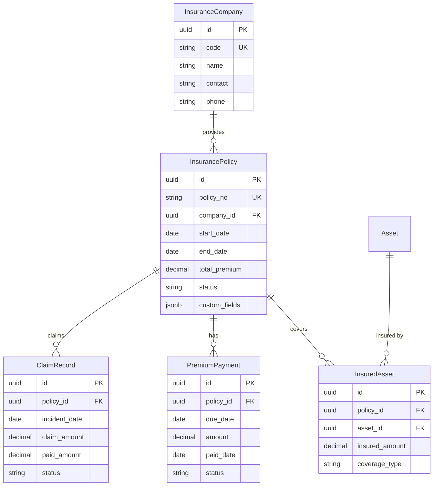

# 资产保险管理模块 PRD

> 本文档定义 GZEAMS 平台资产保险管理模块的功能需求和技术实现规范

---

## 文档信息

| 字段 | 说明 |
|------|------|
| **功能名称** | 资产保险管理 (Asset Insurance Management) |
| **功能代码** | INSURANCE_MANAGEMENT |
| **文档版本** | 1.0.0 |
| **创建日期** | 2026-01-21 |
| **维护人** | Claude Code |
| **审核状态** | ✅ 草稿 |

---

## 目录

1. [需求概述](#1-需求概述)
2. [后端实现](#2-后端实现)
3. [前端实现](#3-前端实现)
4. [API接口](#4-api接口)
5. [权限设计](#5-权限设计)
6. [测试用例](#6-测试用例)
7. [实施计划](#7-实施计划)
8. [附录](#8-附录)

---

## 1. 需求概述

### 1.1 业务背景

**业务场景**:
企业的重要固定资产（如车辆、设备、机器等）通常需要购买保险以降低意外损失风险。资产保险管理模块需要完整记录保险合同、保单信息、理赔记录等。

**现状分析**:
| 现状 | 问题 | 影响 |
|------|------|------|
| 保险信息分散管理 | Excel表格或纸质保单 | 查询困难、易丢失 |
| 缺少到期提醒 | 保单续期错过 | 资产脱保风险 |
| 无理赔记录管理 | 理赔历史无法追溯 | 保费优化无依据 |
| 无保费统计 | 保险成本无法核算 | 财务分析缺失 |

### 1.2 目标用户

| 用户角色 | 使用场景 | 核心需求 |
|---------|---------|----------|
| **资产管理员** | 管理保险合同、跟踪到期日 | 需要完整保险台账、到期提醒 |
| **财务人员** | 核算保费、处理理赔 | 需要保费明细、理赔记录 |
| **采购人员** | 对比保险公司、购买保险 | 需要保险公司信息、历史报价 |
| **风控人员** | 评估保险覆盖、风险分析 | 需要保险覆盖率统计 |

### 1.3 功能范围

#### 1.3.1 本次实现范围

- ✅ **保险合同管理**: 保单信息、保险公司、保险期间
- ✅ **资产保险关联**: 资产与保单多对多关系、保险金额
- ✅ **到期管理**: 到期提醒、续保处理
- ✅ **理赔管理**: 理赔申请、理赔记录、赔款追踪
- ✅ **保费管理**: 保费计划、缴费记录、成本统计

#### 1.3.2 未来规划范围

- ⏳ 在线投保对接 (Phase 2): 与保险公司系统集成
- ⏳ 智能保费计算 (Phase 3): 基于历史数据的保费预测

#### 1.3.3 不在范围内

- ❌ 保险产品销售 (非保险代理业务)
| 文档 | 说明 | 关键章节 |
|------|------|----------|
| [Asset Model](../../../backend/apps/assets/models.py) | 基础资产模型 | §Asset |
| [PRD模板](../common_base_features/00_core/PRD_TEMPLATE.md) | PRD编写规范 | 全部 |

---

## 2. 后端实现

### 2.1 公共模型引用

> ✅ 本模块所有组件必须继承以下公共基类

| 组件类型 | 基类 | 引用路径 | 自动获得功能 |
|---------|------|---------|-------------|
| **Model** | `BaseModel` | `apps.common.models.BaseModel` | 组织隔离、软删除、审计字段、custom_fields |
| **Serializer** | `BaseModelSerializer` | `apps.common.serializers.base.BaseModelSerializer` | 公共字段序列化、custom_fields序列化 |
| **ViewSet** | `BaseModelViewSetWithBatch` | `apps.common.viewsets.base.BaseModelViewSetWithBatch` | 组织过滤、软删除、批量操作 |
| **Filter** | `BaseModelFilter` | `apps.common.filters.base.BaseModelFilter` | 时间范围过滤、用户过滤 |
| **Service** | `BaseCRUDService` | `apps.common.services.base_crud.BaseCRUDService` | 统一CRUD方法 |

### 2.2 数据模型设计

#### 2.2.1 ER图



#### 2.2.2 保险公司模型

```python
# backend/apps/insurance/models.py

from django.db import models
from django.core.validators import MinValueValidator
from apps.common.models import BaseModel


class InsuranceCompany(BaseModel):
    """
    Insurance Company Model

    Maintains catalog of insurance companies for reference.
    """

    class Meta:
        db_table = 'insurance_companies'
        verbose_name = 'Insurance Company'
        verbose_name_plural = 'Insurance Companies'
        ordering = ['name']
        indexes = [
            models.Index(fields=['organization', 'code']),
        ]

    code = models.CharField(
        max_length=50,
        unique=True,
        db_index=True,
        help_text='Company code'
    )
    name = models.CharField(
        max_length=200,
        help_text='Insurance company name'
    )
    short_name = models.CharField(
        max_length=50,
        blank=True,
        help_text='Short name/abbreviation'
    )
    company_type = models.CharField(
        max_length=50,
        blank=True,
        help_text='Company type (property, casualty, life, etc.)'
    )

    # Contact Information
    contact_person = models.CharField(
        max_length=100,
        blank=True,
        help_text='Primary contact person'
    )
    contact_phone = models.CharField(
        max_length=20,
        blank=True,
        help_text='Contact phone'
    )
    contact_email = models.EmailField(
        blank=True,
        help_text='Contact email'
    )
    website = models.URLField(
        blank=True,
        help_text='Company website'
    )
    address = models.TextField(
        blank=True,
        help_text='Company address'
    )

    # Service
    claims_phone = models.CharField(
        max_length=20,
        blank=True,
        help_text='Claims reporting hotline'
    )
    claims_email = models.EmailField(
        blank=True,
        help_text='Claims email'
    )

    # Notes
    notes = models.TextField(
        blank=True,
        help_text='Additional notes'
    )

    is_active = models.BooleanField(
        default=True,
        help_text='Whether this company is actively used'
    )

    def __str__(self):
        return f"{self.name} ({self.short_name or self.code})"


class InsurancePolicy(BaseModel):
    """
    Insurance Policy Model

    Manages insurance policies/policies for assets.
    """

    class Meta:
        db_table = 'insurance_policies'
        verbose_name = 'Insurance Policy'
        verbose_name_plural = 'Insurance Policies'
        ordering = ['-created_at']
        indexes = [
            models.Index(fields=['organization', 'policy_no']),
            models.Index(fields=['organization', 'company']),
            models.Index(fields=['organization', 'status']),
            models.Index(fields=['organization', 'start_date', 'end_date']),
        ]

    STATUS_CHOICES = [
        ('draft', 'Draft'),
        ('active', 'Active'),
        ('expired', 'Expired'),
        ('cancelled', 'Cancelled'),
        ('terminated', 'Terminated'),
        ('renewed', 'Renewed'),
    ]

    PAYMENT_FREQUENCY_CHOICES = [
        ('one_time', 'One Time'),
        ('annual', 'Annual'),
        ('semi_annual', 'Semi-Annual'),
        ('quarterly', 'Quarterly'),
        ('monthly', 'Monthly'),
    ]

    # ========== Policy Information ==========
    policy_no = models.CharField(
        max_length=100,
        unique=True,
        db_index=True,
        help_text='Policy number from insurer'
    )
    policy_name = models.CharField(
        max_length=200,
        blank=True,
        help_text='Policy name/alias'
    )

    company = models.ForeignKey(
        InsuranceCompany,
        on_delete=models.PROTECT,
        related_name='policies',
        help_text='Insurance company'
    )

    # Insurance Type
    insurance_type = models.CharField(
        max_length=50,
        help_text='Type of insurance (property, equipment, vehicle, etc.)'
    )
    coverage_type = models.CharField(
        max_length=100,
        blank=True,
        help_text='Coverage type (all-risk, named-peril, etc.)'
    )

    # ========== Period ==========
    start_date = models.DateField(
        help_text='Policy start date'
    )
    end_date = models.DateField(
        help_text='Policy end date'
    )
    renewal_date = models.DateField(
        null=True,
        blank=True,
        help_text='Next renewal date'
    )

    # ========== Financial ==========
    total_insured_amount = models.DecimalField(
        max_digits=16,
        decimal_places=2,
        validators=[MinValueValidator(0)],
        help_text='Total insured amount'
    )
    total_premium = models.DecimalField(
        max_digits=14,
        decimal_places=2,
        validators=[MinValueValidator(0)],
        help_text='Total premium amount'
    )
    payment_frequency = models.CharField(
        max_length=50,
        choices=PAYMENT_FREQUENCY_CHOICES,
        default='annual',
        help_text='Payment frequency'
    )

    # Deductible
    deductible_amount = models.DecimalField(
        max_digits=14,
        decimal_places=2,
        default=0,
        help_text='Deductible amount per claim'
    )
    deductible_type = models.CharField(
        max_length=50,
        blank=True,
        help_text='Deductible type (fixed, percentage, per-claim)'
    )

    # ========== Status ==========
    status = models.CharField(
        max_length=50,
        choices=STATUS_CHOICES,
        default='draft',
        help_text='Policy status'
    )

    # ========== Documents ==========
    policy_document = models.FileField(
        upload_to='insurance/policies/%Y/%m/',
        null=True,
        blank=True,
        help_text='Policy document PDF'
    )

    # ========== Notes ==========
    coverage_description = models.TextField(
        blank=True,
        help_text='Description of coverage'
    )
    exclusion_clause = models.TextField(
        blank=True,
        help_text='Exclusion clauses'
    )
    notes = models.TextField(
        blank=True,
        help_text='Additional notes'
    )

    def __str__(self):
        return f"{self.policy_no} - {self.company.name}"

    @property
    def is_active(self):
        """Check if policy is currently active."""
        from django.utils import timezone
        today = timezone.now().date()
        return (self.status == 'active' and
                self.start_date <= today <= self.end_date)

    @property
    def days_until_expiry(self):
        """Get days until policy expires."""
        from django.utils import timezone
        today = timezone.now().date()
        if self.end_date:
            delta = self.end_date - today
            return delta.days
        return None

    @property
    def is_expiring_soon(self):
        """Check if policy expires within 30 days."""
        days = self.days_until_expiry
        return days is not None and 0 <= days <= 30

    @property
    def unpaid_premium(self):
        """Get total unpaid premium amount."""
        return self.payments.filter(
            status__in=['pending', 'partial']
        ).aggregate(
            unpaid=models.Sum(models.F('amount') - models.F('paid_amount'))
        )['unpaid'] or 0


class InsuredAsset(BaseModel):
    """
    Insured Asset Model

    Links assets to insurance policies with coverage details.
    """

    class Meta:
        db_table = 'insured_assets'
        verbose_name = 'Insured Asset'
        verbose_name_plural = 'Insured Assets'
        ordering = ['-created_at']
        indexes = [
            models.Index(fields=['organization', 'policy']),
            models.Index(fields=['organization', 'asset']),
            models.Index(fields=['organization', 'policy', 'asset']),
        ]
        unique_together = [['organization', 'policy', 'asset']]

    policy = models.ForeignKey(
        InsurancePolicy,
        on_delete=models.CASCADE,
        related_name='insured_assets',
        help_text='Parent insurance policy'
    )
    asset = models.ForeignKey(
        'assets.Asset',
        on_delete=models.CASCADE,
        related_name='insurance_coverages',
        help_text='Insured asset'
    )

    # Coverage Details
    insured_amount = models.DecimalField(
        max_digits=14,
        decimal_places=2,
        validators=[MinValueValidator(0)],
        help_text='Insured amount for this asset'
    )
    premium_amount = models.DecimalField(
        max_digits=14,
        decimal_places=2,
        validators=[MinValueValidator(0)],
        default=0,
        help_text='Premium allocation for this asset'
    )

    # Location/Usage
    asset_location = models.CharField(
        max_length=200,
        blank=True,
        help_text='Asset location at policy time'
    )
    asset_usage = models.CharField(
        max_length=100,
        blank=True,
        help_text='Asset usage type'
    )

    # Valuation
    valuation_method = models.CharField(
        max_length=50,
        blank=True,
        help_text='Valuation method (replacement, actual cash value)'
    )
    valuation_date = models.DateField(
        null=True,
        blank=True,
        help_text='Valuation date'
    )

    # Notes
    notes = models.TextField(
        blank=True,
        help_text='Coverage notes'
    )

    def __str__(self):
        return f"{self.asset.asset_name} - {self.policy.policy_no}"


class PremiumPayment(BaseModel):
    """
    Premium Payment Model

    Tracks premium payment schedule and actual payments.
    """

    class Meta:
        db_table = 'premium_payments'
        verbose_name = 'Premium Payment'
        verbose_name_plural = 'Premium Payments'
        ordering = ['due_date']
        indexes = [
            models.Index(fields=['organization', 'policy']),
            models.Index(fields=['organization', 'status']),
            models.Index(fields=['organization', 'due_date']),
        ]

    STATUS_CHOICES = [
        ('pending', 'Pending'),
        ('partial', 'Partially Paid'),
        ('paid', 'Paid'),
        ('overdue', 'Overdue'),
        ('waived', 'Waived'),
    ]

    policy = models.ForeignKey(
        InsurancePolicy,
        on_delete=models.CASCADE,
        related_name='payments',
        help_text='Related insurance policy'
    )

    # Payment Details
    payment_no = models.CharField(
        max_length=50,
        unique=True,
        db_index=True,
        help_text='Payment reference number'
    )
    due_date = models.DateField(
        db_index=True,
        help_text='Payment due date'
    )
    amount = models.DecimalField(
        max_digits=14,
        decimal_places=2,
        validators=[MinValueValidator(0)],
        help_text='Payment amount due'
    )
    paid_amount = models.DecimalField(
        max_digits=14,
        decimal_places=2,
        default=0,
        help_text='Amount actually paid'
    )

    # Status
    status = models.CharField(
        max_length=50,
        choices=STATUS_CHOICES,
        default='pending',
        help_text='Payment status'
    )

    # Payment Details
    paid_date = models.DateField(
        null=True,
        blank=True,
        help_text='Date payment was made'
    )
    payment_method = models.CharField(
        max_length=50,
        blank=True,
        help_text='Payment method'
    )
    payment_reference = models.CharField(
        max_length=200,
        blank=True,
        help_text='Payment reference/receipt number'
    )
    invoice_no = models.CharField(
        max_length=100,
        blank=True,
        help_text='Invoice number from insurer'
    )

    # Receipt
    receipt_document = models.FileField(
        upload_to='insurance/receipts/%Y/%m/',
        null=True,
        blank=True,
        help_text='Payment receipt document'
    )

    # Notes
    notes = models.TextField(
        blank=True,
        help_text='Payment notes'
    )

    def __str__(self):
        return f"{self.payment_no} - {self.policy.policy_no}"

    @property
    def outstanding_amount(self):
        """Get outstanding amount."""
        return self.amount - self.paid_amount

    @property
    def is_overdue(self):
        """Check if payment is overdue."""
        from django.utils import timezone
        return (self.status in ['pending', 'partial'] and
                self.due_date < timezone.now().date())


class ClaimRecord(BaseModel):
    """
    Insurance Claim Model

    Records insurance claims and their resolution.
    """

    class Meta:
        db_table = 'claim_records'
        verbose_name = 'Claim Record'
        verbose_name_plural = 'Claim Records'
        ordering = ['-incident_date', '-created_at']
        indexes = [
            models.Index(fields=['organization', 'policy']),
            models.Index(fields=['organization', 'status']),
            models.Index(fields=['organization', 'incident_date']),
        ]

    STATUS_CHOICES = [
        ('reported', 'Reported'),
        ('investigating', 'Investigating'),
        ('approved', 'Approved'),
        ('rejected', 'Rejected'),
        ('paid', 'Paid'),
        ('closed', 'Closed'),
    ]

    TYPE_CHOICES = [
        ('damage', 'Damage'),
        ('loss', 'Loss'),
        ('theft', 'Theft'),
        ('liability', 'Liability'),
        ('other', 'Other'),
    ]

    policy = models.ForeignKey(
        InsurancePolicy,
        on_delete=models.CASCADE,
        related_name='claims',
        help_text='Related insurance policy'
    )
    asset = models.ForeignKey(
        'assets.Asset',
        on_delete=models.SET_NULL,
        null=True,
        blank=True,
        related_name='insurance_claims',
        help_text='Affected asset (if applicable)'
    )

    # Claim Information
    claim_no = models.CharField(
        max_length=100,
        unique=True,
        db_index=True,
        help_text='Claim number assigned by insurer'
    )

    # Incident Details
    incident_date = models.DateField(
        db_index=True,
        help_text='Date of incident'
    )
    incident_type = models.CharField(
        max_length=50,
        choices=TYPE_CHOICES,
        help_text='Type of incident'
    )
    incident_description = models.TextField(
        help_text='Description of the incident'
    )
    incident_location = models.CharField(
        max_length=200,
        blank=True,
        help_text='Location of incident'
    )

    # Claim Details
    claim_date = models.DateField(
        null=True,
        blank=True,
        help_text='Date claim was filed'
    )
    claimed_amount = models.DecimalField(
        max_digits=14,
        decimal_places=2,
        validators=[MinValueValidator(0)],
        help_text='Amount claimed'
    )

    # Resolution
    status = models.CharField(
        max_length=50,
        choices=STATUS_CHOICES,
        default='reported',
        help_text='Claim status'
    )
    approved_amount = models.DecimalField(
        max_digits=14,
        decimal_places=2,
        null=True,
        blank=True,
        help_text='Amount approved by insurer'
    )
    paid_amount = models.DecimalField(
        max_digits=14,
        decimal_places=2,
        default=0,
        help_text='Amount actually paid'
    )
    paid_date = models.DateField(
        null=True,
        blank=True,
        help_text='Date payment was received'
    )

    # Adjuster
    adjuster_name = models.CharField(
        max_length=100,
        blank=True,
        help_text='Insurance adjuster name'
    )
    adjuster_contact = models.CharField(
        max_length=100,
        blank=True,
        help_text='Adjuster contact information'
    )

    # Documents
    photos = models.JSONField(
        default=list,
        blank=True,
        help_text='Photos of damage/loss'
    )
    supporting_documents = models.JSONField(
        default=list,
        blank=True,
        help_text='Supporting documents'
    )

    # Settlement
    settlement_date = models.DateField(
        null=True,
        blank=True,
        help_text='Date claim was settled'
    )
    settlement_notes = models.TextField(
        blank=True,
        help_text='Settlement notes and details'
    )

    # Notes
    notes = models.TextField(
        blank=True,
        help_text='Additional notes'
    )

    def __str__(self):
        return f"Claim {self.claim_no or 'Pending'} - {self.incident_type}"

    @property
    def payout_ratio(self):
        """Calculate payout ratio (approved/claimed)."""
        if self.claimed_amount and self.claimed_amount > 0:
            if self.approved_amount:
                return (self.approved_amount / self.claimed_amount) * 100
            elif self.paid_amount:
                return (self.paid_amount / self.claimed_amount) * 100
        return 0


class PolicyRenewal(BaseModel):
    """
    Policy Renewal Model

    Records policy renewals and history.
    """

    class Meta:
        db_table = 'policy_renewals'
        verbose_name = 'Policy Renewal'
        verbose_name_plural = 'Policy Renewals'
        ordering = ['-created_at']
        indexes = [
            models.Index(fields=['organization', 'original_policy']),
            models.Index(fields=['organization', 'renewed_policy']),
        ]

    original_policy = models.ForeignKey(
        InsurancePolicy,
        on_delete=models.CASCADE,
        related_name='renewals_from',
        help_text='Original policy being renewed'
    )
    renewed_policy = models.ForeignKey(
        InsurancePolicy,
        on_delete=models.CASCADE,
        related_name='renewals_to',
        help_text='New renewed policy'
    )

    # Renewal Details
    renewal_no = models.CharField(
        max_length=50,
        unique=True,
        db_index=True,
        help_text='Renewal reference number'
    )
    original_end_date = models.DateField(
        help_text='Original policy end date'
    )
    new_start_date = models.DateField(
        help_text='New policy start date'
    )
    new_end_date = models.DateField(
        help_text='New policy end date'
    )

    # Premium Comparison
    original_premium = models.DecimalField(
        max_digits=14,
        decimal_places=2,
        help_text='Original annual premium'
    )
    new_premium = models.DecimalField(
        max_digits=14,
        decimal_places=2,
        help_text='New annual premium'
    )

    # Change Summary
    coverage_changes = models.TextField(
        blank=True,
        help_text='Summary of coverage changes'
    )
    notes = models.TextField(
        blank=True,
        help_text='Additional notes'
    )

    def __str__(self):
        return f"Renewal {self.renewal_no}"

    @property
    def premium_change(self):
        """Calculate premium change amount."""
        return self.new_premium - self.original_premium

    @property
    def premium_change_percent(self):
        """Calculate premium change percentage."""
        if self.original_premium and self.original_premium > 0:
            return ((self.new_premium - self.original_premium) / self.original_premium) * 100
        return 0
```

#### 2.2.3 序列化器

```python
# backend/apps/insurance/serializers.py

from rest_framework import serializers
from apps.common.serializers.base import BaseModelSerializer
from .models import (
    InsuranceCompany, InsurancePolicy, InsuredAsset,
    PremiumPayment, ClaimRecord, PolicyRenewal
)


class InsuranceCompanySerializer(BaseModelSerializer):
    """Insurance Company Serializer"""

    class Meta(BaseModelSerializer.Meta):
        model = InsuranceCompany
        fields = BaseModelSerializer.Meta.fields + [
            'code', 'name', 'short_name', 'company_type',
            'contact_person', 'contact_phone', 'contact_email', 'website', 'address',
            'claims_phone', 'claims_email',
            'notes', 'is_active',
        ]


class InsuredAssetSerializer(BaseModelSerializer):
    """Insured Asset Serializer"""
    asset_name = serializers.CharField(source='asset.asset_name', read_only=True)
    asset_code = serializers.CharField(source='asset.asset_code', read_only=True)

    class Meta(BaseModelSerializer.Meta):
        model = InsuredAsset
        fields = BaseModelSerializer.Meta.fields + [
            'policy', 'asset', 'asset_name', 'asset_code',
            'insured_amount', 'premium_amount',
            'asset_location', 'asset_usage',
            'valuation_method', 'valuation_date',
            'notes',
        ]


class PremiumPaymentSerializer(BaseModelSerializer):
    """Premium Payment Serializer"""
    policy_no = serializers.CharField(source='policy.policy_no', read_only=True)
    company_name = serializers.CharField(source='policy.company.name', read_only=True)
    outstanding_amount = serializers.ReadOnlyField()
    is_overdue = serializers.ReadOnlyField()

    class Meta(BaseModelSerializer.Meta):
        model = PremiumPayment
        fields = BaseModelSerializer.Meta.fields + [
            'policy', 'policy_no', 'company_name',
            'payment_no', 'due_date', 'amount', 'paid_amount',
            'outstanding_amount', 'is_overdue',
            'status', 'paid_date', 'payment_method', 'payment_reference',
            'invoice_no', 'receipt_document', 'notes',
        ]


class InsurancePolicySerializer(BaseModelSerializer):
    """Insurance Policy Serializer"""
    company_name = serializers.CharField(source='company.name', read_only=True)
    company_short_name = serializers.CharField(source='company.short_name', read_only=True)
    insured_assets = InsuredAssetSerializer(many=True, read_only=True)
    payments = PremiumPaymentSerializer(many=True, read_only=True)
    is_active = serializers.BooleanField(read_only=True)
    days_until_expiry = serializers.IntegerField(read_only=True)
    is_expiring_soon = serializers.BooleanField(read_only=True)
    unpaid_premium = serializers.DecimalField(max_digits=14, decimal_places=2, read_only=True)

    # Statistics
    total_insured_assets = serializers.IntegerField(read_only=True)
    total_claims = serializers.IntegerField(read_only=True)
    total_claim_amount = serializers.DecimalField(max_digits=14, decimal_places=2, read_only=True)

    class Meta(BaseModelSerializer.Meta):
        model = InsurancePolicy
        fields = BaseModelSerializer.Meta.fields + [
            # Policy
            'policy_no', 'policy_name', 'company', 'company_name', 'company_short_name',
            # Type
            'insurance_type', 'coverage_type',
            # Period
            'start_date', 'end_date', 'renewal_date',
            # Financial
            'total_insured_amount', 'total_premium', 'payment_frequency',
            'deductible_amount', 'deductible_type',
            # Status
            'status', 'is_active', 'days_until_expiry', 'is_expiring_soon',
            # Relations & Stats
            'insured_assets', 'payments', 'unpaid_premium',
            'total_insured_assets', 'total_claims', 'total_claim_amount',
            # Documents
            'policy_document',
            # Terms
            'coverage_description', 'exclusion_clause', 'notes',
        ]


class ClaimRecordSerializer(BaseModelSerializer):
    """Claim Record Serializer"""
    policy_no = serializers.CharField(source='policy.policy_no', read_only=True)
    company_name = serializers.CharField(source='policy.company.name', read_only=True)
    asset_name = serializers.CharField(source='asset.asset_name', read_only=True)
    asset_code = serializers.CharField(source='asset.asset_code', read_only=True)
    payout_ratio = serializers.FloatField(read_only=True)

    class Meta(BaseModelSerializer.Meta):
        model = ClaimRecord
        fields = BaseModelSerializer.Meta.fields + [
            'policy', 'policy_no', 'company_name',
            'asset', 'asset_name', 'asset_code',
            'claim_no', 'incident_date', 'incident_type', 'incident_description',
            'incident_location', 'claim_date', 'claimed_amount',
            'status', 'approved_amount', 'paid_amount', 'paid_date', 'payout_ratio',
            'adjuster_name', 'adjuster_contact',
            'photos', 'supporting_documents',
            'settlement_date', 'settlement_notes',
            'notes',
        ]


class PolicyRenewalSerializer(BaseModelSerializer):
    """Policy Renewal Serializer"""
    original_policy_no = serializers.CharField(source='original_policy.policy_no', read_only=True)
    renewed_policy_no = serializers.CharField(source='renewed_policy.policy_no', read_only=True)
    premium_change = serializers.ReadOnlyField()
    premium_change_percent = serializers.FloatField(read_only=True)

    class Meta(BaseModelSerializer.Meta):
        model = PolicyRenewal
        fields = BaseModelSerializer.Meta.fields + [
            'original_policy', 'original_policy_no',
            'renewed_policy', 'renewed_policy_no',
            'renewal_no', 'original_end_date', 'new_start_date', 'new_end_date',
            'original_premium', 'new_premium', 'premium_change', 'premium_change_percent',
            'coverage_changes', 'notes',
        ]
```

#### 2.2.4 ViewSet

```python
# backend/apps/insurance/viewsets.py

from rest_framework import viewsets, status
from rest_framework.decorators import action
from rest_framework.response import Response
from django.utils import timezone
from django.db.models import Count, Sum, Q, F
from apps.common.viewsets.base import BaseModelViewSetWithBatch
from .models import (
    InsuranceCompany, InsurancePolicy, InsuredAsset,
    PremiumPayment, ClaimRecord, PolicyRenewal
)
from .serializers import (
    InsuranceCompanySerializer, InsurancePolicySerializer, InsuredAssetSerializer,
    PremiumPaymentSerializer, ClaimRecordSerializer, PolicyRenewalSerializer
)


class InsuranceCompanyViewSet(BaseModelViewSetWithBatch):
    """Insurance Company ViewSet"""
    queryset = InsuranceCompany.objects.all()
    serializer_class = InsuranceCompanySerializer
    filterset_class = BaseModelFilter


class InsurancePolicyViewSet(BaseModelViewSetWithBatch):
    """Insurance Policy ViewSet"""
    queryset = InsurancePolicy.objects.all()
    serializer_class = InsurancePolicySerializer
    filterset_class = BaseModelFilter

    def get_queryset(self):
        """Optimize queryset with annotations."""
        queryset = super().get_queryset()
        return queryset.annotate(
            total_insured_assets=Count('insured_assets'),
            total_claims=Count('claims'),
            total_claim_amount=Sum('claims__paid_amount')
        )

    @action(detail=True, methods=['post'])
    def activate(self, request, pk=None):
        """Activate a draft policy."""
        policy = self.get_object()

        if policy.status != 'draft':
            return Response(
                {'success': False, 'error': {'code': 'INVALID_STATUS'}},
                status=status.HTTP_400_BAD_REQUEST
            )

        policy.status = 'active'
        policy.save()

        # Generate payment schedule
        self._generate_payment_schedule(policy)

        serializer = self.get_serializer(policy)
        return Response({
            'success': True,
            'message': 'Policy activated',
            'data': serializer.data
        })

    def _generate_payment_schedule(self, policy):
        """Generate premium payment schedule."""
        from datetime import timedelta

        if policy.payment_frequency == 'one_time':
            PremiumPayment.objects.create(
                organization_id=policy.organization_id,
                policy=policy,
                due_date=policy.start_date,
                amount=policy.total_premium,
                created_by=policy.created_by
            )
            return

        intervals = {
            'monthly': timedelta(days=30),
            'quarterly': timedelta(days=90),
            'semi_annual': timedelta(days=180),
            'annual': timedelta(days=365),
        }

        interval = intervals.get(policy.payment_frequency, timedelta(days=365))
        payment_count = int((policy.end_date - policy.start_date).days / interval.days)
        payment_amount = policy.total_premium / max(payment_count, 1)

        current_date = policy.start_date
        for i in range(max(payment_count, 1)):
            PremiumPayment.objects.create(
                organization_id=policy.organization_id,
                policy=policy,
                due_date=current_date,
                amount=round(payment_amount, 2),
                created_by=policy.created_by
            )
            current_date += interval

    @action(detail=False, methods=['get'])
    def expiring_soon(self, request):
        """Get policies expiring within 30/60/90 days."""
        days = int(request.query_params.get('days', 30))
        delta = timezone.now().date() + timezone.timedelta(days=days)

        policies = self.queryset.filter(
            end_date__lte=delta,
            status='active'
        )

        page = self.paginate_queryset(policies)
        serializer = self.get_serializer(page, many=True)
        return self.get_paginated_response(serializer.data)

    @action(detail=False, methods=['get'])
    def dashboard_stats(self, request):
        """Get insurance dashboard statistics."""
        from django.db.models import Sum, Count, Q

        org_id = request.user.organization_id

        # Policy stats
        total_policies = InsurancePolicy.objects.filter(
            organization_id=org_id
        ).count()
        active_policies = InsurancePolicy.objects.filter(
            organization_id=org_id,
            status='active'
        ).count()
        expiring_policies = InsurancePolicy.objects.filter(
            organization_id=org_id,
            status='active',
            end_date__lte=timezone.now().date() + timezone.timedelta(days=30)
        ).count()

        # Premium stats
        total_annual_premium = InsurancePolicy.objects.filter(
            organization_id=org_id,
            status='active'
        ).aggregate(total=Sum('total_premium'))['total'] or 0

        unpaid_premium = PremiumPayment.objects.filter(
            organization_id=org_id,
            status__in=['pending', 'partial']
        ).aggregate(
            unpaid=Sum(F('amount') - F('paid_amount'))
        )['unpaid'] or 0

        # Claim stats
        pending_claims = ClaimRecord.objects.filter(
            organization_id=org_id,
            status__in=['reported', 'investigating', 'approved']
        ).count()
        total_paid_claims = ClaimRecord.objects.filter(
            organization_id=org_id,
            status='paid'
        ).aggregate(total=Sum('paid_amount'))['total'] or 0

        return Response({
            'success': True,
            'data': {
                'policies': {
                    'total': total_policies,
                    'active': active_policies,
                    'expiring_soon': expiring_policies
                },
                'premium': {
                    'annual_total': float(total_annual_premium),
                    'unpaid': float(unpaid_premium)
                },
                'claims': {
                    'pending': pending_claims,
                    'total_paid': float(total_paid_claims)
                }
            }
        })


class ClaimRecordViewSet(BaseModelViewSetWithBatch):
    """Claim Record ViewSet"""
    queryset = ClaimRecord.objects.all()
    serializer_class = ClaimRecordSerializer
    filterset_class = BaseModelFilter

    @action(detail=True, methods=['post'])
    def approve(self, request, pk=None):
        """Approve a claim with amount."""
        claim = self.get_object()

        if claim.status not in ['reported', 'investigating']:
            return Response(
                {'success': False, 'error': {'code': 'INVALID_STATUS'}},
                status=status.HTTP_400_BAD_REQUEST
            )

        claim.status = 'approved'
        claim.approved_amount = request.data.get('approved_amount', 0)
        claim.save()

        serializer = self.get_serializer(claim)
        return Response({
            'success': True,
            'message': 'Claim approved',
            'data': serializer.data
        })

    @action(detail=True, methods=['post'])
    def record_payment(self, request, pk=None):
        """Record claim payment."""
        claim = self.get_object()

        amount = request.data.get('amount', 0)
        claim.paid_amount += amount
        claim.paid_date = timezone.now().date()

        if claim.paid_amount >= (claim.approved_amount or claim.claimed_amount):
            claim.status = 'paid'
            claim.settlement_date = timezone.now().date()

        claim.save()

        serializer = self.get_serializer(claim)
        return Response({
            'success': True,
            'message': 'Payment recorded',
            'data': serializer.data
        })
```

### 2.3 文件结构

```
backend/apps/insurance/
├── __init__.py
├── models.py              # Insurance models
├── serializers.py         # Model serializers
├── viewsets.py            # API viewsets
├── filters.py             # Query filters
├── services.py            # Business logic services
├── urls.py                # URL routing
└── tests/                 # Test cases
    ├── __init__.py
    ├── test_models.py
    └── test_viewsets.py
```

---

## 3. 前端实现

### 3.1 保险合同列表页

```vue
<!-- frontend/src/views/insurance/InsurancePolicyList.vue -->

<template>
    <BaseListPage
        title="保险合同管理"
        :fetch-method="fetchData"
        :columns="columns"
        :filter-fields="filterFields"
        :custom-slots="['company', 'period', 'status', 'actions']"
    >
        <template #company="{ row }">
            <div>{{ row.company_name }}</div>
        </template>

        <template #period="{ row }">
            <div class="period">
                {{ formatDate(row.start_date) }} ~ {{ formatDate(row.end_date) }}
            </div>
            <el-tag v-if="row.days_until_expiry < 30" size="small" type="warning">
                {{ row.days_until_expiry }}天后到期
            </el-tag>
        </template>

        <template #status="{ row }">
            <el-tag :type="getStatusType(row.status)">
                {{ getStatusLabel(row.status) }}
            </el-tag>
        </template>

        <template #actions="{ row }">
            <el-button link type="primary" @click="handleView(row)">查看</el-button>
            <el-dropdown>
                <el-button link type="primary">更多</el-button>
                <template #dropdown>
                    <el-dropdown-menu>
                        <el-dropdown-item @click="handleClaims(row)">理赔记录</el-dropdown-item>
                        <el-dropdown-item @click="handleRenew(row)">续保</el-dropdown-item>
                    </el-dropdown-menu>
                </template>
            </el-dropdown>
        </template>
    </BaseListPage>
</template>
```

### 3.2 API封装

```javascript
// frontend/src/api/insurance.js

import request from '@/utils/request'

export const insuranceApi = {
    // Companies
    listCompanies(params) {
        return request({
            url: '/api/insurance-companies/',
            method: 'get',
            params
        })
    },

    // Policies
    listPolicies(params) {
        return request({
            url: '/api/insurance-policies/',
            method: 'get',
            params
        })
    },

    createPolicy(data) {
        return request({
            url: '/api/insurance-policies/',
            method: 'post',
            data
        })
    },

    activatePolicy(id) {
        return request({
            url: `/api/insurance-policies/${id}/activate/`,
            method: 'post'
        })
    },

    getExpiringPolicies(params) {
        return request({
            url: '/api/insurance-policies/expiring-soon/',
            method: 'get',
            params
        })
    },

    getDashboardStats() {
        return request({
            url: '/api/insurance-policies/dashboard-stats/',
            method: 'get'
        })
    },

    // Claims
    listClaims(params) {
        return request({
            url: '/api/claim-records/',
            method: 'get',
            params
        })
    },

    createClaim(data) {
        return request({
            url: '/api/claim-records/',
            method: 'post',
            data
        })
    },

    approveClaim(id, data) {
        return request({
            url: `/api/claim-records/${id}/approve/`,
            method: 'post',
            data
        })
    },

    recordClaimPayment(id, data) {
        return request({
            url: `/api/claim-records/${id}/record-payment/`,
            method: 'post',
            data
        })
    }
}
```

---

## 4. API接口

### 4.1 标准端点

| 方法 | 端点 | 说明 |
|------|------|------|
| GET | `/api/insurance-companies/` | 保险公司列表 |
| POST | `/api/insurance-companies/` | 创建保险公司 |
| GET | `/api/insurance-policies/` | 保险合同列表 |
| POST | `/api/insurance-policies/` | 创建保险合同 |
| POST | `/api/insurance-policies/{id}/activate/` | 激活合同 |
| GET | `/api/insurance-policies/expiring-soon/` | 即将到期合同 |
| GET | `/api/insurance-policies/dashboard-stats/` | 仪表盘统计 |
| GET | `/api/claim-records/` | 理赔记录列表 |
| POST | `/api/claim-records/` | 创建理赔记录 |
| POST | `/api/claim-records/{id}/approve/` | 审批理赔 |
| POST | `/api/claim-records/{id}/record-payment/` | 记录赔款 |

---

## 5. 权限设计

| 权限代码 | 说明 | 角色 |
|---------|------|------|
| `insurance_policy.view` | 查看保险合同 | 所有用户 |
| `insurance_policy.add` | 创建保险合同 | 资产管理员 |
| `insurance_policy.change` | 编辑保险合同 | 资产管理员 |
| `insurance_policy.delete` | 删除保险合同 | 资产管理员 |
| `claim.view` | 查看理赔记录 | 所有用户 |
| `claim.add` | 创建理赔记录 | 资产管理员 |
| `claim.approve` | 审批理赔 | 风控人员 |

---

## 6. 测试用例

### 6.1 后端单元测试

```python
# backend/apps/insurance/tests/test_models.py

from django.test import TestCase
from apps.insurance.models import InsurancePolicy, ClaimRecord
from apps.assets.models import Asset, AssetCategory
from apps.organizations.models import Organization
from apps.accounts.models import User


class InsurancePolicyModelTest(TestCase):
    """Insurance Policy Model Tests"""

    def setUp(self):
        self.unique_suffix = "ins1234"
        self.org = Organization.objects.create(
            name=f'Test Org {self.unique_suffix}',
            code=f'TESTORG_{self.unique_suffix}'
        )
        self.user = User.objects.create_user(
            username=f'testuser_{self.unique_suffix}',
            organization=self.org
        )
        self.company = InsuranceCompany.objects.create(
            organization=self.org,
            code='PICC',
            name='People Insurance Company',
            created_by=self.user
        )

    def test_policy_creation(self):
        """Test insurance policy creation."""
        policy = InsurancePolicy.objects.create(
            organization=self.org,
            policy_no='POL-2026-001',
            company=self.company,
            insurance_type='property',
            start_date='2026-01-01',
            end_date='2026-12-31',
            total_insured_amount=1000000,
            total_premium=5000,
            created_by=self.user
        )

        self.assertEqual(policy.policy_no, 'POL-2026-001')
        self.assertTrue(policy.is_active)

    def test_days_until_expiry(self):
        """Test expiry calculation."""
        from django.utils import timezone

        policy = InsurancePolicy.objects.create(
            organization=self.org,
            policy_no='POL-2026-002',
            company=self.company,
            insurance_type='equipment',
            start_date='2026-01-01',
            end_date=timezone.now().date() + timezone.timedelta(days=15),
            total_premium=3000,
            created_by=self.user
        )

        self.assertTrue(policy.is_expiring_soon)
        self.assertEqual(policy.days_until_expiry, 15)


class ClaimRecordModelTest(TestCase):
    """Claim Record Model Tests"""

    def test_payout_ratio(self):
        """Test payout ratio calculation."""
        claim = ClaimRecord.objects.create(
            organization=self.org,
            policy=self.policy,
            incident_date='2026-01-15',
            incident_type='damage',
            incident_description='Test damage',
            claimed_amount=10000,
            approved_amount=8000,
            paid_amount=8000
        )

        self.assertEqual(claim.payout_ratio, 80.0)
```

---

## 7. 实施计划

### 7.1 任务分解

| 阶段 | 任务 | 工作量 |
|------|------|--------|
| 1. 数据模型 | 创建Model和Migration | 2.5h |
| 2. 业务逻辑 | Serializer、ViewSet、Service | 3.5h |
| 3. 前端页面 | 列表、表单、仪表盘 | 7h |
| 4. 测试 | 单元测试、集成测试 | 3h |
| 5. 联调 | 前后端联调、E2E测试 | 2.5h |

**总工作量**: 约 18.5 小时

### 7.2 里程碑

| 里程碑 | 交付物 | 预计日期 |
|--------|--------|----------|
| M1: 数据模型完成 | Model, Migration | D+1 |
| M2: 后端API完成 | ViewSet, Service | D+2 |
| M3: 前端页面完成 | 列表、表单页面 | D+4 |
| M4: 测试完成 | 单元测试、集成测试 | D+5 |

---

## 8. 附录

### 8.1 相关文档

| 文档 | 说明 |
|------|------|
| [PRD模板](../common_base_features/00_core/PRD_TEMPLATE.md) | PRD编写规范 |
| [Asset Model](../../../backend/apps/assets/models.py) | 基础资产模型 |

### 8.2 变更历史

| 版本 | 日期 | 变更内容 | 作者 |
|------|------|----------|------|
| 1.0.0 | 2026-01-21 | 初始版本 | Claude Code |

---

**文档结束**
