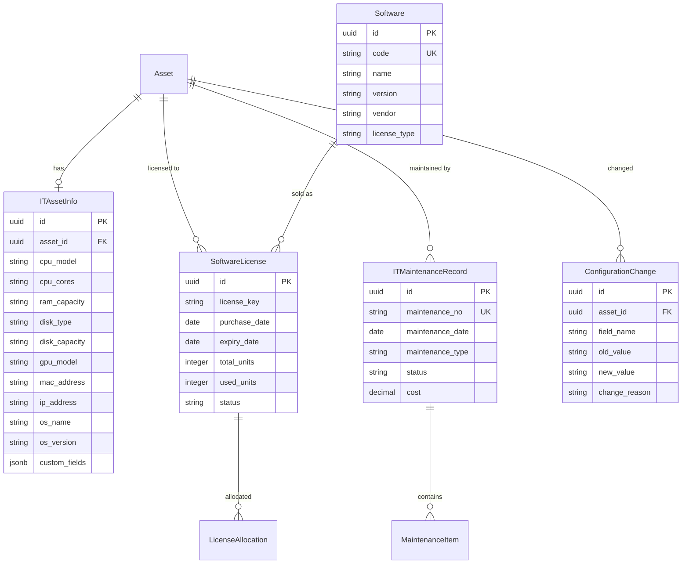

# IT资产管理模块 PRD

> 本文档定义 GZEAMS 平台 IT 资产管理模块的功能需求和技术实现规范

---

## 文档信息

| 字段 | 说明 |
|------|------|
| **功能名称** | IT资产管理 (IT Asset Management) |
| **功能代码** | IT_ASSET_MANAGEMENT |
| **文档版本** | 1.0.0 |
| **创建日期** | 2026-01-21 |
| **维护人** | Claude Code |
| **审核状态** | ✅ 草稿 |

---

## 目录

1. [需求概述](#1-需求概述)
2. [后端实现](#2-后端实现)
3. [前端实现](#3-前端实现)
4. [API接口](#4-api接口)
5. [权限设计](#5-权限设计)
6. [测试用例](#6-测试用例)
7. [实施计划](#7-实施计划)
8. [附录](#8-附录)

---

## 1. 需求概述

### 1.1 业务背景

**业务场景**:
IT设备是企业固定资产的重要组成部分，具有价值高、更新快、管理复杂的特点。企业需要专门针对IT设备的管理功能，包括：

- **软件许可证管理**: 跟踪操作系统、办公软件、专业软件的授权信息
- **硬件配置跟踪**: 记录CPU、内存、硬盘等详细配置信息
- **IT维护记录**: 记录维修、升级、更换配件等维护历史
- **IT设备生命周期**: 从采购到报废的全程跟踪
- **安全合规管理**: 密码管理、加密状态、安全审计

**现状分析**:
| 现状 | 问题 | 影响 |
|------|------|------|
| 基础资产模型无IT专用字段 | 无法记录CPU、内存、序列号等IT关键信息 | IT资产管理不完整 |
| 缺少软件许可证关联 | 软件资产与硬件设备分离，无法统计合规性 | 软件资产审计困难 |
| 无维护记录功能 | 设备维修历史无法追溯，影响采购决策 | 维护成本无法准确核算 |
| 缺少配置变更记录 | 设备升级、配件更换无记录 | 资产价值评估不准确 |

### 1.2 目标用户

| 用户角色 | 使用场景 | 核心需求 |
|---------|---------|----------|
| **IT管理员** | 管理全公司IT设备、软件许可、维护计划 | 需要完整的IT资产台账、软件合规统计、维护提醒 |
| **IT技术人员** | 执行设备维护、软件安装、配置变更 | 需要记录维护日志、查看设备配置历史 |
| **财务人员** | IT资产折旧计算、软件许可费用核算 | 需要IT资产价值报表、软件费用统计 |
| **普通员工** | 查看本人使用的IT设备信息 | 需要查看设备配置、软件清单、报修申请 |

### 1.3 功能范围

#### 1.3.1 本次实现范围

- ✅ **IT设备扩展属性**: 硬件配置(CPU、内存、硬盘)、MAC地址、IP地址等
- ✅ **软件许可证管理**: 许可证与资产关联、有效期跟踪、合规统计
- ✅ **IT维护记录**: 维护工单、维修历史、配件更换记录
- ✅ **配置变更历史**: 跟踪硬件配置变更、软件安装/卸载记录
- ✅ **IT资产报表**: 软件合规报表、设备配置统计、维护费用分析

#### 1.3.2 未来规划范围

- ⏳ IT资产自动发现 (Phase 2): 网络扫描、AD域集成
- ⏳ 远程管理功能 (Phase 2): 远程桌面集成、远程命令执行
- ⏳ 移动设备管理 (Phase 3): MDM集成、移动设备策略管理

#### 1.3.3 不在范围内

- ❌ 监控告警功能 (由专业监控系统提供)
- ❌ 终端安全审计 (由EDR系统提供)
- ❌ 网络设备配置管理 (由网管系统提供)

### 1.4 相关文档

| 文档 | 说明 | 关键章节 |
|------|------|----------|
| [Asset Model](../../../backend/apps/assets/models.py) | 基础资产模型 | §Asset |
| [PRD模板](../common_base_features/00_core/PRD_TEMPLATE.md) | PRD编写规范 | 全部 |
| [后端基类](../common_base_features/00_core/backend.md) | 公共基类实现 | §2 |

---

## 2. 后端实现

### 2.1 公共模型引用

> ✅ 本模块所有组件必须继承以下公共基类

| 组件类型 | 基类 | 引用路径 | 自动获得功能 |
|---------|------|---------|-------------|
| **Model** | `BaseModel` | `apps.common.models.BaseModel` | 组织隔离、软删除、审计字段、custom_fields |
| **Serializer** | `BaseModelSerializer` | `apps.common.serializers.base.BaseModelSerializer` | 公共字段序列化、custom_fields序列化 |
| **ViewSet** | `BaseModelViewSetWithBatch` | `apps.common.viewsets.base.BaseModelViewSetWithBatch` | 组织过滤、软删除、批量操作 |
| **Filter** | `BaseModelFilter` | `apps.common.filters.base.BaseModelFilter` | 时间范围过滤、用户过滤 |
| **Service** | `BaseCRUDService` | `apps.common.services.base_crud.BaseCRUDService` | 统一CRUD方法 |

### 2.2 数据模型设计

#### 2.2.1 ER图



#### 2.2.2 IT设备信息扩展模型

```python
# backend/apps/it_assets/models.py

from django.db import models
from django.core.validators import MinValueValidator
from apps.common.models import BaseModel


class ITAssetInfo(BaseModel):
    """
    IT Asset Information Extension Model

    Extends the base Asset model with IT-specific hardware and software information.
    Inherits from BaseModel for organization isolation and soft delete functionality.
    """

    class Meta:
        db_table = 'it_asset_info'
        verbose_name = 'IT Asset Information'
        verbose_name_plural = 'IT Asset Information'
        ordering = ['-created_at']
        indexes = [
            models.Index(fields=['organization', 'asset']),
            models.Index(fields=['organization', 'mac_address']),
            models.Index(fields=['organization', 'ip_address']),
        ]

    # Basic Information
    asset = models.OneToOneField(
        'assets.Asset',
        on_delete=models.CASCADE,
        related_name='it_info',
        help_text='Related asset'
    )

    # ========== Hardware Configuration ==========
    # CPU Information
    cpu_model = models.CharField(
        max_length=200,
        blank=True,
        help_text='CPU model (e.g., Intel Core i7-12700K)'
    )
    cpu_cores = models.IntegerField(
        null=True,
        blank=True,
        validators=[MinValueValidator(1)],
        help_text='Number of CPU cores'
    )
    cpu_threads = models.IntegerField(
        null=True,
        blank=True,
        validators=[MinValueValidator(1)],
        help_text='Number of CPU threads'
    )

    # Memory Information
    ram_capacity = models.IntegerField(
        null=True,
        blank=True,
        validators=[MinValueValidator(1)],
        help_text='RAM capacity in GB'
    )
    ram_type = models.CharField(
        max_length=50,
        blank=True,
        help_text='RAM type (e.g., DDR4, DDR5)'
    )
    ram_slots = models.IntegerField(
        null=True,
        blank=True,
        validators=[MinValueValidator(1)],
        help_text='Number of RAM slots'
    )

    # Disk Information
    disk_type = models.CharField(
        max_length=50,
        blank=True,
        help_text='Disk type (SSD/HDD/NVMe)'
    )
    disk_capacity = models.IntegerField(
        null=True,
        blank=True,
        validators=[MinValueValidator(1)],
        help_text='Disk capacity in GB'
    )
    disk_count = models.IntegerField(
        default=1,
        validators=[MinValueValidator(1)],
        help_text='Number of disks'
    )

    # GPU Information
    gpu_model = models.CharField(
        max_length=200,
        blank=True,
        help_text='GPU model'
    )
    gpu_memory = models.IntegerField(
        null=True,
        blank=True,
        validators=[MinValueValidator(1)],
        help_text='GPU memory in MB'
    )

    # Network Information
    mac_address = models.CharField(
        max_length=17,
        blank=True,
        db_index=True,
        help_text='MAC address (format: XX:XX:XX:XX:XX:XX)'
    )
    ip_address = models.GenericIPAddressField(
        null=True,
        blank=True,
        help_text='IP address'
    )
    hostname = models.CharField(
        max_length=100,
        blank=True,
        help_text='Computer hostname'
    )

    # ========== Operating System Information ==========
    os_name = models.CharField(
        max_length=100,
        blank=True,
        help_text='Operating system name (e.g., Windows 11, Ubuntu 22.04)'
    )
    os_version = models.CharField(
        max_length=100,
        blank=True,
        help_text='Operating system version'
    )
    os_architecture = models.CharField(
        max_length=50,
        blank=True,
        help_text='OS architecture (x86_64, arm64)'
    )
    os_license_key = models.CharField(
        max_length=200,
        blank=True,
        help_text='Operating system license key (encrypted)'
    )

    # ========== Security Information ==========
    bitlocker_key = models.CharField(
        max_length=200,
        blank=True,
        help_text='BitLocker recovery key (encrypted)'
    )
    bios_password = models.BooleanField(
        default=False,
        help_text='Whether BIOS password is set'
    )
    disk_encrypted = models.BooleanField(
        default=False,
        help_text='Whether disk is encrypted'
    )
    antivirus_software = models.CharField(
        max_length=100,
        blank=True,
        help_text='Installed antivirus software'
    )
    antivirus_enabled = models.BooleanField(
        default=True,
        help_text='Whether antivirus is enabled'
    )
    last_scan_date = models.DateField(
        null=True,
        blank=True,
        help_text='Last security scan date'
    )

    # ========== Domain/AD Information ==========
    ad_domain = models.CharField(
        max_length=100,
        blank=True,
        help_text='Active Directory domain'
    )
    ad_ou = models.CharField(
        max_length=200,
        blank=True,
        help_text='Organizational Unit path'
    )
    ad_computer_name = models.CharField(
        max_length=100,
        blank=True,
        help_text='AD computer name'
    )

    # ========== Management Information ==========
    management_ip = models.GenericIPAddressField(
        null=True,
        blank=True,
        help_text='Management IP address (iDRAC, iLO, etc.)'
    )
    remote_access_enabled = models.BooleanField(
        default=False,
        help_text='Remote management access enabled'
    )
    ssh_enabled = models.BooleanField(
        default=False,
        help_text='SSH access enabled'
    )
    rdp_enabled = models.BooleanField(
        default=False,
        help_text='RDP access enabled'
    )

    # ========== Notes ==========
    it_notes = models.TextField(
        blank=True,
        help_text='IT-specific notes'
    )

    def __str__(self):
        return f"IT Info - {self.asset.asset_name}"

    def get_full_config(self):
        """Get full hardware configuration summary."""
        config = []
        if self.cpu_model:
            config.append(f"CPU: {self.cpu_model}")
        if self.ram_capacity:
            config.append(f"RAM: {self.ram_capacity}GB {self.ram_type}")
        if self.disk_capacity:
            config.append(f"Disk: {self.disk_type} {self.disk_capacity}GB")
        return " | ".join(config)
```

#### 2.2.3 软件许可模型

```python
class Software(BaseModel):
    """
    Software Catalog Model

    Defines software products available for license management.
    """

    class Meta:
        db_table = 'software_catalog'
        verbose_name = 'Software'
        verbose_name_plural = 'Software Catalog'
        ordering = ['name']
        indexes = [
            models.Index(fields=['organization', 'code']),
            models.Index(fields=['organization', 'vendor']),
        ]

    SOFTWARE_TYPE_CHOICES = [
        ('os', 'Operating System'),
        ('office', 'Office Suite'),
        ('professional', 'Professional Software'),
        ('development', 'Development Tool'),
        ('security', 'Security Software'),
        ('database', 'Database'),
        ('other', 'Other'),
    ]

    code = models.CharField(
        max_length=50,
        unique=True,
        db_index=True,
        help_text='Software code (e.g., WIN11, OFF365)'
    )
    name = models.CharField(
        max_length=200,
        help_text='Software name'
    )
    version = models.CharField(
        max_length=50,
        blank=True,
        help_text='Software version'
    )
    vendor = models.CharField(
        max_length=200,
        blank=True,
        help_text='Software vendor'
    )
    software_type = models.CharField(
        max_length=50,
        choices=SOFTWARE_TYPE_CHOICES,
        default='other',
        help_text='Software type'
    )
    license_type = models.CharField(
        max_length=50,
        blank=True,
        help_text='License type (perpetual, subscription, OEM, volume)'
    )
    category = models.ForeignKey(
        'assets.AssetCategory',
        on_delete=models.SET_NULL,
        null=True,
        blank=True,
        related_name='software_items',
        help_text='Related asset category'
    )
    is_active = models.BooleanField(
        default=True,
        help_text='Whether this software is actively tracked'
    )

    def __str__(self):
        return f"{self.name} {self.version}".strip()


class SoftwareLicense(BaseModel):
    """
    Software License Model

    Tracks software license purchases, allocations, and expirations.
    """

    class Meta:
        db_table = 'software_licenses'
        verbose_name = 'Software License'
        verbose_name_plural = 'Software Licenses'
        ordering = ['-created_at']
        indexes = [
            models.Index(fields=['organization', 'software']),
            models.Index(fields=['organization', 'status']),
            models.Index(fields=['organization', 'expiry_date']),
        ]

    STATUS_CHOICES = [
        ('active', 'Active'),
        ('expired', 'Expired'),
        ('suspended', 'Suspended'),
        ('revoked', 'Revoked'),
    ]

    license_no = models.CharField(
        max_length=100,
        unique=True,
        db_index=True,
        help_text='License number'
    )
    software = models.ForeignKey(
        Software,
        on_delete=models.CASCADE,
        related_name='licenses',
        help_text='Associated software'
    )
    license_key = models.CharField(
        max_length=500,
        blank=True,
        help_text='License key/serial (encrypted)'
    )

    # License Quantity
    total_units = models.IntegerField(
        default=1,
        validators=[MinValueValidator(1)],
        help_text='Total licensed units'
    )
    used_units = models.IntegerField(
        default=0,
        validators=[MinValueValidator(0)],
        help_text='Currently allocated units'
    )

    # License Period
    purchase_date = models.DateField(
        help_text='License purchase date'
    )
    expiry_date = models.DateField(
        null=True,
        blank=True,
        help_text='License expiration date (null for perpetual)'
    )

    # Financial
    purchase_price = models.DecimalField(
        max_digits=14,
        decimal_places=2,
        null=True,
        blank=True,
        help_text='License purchase price'
    )
    annual_cost = models.DecimalField(
        max_digits=14,
        decimal_places=2,
        null=True,
        blank=True,
        help_text='Annual maintenance/subscription cost'
    )

    # Status
    status = models.CharField(
        max_length=50,
        choices=STATUS_CHOICES,
        default='active',
        help_text='License status'
    )

    # License Details
    license_type = models.CharField(
        max_length=50,
        blank=True,
        help_text='License type (perpetual, subscription, OEM, volume)'
    )
    agreement_no = models.CharField(
        max_length=100,
        blank=True,
        help_text='Enterprise agreement number'
    )
    vendor = models.ForeignKey(
        'assets.Supplier',
        on_delete=models.SET_NULL,
        null=True,
        blank=True,
        related_name='software_licenses',
        help_text='License vendor/supplier'
    )

    # Notes
    notes = models.TextField(
        blank=True,
        help_text='License notes'
    )

    def __str__(self):
        return f"{self.license_no} - {self.software.name}"

    def is_expired(self):
        """Check if license is expired."""
        if self.expiry_date is None:
            return False  # Perpetual license
        from django.utils import timezone
        return timezone.now().date() > self.expiry_date

    def available_units(self):
        """Get available license units."""
        return self.total_units - self.used_units

    def utilization_rate(self):
        """Get license utilization rate as percentage."""
        if self.total_units == 0:
            return 0
        return (self.used_units / self.total_units) * 100


class LicenseAllocation(BaseModel):
    """
    Software License Allocation Model

    Tracks which assets are assigned which software licenses.
    """

    class Meta:
        db_table = 'license_allocations'
        verbose_name = 'License Allocation'
        verbose_name_plural = 'License Allocations'
        ordering = ['-created_at']
        indexes = [
            models.Index(fields=['organization', 'license']),
            models.Index(fields=['organization', 'asset']),
            models.Index(fields=['organization', 'license', 'asset']),
        ]
        unique_together = [['organization', 'license', 'asset']]

    license = models.ForeignKey(
        SoftwareLicense,
        on_delete=models.CASCADE,
        related_name='allocations',
        help_text='Allocated license'
    )
    asset = models.ForeignKey(
        'assets.Asset',
        on_delete=models.CASCADE,
        related_name='software_allocations',
        help_text='Asset with this software'
    )

    allocated_date = models.DateField(
        help_text='Allocation date'
    )
    allocated_by = models.ForeignKey(
        'accounts.User',
        on_delete=models.SET_NULL,
        null=True,
        blank=True,
        related_name='license_allocations',
        help_text='User who made the allocation'
    )

    allocation_key = models.CharField(
        max_length=500,
        blank=True,
        help_text='Specific license key for this allocation (encrypted)'
    )

    is_active = models.BooleanField(
        default=True,
        help_text='Whether this allocation is active'
    )
    notes = models.TextField(
        blank=True,
        help_text='Allocation notes'
    )

    def __str__(self):
        return f"{self.license.software.name} -> {self.asset.asset_name}"

    def save(self, *args, **kwargs):
        is_new = self.pk is None
        super().save(*args, **kwargs)

        # Update license usage
        if is_new and self.is_active:
            self.license.used_units += 1
            self.license.save()
```

#### 2.2.4 IT维护记录模型

```python
class ITMaintenanceRecord(BaseModel):
    """
    IT Maintenance Record Model

    Tracks all maintenance activities for IT assets including repairs,
    upgrades, and routine maintenance.
    """

    class Meta:
        db_table = 'it_maintenance_records'
        verbose_name = 'IT Maintenance Record'
        verbose_name_plural = 'IT Maintenance Records'
        ordering = ['-maintenance_date', '-created_at']
        indexes = [
            models.Index(fields=['organization', 'maintenance_no']),
            models.Index(fields=['organization', 'asset']),
            models.Index(fields=['organization', 'status']),
            models.Index(fields=['organization', 'maintenance_date']),
        ]

    MAINTENANCE_TYPE_CHOICES = [
        ('repair', 'Repair'),
        ('upgrade', 'Upgrade'),
        ('replacement', 'Component Replacement'),
        ('routine', 'Routine Maintenance'),
        ('cleaning', 'Cleaning'),
        ('diagnostic', 'Diagnostic'),
        ('installation', 'Software Installation'),
        ('other', 'Other'),
    ]

    STATUS_CHOICES = [
        ('pending', 'Pending'),
        ('in_progress', 'In Progress'),
        ('completed', 'Completed'),
        ('cancelled', 'Cancelled'),
    ]

    maintenance_no = models.CharField(
        max_length=50,
        unique=True,
        db_index=True,
        help_text='Maintenance order number (auto-generated: MT+YYYYMM+NNNN)'
    )
    asset = models.ForeignKey(
        'assets.Asset',
        on_delete=models.CASCADE,
        related_name='maintenance_records',
        help_text='Maintained asset'
    )

    maintenance_type = models.CharField(
        max_length=50,
        choices=MAINTENANCE_TYPE_CHOICES,
        help_text='Type of maintenance'
    )
    maintenance_date = models.DateField(
        help_text='Maintenance date'
    )

    # Problem Description
    problem_description = models.TextField(
        blank=True,
        help_text='Description of the problem/reason for maintenance'
    )
    symptoms = models.TextField(
        blank=True,
        help_text='Symptoms observed'
    )

    # Resolution
    resolution = models.TextField(
        blank=True,
        help_text='What was done to resolve the issue'
    )
    resolution_date = models.DateField(
        null=True,
        blank=True,
        help_text='Date issue was resolved'
    )

    # Status and Approval
    status = models.CharField(
        max_length=50,
        choices=STATUS_CHOICES,
        default='pending',
        help_text='Maintenance status'
    )

    # Technician Information
    technician = models.ForeignKey(
        'accounts.User',
        on_delete=models.SET_NULL,
        null=True,
        blank=True,
        related_name='maintenance_tasks',
        help_text='Technician who performed the maintenance'
    )
    external_vendor = models.ForeignKey(
        'assets.Supplier',
        on_delete=models.SET_NULL,
        null=True,
        blank=True,
        related_name='maintenance_services',
        help_text='External vendor if applicable'
    )

    # Cost Tracking
    labor_cost = models.DecimalField(
        max_digits=14,
        decimal_places=2,
        default=0,
        help_text='Labor cost'
    )
    parts_cost = models.DecimalField(
        max_digits=14,
        decimal_places=2,
        default=0,
        help_text='Cost of replacement parts'
    )
    total_cost = models.DecimalField(
        max_digits=14,
        decimal_places=2,
        default=0,
        help_text='Total maintenance cost'
    )

    # Downtime Tracking
    downtime_start = models.DateTimeField(
        null=True,
        blank=True,
        help_text='When asset became unavailable'
    )
    downtime_end = models.DateTimeField(
        null=True,
        blank=True,
        help_text='When asset became available again'
    )

    # Notes
    notes = models.TextField(
        blank=True,
        help_text='Additional maintenance notes'
    )

    def __str__(self):
        return f"{self.maintenance_no} - {self.asset.asset_name}"

    def save(self, *args, **kwargs):
        if not self.maintenance_no:
            self.maintenance_no = self._generate_maintenance_no()
        # Auto-calculate total cost
        self.total_cost = (self.labor_cost or 0) + (self.parts_cost or 0)
        super().save(*args, **kwargs)

    def _generate_maintenance_no(self):
        """Generate maintenance order number."""
        try:
            from apps.system.services import SequenceService
            return SequenceService.get_next_value(
                'MAINTENANCE_NO',
                organization_id=self.organization_id
            )
        except Exception:
            from django.utils import timezone
            prefix = timezone.now().strftime('%Y%m')
            last_record = ITMaintenanceRecord.all_objects.filter(
                maintenance_no__startswith=f"MT{prefix}"
            ).order_by('-maintenance_no').first()
            if last_record:
                seq = int(last_record.maintenance_no[-4:]) + 1
            else:
                seq = 1
            return f"MT{prefix}{seq:04d}"

    def downtime_hours(self):
        """Calculate downtime in hours."""
        if self.downtime_start and self.downtime_end:
            delta = self.downtime_end - self.downtime_start
            return delta.total_seconds() / 3600
        return 0


class MaintenanceItem(BaseModel):
    """
    Maintenance Item/Component Model

    Tracks individual parts or components replaced during maintenance.
    """

    class Meta:
        db_table = 'maintenance_items'
        verbose_name = 'Maintenance Item'
        verbose_name_plural = 'Maintenance Items'
        ordering = ['-created_at']

    maintenance_record = models.ForeignKey(
        ITMaintenanceRecord,
        on_delete=models.CASCADE,
        related_name='items',
        help_text='Parent maintenance record'
    )

    item_name = models.CharField(
        max_length=200,
        help_text='Item/component name'
    )
    item_type = models.CharField(
        max_length=50,
        blank=True,
        help_text='Item type (hardware, software, service)'
    )
    part_number = models.CharField(
        max_length=100,
        blank=True,
        help_text='Manufacturer part number'
    )

    quantity = models.IntegerField(
        default=1,
        validators=[MinValueValidator(1)],
        help_text='Quantity'
    )
    unit_cost = models.DecimalField(
        max_digits=14,
        decimal_places=2,
        default=0,
        help_text='Cost per unit'
    )
    total_cost = models.DecimalField(
        max_digits=14,
        decimal_places=2,
        default=0,
        help_text='Total cost for this item'
    )

    vendor = models.ForeignKey(
        'assets.Supplier',
        on_delete=models.SET_NULL,
        null=True,
        blank=True,
        related_name='+',
        help_text='Part vendor'
    )

    notes = models.TextField(
        blank=True,
        help_text='Item notes'
    )

    def __str__(self):
        return f"{self.item_name} x{self.quantity}"

    def save(self, *args, **kwargs):
        self.total_cost = (self.unit_cost or 0) * (self.quantity or 0)
        super().save(*args, **kwargs)
```

#### 2.2.5 配置变更历史模型

```python
class ConfigurationChange(BaseModel):
    """
    Configuration Change History Model

    Tracks all changes to IT asset hardware and software configuration.
    Automatically populated via signals when ITAssetInfo is updated.
    """

    class Meta:
        db_table = 'configuration_changes'
        verbose_name = 'Configuration Change'
        verbose_name_plural = 'Configuration Changes'
        ordering = ['-created_at']
        indexes = [
            models.Index(fields=['organization', 'asset']),
            models.Index(fields=['organization', 'asset', '-created_at']),
            models.Index(fields=['organization', 'field_name']),
        ]

    CHANGE_TYPE_CHOICES = [
        ('hardware', 'Hardware Change'),
        ('software', 'Software Change'),
        ('network', 'Network Change'),
        ('security', 'Security Change'),
        ('other', 'Other Change'),
    ]

    asset = models.ForeignKey(
        'assets.Asset',
        on_delete=models.CASCADE,
        related_name='configuration_changes',
        help_text='Asset that was changed'
    )

    field_name = models.CharField(
        max_length=100,
        help_text='Name of the field that changed'
    )
    field_display_name = models.CharField(
        max_length=200,
        help_text='Display name of the field'
    )

    old_value = models.TextField(
        blank=True,
        help_text='Previous value'
    )
    new_value = models.TextField(
        blank=True,
        help_text='New value'
    )

    change_type = models.CharField(
        max_length=50,
        choices=CHANGE_TYPE_CHOICES,
        default='other',
        help_text='Type of change'
    )
    change_reason = models.TextField(
        blank=True,
        help_text='Reason for the change'
    )

    changed_by = models.ForeignKey(
        'accounts.User',
        on_delete=models.SET_NULL,
        null=True,
        blank=True,
        related_name='configuration_changes',
        help_text='User who made the change'
    )

    ip_address = models.GenericIPAddressField(
        null=True,
        blank=True,
        help_text='IP address of the user who made the change'
    )

    def __str__(self):
        return f"{self.asset.asset_name}: {self.field_display_name} changed"

    @classmethod
    def log_change(cls, asset, field_name, old_value, new_value,
                   changed_by=None, change_reason='', change_type='other',
                   ip_address=None):
        """
        Create a configuration change log entry.

        Args:
            asset: The Asset instance
            field_name: The field name that changed
            old_value: The old value
            new_value: The new value
            changed_by: User who made the change
            change_reason: Reason for the change
            change_type: Type of change
            ip_address: IP address of the changer
        """
        from apps.accounts.models import User
        from apps.common.middleware import get_current_organization

        # Get display name for field
        display_names = {
            'cpu_model': 'CPU Model',
            'ram_capacity': 'RAM Capacity',
            'disk_capacity': 'Disk Capacity',
            'mac_address': 'MAC Address',
            'ip_address': 'IP Address',
            'os_name': 'Operating System',
            'os_version': 'OS Version',
        }

        cls.objects.create(
            organization_id=asset.organization_id,
            asset=asset,
            field_name=field_name,
            field_display_name=display_names.get(field_name, field_name),
            old_value=str(old_value) if old_value else '',
            new_value=str(new_value) if new_value else '',
            change_type=change_type,
            change_reason=change_reason,
            changed_by=changed_by,
            created_by=changed_by or User.objects.first(),
            ip_address=ip_address
        )
```

#### 2.2.6 序列化器

```python
# backend/apps/it_assets/serializers.py

from rest_framework import serializers
from apps.common.serializers.base import BaseModelSerializer
from .models import (
    ITAssetInfo, Software, SoftwareLicense, LicenseAllocation,
    ITMaintenanceRecord, MaintenanceItem, ConfigurationChange
)


class ITAssetInfoSerializer(BaseModelSerializer):
    """IT Asset Information Serializer"""

    class Meta(BaseModelSerializer.Meta):
        model = ITAssetInfo
        fields = BaseModelSerializer.Meta.fields + [
            # Hardware
            'asset', 'cpu_model', 'cpu_cores', 'cpu_threads',
            'ram_capacity', 'ram_type', 'ram_slots',
            'disk_type', 'disk_capacity', 'disk_count',
            'gpu_model', 'gpu_memory',
            # Network
            'mac_address', 'ip_address', 'hostname',
            # OS
            'os_name', 'os_version', 'os_architecture', 'os_license_key',
            # Security
            'bitlocker_key', 'bios_password', 'disk_encrypted',
            'antivirus_software', 'antivirus_enabled', 'last_scan_date',
            # AD
            'ad_domain', 'ad_ou', 'ad_computer_name',
            # Management
            'management_ip', 'remote_access_enabled', 'ssh_enabled', 'rdp_enabled',
            # Notes
            'it_notes',
        ]
        extra_kwargs = {
            'os_license_key': {'write_only': True},
            'bitlocker_key': {'write_only': True},
        }

    def to_representation(self, instance):
        """Mask sensitive data in output."""
        data = super().to_representation(instance)
        # Mask sensitive fields
        if data.get('os_license_key'):
            data['os_license_key'] = '***MASKED***'
        if data.get('bitlocker_key'):
            data['bitlocker_key'] = '***MASKED***'
        return data


class SoftwareSerializer(BaseModelSerializer):
    """Software Catalog Serializer"""

    class Meta(BaseModelSerializer.Meta):
        model = Software
        fields = BaseModelSerializer.Meta.fields + [
            'code', 'name', 'version', 'vendor', 'software_type',
            'license_type', 'category', 'is_active',
        ]


class SoftwareLicenseSerializer(BaseModelSerializer):
    """Software License Serializer"""
    software_name = serializers.CharField(source='software.name', read_only=True)
    software_version = serializers.CharField(source='software.version', read_only=True)
    available_units = serializers.IntegerField(read_only=True)
    utilization_rate = serializers.FloatField(read_only=True)
    is_expired = serializers.BooleanField(read_only=True)

    class Meta(BaseModelSerializer.Meta):
        model = SoftwareLicense
        fields = BaseModelSerializer.Meta.fields + [
            'license_no', 'software', 'software_name', 'software_version',
            'license_key', 'total_units', 'used_units', 'available_units',
            'utilization_rate', 'purchase_date', 'expiry_date', 'is_expired',
            'purchase_price', 'annual_cost', 'status', 'license_type',
            'agreement_no', 'vendor', 'notes',
        ]
        extra_kwargs = {
            'license_key': {'write_only': True},
        }


class LicenseAllocationSerializer(BaseModelSerializer):
    """License Allocation Serializer"""
    software_name = serializers.CharField(source='license.software.name', read_only=True)
    asset_name = serializers.CharField(source='asset.asset_name', read_only=True)
    asset_code = serializers.CharField(source='asset.asset_code', read_only=True)
    allocated_by_name = serializers.CharField(source='allocated_by.username', read_only=True)

    class Meta(BaseModelSerializer.Meta):
        model = LicenseAllocation
        fields = BaseModelSerializer.Meta.fields + [
            'license', 'software_name', 'asset', 'asset_name', 'asset_code',
            'allocated_date', 'allocated_by', 'allocated_by_name',
            'allocation_key', 'is_active', 'notes',
        ]


class MaintenanceItemSerializer(BaseModelSerializer):
    """Maintenance Item Serializer"""

    class Meta(BaseModelSerializer.Meta):
        model = MaintenanceItem
        fields = BaseModelSerializer.Meta.fields + [
            'maintenance_record', 'item_name', 'item_type', 'part_number',
            'quantity', 'unit_cost', 'total_cost', 'vendor', 'notes',
        ]


class ITMaintenanceRecordSerializer(BaseModelSerializer):
    """IT Maintenance Record Serializer"""
    asset_name = serializers.CharField(source='asset.asset_name', read_only=True)
    asset_code = serializers.CharField(source='asset.asset_code', read_only=True)
    technician_name = serializers.CharField(source='technician.username', read_only=True)
    items = MaintenanceItemSerializer(many=True, read_only=True)
    downtime_hours = serializers.FloatField(read_only=True)

    class Meta(BaseModelSerializer.Meta):
        model = ITMaintenanceRecord
        fields = BaseModelSerializer.Meta.fields + [
            'maintenance_no', 'asset', 'asset_name', 'asset_code',
            'maintenance_type', 'maintenance_date',
            'problem_description', 'symptoms', 'resolution', 'resolution_date',
            'status', 'technician', 'technician_name', 'external_vendor',
            'labor_cost', 'parts_cost', 'total_cost',
            'downtime_start', 'downtime_end', 'downtime_hours',
            'notes', 'items',
        ]


class ConfigurationChangeSerializer(BaseModelSerializer):
    """Configuration Change Serializer"""
    asset_name = serializers.CharField(source='asset.asset_name', read_only=True)
    asset_code = serializers.CharField(source='asset.asset_code', read_only=True)
    changed_by_name = serializers.CharField(source='changed_by.username', read_only=True)

    class Meta(BaseModelSerializer.Meta):
        model = ConfigurationChange
        fields = BaseModelSerializer.Meta.fields + [
            'asset', 'asset_name', 'asset_code',
            'field_name', 'field_display_name',
            'old_value', 'new_value', 'change_type', 'change_reason',
            'changed_by', 'changed_by_name', 'ip_address',
        ]
```

#### 2.2.7 过滤器

```python
# backend/apps/it_assets/filters.py

from django_filters import rest_framework as filters
from apps.common.filters.base import BaseModelFilter
from .models import (
    ITAssetInfo, Software, SoftwareLicense, LicenseAllocation,
    ITMaintenanceRecord, ConfigurationChange
)


class ITAssetInfoFilter(BaseModelFilter):
    """IT Asset Information Filter"""

    class Meta(BaseModelFilter.Meta):
        model = ITAssetInfo
        fields = BaseModelFilter.Meta.fields + [
            'cpu_model', 'ram_capacity', 'disk_type', 'os_name',
        ]


class SoftwareFilter(BaseModelFilter):
    """Software Filter"""

    software_type = filters.CharFilter(field_name='software_type')
    vendor = filters.CharFilter(lookup_expr='icontains')

    class Meta(BaseModelFilter.Meta):
        model = Software
        fields = BaseModelFilter.Meta.fields + [
            'software_type', 'vendor', 'is_active',
        ]


class SoftwareLicenseFilter(BaseModelFilter):
    """Software License Filter"""

    status = filters.CharFilter()
    software = filters.CharFilter(field_name='software__code')
    expiring_soon = filters.BooleanFilter(method='filter_expiring_soon')

    def filter_expiring_soon(self, queryset, name, value):
        """Filter licenses expiring within 30 days."""
        if value:
            from django.utils import timezone
            delta = timezone.now().date() + timezone.timedelta(days=30)
            return queryset.filter(expiry_date__lte=delta, status='active')
        return queryset

    class Meta(BaseModelFilter.Meta):
        model = SoftwareLicense
        fields = BaseModelFilter.Meta.fields + [
            'software', 'status', 'expiry_date',
        ]


class ITMaintenanceRecordFilter(BaseModelFilter):
    """IT Maintenance Record Filter"""

    maintenance_type = filters.CharFilter()
    status = filters.CharFilter()
    date_from = filters.DateFilter(field_name='maintenance_date', lookup_expr='gte')
    date_to = filters.DateFilter(field_name='maintenance_date', lookup_expr='lte')

    class Meta(BaseModelFilter.Meta):
        model = ITMaintenanceRecord
        fields = BaseModelFilter.Meta.fields + [
            'maintenance_type', 'status', 'maintenance_date',
        ]


class ConfigurationChangeFilter(BaseModelFilter):
    """Configuration Change Filter"""

    change_type = filters.CharFilter()
    field_name = filters.CharFilter()
    date_from = filters.DateFilter(field_name='created_at', lookup_expr='gte')
    date_to = filters.DateFilter(field_name='created_at', lookup_expr='lte')

    class Meta(BaseModelFilter.Meta):
        model = ConfigurationChange
        fields = BaseModelFilter.Meta.fields + [
            'change_type', 'field_name',
        ]
```

#### 2.2.8 ViewSet

```python
# backend/apps/it_assets/viewsets.py

from rest_framework import viewsets, status
from rest_framework.decorators import action
from rest_framework.response import Response
from apps.common.viewsets.base import BaseModelViewSetWithBatch
from apps.common.responses.base import BaseResponse
from .models import (
    ITAssetInfo, Software, SoftwareLicense, LicenseAllocation,
    ITMaintenanceRecord, MaintenanceItem, ConfigurationChange
)
from .serializers import (
    ITAssetInfoSerializer, SoftwareSerializer, SoftwareLicenseSerializer,
    LicenseAllocationSerializer, ITMaintenanceRecordSerializer,
    MaintenanceItemSerializer, ConfigurationChangeSerializer
)
from .filters import (
    ITAssetInfoFilter, SoftwareFilter, SoftwareLicenseFilter,
    ITMaintenanceRecordFilter, ConfigurationChangeFilter
)


class ITAssetInfoViewSet(BaseModelViewSetWithBatch):
    """IT Asset Information ViewSet"""
    queryset = ITAssetInfo.objects.all()
    serializer_class = ITAssetInfoSerializer
    filterset_class = ITAssetInfoFilter

    def perform_update(self, serializer):
        """Log configuration changes on update."""
        instance = self.get_object()
        old_values = {}
        new_values = {}

        # Track changed fields
        tracked_fields = [
            'cpu_model', 'ram_capacity', 'disk_capacity',
            'mac_address', 'ip_address', 'os_name', 'os_version'
        ]

        for field in tracked_fields:
            old_val = getattr(instance, field, None)
            new_val = serializer.validated_data.get(field)
            if new_val is not None and old_val != new_val:
                old_values[field] = old_val
                new_values[field] = new_val

        # Save the instance
        serializer.save(updated_by=self.request.user)

        # Log changes
        for field, old_val in old_values.items():
            ConfigurationChange.log_change(
                asset=instance.asset,
                field_name=field,
                old_value=old_val,
                new_value=new_values[field],
                changed_by=self.request.user,
                change_type='hardware' if field in ['cpu_model', 'ram_capacity', 'disk_capacity'] else 'software'
            )


class SoftwareViewSet(BaseModelViewSetWithBatch):
    """Software Catalog ViewSet"""
    queryset = Software.objects.all()
    serializer_class = SoftwareSerializer
    filterset_class = SoftwareFilter


class SoftwareLicenseViewSet(BaseModelViewSetWithBatch):
    """Software License ViewSet"""
    queryset = SoftwareLicense.objects.all()
    serializer_class = SoftwareLicenseSerializer
    filterset_class = SoftwareLicenseFilter

    @action(detail=False, methods=['get'])
    def expiring(self, request):
        """Get licenses expiring within 30 days."""
        from django.utils import timezone
        delta = timezone.now().date() + timezone.timedelta(days=30)

        licenses = self.queryset.filter(
            expiry_date__lte=delta,
            status='active'
        )

        page = self.paginate_queryset(licenses)
        serializer = self.get_serializer(page, many=True)
        return self.get_paginated_response(serializer.data)

    @action(detail=False, methods=['get'])
    def compliance_report(self, request):
        """Get software compliance report."""
        from django.db.models import Sum, F

        total_licenses = self.queryset.filter(status='active').count()
        expiring_licenses = self.queryset.filter(
            status='active',
            expiry_date__lte=timezone.now().date() + timezone.timedelta(days=30)
        ).count()

        # Utilization stats
        over_utilized = []
        for license in self.queryset.filter(status='active'):
            if license.utilization_rate() > 100:
                over_utilized.append({
                    'software': license.software.name,
                    'utilization': license.utilization_rate()
                })

        return Response({
            'success': True,
            'data': {
                'total_licenses': total_licenses,
                'expiring_licenses': expiring_licenses,
                'over_utilized': over_utilized
            }
        })


class LicenseAllocationViewSet(BaseModelViewSetWithBatch):
    """License Allocation ViewSet"""
    queryset = LicenseAllocation.objects.all()
    serializer_class = LicenseAllocationSerializer
    filterset_class = BaseModelFilter

    def perform_create(self, serializer):
        """Validate license availability before allocation."""
        license_obj = serializer.validated_data['license']

        if license_obj.available_units() <= 0:
            return Response(
                {
                    'success': False,
                    'error': {
                        'code': 'NO_AVAILABLE_LICENSES',
                        'message': 'No available licenses for this software'
                    }
                },
                status=status.HTTP_400_BAD_REQUEST
            )

        serializer.save(
            allocated_by=self.request.user,
            allocated_date=timezone.now().date()
        )

    def perform_destroy(self, instance):
        """Update license usage on deallocation."""
        if instance.is_active:
            instance.license.used_units -= 1
            instance.license.save()
        instance.is_active = False
        instance.save()


class ITMaintenanceRecordViewSet(BaseModelViewSetWithBatch):
    """IT Maintenance Record ViewSet"""
    queryset = ITMaintenanceRecord.objects.all()
    serializer_class = ITMaintenanceRecordSerializer
    filterset_class = ITMaintenanceRecordFilter

    @action(detail=True, methods=['post'])
    def complete(self, request, pk=None):
        """Mark maintenance as completed."""
        record = self.get_object()

        if record.status == 'completed':
            return Response(
                {
                    'success': False,
                    'error': {
                        'code': 'ALREADY_COMPLETED',
                        'message': 'Maintenance is already completed'
                    }
                },
                status=status.HTTP_400_BAD_REQUEST
            )

        record.status = 'completed'
        record.resolution_date = timezone.now().date()
        record.technician = request.user
        record.save()

        serializer = self.get_serializer(record)
        return Response({
            'success': True,
            'message': 'Maintenance marked as completed',
            'data': serializer.data
        })


class ConfigurationChangeViewSet(BaseModelViewSetWithBatch):
    """Configuration Change ViewSet (Read Only)"""
    queryset = ConfigurationChange.objects.all()
    serializer_class = ConfigurationChangeSerializer
    filterset_class = ConfigurationChangeFilter

    def get_permissions(self):
        """Configuration changes are read-only."""
        return [IsAuthenticated()],  # Override to remove edit permissions

    def allow_create(self):
        return False

    def allow_update(self):
        return False

    def allow_delete(self):
        return False
```

### 2.3 Service层

```python
# backend/apps/it_assets/services.py

from apps.common.services.base_crud import BaseCRUDService
from .models import (
    ITAssetInfo, Software, SoftwareLicense, LicenseAllocation,
    ITMaintenanceRecord, ConfigurationChange
)


class ITAssetInfoService(BaseCRUDService):
    """IT Asset Information Service"""

    def __init__(self):
        super().__init__(ITAssetInfo)

    def get_by_asset_id(self, asset_id: str):
        """Get IT info by asset ID."""
        return self.model_class.objects.filter(asset_id=asset_id).first()

    def get_by_mac_address(self, mac_address: str, organization_id: str):
        """Get IT info by MAC address."""
        return self.model_class.objects.filter(
            mac_address=mac_address,
            organization_id=organization_id
        ).first()


class SoftwareLicenseService(BaseCRUDService):
    """Software License Service"""

    def __init__(self):
        super().__init__(SoftwareLicense)

    def get_expiring_licenses(self, organization_id: str, days: int = 30):
        """Get licenses expiring within specified days."""
        from django.utils import timezone
        delta = timezone.now().date() + timezone.timedelta(days=days)

        return self.model_class.objects.filter(
            organization_id=organization_id,
            expiry_date__lte=delta,
            status='active'
        )

    def get_over_utilized_licenses(self, organization_id: str):
        """Get licenses with utilization over 100%."""
        licenses = self.model_class.objects.filter(
            organization_id=organization_id,
            status='active'
        )

        over_utilized = []
        for license in licenses:
            if license.utilization_rate() > 100:
                over_utilized.append(license)

        return over_utilized

    def allocate_license(self, license_id: str, asset_id: str,
                         allocated_by: str, allocation_key: str = None):
        """Allocate a license to an asset."""
        from django.utils import timezone

        license = self.get(license_id)

        if license.available_units() <= 0:
            raise ValueError('No available licenses')

        from apps.assets.models import Asset
        asset = Asset.objects.get(id=asset_id)

        allocation = LicenseAllocation.objects.create(
            organization_id=license.organization_id,
            license_id=license_id,
            asset_id=asset_id,
            allocated_by_id=allocated_by,
            allocated_date=timezone.now().date(),
            allocation_key=allocation_key,
            created_by_id=allocated_by
        )

        return allocation

    def deallocate_license(self, allocation_id: str):
        """Deallocate a license from an asset."""
        allocation = LicenseAllocation.objects.get(id=allocation_id)

        if allocation.is_active:
            allocation.license.used_units -= 1
            allocation.license.save()

        allocation.is_active = False
        allocation.save()

        return allocation


class ITMaintenanceService(BaseCRUDService):
    """IT Maintenance Service"""

    def __init__(self):
        super().__init__(ITMaintenanceRecord)

    def get_by_asset(self, asset_id: str):
        """Get maintenance records for an asset."""
        return self.model_class.objects.filter(asset_id=asset_id)

    def get_upcoming_maintenance(self, organization_id: str, days: int = 7):
        """Get scheduled upcoming maintenance."""
        from django.utils import timezone
        delta = timezone.now().date() + timezone.timedelta(days=days)

        return self.model_class.objects.filter(
            organization_id=organization_id,
            maintenance_date__lte=delta,
            status__in=['pending', 'in_progress']
        )

    def calculate_maintenance_cost(self, asset_id: str, start_date, end_date):
        """Calculate total maintenance cost for an asset in a date range."""
        records = self.model_class.objects.filter(
            asset_id=asset_id,
            maintenance_date__gte=start_date,
            maintenance_date__lte=end_date,
            status='completed'
        )

        return sum(r.total_cost for r in records)


class ConfigurationChangeService(BaseCRUDService):
    """Configuration Change Service"""

    def __init__(self):
        super().__init__(ConfigurationChange)

    def get_asset_history(self, asset_id: str):
        """Get configuration change history for an asset."""
        return self.model_class.objects.filter(
            asset_id=asset_id
        ).order_by('-created_at')

    def get_field_history(self, asset_id: str, field_name: str):
        """Get history for a specific field."""
        return self.model_class.objects.filter(
            asset_id=asset_id,
            field_name=field_name
        ).order_by('-created_at')
```

### 2.4 文件结构

```
backend/apps/it_assets/
├── __init__.py
├── models.py              # IT asset models
├── serializers.py         # Model serializers
├── viewsets.py            # API viewsets
├── filters.py             # Query filters
├── services.py            # Business logic services
├── urls.py                # URL routing
├── signals.py             # Model signals for auto-logging
├── admin.py               # Django admin configuration
└── tests/                 # Test cases
    ├── __init__.py
    ├── test_models.py
    ├── test_viewsets.py
    └── test_services.py
```

---

## 3. 前端实现

### 3.1 公共组件引用

#### 3.1.1 页面组件清单

| 组件名 | 组件路径 | 用途 | Props | Events |
|--------|---------|------|-------|--------|
| BaseListPage | @/components/common/BaseListPage.vue | 列表页面 | title, fetchMethod, columns | row-click, create |
| BaseFormPage | @/components/common/BaseFormPage.vue | 表单页面 | title, submitMethod, rules | submit-success |
| BaseDetailPage | @/components/common/BaseDetailPage.vue | 详情页面 | title, data, fields | - |
| ITAssetCard | @/components/it_assets/ITAssetCard.vue | IT资产卡片 | asset, itInfo | - |

#### 3.1.2 Hooks

| Hook | 用途 | 引用路径 |
|------|------|---------|
| useITAssets | IT资产管理 | @/composables/useITAssets.js |
| useSoftwareLicenses | 软件许可管理 | @/composables/useSoftwareLicenses.js |

### 3.2 页面布局

#### 3.2.1 IT资产列表页

```vue
<!-- frontend/src/views/it_assets/ITAssetList.vue -->

<template>
    <BaseListPage
        title="IT资产管理"
        :fetch-method="fetchData"
        :batch-delete-method="batchDelete"
        :columns="columns"
        :search-fields="searchFields"
        :filter-fields="filterFields"
        :custom-slots="['configuration', 'status', 'actions']"
        @row-click="handleRowClick"
        @create="handleCreate"
    >
        <!-- 配置列插槽 -->
        <template #configuration="{ row }">
            <div class="config-info">
                <span v-if="row.it_info?.cpu_model">{{ row.it_info.cpu_model }}</span>
                <span v-if="row.it_info?.ram_capacity"> / {{ row.it_info.ram_capacity }}GB RAM</span>
                <span v-if="row.it_info?.disk_capacity"> / {{ row.it_info.disk_capacity }}GB {{ row.it_info.disk_type }}</span>
                <el-text v-else type="info">未配置</el-text>
            </div>
        </template>

        <!-- 操作列插槽 -->
        <template #actions="{ row }">
            <el-button link type="primary" @click.stop="handleEdit(row)">
                编辑
            </el-button>
            <el-button link type="primary" @click.stop="handleMaintenance(row)">
                维护
            </el-button>
            <el-dropdown @command="(cmd) => handleMore(cmd, row)">
                <el-button link type="primary">
                    更多<el-icon><arrow-down /></el-icon>
                </el-button>
                <template #dropdown>
                    <el-dropdown-menu>
                        <el-dropdown-item command="history">变更历史</el-dropdown-item>
                        <el-dropdown-item command="software">软件清单</el-dropdown-item>
                    </el-dropdown-menu>
                </template>
            </el-dropdown>
        </template>
    </BaseListPage>
</template>

<script setup>
import { ref } from 'vue'
import { useRouter } from 'vue-router'
import BaseListPage from '@/components/common/BaseListPage.vue'
import { itAssetApi } from '@/api/it_assets'

const router = useRouter()

const columns = [
    { prop: 'asset_code', label: '资产编码', width: 150 },
    { prop: 'asset_name', label: '资产名称', minWidth: 200 },
    { prop: 'configuration', label: '硬件配置', minWidth: 300, slot: true },
    { prop: 'it_info.ip_address', label: 'IP地址', width: 130 },
    { prop: 'it_info.mac_address', label: 'MAC地址', width: 160 },
    { prop: 'it_info.os_name', label: '操作系统', width: 150 },
    { prop: 'custodian.username', label: '使用人', width: 100 },
    { prop: 'actions', label: '操作', width: 180, slot: true, fixed: 'right' }
]

const searchFields = [
    { prop: 'keyword', label: '搜索', placeholder: '编码/名称/IP/MAC' }
]

const filterFields = [
    { prop: 'asset_category', label: '资产分类', type: 'category' },
    { prop: 'department', label: '使用部门', type: 'department' },
    { prop: 'ram_capacity', label: '内存大小', type: 'range' },
]

const fetchData = (params) => itAssetApi.list(params)
const batchDelete = (data) => itAssetApi.batchDelete(data)

const handleRowClick = (row) => {
    router.push(`/it-assets/${row.id}`)
}

const handleCreate = () => {
    router.push('/it-assets/create')
}

const handleEdit = (row) => {
    router.push(`/it-assets/${row.id}/edit`)
}

const handleMaintenance = (row) => {
    router.push({
        path: '/it-assets/maintenance/create',
        query: { asset_id: row.id }
    })
}

const handleMore = (command, row) => {
    if (command === 'history') {
        router.push(`/it-assets/${row.id}/history`)
    } else if (command === 'software') {
        router.push(`/it-assets/${row.id}/software`)
    }
}
</script>

<style scoped>
.config-info {
    font-size: 13px;
    color: #606266;
}
</style>
```

#### 3.2.2 IT资产表单页

```vue
<!-- frontend/src/views/it_assets/ITAssetForm.vue -->

<template>
    <BaseFormPage
        :title="isEdit ? '编辑IT资产' : '新建IT资产'"
        :submit-method="handleSubmit"
        :rules="rules"
        :initial-data="initialData"
        redirect-path="/it-assets"
    >
        <template #default="{ data }">
            <el-tabs v-model="activeTab">
                <!-- 基本信息 -->
                <el-tab-pane label="基本信息" name="basic">
                    <el-form-item label="关联资产" prop="asset" v-if="!isEdit">
                        <el-select
                            v-model="data.asset"
                            filterable
                            remote
                            :remote-method="searchAssets"
                            placeholder="选择资产"
                        >
                            <el-option
                                v-for="asset in assetOptions"
                                :key="asset.id"
                                :label="`${asset.asset_code} - ${asset.asset_name}`"
                                :value="asset.id"
                            />
                        </el-select>
                    </el-form-item>
                </el-tab-pane>

                <!-- 硬件配置 -->
                <el-tab-pane label="硬件配置" name="hardware">
                    <el-row :gutter="20">
                        <el-col :span="12">
                            <el-form-item label="CPU型号" prop="cpu_model">
                                <el-input v-model="data.cpu_model" placeholder="如: Intel Core i7-12700K" />
                            </el-form-item>
                        </el-col>
                        <el-col :span="6">
                            <el-form-item label="核心数" prop="cpu_cores">
                                <el-input-number v-model="data.cpu_cores" :min="1" :max="128" />
                            </el-form-item>
                        </el-col>
                        <el-col :span="6">
                            <el-form-item label="线程数" prop="cpu_threads">
                                <el-input-number v-model="data.cpu_threads" :min="1" :max="256" />
                            </el-form-item>
                        </el-col>
                    </el-row>

                    <el-row :gutter="20">
                        <el-col :span="8">
                            <el-form-item label="内存容量(GB)" prop="ram_capacity">
                                <el-input-number v-model="data.ram_capacity" :min="1" :max="1024" />
                            </el-form-item>
                        </el-col>
                        <el-col :span="8">
                            <el-form-item label="内存类型" prop="ram_type">
                                <el-select v-model="data.ram_type">
                                    <el-option label="DDR3" value="DDR3" />
                                    <el-option label="DDR4" value="DDR4" />
                                    <el-option label="DDR5" value="DDR5" />
                                    <el-option label="LPDDR4" value="LPDDR4" />
                                    <el-option label="LPDDR5" value="LPDDR5" />
                                </el-select>
                            </el-form-item>
                        </el-col>
                        <el-col :span="8">
                            <el-form-item label="插槽数量" prop="ram_slots">
                                <el-input-number v-model="data.ram_slots" :min="1" :max="16" />
                            </el-form-item>
                        </el-col>
                    </el-row>

                    <el-row :gutter="20">
                        <el-col :span="8">
                            <el-form-item label="磁盘类型" prop="disk_type">
                                <el-select v-model="data.disk_type">
                                    <el-option label="SSD" value="SSD" />
                                    <el-option label="HDD" value="HDD" />
                                    <el-option label="NVMe" value="NVMe" />
                                    <el-option label="eMMC" value="eMMC" />
                                </el-select>
                            </el-form-item>
                        </el-col>
                        <el-col :span="8">
                            <el-form-item label="磁盘容量(GB)" prop="disk_capacity">
                                <el-input-number v-model="data.disk_capacity" :min="1" />
                            </el-form-item>
                        </el-col>
                        <el-col :span="8">
                            <el-form-item label="磁盘数量" prop="disk_count">
                                <el-input-number v-model="data.disk_count" :min="1" :max="10" />
                            </el-form-item>
                        </el-col>
                    </el-row>

                    <el-row :gutter="20">
                        <el-col :span="12">
                            <el-form-item label="GPU型号" prop="gpu_model">
                                <el-input v-model="data.gpu_model" placeholder="如: NVIDIA RTX 3060" />
                            </el-form-item>
                        </el-col>
                        <el-col :span="12">
                            <el-form-item label="显存(MB)" prop="gpu_memory">
                                <el-input-number v-model="data.gpu_memory" :min="1" />
                            </el-form-item>
                        </el-col>
                    </el-row>
                </el-tab-pane>

                <!-- 网络配置 -->
                <el-tab-pane label="网络配置" name="network">
                    <el-row :gutter="20">
                        <el-col :span="12">
                            <el-form-item label="MAC地址" prop="mac_address">
                                <el-input v-model="data.mac_address" placeholder="XX:XX:XX:XX:XX:XX" />
                            </el-form-item>
                        </el-col>
                        <el-col :span="12">
                            <el-form-item label="IP地址" prop="ip_address">
                                <el-input v-model="data.ip_address" placeholder="192.168.1.100" />
                            </el-form-item>
                        </el-col>
                    </el-row>
                    <el-form-item label="主机名" prop="hostname">
                        <el-input v-model="data.hostname" placeholder="计算机名" />
                    </el-form-item>
                </el-tab-pane>

                <!-- 操作系统 -->
                <el-tab-pane label="操作系统" name="os">
                    <el-row :gutter="20">
                        <el-col :span="12">
                            <el-form-item label="操作系统" prop="os_name">
                                <el-input v-model="data.os_name" placeholder="如: Windows 11 Pro" />
                            </el-form-item>
                        </el-col>
                        <el-col :span="12">
                            <el-form-item label="版本号" prop="os_version">
                                <el-input v-model="data.os_version" placeholder="如: 22H2" />
                            </el-form-item>
                        </el-col>
                    </el-row>
                    <el-row :gutter="20">
                        <el-col :span="12">
                            <el-form-item label="系统架构" prop="os_architecture">
                                <el-select v-model="data.os_architecture">
                                    <el-option label="x86_64" value="x86_64" />
                                    <el-option label="arm64" value="arm64" />
                                    <el-option label="x86" value="x86" />
                                </el-select>
                            </el-form-item>
                        </el-col>
                        <el-col :span="12">
                            <el-form-item label="系统许可证密钥" prop="os_license_key">
                                <el-input v-model="data.os_license_key" type="password" show-password />
                            </el-form-item>
                        </el-col>
                    </el-row>
                </el-tab-pane>

                <!-- 安全配置 -->
                <el-tab-pane label="安全配置" name="security">
                    <el-form-item label="BitLocker恢复密钥" prop="bitlocker_key">
                        <el-input v-model="data.bitlocker_key" type="password" show-password />
                    </el-form-item>
                    <el-row :gutter="20">
                        <el-col :span="8">
                            <el-form-item label="BIOS密码" prop="bios_password">
                                <el-switch v-model="data.bios_password" />
                            </el-form-item>
                        </el-col>
                        <el-col :span="8">
                            <el-form-item label="磁盘加密" prop="disk_encrypted">
                                <el-switch v-model="data.disk_encrypted" />
                            </el-form-item>
                        </el-col>
                        <el-col :span="8">
                            <el-form-item label="杀毒软件" prop="antivirus_enabled">
                                <el-switch v-model="data.antivirus_enabled" />
                            </el-form-item>
                        </el-col>
                    </el-row>
                    <el-row :gutter="20">
                        <el-col :span="12">
                            <el-form-item label="杀毒软件名称" prop="antivirus_software">
                                <el-input v-model="data.antivirus_software" />
                            </el-form-item>
                        </el-col>
                        <el-col :span="12">
                            <el-form-item label="上次扫描日期" prop="last_scan_date">
                                <el-date-picker v-model="data.last_scan_date" type="date" />
                            </el-form-item>
                        </el-col>
                    </el-row>
                </el-tab-pane>

                <!-- AD域配置 -->
                <el-tab-pane label="AD域配置" name="ad">
                    <el-form-item label="AD域" prop="ad_domain">
                        <el-input v-model="data.ad_domain" placeholder="如: corp.example.com" />
                    </el-form-item>
                    <el-form-item label="OU路径" prop="ad_ou">
                        <el-input v-model="data.ad_ou" placeholder="如: OU=Computers,DC=corp,DC=example,DC=com" />
                    </el-form-item>
                    <el-form-item label="AD计算机名" prop="ad_computer_name">
                        <el-input v-model="data.ad_computer_name" />
                    </el-form-item>
                </el-tab-pane>

                <!-- 远程管理 -->
                <el-tab-pane label="远程管理" name="remote">
                    <el-row :gutter="20">
                        <el-col :span="12">
                            <el-form-item label="管理IP" prop="management_ip">
                                <el-input v-model="data.management_ip" placeholder="iDRAC/iLO IP" />
                            </el-form-item>
                        </el-col>
                        <el-col :span="12">
                            <el-form-item label="远程访问" prop="remote_access_enabled">
                                <el-switch v-model="data.remote_access_enabled" />
                            </el-form-item>
                        </el-col>
                    </el-row>
                    <el-row :gutter="20">
                        <el-col :span="8">
                            <el-form-item label="SSH启用" prop="ssh_enabled">
                                <el-switch v-model="data.ssh_enabled" />
                            </el-form-item>
                        </el-col>
                        <el-col :span="8">
                            <el-form-item label="RDP启用" prop="rdp_enabled">
                                <el-switch v-model="data.rdp_enabled" />
                            </el-form-item>
                        </el-col>
                    </el-row>
                </el-tab-pane>

                <!-- 备注 -->
                <el-tab-pane label="备注" name="notes">
                    <el-form-item label="IT备注" prop="it_notes">
                        <el-input v-model="data.it_notes" type="textarea" :rows="5" />
                    </el-form-item>
                </el-tab-pane>
            </el-tabs>
        </template>
    </BaseFormPage>
</template>

<script setup>
import { ref, onMounted, computed } from 'vue'
import { useRoute } from 'vue-router'
import BaseFormPage from '@/components/common/BaseFormPage.vue'
import { itAssetApi } from '@/api/it_assets'
import { assetApi } from '@/api/assets'

const route = useRoute()
const isEdit = computed(() => !!route.params.id)
const initialData = ref({})
const activeTab = ref('basic')
const assetOptions = ref([])

const rules = {
    asset: [{ required: true, message: '请选择资产', trigger: 'change' }],
    mac_address: [
        {
            pattern: /^([0-9A-Fa-f]{2}:){5}[0-9A-Fa-f]{2}$/,
            message: 'MAC地址格式错误',
            trigger: 'blur'
        }
    ]
}

const handleSubmit = async (data) => {
    const id = route.params.id
    if (id) {
        return await itAssetApi.update(id, data)
    } else {
        return await itAssetApi.create(data)
    }
}

const searchAssets = async (query) => {
    if (query) {
        const response = await assetApi.list({ search: query })
        assetOptions.value = response.data.results
    }
}

onMounted(async () => {
    const id = route.params.id
    if (id) {
        const response = await itAssetApi.get(id)
        initialData.value = response.data
    }
})
</script>
```

#### 3.2.3 软件许可管理页面

```vue
<!-- frontend/src/views/it_assets/SoftwareLicenseList.vue -->

<template>
    <div class="software-license-page">
        <el-row :gutter="20">
            <!-- 许可证列表 -->
            <el-col :span="16">
                <BaseListPage
                    title="软件许可证"
                    :fetch-method="fetchLicenses"
                    :columns="licenseColumns"
                    :filter-fields="licenseFilters"
                    :show-create="false"
                    :custom-slots="['utilization', 'expiry', 'actions']"
                >
                    <template #utilization="{ row }">
                        <el-progress
                            :percentage="row.utilization_rate"
                            :status="row.utilization_rate > 90 ? 'exception' : 'success'"
                        />
                    </template>
                    <template #expiry="{ row }">
                        <el-tag
                            v-if="row.is_expired"
                            type="danger"
                        >已过期</el-tag>
                        <el-tag
                            v-else-if="isExpiringSoon(row.expiry_date)"
                            type="warning"
                        >{{ formatDate(row.expiry_date) }}</el-tag>
                        <el-tag v-else type="success">{{ formatDate(row.expiry_date) }}</el-tag>
                    </template>
                    <template #actions="{ row }">
                        <el-button link type="primary" @click="handleAllocate(row)">
                            分配
                        </el-button>
                        <el-button link type="primary" @click="handleViewAllocations(row)">
                            查看分配
                        </el-button>
                    </template>
                </BaseListPage>
            </el-col>

            <!-- 统计面板 -->
            <el-col :span="8">
                <el-card shadow="hover">
                    <template #header>
                        <span>合规概览</span>
                        <el-button style="float: right" text @click="loadComplianceReport">刷新</el-button>
                    </template>
                    <div class="compliance-stats">
                        <el-statistic title="许可证总数" :value="complianceData.total_licenses" />
                        <el-divider />
                        <el-statistic title="即将过期" :value="complianceData.expiring_licenses">
                            <template #suffix>
                                <el-text type="warning">30天内</el-text>
                            </template>
                        </el-statistic>
                        <el-divider />
                        <div class="over-utilized">
                            <div class="title">过度分配</div>
                            <el-tag
                                v-for="item in complianceData.over_utilized"
                                :key="item.software"
                                type="danger"
                                style="margin: 5px"
                            >
                                {{ item.software }}: {{ item.utilization.toFixed(0) }}%
                            </el-tag>
                            <el-text v-if="complianceData.over_utilized.length === 0" type="success">
                                无过度分配
                            </el-text>
                        </div>
                    </div>
                </el-card>
            </el-col>
        </el-row>

        <!-- 分配对话框 -->
        <AllocationDialog
            v-model="allocationDialogVisible"
            :license="selectedLicense"
            @allocated="loadData"
        />
    </div>
</template>

<script setup>
import { ref, onMounted } from 'vue'
import BaseListPage from '@/components/common/BaseListPage.vue'
import AllocationDialog from '@/components/it_assets/AllocationDialog.vue'
import { softwareLicenseApi } from '@/api/it_assets'

const allocationDialogVisible = ref(false)
const selectedLicense = ref(null)
const complianceData = ref({
    total_licenses: 0,
    expiring_licenses: 0,
    over_utilized: []
})

const licenseColumns = [
    { prop: 'license_no', label: '许可证编号', width: 150 },
    { prop: 'software_name', label: '软件名称', minWidth: 150 },
    { prop: 'utilization', label: '使用率', width: 150, slot: true },
    { prop: 'total_units', label: '总数量', width: 100 },
    { prop: 'used_units', label: '已用', width: 80 },
    { prop: 'expiry', label: '到期日', width: 120, slot: true },
    { prop: 'actions', label: '操作', width: 150, slot: true }
]

const licenseFilters = [
    { prop: 'software', label: '软件', type: 'select' },
    { prop: 'status', label: '状态', options: [
        { label: '生效中', value: 'active' },
        { label: '已过期', value: 'expired' }
    ]}
]

const fetchLicenses = (params) => softwareLicenseApi.list(params)

const isExpiringSoon = (date) => {
    if (!date) return false
    const days = Math.ceil((new Date(date) - new Date()) / (1000 * 60 * 60 * 24))
    return days <= 30 && days >= 0
}

const formatDate = (date) => {
    if (!date) return '永久'
    return new Date(date).toLocaleDateString()
}

const handleAllocate = (row) => {
    selectedLicense.value = row
    allocationDialogVisible.value = true
}

const handleViewAllocations = (row) => {
    // 跳转到分配详情页
}

const loadComplianceReport = async () => {
    const response = await softwareLicenseApi.complianceReport()
    complianceData.value = response.data
}

const loadData = () => {
    // 刷新列表
}

onMounted(() => {
    loadComplianceReport()
})
</script>
```

### 3.3 API封装

```javascript
// frontend/src/api/it_assets.js

import request from '@/utils/request'

export const itAssetApi = {
    /**
     * Get IT asset list
     */
    list(params) {
        return request({
            url: '/api/it-assets/',
            method: 'get',
            params
        })
    },

    /**
     * Get IT asset detail
     */
    get(id) {
        return request({
            url: `/api/it-assets/${id}/`,
            method: 'get'
        })
    },

    /**
     * Create IT asset info
     */
    create(data) {
        return request({
            url: '/api/it-assets/',
            method: 'post',
            data
        })
    },

    /**
     * Update IT asset info
     */
    update(id, data) {
        return request({
            url: `/api/it-assets/${id}/`,
            method: 'put',
            data
        })
    },

    /**
     * Delete IT asset info
     */
    delete(id) {
        return request({
            url: `/api/it-assets/${id}/`,
            method: 'delete'
        })
    },

    /**
     * Batch delete
     */
    batchDelete(data) {
        return request({
            url: '/api/it-assets/batch-delete/',
            method: 'post',
            data
        })
    }
}

export const softwareApi = {
    list(params) {
        return request({
            url: '/api/software/',
            method: 'get',
            params
        })
    },

    get(id) {
        return request({
            url: `/api/software/${id}/`,
            method: 'get'
        })
    },

    create(data) {
        return request({
            url: '/api/software/',
            method: 'post',
            data
        })
    },

    update(id, data) {
        return request({
            url: `/api/software/${id}/`,
            method: 'put',
            data
        })
    }
}

export const softwareLicenseApi = {
    list(params) {
        return request({
            url: '/api/software-licenses/',
            method: 'get',
            params
        })
    },

    get(id) {
        return request({
            url: `/api/software-licenses/${id}/`,
            method: 'get'
        })
    },

    create(data) {
        return request({
            url: '/api/software-licenses/',
            method: 'post',
            data
        })
    },

    update(id, data) {
        return request({
            url: `/api/software-licenses/${id}/`,
            method: 'put',
            data
        })
    },

    /**
     * Get expiring licenses
     */
    expiring(params) {
        return request({
            url: '/api/software-licenses/expiring/',
            method: 'get',
            params
        })
    },

    /**
     * Get compliance report
     */
    complianceReport() {
        return request({
            url: '/api/software-licenses/compliance-report/',
            method: 'get'
        })
    }
}

export const licenseAllocationApi = {
    list(params) {
        return request({
            url: '/api/license-allocations/',
            method: 'get',
            params
        })
    },

    create(data) {
        return request({
            url: '/api/license-allocations/',
            method: 'post',
            data
        })
    },

    delete(id) {
        return request({
            url: `/api/license-allocations/${id}/`,
            method: 'delete'
        })
    },

    /**
     * Allocate license to asset
     */
    allocate(licenseId, assetId, data) {
        return request({
            url: `/api/software-licenses/${licenseId}/allocate/`,
            method: 'post',
            data: { asset_id: assetId, ...data }
        })
    }
}

export const maintenanceApi = {
    list(params) {
        return request({
            url: '/api/maintenance-records/',
            method: 'get',
            params
        })
    },

    get(id) {
        return request({
            url: `/api/maintenance-records/${id}/`,
            method: 'get'
        })
    },

    create(data) {
        return request({
            url: '/api/maintenance-records/',
            method: 'post',
            data
        })
    },

    update(id, data) {
        return request({
            url: `/api/maintenance-records/${id}/`,
            method: 'put',
            data
        })
    },

    /**
     * Complete maintenance
     */
    complete(id, data) {
        return request({
            url: `/api/maintenance-records/${id}/complete/`,
            method: 'post',
            data
        })
    },

    /**
     * Get asset maintenance history
     */
    getAssetHistory(assetId) {
        return request({
            url: `/api/maintenance-records/`,
            method: 'get',
            params: { asset: assetId }
        })
    }
}

export const configurationChangeApi = {
    list(params) {
        return request({
            url: '/api/configuration-changes/',
            method: 'get',
            params
        })
    },

    /**
     * Get asset configuration history
     */
    getAssetHistory(assetId) {
        return request({
            url: '/api/configuration-changes/',
            method: 'get',
            params: { asset: assetId }
        })
    }
}
```

### 3.4 路由配置

```javascript
// frontend/src/router/modules/it_assets.js

export default {
    path: '/it-assets',
    name: 'ITAssets',
    component: () => import('@/layouts/MainLayout.vue'),
    meta: {
        title: 'IT资产管理',
        icon: 'Monitor',
        order: 4
    },
    children: [
        {
            path: '',
            name: 'ITAssetList',
            component: () => import('@/views/it_assets/ITAssetList.vue'),
            meta: { title: 'IT资产列表' }
        },
        {
            path: 'create',
            name: 'ITAssetCreate',
            component: () => import('@/views/it_assets/ITAssetForm.vue'),
            meta: { title: '新建IT资产' }
        },
        {
            path: ':id',
            name: 'ITAssetDetail',
            component: () => import('@/views/it_assets/ITAssetDetail.vue'),
            meta: { title: 'IT资产详情' }
        },
        {
            path: ':id/edit',
            name: 'ITAssetEdit',
            component: () => import('@/views/it_assets/ITAssetForm.vue'),
            meta: { title: '编辑IT资产' }
        },
        {
            path: ':id/history',
            name: 'ITAssetHistory',
            component: () => import('@/views/it_assets/ConfigurationHistory.vue'),
            meta: { title: '配置变更历史' }
        },
        {
            path: ':id/software',
            name: 'ITAssetSoftware',
            component: () => import('@/views/it_assets/AssetSoftware.vue'),
            meta: { title: '软件清单' }
        },
        {
            path: 'software',
            name: 'SoftwareList',
            component: () => import('@/views/it_assets/SoftwareList.vue'),
            meta: { title: '软件目录' }
        },
        {
            path: 'licenses',
            name: 'SoftwareLicenseList',
            component: () => import('@/views/it_assets/SoftwareLicenseList.vue'),
            meta: { title: '软件许可证' }
        },
        {
            path: 'maintenance',
            name: 'MaintenanceList',
            component: () => import('@/views/it_assets/MaintenanceList.vue'),
            meta: { title: '维护记录' }
        },
        {
            path: 'maintenance/create',
            name: 'MaintenanceCreate',
            component: () => import('@/views/it_assets/MaintenanceForm.vue'),
            meta: { title: '新建维护记录' }
        }
    ]
}
```

---

## 4. API接口

### 4.1 标准CRUD端点

| 方法 | 端点 | 说明 | 请求示例 |
|------|------|------|----------|
| GET | `/api/it-assets/` | IT资产列表(分页、过滤、搜索) | `?cpu_model=Intel&ram_capacity_gte=16` |
| GET | `/api/it-assets/{id}/` | 获取单条IT资产信息 | - |
| POST | `/api/it-assets/` | 创建IT资产信息 | 见下方请求示例 |
| PUT | `/api/it-assets/{id}/` | 完整更新 | 见下方请求示例 |
| DELETE | `/api/it-assets/{id}/` | 软删除 | - |

| 方法 | 端点 | 说明 |
|------|------|------|
| GET | `/api/software/` | 软件目录列表 |
| POST | `/api/software/` | 创建软件条目 |
| GET | `/api/software-licenses/` | 许可证列表 |
| POST | `/api/software-licenses/` | 创建许可证 |
| GET | `/api/software-licenses/expiring/` | 获取即将过期许可证 |
| GET | `/api/software-licenses/compliance-report/` | 获取合规报告 |
| GET | `/api/license-allocations/` | 获取分配列表 |
| POST | `/api/license-allocations/` | 分配许可证 |
| DELETE | `/api/license-allocations/{id}/` | 取消分配 |
| GET | `/api/maintenance-records/` | 维护记录列表 |
| POST | `/api/maintenance-records/` | 创建维护记录 |
| POST | `/api/maintenance-records/{id}/complete/` | 完成维护 |
| GET | `/api/configuration-changes/` | 配置变更历史(只读) |

### 4.2 请求/响应示例

#### 4.2.1 创建IT资产信息

**请求**:
```http
POST /api/it-assets/ HTTP/1.1
Content-Type: application/json
X-Organization-Id: {org_id}

{
    "asset": "550e8400-e29b-41d4-a716-446655440000",
    "cpu_model": "Intel Core i7-12700K",
    "cpu_cores": 12,
    "cpu_threads": 20,
    "ram_capacity": 32,
    "ram_type": "DDR5",
    "ram_slots": 4,
    "disk_type": "NVMe",
    "disk_capacity": 1024,
    "disk_count": 1,
    "mac_address": "00:1A:2B:3C:4D:5E",
    "ip_address": "192.168.1.100",
    "hostname": "PC-USER001",
    "os_name": "Windows 11 Pro",
    "os_version": "22H2",
    "os_architecture": "x86_64",
    "os_license_key": "XXXXX-XXXXX-XXXXX-XXXXX-XXXXX",
    "disk_encrypted": true,
    "antivirus_software": "Windows Defender",
    "antivirus_enabled": true
}
```

**响应**:
```http
HTTP/1.1 201 Created
Content-Type: application/json

{
    "success": true,
    "message": "创建成功",
    "data": {
        "id": "it-info-id",
        "asset": "550e8400-e29b-41d4-a716-446655440000",
        "cpu_model": "Intel Core i7-12700K",
        "ram_capacity": 32,
        "os_name": "Windows 11 Pro",
        "os_license_key": "***MASKED***",
        "organization": {...},
        "created_at": "2026-01-21T10:30:00Z",
        "created_by": {...}
    }
}
```

#### 4.2.2 分配软件许可证

**请求**:
```http
POST /api/license-allocations/ HTTP/1.1
Content-Type: application/json

{
    "license": "license-id",
    "asset": "asset-id",
    "allocation_key": "XXXXX-XXXXX-XXXXX-XXXXX",
    "notes": "分配给研发部张三"
}
```

**响应**:
```http
HTTP/1.1 201 Created
Content-Type: application/json

{
    "success": true,
    "message": "许可证分配成功",
    "data": {
        "id": "allocation-id",
        "software_name": "Microsoft Office 2021",
        "asset_name": "Dell Latitude 7420",
        "allocated_date": "2026-01-21"
    }
}
```

#### 4.2.3 创建维护记录

**请求**:
```http
POST /api/maintenance-records/ HTTP/1.1
Content-Type: application/json

{
    "asset": "asset-id",
    "maintenance_type": "repair",
    "maintenance_date": "2026-01-21",
    "problem_description": "电脑无法开机，电源指示灯不亮",
    "symptoms": "按电源键无反应，指示灯不亮",
    "status": "pending"
}
```

### 4.3 错误响应

```http
HTTP/1.1 400 Bad Request
Content-Type: application/json

{
    "success": false,
    "error": {
        "code": "NO_AVAILABLE_LICENSES",
        "message": "该软件暂无可用许可证",
        "details": {}
    }
}
```

---

## 5. 权限设计

### 5.1 权限定义

| 权限代码 | 说明 | 角色 |
|---------|------|------|
| `it_asset.view` | 查看IT资产信息 | 所有用户 |
| `it_asset.add` | 创建IT资产信息 | IT管理员 |
| `it_asset.change` | 编辑IT资产信息 | IT管理员 |
| `it_asset.delete` | 删除IT资产信息 | IT管理员 |
| `software.view` | 查看软件目录 | 所有用户 |
| `software.add` | 创建软件条目 | IT管理员 |
| `software.change` | 编辑软件条目 | IT管理员 |
| `software.delete` | 删除软件条目 | IT管理员 |
| `license.view` | 查看许可证 | IT管理员、财务人员 |
| `license.add` | 创建许可证 | IT管理员、采购人员 |
| `license.change` | 编辑许可证 | IT管理员 |
| `license.allocate` | 分配许可证 | IT管理员 |
| `maintenance.view` | 查看维护记录 | 所有用户 |
| `maintenance.add` | 创建维护记录 | IT技术人员 |
| `maintenance.change` | 编辑维护记录 | IT管理员 |
| `maintenance.complete` | 完成维护记录 | IT技术人员 |

### 5.2 权限配置

```python
# 在 ViewSet 中配置权限
from apps.common.permissions.base import BasePermission, IsOrganizationMember

class ITAssetInfoViewSet(BaseModelViewSetWithBatch):
    queryset = ITAssetInfo.objects.all()
    serializer_class = ITAssetInfoSerializer
    filterset_class = ITAssetInfoFilter

    permission_classes = [
        IsOrganizationMember,
        BasePermission,
    ]
```

---

## 6. 测试用例

### 6.1 后端单元测试

```python
# backend/apps/it_assets/tests/test_models.py

import pytest
from django.test import TestCase
from apps.it_assets.models import (
    ITAssetInfo, Software, SoftwareLicense, LicenseAllocation,
    ITMaintenanceRecord
)
from apps.assets.models import Asset, AssetCategory
from apps.organizations.models import Organization
from apps.accounts.models import User


class ITAssetInfoModelTest(TestCase):
    """IT Asset Information Model Tests"""

    def setUp(self):
        """Set up test data"""
        self.unique_suffix = "test1234"
        self.org = Organization.objects.create(
            name=f'Test Organization {self.unique_suffix}',
            code=f'TESTORG_{self.unique_suffix}'
        )
        self.user = User.objects.create_user(
            username=f'testuser_{self.unique_suffix}',
            email=f'test{self.unique_suffix}@example.com',
            organization=self.org
        )
        self.category = AssetCategory.objects.create(
            organization=self.org,
            code='COMPUTER',
            name='Computer Equipment'
        )
        self.asset = Asset.objects.create(
            organization=self.org,
            asset_code=f'ASSET{self.unique_suffix}',
            asset_name='Test Laptop',
            asset_category=self.category,
            purchase_price=10000,
            purchase_date='2026-01-01',
            created_by=self.user
        )

    def test_create_it_asset_info(self):
        """Test creating IT asset info"""
        it_info = ITAssetInfo.objects.create(
            organization=self.org,
            asset=self.asset,
            cpu_model='Intel Core i7-12700K',
            cpu_cores=12,
            ram_capacity=32,
            ram_type='DDR5',
            disk_type='NVMe',
            disk_capacity=1024,
            mac_address='00:1A:2B:3C:4D:5E',
            ip_address='192.168.1.100',
            os_name='Windows 11 Pro',
            os_version='22H2',
            created_by=self.user
        )

        self.assertEqual(it_info.asset, self.asset)
        self.assertEqual(it_info.cpu_model, 'Intel Core i7-12700K')
        self.assertEqual(it_info.ram_capacity, 32)
        self.assertEqual(it_info.mac_address, '00:1A:2B:3C:4D:5E')

    def test_get_full_config(self):
        """Test full configuration summary"""
        it_info = ITAssetInfo.objects.create(
            organization=self.org,
            asset=self.asset,
            cpu_model='Intel Core i7-12700K',
            ram_capacity=32,
            ram_type='DDR5',
            disk_type='NVMe',
            disk_capacity=1024,
            created_by=self.user
        )

        config = it_info.get_full_config()
        self.assertIn('Intel Core i7-12700K', config)
        self.assertIn('32GB', config)
        self.assertIn('1024GB', config)


class SoftwareLicenseModelTest(TestCase):
    """Software License Model Tests"""

    def setUp(self):
        """Set up test data"""
        self.unique_suffix = "test5678"
        self.org = Organization.objects.create(
            name=f'Test Organization {self.unique_suffix}',
            code=f'TESTORG_{self.unique_suffix}'
        )
        self.user = User.objects.create_user(
            username=f'testuser_{self.unique_suffix}',
            email=f'test{self.unique_suffix}@example.com',
            organization=self.org
        )

        self.software = Software.objects.create(
            organization=self.org,
            code='OFF365',
            name='Microsoft Office 365',
            version='2021',
            vendor='Microsoft',
            software_type='office'
        )

    def test_license_utilization_rate(self):
        """Test license utilization calculation"""
        license = SoftwareLicense.objects.create(
            organization=self.org,
            license_no='LIC-001',
            software=self.software,
            total_units=10,
            used_units=7,
            purchase_date='2026-01-01',
            created_by=self.user
        )

        self.assertEqual(license.utilization_rate(), 70.0)
        self.assertEqual(license.available_units(), 3)

    def test_is_expired(self):
        """Test license expiration check"""
        from django.utils import timezone
        import datetime

        # Perpetual license
        perpetual_license = SoftwareLicense.objects.create(
            organization=self.org,
            license_no='LIC-002',
            software=self.software,
            total_units=1,
            purchase_date='2026-01-01',
            expiry_date=None,
            created_by=self.user
        )
        self.assertFalse(perpetual_license.is_expired())

        # Expired license
        expired_license = SoftwareLicense.objects.create(
            organization=self.org,
            license_no='LIC-003',
            software=self.software,
            total_units=1,
            purchase_date='2020-01-01',
            expiry_date='2023-01-01',
            created_by=self.user
        )
        self.assertTrue(expired_license.is_expired())


class ITMaintenanceRecordModelTest(TestCase):
    """IT Maintenance Record Model Tests"""

    def setUp(self):
        """Set up test data"""
        self.unique_suffix = "test9012"
        self.org = Organization.objects.create(
            name=f'Test Organization {self.unique_suffix}',
            code=f'TESTORG_{self.unique_suffix}'
        )
        self.user = User.objects.create_user(
            username=f'testuser_{self.unique_suffix}',
            email=f'test{self.unique_suffix}@example.com',
            organization=self.org
        )
        self.category = AssetCategory.objects.create(
            organization=self.org,
            code='COMPUTER',
            name='Computer Equipment'
        )
        self.asset = Asset.objects.create(
            organization=self.org,
            asset_code=f'ASSET{self.unique_suffix}',
            asset_name='Test Laptop',
            asset_category=self.category,
            purchase_price=10000,
            purchase_date='2026-01-01',
            created_by=self.user
        )

    def test_maintenance_no_generation(self):
        """Test maintenance number auto-generation"""
        record = ITMaintenanceRecord.objects.create(
            organization=self.org,
            asset=self.asset,
            maintenance_type='repair',
            maintenance_date='2026-01-21',
            problem_description='Test problem',
            created_by=self.user
        )

        self.assertIsNotNone(record.maintenance_no)
        self.assertTrue(record.maintenance_no.startswith('MT'))

    def test_total_cost_calculation(self):
        """Test total cost auto-calculation"""
        record = ITMaintenanceRecord.objects.create(
            organization=self.org,
            asset=self.asset,
            maintenance_type='repair',
            maintenance_date='2026-01-21',
            labor_cost=200,
            parts_cost=150,
            created_by=self.user
        )

        self.assertEqual(record.total_cost, 350)
```

### 6.2 API测试

```python
# backend/apps/it_assets/tests/test_viewsets.py

import pytest
from django.test import TestCase
from rest_framework.test import APIClient
from apps.it_assets.models import ITAssetInfo, Software, SoftwareLicense
from apps.assets.models import Asset, AssetCategory
from apps.organizations.models import Organization
from apps.accounts.models import User


class ITAssetInfoViewSetTest(TestCase):
    """IT Asset Info API Tests"""

    def setUp(self):
        """Set up test data"""
        self.client = APIClient()
        self.unique_suffix = "api1234"

        self.org = Organization.objects.create(
            name=f'Test Organization {self.unique_suffix}',
            code=f'TESTORG_{self.unique_suffix}'
        )
        self.user = User.objects.create_user(
            username=f'testuser_{self.unique_suffix}',
            email=f'test{self.unique_suffix}@example.com',
            organization=self.org
        )
        self.client.force_authenticate(user=self.user)

        self.category = AssetCategory.objects.create(
            organization=self.org,
            code='COMPUTER',
            name='Computer Equipment'
        )
        self.asset = Asset.objects.create(
            organization=self.org,
            asset_code=f'ASSET{self.unique_suffix}',
            asset_name='Test Laptop',
            asset_category=self.category,
            purchase_price=10000,
            purchase_date='2026-01-01',
            created_by=self.user
        )

    def test_create_it_asset_info(self):
        """Test creating IT asset info via API"""
        url = '/api/it-assets/'
        data = {
            'asset': str(self.asset.id),
            'cpu_model': 'Intel Core i7-12700K',
            'cpu_cores': 12,
            'ram_capacity': 32,
            'ram_type': 'DDR5',
            'mac_address': '00:1A:2B:3C:4D:5E'
        }

        response = self.client.post(url, data)

        self.assertEqual(response.status_code, 201)
        self.assertEqual(response.data['data']['cpu_model'], 'Intel Core i7-12700K')

    def test_list_it_assets(self):
        """Test listing IT assets"""
        ITAssetInfo.objects.create(
            organization=self.org,
            asset=self.asset,
            cpu_model='Intel Core i7',
            ram_capacity=16,
            created_by=self.user
        )

        url = '/api/it-assets/'
        response = self.client.get(url)

        self.assertEqual(response.status_code, 200)
        self.assertGreaterEqual(response.data['data']['count'], 1)

    def test_mac_address_validation(self):
        """Test MAC address format validation"""
        url = '/api/it-assets/'
        data = {
            'asset': str(self.asset.id),
            'mac_address': 'invalid-mac-address'
        }

        response = self.client.post(url, data)

        self.assertEqual(response.status_code, 400)


class SoftwareLicenseViewSetTest(TestCase):
    """Software License API Tests"""

    def setUp(self):
        """Set up test data"""
        self.client = APIClient()
        self.unique_suffix = "lic5678"

        self.org = Organization.objects.create(
            name=f'Test Organization {self.unique_suffix}',
            code=f'TESTORG_{self.unique_suffix}'
        )
        self.user = User.objects.create_user(
            username=f'testuser_{self.unique_suffix}',
            email=f'test{self.unique_suffix}@example.com',
            organization=self.org
        )
        self.client.force_authenticate(user=self.user)

        self.software = Software.objects.create(
            organization=self.org,
            code='OFF365',
            name='Microsoft Office 365',
            version='2021',
            created_by=self.user
        )

    def test_create_license(self):
        """Test creating software license"""
        url = '/api/software-licenses/'
        data = {
            'license_no': 'LIC-001',
            'software': str(self.software.id),
            'total_units': 10,
            'purchase_date': '2026-01-01',
            'expiry_date': '2027-01-01'
        }

        response = self.client.post(url, data)

        self.assertEqual(response.status_code, 201)
        self.assertEqual(response.data['data']['total_units'], 10)

    def test_compliance_report(self):
        """Test compliance report endpoint"""
        SoftwareLicense.objects.create(
            organization=self.org,
            license_no='LIC-001',
            software=self.software,
            total_units=10,
            used_units=12,
            purchase_date='2026-01-01',
            created_by=self.user
        )

        url = '/api/software-licenses/compliance-report/'
        response = self.client.get(url)

        self.assertEqual(response.status_code, 200)
        self.assertGreater(len(response.data['data']['over_utilized']), 0)
```

### 6.3 集成测试

```python
# backend/apps/it_assets/tests/test_integration.py

import pytest
from django.test import TestCase
from rest_framework.test import APIClient
from apps.it_assets.models import ITAssetInfo, Software, SoftwareLicense, ConfigurationChange
from apps.assets.models import Asset, AssetCategory
from apps.organizations.models import Organization
from apps.accounts.models import User


class ITAssetIntegrationTest(TestCase):
    """IT Asset Integration Tests"""

    def setUp(self):
        """Set up test data"""
        self.client = APIClient()
        self.unique_suffix = "int9876"

        self.org = Organization.objects.create(
            name=f'Test Organization {self.unique_suffix}',
            code=f'TESTORG_{self.unique_suffix}'
        )
        self.user = User.objects.create_user(
            username=f'testuser_{self.unique_suffix}',
            email=f'test{self.unique_suffix}@example.com',
            organization=self.org
        )
        self.client.force_authenticate(user=self.user)

        self.category = AssetCategory.objects.create(
            organization=self.org,
            code='COMPUTER',
            name='Computer Equipment'
        )
        self.asset = Asset.objects.create(
            organization=self.org,
            asset_code=f'ASSET{self.unique_suffix}',
            asset_name='Test Laptop',
            asset_category=self.category,
            purchase_price=10000,
            purchase_date='2026-01-01',
            created_by=self.user
        )

    def test_configuration_change_logging(self):
        """Test that configuration changes are automatically logged"""
        # Create IT asset info
        it_info = ITAssetInfo.objects.create(
            organization=self.org,
            asset=self.asset,
            ram_capacity=16,
            created_by=self.user
        )

        # Update RAM capacity
        url = f'/api/it-assets/{it_info.id}/'
        data = {
            'asset': str(self.asset.id),
            'ram_capacity': 32
        }

        response = self.client.put(url, data)
        self.assertEqual(response.status_code, 200)

        # Check configuration change was logged
        changes = ConfigurationChange.objects.filter(
            asset=self.asset,
            field_name='ram_capacity'
        )

        self.assertEqual(changes.count(), 1)
        self.assertEqual(changes.first().old_value, '16')
        self.assertEqual(changes.first().new_value, '32')

    def test_license_allocation_workflow(self):
        """Test full license allocation workflow"""
        # Create software and license
        software = Software.objects.create(
            organization=self.org,
            code='WIN11',
            name='Windows 11',
            created_by=self.user
        )

        license = SoftwareLicense.objects.create(
            organization=self.org,
            license_no='LIC-001',
            software=software,
            total_units=5,
            purchase_date='2026-01-01',
            created_by=self.user
        )

        # Allocate license to asset
        url = '/api/license-allocations/'
        data = {
            'license': str(license.id),
            'asset': str(self.asset.id)
        }

        response = self.client.post(url, data)
        self.assertEqual(response.status_code, 201)

        # Verify license usage updated
        license.refresh_from_db()
        self.assertEqual(license.used_units, 1)

        # Deallocate license
        allocation_url = f"/api/license-allocations/{response.data['data']['id']}/"
        response = self.client.delete(allocation_url)
        self.assertEqual(response.status_code, 200)

        # Verify license usage decreased
        license.refresh_from_db()
        self.assertEqual(license.used_units, 0)
```

### 6.4 前端组件测试

```javascript
// frontend/src/views/it_assets/__tests__/ITAssetForm.spec.js

import { describe, it, expect, vi, beforeEach } from 'vitest'
import { mount } from '@vue/test-utils'
import ITAssetForm from '../ITAssetForm.vue'
import { itAssetApi } from '@/api/it_assets'

vi.mock('@/api/it_assets')

describe('ITAssetForm', () => {
    beforeEach(() => {
        vi.clearAllMocks()
    })

    it('should render all tabs', () => {
        const wrapper = mount(ITAssetForm)
        const tabs = wrapper.findAll('.el-tabs__item')
        expect(tabs.length).toBeGreaterThan(0)
        expect(tabs[0].text()).toContain('基本信息')
    })

    it('should validate MAC address format', async () => {
        const wrapper = mount(ITAssetForm)
        const input = wrapper.find('input[placeholder="XX:XX:XX:XX:XX:XX"]')

        await input.setValue('invalid-mac')
        await wrapper.vm.$nextTick()

        // Check validation error
        expect(wrapper.vm.errors.mac_address).toBeTruthy()
    })

    it('should submit IT asset data', async () => {
        const mockResponse = {
            success: true,
            data: { id: 'test-id', cpu_model: 'Intel Core i7' }
        }
        itAssetApi.create.mockResolvedValue(mockResponse)

        const wrapper = mount(ITAssetForm)
        wrapper.vm.form.cpu_model = 'Intel Core i7'
        wrapper.vm.form.ram_capacity = 32

        await wrapper.vm.handleSubmit()

        expect(itAssetApi.create).toHaveBeenCalledWith(
            expect.objectContaining({
                cpu_model: 'Intel Core i7',
                ram_capacity: 32
            })
        )
    })
})
```

---

## 7. 实施计划

### 7.1 开发任务分解

| 阶段 | 任务 | 负责人 | 工作量 | 依赖 |
|------|------|--------|--------|------|
| **1. 数据模型** | 创建ITAssetInfo模型和Migration | 后端开发 | 2h | - |
| | 创建Software/SoftwareLicense模型 | 后端开发 | 2h | - |
| | 创建ITMaintenanceRecord模型 | 后端开发 | 2h | - |
| | 创建ConfigurationChange模型 | 后端开发 | 1h | - |
| **2. 序列化器** | 编写所有Serializer | 后端开发 | 2h | Model |
| **3. 业务逻辑** | 实现Service层 | 后端开发 | 3h | Serializer |
| | 实现ViewSet | 后端开发 | 3h | Service |
| | 配置URL路由 | 后端开发 | 0.5h | ViewSet |
| **4. 前端页面** | IT资产列表页 | 前端开发 | 4h | API |
| | IT资产表单页 | 前端开发 | 6h | API |
| | 软件许可证管理页 | 前端开发 | 5h | API |
| | 维护记录页面 | 前端开发 | 4h | API |
| | 配置历史页面 | 前端开发 | 3h | API |
| **5. 测试** | 后端单元测试 | 后端开发 | 4h | ViewSet |
| | 前端组件测试 | 前端开发 | 3h | 页面 |
| | 集成测试 | 测试工程师 | 3h | 全部 |
| **6. 联调** | 前后端联调 | 全栈 | 4h | 全部 |
| | E2E测试 | 测试工程师 | 2h | 联调完成 |
| **7. 上线** | 代码审查 | Team | 2h | 全部 |
| | 部署上线 | 运维 | 1h | 审查通过 |
| | 验收测试 | 产品+测试 | 2h | 部署完成 |

**总工作量**: 约 58.5 小时

### 7.2 里程碑

| 里程碑 | 交付物 | 预计日期 |
|--------|--------|----------|
| M1: 数据模型完成 | 所有Model和Migration | D+2 |
| M2: 后端API完成 | ViewSet、Service、单元测试 | D+6 |
| M3: 前端页面完成 | 所有页面和组件 | D+13 |
| M4: 联调测试完成 | 集成测试、E2E测试 | D+17 |
| M5: 上线 | 生产环境部署 | D+18 |

### 7.3 风险与对策

| 风险 | 概率 | 影响 | 对策 |
|------|------|------|------|
| 与Asset模型集成复杂 | 中 | 高 | 提前验证OneToOne关系和信号机制 |
| 配置变更日志性能影响 | 低 | 中 | 使用异步信号记录变更 |
| 软件许可证并发分配 | 低 | 高 | 使用数据库事务和行锁 |
| 前端表单字段过多 | 中 | 中 | 使用Tab分组和动态加载 |
| 加密字段存储 | 低 | 中 | 使用Django加密字段库 |

---

## 8. 附录

### 8.1 相关文档

| 文档 | 说明 | 关键章节 |
|------|------|----------|
| [PRD模板](../common_base_features/00_core/PRD_TEMPLATE.md) | PRD编写规范 | 全部 |
| [Asset Model](../../../backend/apps/assets/models.py) | 基础资产模型 | §Asset |
| [后端基类](../common_base_features/00_core/backend.md) | 公共基类实现 | §2 |

### 8.2 变更历史

| 版本 | 日期 | 变更内容 | 作者 |
|------|------|----------|------|
| 1.0.0 | 2026-01-21 | 初始版本 | Claude Code |

### 8.3 审核记录

| 角色 | 姓名 | 审核意见 | 日期 |
|------|------|----------|------|
| 产品经理 | | | |
| 技术主管 | | | |
| 测试主管 | | | |

### 8.4 快速检查清单

#### 后端检查清单

- [ ] Model 继承 BaseModel
- [ ] Serializer 继承 BaseModelSerializer
- [ ] ViewSet 继承 BaseModelViewSetWithBatch
- [ ] Filter 继承 BaseModelFilter
- [ ] Service 继承 BaseCRUDService
- [ ] 单元测试覆盖率 > 80%
- [ ] API 响应格式符合 api.md 规范
- [ ] 敏感字段加密存储(os_license_key, bitlocker_key)
- [ ] 配置变更自动记录

#### 前端检查清单

- [ ] 使用公共页面组件(BaseListPage/BaseFormPage)
- [ ] API 调用封装在 @/api/ 目录
- [ ] 组件测试覆盖率 > 80%
- [ ] MAC地址格式验证
- [ ] Tab分组表单可正常切换

#### 文档检查清单

- [ ] 包含公共模型引用声明
- [ ] 包含公共组件引用清单
- [ ] 包含测试用例
- [ ] 包含实施计划
- [ ] 代码示例完整可运行

---

**文档结束**
