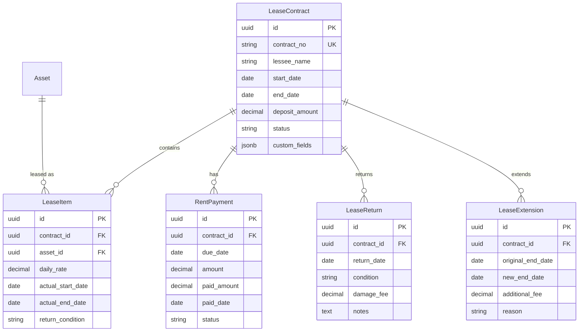

# 资产租赁管理模块 PRD

> 本文档定义 GZEAMS 平台资产租赁管理模块的功能需求和技术实现规范

---

## 文档信息

| 字段 | 说明 |
|------|------|
| **功能名称** | 资产租赁管理 (Asset Leasing Management) |
| **功能代码** | LEASING_MANAGEMENT |
| **文档版本** | 1.0.0 |
| **创建日期** | 2026-01-21 |
| **维护人** | Claude Code |
| **审核状态** | ✅ 草稿 |

---

## 目录

1. [需求概述](#1-需求概述)
2. [后端实现](#2-后端实现)
3. [前端实现](#3-前端实现)
4. [API接口](#4-api接口)
5. [权限设计](#5-权限设计)
6. [测试用例](#6-测试用例)
7. [实施计划](#7-实施计划)
8. [附录](#8-附录)

---

## 1. 需求概述

### 1.1 业务背景

**业务场景**:
企业在运营过程中，可能需要将闲置资产对外出租获取收益，或者从外部租赁资产以满足临时使用需求。资产租赁管理模块需要完整记录租赁合同、租金收取、资产归还等全生命周期信息。

**现状分析**:
| 现状 | 问题 | 影响 |
|------|------|------|
| 无专门租赁合同管理 | 租赁信息分散在Excel或纸质文档 | 查询困难、易丢失 |
| 缺少到期提醒机制 | 租赁到期无法及时处理 | 资产损失、续约延误 |
| 无租金收取跟踪 | 收款情况不清晰 | 财务对账困难 |
| 无租赁资产状态管理 | 租赁期间资产状态无法跟踪 | 资产损坏责任不清 |

### 1.2 目标用户

| 用户角色 | 使用场景 | 核心需求 |
|---------|---------|----------|
| **资产管理员** | 管理租赁合同、跟踪租赁状态 | 需要完整的租赁台账、到期提醒 |
| **财务人员** | 核算租金收入、开具发票 | 需要租金明细、收款记录 |
| **业务人员** | 对外租赁报价、合同签订 | 需要租赁报价、合同模板 |
| **承租方** | 查询租赁信息、申请续租 | 需要自助查询、在线申请 |

### 1.3 功能范围

#### 1.3.1 本次实现范围

- ✅ **租赁合同管理**: 合同信息、承租方信息、租赁资产清单
- ✅ **租金管理**: 租金计划、收款记录、欠款提醒
- ✅ **租赁出入库**: 租赁资产出库、归还验收
- ✅ **到期管理**: 到期提醒、续租处理、逾期处理
- ✅ **租赁报表**: 租赁收入统计、资产利用率分析

#### 1.3.2 未来规划范围

- ⏳ 在线租赁门户 (Phase 2): 承租方自助服务
- ⏳ 租赁报价系统 (Phase 2): 动态定价、折扣管理
- ⏳ 电子签章集成 (Phase 3): 合同在线签署

#### 1.3.3 不在范围内

- ❌ 融资租赁会计处理 (由财务系统处理)
- ❌ 租赁法律纠纷处理 (由法务部门处理)
- ❌ 租赁保险 (由保险模块处理)

### 1.4 相关文档

| 文档 | 说明 | 关键章节 |
|------|------|----------|
| [Asset Model](../../../backend/apps/assets/models.py) | 基础资产模型 | §Asset |
| [PRD模板](../common_base_features/00_core/PRD_TEMPLATE.md) | PRD编写规范 | 全部 |

---

## 2. 后端实现

### 2.1 公共模型引用

> ✅ 本模块所有组件必须继承以下公共基类

| 组件类型 | 基类 | 引用路径 | 自动获得功能 |
|---------|------|---------|-------------|
| **Model** | `BaseModel` | `apps.common.models.BaseModel` | 组织隔离、软删除、审计字段、custom_fields |
| **Serializer** | `BaseModelSerializer` | `apps.common.serializers.base.BaseModelSerializer` | 公共字段序列化、custom_fields序列化 |
| **ViewSet** | `BaseModelViewSetWithBatch` | `apps.common.viewsets.base.BaseModelViewSetWithBatch` | 组织过滤、软删除、批量操作 |
| **Filter** | `BaseModelFilter` | `apps.common.filters.base.BaseModelFilter` | 时间范围过滤、用户过滤 |
| **Service** | `BaseCRUDService` | `apps.common.services.base_crud.BaseCRUDService` | 统一CRUD方法 |

### 2.2 数据模型设计

#### 2.2.1 ER图



#### 2.2.2 租赁合同模型

```python
# backend/apps/leasing/models.py

from django.db import models
from django.core.validators import MinValueValidator
from apps.common.models import BaseModel


class LeaseContract(BaseModel):
    """
    Lease Contract Model

    Manages asset leasing contracts with customers/lessees.
    Inherits from BaseModel for organization isolation and soft delete.
    """

    class Meta:
        db_table = 'lease_contracts'
        verbose_name = 'Lease Contract'
        verbose_name_plural = 'Lease Contracts'
        ordering = ['-created_at']
        indexes = [
            models.Index(fields=['organization', 'contract_no']),
            models.Index(fields=['organization', 'lessee_name']),
            models.Index(fields=['organization', 'status']),
            models.Index(fields=['organization', 'start_date', 'end_date']),
        ]

    STATUS_CHOICES = [
        ('draft', 'Draft'),
        ('active', 'Active'),
        ('suspended', 'Suspended'),
        ('completed', 'Completed'),
        ('terminated', 'Terminated'),
        ('overdue', 'Overdue'),
    ]

    PAYMENT_TYPE_CHOICES = [
        ('daily', 'Daily'),
        ('weekly', 'Weekly'),
        ('monthly', 'Monthly'),
        ('quarterly', 'Quarterly'),
        ('one_time', 'One Time'),
    ]

    # ========== Contract Information ==========
    contract_no = models.CharField(
        max_length=50,
        unique=True,
        db_index=True,
        help_text='Contract number (auto-generated: ZL+YYYYMM+NNNN)'
    )
    contract_name = models.CharField(
        max_length=200,
        help_text='Contract name/description'
    )

    # ========== Lessee Information ==========
    lessee_name = models.CharField(
        max_length=200,
        db_index=True,
        help_text='Lessee (customer) name'
    )
    lessee_type = models.CharField(
        max_length=50,
        choices=[('individual', 'Individual'), ('company', 'Company')],
        default='company',
        help_text='Lessee type'
    )
    lessee_contact = models.CharField(
        max_length=100,
        blank=True,
        help_text='Primary contact person'
    )
    lessee_phone = models.CharField(
        max_length=20,
        blank=True,
        help_text='Contact phone'
    )
    lessee_email = models.EmailField(
        blank=True,
        help_text='Contact email'
    )
    lessee_address = models.TextField(
        blank=True,
        help_text='Lessee address'
    )
    lessee_id_number = models.CharField(
        max_length=100,
        blank=True,
        help_text='ID number or business license'
    )

    # ========== Lease Period ==========
    start_date = models.DateField(
        help_text='Lease start date'
    )
    end_date = models.DateField(
        help_text='Lease end date'
    )
    actual_start_date = models.DateField(
        null=True,
        blank=True,
        help_text='Actual start date (when assets are delivered)'
    )
    actual_end_date = models.DateField(
        null=True,
        blank=True,
        help_text='Actual end date (when assets are returned)'
    )

    # ========== Financial Terms ==========
    payment_type = models.CharField(
        max_length=50,
        choices=PAYMENT_TYPE_CHOICES,
        default='monthly',
        help_text='Payment frequency'
    )
    total_rent = models.DecimalField(
        max_digits=14,
        decimal_places=2,
        validators=[MinValueValidator(0)],
        help_text='Total rent amount'
    )
    deposit_amount = models.DecimalField(
        max_digits=14,
        decimal_places=2,
        default=0,
        validators=[MinValueValidator(0)],
        help_text='Security deposit amount'
    )
    deposit_paid = models.DecimalField(
        max_digits=14,
        decimal_places=2,
        default=0,
        help_text='Deposit amount actually paid'
    )

    # ========== Status ==========
    status = models.CharField(
        max_length=50,
        choices=STATUS_CHOICES,
        default='draft',
        db_index=True,
        help_text='Contract status'
    )

    # ========== Approval ==========
    approved_by = models.ForeignKey(
        'accounts.User',
        on_delete=models.SET_NULL,
        null=True,
        blank=True,
        related_name='approved_leases',
        help_text='Contract approver'
    )
    approved_at = models.DateTimeField(
        null=True,
        blank=True,
        help_text='Approval timestamp'
    )

    # ========== Terms ==========
    terms = models.TextField(
        blank=True,
        help_text='Lease terms and conditions'
    )
    notes = models.TextField(
        blank=True,
        help_text='Additional notes'
    )

    def __str__(self):
        return f"{self.contract_no} - {self.lessee_name}"

    def save(self, *args, **kwargs):
        if not self.contract_no:
            self.contract_no = self._generate_contract_no()
        super().save(*args, **kwargs)

    def _generate_contract_no(self):
        """Generate contract number using SequenceService."""
        try:
            from apps.system.services import SequenceService
            return SequenceService.get_next_value(
                'LEASE_CONTRACT_NO',
                organization_id=self.organization_id
            )
        except Exception:
            from django.utils import timezone
            prefix = timezone.now().strftime('%Y%m')
            last_contract = LeaseContract.all_objects.filter(
                contract_no__startswith=f"ZL{prefix}"
            ).order_by('-contract_no').first()
            if last_contract:
                seq = int(last_contract.contract_no[-4:]) + 1
            else:
                seq = 1
            return f"ZL{prefix}{seq:04d}"

    def is_active(self):
        """Check if contract is currently active."""
        from django.utils import timezone
        today = timezone.now().date()
        return (self.status == 'active' and
                self.actual_start_date and
                self.actual_start_date <= today and
                (not self.actual_end_date or self.actual_end_date >= today))

    def days_remaining(self):
        """Get days remaining in lease."""
        from django.utils import timezone
        today = timezone.now().date()
        if self.actual_end_date:
            delta = self.actual_end_date - today
            return max(0, delta.days)
        elif self.end_date:
            delta = self.end_date - today
            return max(0, delta.days)
        return None

    def total_days(self):
        """Get total lease period in days."""
        if self.start_date and self.end_date:
            return (self.end_date - self.start_date).days + 1
        return None

    def unpaid_amount(self):
        """Get total unpaid rent amount."""
        return self.payments.filter(
            status__in=['pending', 'partial']
        ).aggregate(
            unpaid=models.Sum(
                models.F('amount') - models.F('paid_amount')
            )
        )['unpaid'] or 0


class LeaseItem(BaseModel):
    """
    Lease Item Model

    Individual assets included in a lease contract.
    """

    class Meta:
        db_table = 'lease_items'
        verbose_name = 'Lease Item'
        verbose_name_plural = 'Lease Items'
        ordering = ['-created_at']
        indexes = [
            models.Index(fields=['organization', 'contract']),
            models.Index(fields=['organization', 'asset']),
        ]

    CONDITION_CHOICES = [
        ('excellent', 'Excellent'),
        ('good', 'Good'),
        ('fair', 'Fair'),
        ('poor', 'Poor'),
    ]

    contract = models.ForeignKey(
        LeaseContract,
        on_delete=models.CASCADE,
        related_name='items',
        help_text='Parent lease contract'
    )
    asset = models.ForeignKey(
        'assets.Asset',
        on_delete=models.PROTECT,
        related_name='lease_items',
        help_text='Leased asset'
    )

    # Pricing
    daily_rate = models.DecimalField(
        max_digits=14,
        decimal_places=2,
        validators=[MinValueValidator(0)],
        help_text='Daily rental rate'
    )
    insured_value = models.DecimalField(
        max_digits=14,
        decimal_places=2,
        null=True,
        blank=True,
        help_text='Insured value for this asset'
    )

    # Dates
    actual_start_date = models.DateField(
        null=True,
        blank=True,
        help_text='Actual delivery date'
    )
    actual_end_date = models.DateField(
        null=True,
        blank=True,
        help_text='Actual return date'
    )

    # Condition tracking
    start_condition = models.CharField(
        max_length=50,
        choices=CONDITION_CHOICES,
        default='good',
        help_text='Asset condition at start'
    )
    return_condition = models.CharField(
        max_length=50,
        choices=CONDITION_CHOICES,
        blank=True,
        help_text='Asset condition at return'
    )
    damage_description = models.TextField(
        blank=True,
        help_text='Description of any damage'
    )

    # Notes
    notes = models.TextField(
        blank=True,
        help_text='Item notes'
    )

    def __str__(self):
        return f"{self.contract.contract_no} - {self.asset.asset_name}"

    @property
    def days_leased(self):
        """Calculate actual days leased."""
        if self.actual_start_date and self.actual_end_date:
            return (self.actual_end_date - self.actual_start_date).days + 1
        return 0

    @property
    def total_rent(self):
        """Calculate total rent for this item."""
        return self.daily_rate * self.days_leased


class RentPayment(BaseModel):
    """
    Rent Payment Model

    Tracks scheduled and actual rent payments for a lease.
    """

    class Meta:
        db_table = 'rent_payments'
        verbose_name = 'Rent Payment'
        verbose_name_plural = 'Rent Payments'
        ordering = ['due_date']
        indexes = [
            models.Index(fields=['organization', 'contract']),
            models.Index(fields=['organization', 'status']),
            models.Index(fields=['organization', 'due_date']),
        ]

    STATUS_CHOICES = [
        ('pending', 'Pending'),
        ('partial', 'Partially Paid'),
        ('paid', 'Paid'),
        ('overdue', 'Overdue'),
        ('waived', 'Waived'),
    ]

    contract = models.ForeignKey(
        LeaseContract,
        on_delete=models.CASCADE,
        related_name='payments',
        help_text='Related lease contract'
    )

    # Payment Details
    payment_no = models.CharField(
        max_length=50,
        unique=True,
        db_index=True,
        help_text='Payment number (auto-generated)'
    )
    due_date = models.DateField(
        db_index=True,
        help_text='Payment due date'
    )
    amount = models.DecimalField(
        max_digits=14,
        decimal_places=2,
        validators=[MinValueValidator(0)],
        help_text='Payment amount due'
    )
    paid_amount = models.DecimalField(
        max_digits=14,
        decimal_places=2,
        default=0,
        help_text='Amount actually paid'
    )

    # Status
    status = models.CharField(
        max_length=50,
        choices=STATUS_CHOICES,
        default='pending',
        help_text='Payment status'
    )

    # Payment Details
    paid_date = models.DateField(
        null=True,
        blank=True,
        help_text='Date payment was received'
    )
    payment_method = models.CharField(
        max_length=50,
        blank=True,
        help_text='Payment method (cash, transfer, etc.)'
    )
    payment_reference = models.CharField(
        max_length=200,
        blank=True,
        help_text='Payment reference/check number'
    )

    # Invoice
    invoice_no = models.CharField(
        max_length=100,
        blank=True,
        help_text='Invoice number'
    )
    invoice_date = models.DateField(
        null=True,
        blank=True,
        help_text='Invoice date'
    )

    # Notes
    notes = models.TextField(
        blank=True,
        help_text='Payment notes'
    )

    def __str__(self):
        return f"{self.payment_no} - {self.contract.lessee_name}"

    def save(self, *args, **kwargs):
        if not self.payment_no:
            self.payment_no = self._generate_payment_no()
        super().save(*args, **kwargs)

    def _generate_payment_no(self):
        """Generate payment number."""
        try:
            from apps.system.services import SequenceService
            return SequenceService.get_next_value(
                'RENT_PAYMENT_NO',
                organization_id=self.organization_id
            )
        except Exception:
            import uuid
            return f"PAY{uuid.uuid4().hex[:12].upper()}"

    @property
    def outstanding_amount(self):
        """Get outstanding (unpaid) amount."""
        return self.amount - self.paid_amount

    @property
    def is_overdue(self):
        """Check if payment is overdue."""
        from django.utils import timezone
        return (self.status in ['pending', 'partial'] and
                self.due_date < timezone.now().date())


class LeaseReturn(BaseModel):
    """
    Lease Return Model

    Records asset return information and condition assessment.
    """

    class Meta:
        db_table = 'lease_returns'
        verbose_name = 'Lease Return'
        verbose_name_plural = 'Lease Returns'
        ordering = ['-return_date']
        indexes = [
            models.Index(fields=['organization', 'contract']),
            models.Index(fields=['organization', 'return_date']),
        ]

    CONDITION_CHOICES = [
        ('excellent', 'Excellent - Like New'),
        ('good', 'Good - Normal Wear'),
        ('fair', 'Fair - Minor Damage'),
        ('poor', 'Poor - Major Damage'),
        ('broken', 'Broken - Needs Repair'),
        ('lost', 'Lost - Not Returnable'),
    ]

    contract = models.ForeignKey(
        LeaseContract,
        on_delete=models.CASCADE,
        related_name='returns',
        help_text='Related lease contract'
    )
    asset = models.ForeignKey(
        'assets.Asset',
        on_delete=models.PROTECT,
        related_name='lease_returns',
        help_text='Returned asset'
    )

    # Return Information
    return_no = models.CharField(
        max_length=50,
        unique=True,
        db_index=True,
        help_text='Return number (auto-generated)'
    )
    return_date = models.DateField(
        help_text='Return date'
    )
    received_by = models.ForeignKey(
        'accounts.User',
        on_delete=models.SET_NULL,
        null=True,
        blank=True,
        related_name='received_returns',
        help_text='Person who received the return'
    )

    # Condition Assessment
    condition = models.CharField(
        max_length=50,
        choices=CONDITION_CHOICES,
        help_text='Asset return condition'
    )
    damage_description = models.TextField(
        blank=True,
        help_text='Description of any damage'
    )

    # Financial
    damage_fee = models.DecimalField(
        max_digits=14,
        decimal_places=2,
        default=0,
        help_text='Fee charged for damage'
    )
    deposit_deduction = models.DecimalField(
        max_digits=14,
        decimal_places=2,
        default=0,
        help_text='Amount deducted from deposit'
    )
    refund_amount = models.DecimalField(
        max_digits=14,
        decimal_places=2,
        default=0,
        help_text='Refund amount due to lessee'
    )

    # Photos/Documentation
    photos = models.JSONField(
        default=list,
        blank=True,
        help_text='Photos of returned asset'
    )

    # Notes
    notes = models.TextField(
        blank=True,
        help_text='Return notes'
    )

    def __str__(self):
        return f"{self.return_no} - {self.asset.asset_name}"

    def save(self, *args, **kwargs):
        if not self.return_no:
            self.return_no = self._generate_return_no()
        super().save(*args, **kwargs)

    def _generate_return_no(self):
        """Generate return number."""
        try:
            from apps.system.services import SequenceService
            return SequenceService.get_next_value(
                'LEASE_RETURN_NO',
                organization_id=self.organization_id
            )
        except Exception:
            from django.utils import timezone
            prefix = timezone.now().strftime('%Y%m')
            return f"LR{prefix}{timezone.now().strftime('%H%M%S')}"


class LeaseExtension(BaseModel):
    """
    Lease Extension Model

    Records lease contract extensions and renewals.
    """

    class Meta:
        db_table = 'lease_extensions'
        verbose_name = 'Lease Extension'
        verbose_name_plural = 'Lease Extensions'
        ordering = ['-created_at']
        indexes = [
            models.Index(fields=['organization', 'contract']),
        ]

    contract = models.ForeignKey(
        LeaseContract,
        on_delete=models.CASCADE,
        related_name='extensions',
        help_text='Original contract being extended'
    )

    # Extension Details
    extension_no = models.CharField(
        max_length=50,
        unique=True,
        db_index=True,
        help_text='Extension number'
    )
    original_end_date = models.DateField(
        help_text='Original end date before extension'
    )
    new_end_date = models.DateField(
        help_text='New end date after extension'
    )

    # Financial
    additional_rent = models.DecimalField(
        max_digits=14,
        decimal_places=2,
        validators=[MinValueValidator(0)],
        default=0,
        help_text='Additional rent for extension period'
    )

    # Reason
    reason = models.TextField(
        blank=True,
        help_text='Reason for extension'
    )
    notes = models.TextField(
        blank=True,
        help_text='Additional notes'
    )

    # Approval
    approved_by = models.ForeignKey(
        'accounts.User',
        on_delete=models.SET_NULL,
        null=True,
        blank=True,
        related_name='approved_extensions',
        help_text='Extension approver'
    )
    approved_at = models.DateTimeField(
        null=True,
        blank=True,
        help_text='Approval timestamp'
    )

    def __str__(self):
        return f"{self.extension_no} - {self.contract.contract_no}"

    def save(self, *args, **kwargs):
        if not self.extension_no:
            self.extension_no = self._generate_extension_no()
        super().save(*args, **kwargs)

    def _generate_extension_no(self):
        """Generate extension number."""
        import uuid
        return f"EXT{uuid.uuid4().hex[:10].upper()}"

    @property
    def additional_days(self):
        """Get number of days added."""
        if self.original_end_date and self.new_end_date:
            return (self.new_end_date - self.original_end_date).days
        return 0
```

#### 2.2.3 序列化器

```python
# backend/apps/leasing/serializers.py

from rest_framework import serializers
from apps.common.serializers.base import BaseModelSerializer
from .models import (
    LeaseContract, LeaseItem, RentPayment,
    LeaseReturn, LeaseExtension
)


class LeaseItemSerializer(BaseModelSerializer):
    """Lease Item Serializer"""
    asset_name = serializers.CharField(source='asset.asset_name', read_only=True)
    asset_code = serializers.CharField(source='asset.asset_code', read_only=True)
    days_leased = serializers.ReadOnlyField()
    total_rent = serializers.ReadOnlyField()

    class Meta(BaseModelSerializer.Meta):
        model = LeaseItem
        fields = BaseModelSerializer.Meta.fields + [
            'contract', 'asset', 'asset_name', 'asset_code',
            'daily_rate', 'insured_value',
            'actual_start_date', 'actual_end_date',
            'start_condition', 'return_condition', 'damage_description',
            'days_leased', 'total_rent', 'notes',
        ]


class RentPaymentSerializer(BaseModelSerializer):
    """Rent Payment Serializer"""
    contract_no = serializers.CharField(source='contract.contract_no', read_only=True)
    lessee_name = serializers.CharField(source='contract.lessee_name', read_only=True)
    outstanding_amount = serializers.ReadOnlyField()
    is_overdue = serializers.ReadOnlyField()

    class Meta(BaseModelSerializer.Meta):
        model = RentPayment
        fields = BaseModelSerializer.Meta.fields + [
            'contract', 'contract_no', 'lessee_name',
            'payment_no', 'due_date', 'amount', 'paid_amount',
            'outstanding_amount', 'is_overdue',
            'status', 'paid_date', 'payment_method', 'payment_reference',
            'invoice_no', 'invoice_date', 'notes',
        ]


class LeaseContractSerializer(BaseModelSerializer):
    """Lease Contract Serializer"""
    lessee_name = serializers.CharField(required=True)
    items = LeaseItemSerializer(many=True, read_only=True)
    payments = RentPaymentSerializer(many=True, read_only=True)
    is_active = serializers.BooleanField(read_only=True)
    days_remaining = serializers.IntegerField(read_only=True)
    total_days = serializers.IntegerField(read_only=True)
    unpaid_amount = serializers.DecimalField(max_digits=14, decimal_places=2, read_only=True)
    approved_by_name = serializers.CharField(source='approved_by.username', read_only=True)

    class Meta(BaseModelSerializer.Meta):
        model = LeaseContract
        fields = BaseModelSerializer.Meta.fields + [
            # Contract
            'contract_no', 'contract_name',
            # Lessee
            'lessee_name', 'lessee_type', 'lessee_contact',
            'lessee_phone', 'lessee_email', 'lessee_address', 'lessee_id_number',
            # Dates
            'start_date', 'end_date', 'actual_start_date', 'actual_end_date',
            # Financial
            'payment_type', 'total_rent', 'deposit_amount', 'deposit_paid',
            # Status
            'status', 'is_active', 'days_remaining', 'total_days',
            # Approval
            'approved_by', 'approved_by_name', 'approved_at',
            # Relations
            'items', 'payments', 'unpaid_amount',
            # Terms
            'terms', 'notes',
        ]

    def validate(self, data):
        """Validate contract dates."""
        start_date = data.get('start_date')
        end_date = data.get('end_date')

        if start_date and end_date and end_date <= start_date:
            raise serializers.ValidationError({
                'end_date': 'End date must be after start date'
            })

        return data


class LeaseReturnSerializer(BaseModelSerializer):
    """Lease Return Serializer"""
    contract_no = serializers.CharField(source='contract.contract_no', read_only=True)
    lessee_name = serializers.CharField(source='contract.lessee_name', read_only=True)
    asset_name = serializers.CharField(source='asset.asset_name', read_only=True)
    asset_code = serializers.CharField(source='asset.asset_code', read_only=True)
    received_by_name = serializers.CharField(source='received_by.username', read_only=True)

    class Meta(BaseModelSerializer.Meta):
        model = LeaseReturn
        fields = BaseModelSerializer.Meta.fields + [
            'contract', 'contract_no', 'lessee_name',
            'asset', 'asset_name', 'asset_code',
            'return_no', 'return_date', 'received_by', 'received_by_name',
            'condition', 'damage_description',
            'damage_fee', 'deposit_deduction', 'refund_amount',
            'photos', 'notes',
        ]


class LeaseExtensionSerializer(BaseModelSerializer):
    """Lease Extension Serializer"""
    contract_no = serializers.CharField(source='contract.contract_no', read_only=True)
    lessee_name = serializers.CharField(source='contract.lessee_name', read_only=True)
    approved_by_name = serializers.CharField(source='approved_by.username', read_only=True)
    additional_days = serializers.ReadOnlyField()

    class Meta(BaseModelSerializer.Meta):
        model = LeaseExtension
        fields = BaseModelSerializer.Meta.fields + [
            'contract', 'contract_no', 'lessee_name',
            'extension_no', 'original_end_date', 'new_end_date', 'additional_days',
            'additional_rent', 'reason', 'notes',
            'approved_by', 'approved_by_name', 'approved_at',
        ]
```

#### 2.2.4 过滤器

```python
# backend/apps/leasing/filters.py

from django_filters import rest_framework as filters
from apps.common.filters.base import BaseModelFilter
from .models import LeaseContract, RentPayment, LeaseReturn


class LeaseContractFilter(BaseModelFilter):
    """Lease Contract Filter"""

    status = filters.CharFilter()
    lessee_name = filters.CharFilter(lookup_expr='icontains')
    date_from = filters.DateFilter(field_name='start_date', lookup_expr='gte')
    date_to = filters.DateFilter(field_name='end_date', lookup_expr='lte')
    expires_soon = filters.BooleanFilter(method='filter_expires_soon')

    def filter_expires_soon(self, queryset, name, value):
        """Filter contracts expiring within 30 days."""
        if value:
            from django.utils import timezone
            delta = timezone.now().date() + timezone.timedelta(days=30)
            return queryset.filter(
                end_date__lte=delta,
                status='active'
            )
        return queryset

    class Meta(BaseModelFilter.Meta):
        model = LeaseContract
        fields = BaseModelFilter.Meta.fields + [
            'status', 'lessee_name', 'start_date', 'end_date',
        ]


class RentPaymentFilter(BaseModelFilter):
    """Rent Payment Filter"""

    status = filters.CharFilter()
    due_from = filters.DateFilter(field_name='due_date', lookup_expr='gte')
    due_to = filters.DateFilter(field_name='due_date', lookup_expr='lte')
    overdue_only = filters.BooleanFilter(method='filter_overdue')

    def filter_overdue(self, queryset, name, value):
        """Filter only overdue payments."""
        if value:
            from django.utils import timezone
            return queryset.filter(
                due_date__lt=timezone.now().date(),
                status__in=['pending', 'partial']
            )
        return queryset

    class Meta(BaseModelFilter.Meta):
        model = RentPayment
        fields = BaseModelFilter.Meta.fields + [
            'status', 'due_date',
        ]


class LeaseReturnFilter(BaseModelFilter):
    """Lease Return Filter"""

    condition = filters.CharFilter()
    date_from = filters.DateFilter(field_name='return_date', lookup_expr='gte')
    date_to = filters.DateFilter(field_name='return_date', lookup_expr='lte')

    class Meta(BaseModelFilter.Meta):
        model = LeaseReturn
        fields = BaseModelFilter.Meta.fields + [
            'condition', 'return_date',
        ]
```

#### 2.2.5 ViewSet

```python
# backend/apps/leasing/viewsets.py

from rest_framework import viewsets, status
from rest_framework.decorators import action
from rest_framework.response import Response
from django.utils import timezone
from apps.common.viewsets.base import BaseModelViewSetWithBatch
from .models import (
    LeaseContract, LeaseItem, RentPayment,
    LeaseReturn, LeaseExtension
)
from .serializers import (
    LeaseContractSerializer, LeaseItemSerializer, RentPaymentSerializer,
    LeaseReturnSerializer, LeaseExtensionSerializer
)
from .filters import (
    LeaseContractFilter, RentPaymentFilter, LeaseReturnFilter
)


class LeaseContractViewSet(BaseModelViewSetWithBatch):
    """Lease Contract ViewSet"""
    queryset = LeaseContract.objects.all()
    serializer_class = LeaseContractSerializer
    filterset_class = LeaseContractFilter

    def perform_create(self, serializer):
        """Set organization and created_by."""
        serializer.save(
            organization_id=self.request.user.organization_id,
            created_by=self.request.user
        )

    @action(detail=True, methods=['post'])
    def activate(self, request, pk=None):
        """Activate a draft contract."""
        contract = self.get_object()

        if contract.status != 'draft':
            return Response(
                {
                    'success': False,
                    'error': {
                        'code': 'INVALID_STATUS',
                        'message': 'Only draft contracts can be activated'
                    }
                },
                status=status.HTTP_400_BAD_REQUEST
            )

        contract.status = 'active'
        contract.actual_start_date = timezone.now().date()
        contract.approved_by = request.user
        contract.approved_at = timezone.now()
        contract.save()

        # Generate payment schedule
        self._generate_payment_schedule(contract)

        serializer = self.get_serializer(contract)
        return Response({
            'success': True,
            'message': 'Contract activated successfully',
            'data': serializer.data
        })

    def _generate_payment_schedule(self, contract):
        """Generate rent payment schedule based on payment type."""
        from datetime import timedelta

        if contract.payment_type == 'one_time':
            RentPayment.objects.create(
                organization_id=contract.organization_id,
                contract=contract,
                due_date=contract.start_date,
                amount=contract.total_rent,
                created_by=contract.created_by
            )
            return

        # Calculate payment intervals
        intervals = {
            'daily': timedelta(days=1),
            'weekly': timedelta(weeks=1),
            'monthly': timedelta(days=30),
            'quarterly': timedelta(days=90),
        }

        interval = intervals.get(contract.payment_type, timedelta(days=30))
        payment_count = int(contract.total_days() / interval.days)
        payment_amount = contract.total_rent / payment_count

        current_date = contract.start_date
        for i in range(payment_count):
            RentPayment.objects.create(
                organization_id=contract.organization_id,
                contract=contract,
                due_date=current_date,
                amount=round(payment_amount, 2),
                created_by=contract.created_by
            )
            current_date += interval

    @action(detail=True, methods=['post'])
    def complete(self, request, pk=None):
        """Complete/Close a contract."""
        contract = self.get_object()

        if contract.status not in ['active', 'suspended']:
            return Response(
                {
                    'success': False,
                    'error': {
                        'code': 'INVALID_STATUS',
                        'message': 'Only active or suspended contracts can be completed'
                    }
                },
                status=status.HTTP_400_BAD_REQUEST
            )

        contract.status = 'completed'
        contract.actual_end_date = timezone.now().date()
        contract.save()

        serializer = self.get_serializer(contract)
        return Response({
            'success': True,
            'message': 'Contract completed',
            'data': serializer.data
        })

    @action(detail=False, methods=['get'])
    def expiring_soon(self, request):
        """Get contracts expiring within 30 days."""
        delta = timezone.now().date() + timezone.timedelta(days=30)

        contracts = self.queryset.filter(
            end_date__lte=delta,
            status='active'
        )

        page = self.paginate_queryset(contracts)
        serializer = self.get_serializer(page, many=True)
        return self.get_paginated_response(serializer.data)

    @action(detail=False, methods=['get'])
    def overdue(self, request):
        """Get contracts with overdue payments."""
        # Get contracts with pending overdue payments
        from django.db.models import Exists

        overdue_payments = RentPayment.objects.filter(
            contract=models.OuterRef('pk'),
            due_date__lt=timezone.now().date(),
            status__in=['pending', 'partial']
        )

        contracts = self.queryset.filter(
            status='active'
        ).filter(Exists(overdue_payments))

        page = self.paginate_queryset(contracts)
        serializer = self.get_serializer(page, many=True)
        return self.get_paginated_response(serializer.data)


class LeaseItemViewSet(BaseModelViewSetWithBatch):
    """Lease Item ViewSet"""
    queryset = LeaseItem.objects.all()
    serializer_class = LeaseItemSerializer
    filterset_class = BaseModelFilter


class RentPaymentViewSet(BaseModelViewSetWithBatch):
    """Rent Payment ViewSet"""
    queryset = RentPayment.objects.all()
    serializer_class = RentPaymentSerializer
    filterset_class = RentPaymentFilter

    @action(detail=True, methods=['post'])
    def record_payment(self, request, pk=None):
        """Record a payment."""
        payment = self.get_object()

        amount = request.data.get('amount', 0)
        if amount <= 0:
            return Response(
                {
                    'success': False,
                    'error': {'code': 'INVALID_AMOUNT', 'message': 'Amount must be positive'}
                },
                status=status.HTTP_400_BAD_REQUEST
            )

        payment.paid_amount += amount
        payment.paid_date = timezone.now().date()
        payment.payment_method = request.data.get('payment_method', '')

        if payment.paid_amount >= payment.amount:
            payment.status = 'paid'
        else:
            payment.status = 'partial'

        payment.save()

        serializer = self.get_serializer(payment)
        return Response({
            'success': True,
            'message': 'Payment recorded',
            'data': serializer.data
        })


class LeaseReturnViewSet(BaseModelViewSetWithBatch):
    """Lease Return ViewSet"""
    queryset = LeaseReturn.objects.all()
    serializer_class = LeaseReturnSerializer
    filterset_class = LeaseReturnFilter

    def perform_create(self, serializer):
        """Set received_by and update contract."""
        return_obj = serializer.save(
            received_by=self.request.user,
            created_by=self.request.user
        )

        # Update lease item return condition
        contract = return_obj.contract
        try:
            lease_item = LeaseItem.objects.get(
                contract=contract,
                asset=return_obj.asset
            )
            lease_item.return_condition = return_obj.condition
            lease_item.damage_description = return_obj.damage_description
            lease_item.actual_end_date = return_obj.return_date
            lease_item.save()
        except LeaseItem.DoesNotExist:
            pass


class LeaseExtensionViewSet(BaseModelViewSetWithBatch):
    """Lease Extension ViewSet"""
    queryset = LeaseExtension.objects.all()
    serializer_class = LeaseExtensionSerializer
    filterset_class = BaseModelFilter

    def perform_create(self, serializer):
        """Process extension and update contract."""
        extension = serializer.save(
            created_by=self.request.user
        )

        # Update contract end date
        contract = extension.contract
        contract.end_date = extension.new_end_date
        contract.total_rent += extension.additional_rent
        contract.save()
```

### 2.3 文件结构

```
backend/apps/leasing/
├── __init__.py
├── models.py              # Leasing models
├── serializers.py         # Model serializers
├── viewsets.py            # API viewsets
├── filters.py             # Query filters
├── services.py            # Business logic services
├── urls.py                # URL routing
├── admin.py               # Django admin configuration
└── tests/                 # Test cases
    ├── __init__.py
    ├── test_models.py
    ├── test_viewsets.py
    └── test_services.py
```

---

## 3. 前端实现

### 3.1 页面列表

#### 3.1.1 租赁合同列表页

```vue
<!-- frontend/src/views/leasing/LeaseContractList.vue -->

<template>
    <BaseListPage
        title="租赁合同管理"
        :fetch-method="fetchData"
        :columns="columns"
        :search-fields="searchFields"
        :filter-fields="filterFields"
        :custom-slots="['lessee', 'period', 'status', 'actions']"
        @row-click="handleRowClick"
        @create="handleCreate"
    >
        <template #lessee="{ row }">
            <div class="lessee-info">
                <div class="name">{{ row.lessee_name }}</div>
                <div class="contact">{{ row.lessee_phone }}</div>
            </div>
        </template>

        <template #period="{ row }">
            <div class="period-info">
                <div>{{ formatDate(row.start_date) }} ~ {{ formatDate(row.end_date) }}</div>
                <el-tag v-if="row.days_remaining !== null" size="small" type="info">
                    剩余 {{ row.days_remaining }} 天
                </el-tag>
            </div>
        </template>

        <template #status="{ row }">
            <el-tag :type="getStatusType(row.status)">
                {{ getStatusLabel(row.status) }}
            </el-tag>
        </template>

        <template #actions="{ row }">
            <el-button link type="primary" @click.stop="handleView(row)">
                查看
            </el-button>
            <el-button
                v-if="row.status === 'draft'"
                link
                type="success"
                @click.stop="handleActivate(row)"
            >
                激活
            </el-button>
            <el-dropdown @command="(cmd) => handleMore(cmd, row)">
                <el-button link type="primary">
                    更多<el-icon><arrow-down /></el-icon>
                </el-button>
                <template #dropdown>
                    <el-dropdown-menu>
                        <el-dropdown-item command="items">租赁资产</el-dropdown-item>
                        <el-dropdown-item command="payments">租金记录</el-dropdown-item>
                        <el-dropdown-item command="extend">续租</el-dropdown-item>
                        <el-dropdown-item command="return">归还</el-dropdown-item>
                    </el-dropdown-menu>
                </template>
            </el-dropdown>
        </template>
    </BaseListPage>
</template>

<script setup>
import { ref } from 'vue'
import { useRouter } from 'vue-router'
import BaseListPage from '@/components/common/BaseListPage.vue'
import { leaseApi } from '@/api/leasing'

const router = useRouter()

const columns = [
    { prop: 'contract_no', label: '合同编号', width: 140 },
    { prop: 'lessee', label: '承租方', minWidth: 180, slot: true },
    { prop: 'period', label: '租赁期间', width: 240, slot: true },
    { prop: 'total_rent', label: '总租金', width: 120 },
    { prop: 'deposit_amount', label: '押金', width: 100 },
    { prop: 'status', label: '状态', width: 100, slot: true },
    { prop: 'actions', label: '操作', width: 200, slot: true, fixed: 'right' }
]

const searchFields = [
    { prop: 'keyword', label: '搜索', placeholder: '合同编号/承租方' }
]

const filterFields = [
    { prop: 'status', label: '状态', options: [
        { label: '草稿', value: 'draft' },
        { label: '生效中', value: 'active' },
        { label: '已完成', value: 'completed' },
        { label: '已逾期', value: 'overdue' }
    ]}
]

const fetchData = (params) => leaseApi.listContracts(params)

const formatDate = (date) => {
    return new Date(date).toLocaleDateString()
}

const getStatusType = (status) => {
    const types = {
        draft: 'info',
        active: 'success',
        suspended: 'warning',
        completed: '',
        terminated: 'danger',
        overdue: 'danger'
    }
    return types[status] || ''
}

const getStatusLabel = (status) => {
    const labels = {
        draft: '草稿',
        active: '生效中',
        suspended: '暂停',
        completed: '已完成',
        terminated: '已终止',
        overdue: '已逾期'
    }
    return labels[status] || status
}

const handleRowClick = (row) => {
    router.push(`/leasing/${row.id}`)
}

const handleCreate = () => {
    router.push('/leasing/create')
}

const handleView = (row) => {
    router.push(`/leasing/${row.id}`)
}

const handleActivate = async (row) => {
    await leaseApi.activate(row.id)
    // Refresh list
}

const handleMore = (command, row) => {
    const routes = {
        items: `/leasing/${row.id}/items`,
        payments: `/leasing/${row.id}/payments`,
        extend: `/leasing/${row.id}/extend`,
        return: `/leasing/${row.id}/return`
    }
    if (routes[command]) {
        router.push(routes[command])
    }
}
</script>
```

### 3.2 API封装

```javascript
// frontend/src/api/leasing.js

import request from '@/utils/request'

export const leaseApi = {
    // Contracts
    listContracts(params) {
        return request({
            url: '/api/lease-contracts/',
            method: 'get',
            params
        })
    },

    getContract(id) {
        return request({
            url: `/api/lease-contracts/${id}/`,
            method: 'get'
        })
    },

    createContract(data) {
        return request({
            url: '/api/lease-contracts/',
            method: 'post',
            data
        })
    },

    updateContract(id, data) {
        return request({
            url: `/api/lease-contracts/${id}/`,
            method: 'put',
            data
        })
    },

    activate(id) {
        return request({
            url: `/api/lease-contracts/${id}/activate/`,
            method: 'post'
        })
    },

    complete(id) {
        return request({
            url: `/api/lease-contracts/${id}/complete/`,
            method: 'post'
        })
    },

    getExpiringSoon(params) {
        return request({
            url: '/api/lease-contracts/expiring-soon/',
            method: 'get',
            params
        })
    },

    getOverdue(params) {
        return request({
            url: '/api/lease-contracts/overdue/',
            method: 'get',
            params
        })
    },

    // Lease Items
    listItems(params) {
        return request({
            url: '/api/lease-items/',
            method: 'get',
            params
        })
    },

    createItem(data) {
        return request({
            url: '/api/lease-items/',
            method: 'post',
            data
        })
    },

    // Payments
    listPayments(params) {
        return request({
            url: '/api/rent-payments/',
            method: 'get',
            params
        })
    },

    recordPayment(id, data) {
        return request({
            url: `/api/rent-payments/${id}/record-payment/`,
            method: 'post',
            data
        })
    },

    // Returns
    createReturn(data) {
        return request({
            url: '/api/lease-returns/',
            method: 'post',
            data
        })
    },

    // Extensions
    createExtension(data) {
        return request({
            url: '/api/lease-extensions/',
            method: 'post',
            data
        })
    }
}
```

---

## 4. API接口

### 4.1 标准端点

| 方法 | 端点 | 说明 |
|------|------|------|
| GET | `/api/lease-contracts/` | 租赁合同列表 |
| POST | `/api/lease-contracts/` | 创建租赁合同 |
| GET | `/api/lease-contracts/{id}/` | 获取合同详情 |
| PUT | `/api/lease-contracts/{id}/` | 更新合同 |
| POST | `/api/lease-contracts/{id}/activate/` | 激活合同 |
| POST | `/api/lease-contracts/{id}/complete/` | 完成合同 |
| GET | `/api/lease-contracts/expiring-soon/` | 即将到期合同 |
| GET | `/api/lease-contracts/overdue/` | 逾期合同 |
| GET | `/api/rent-payments/` | 租金支付列表 |
| POST | `/api/rent-payments/{id}/record-payment/` | 记录收款 |
| POST | `/api/lease-returns/` | 创建归还记录 |
| POST | `/api/lease-extensions/` | 创建续租记录 |

### 4.2 请求示例

#### 创建租赁合同

```http
POST /api/lease-contracts/ HTTP/1.1
Content-Type: application/json

{
    "contract_name": "办公设备租赁",
    "lessee_name": "某某科技有限公司",
    "lessee_type": "company",
    "lessee_contact": "张三",
    "lessee_phone": "13800138000",
    "lessee_email": "zhangsan@example.com",
    "start_date": "2026-01-01",
    "end_date": "2026-12-31",
    "payment_type": "monthly",
    "total_rent": 12000.00,
    "deposit_amount": 2000.00,
    "items": [
        {
            "asset": "asset-id",
            "daily_rate": 50.00,
            "start_condition": "good"
        }
    ]
}
```

---

## 5. 权限设计

| 权限代码 | 说明 | 角色 |
|---------|------|------|
| `lease_contract.view` | 查看租赁合同 | 所有用户 |
| `lease_contract.add` | 创建租赁合同 | 资产管理员 |
| `lease_contract.change` | 编辑租赁合同 | 资产管理员 |
| `lease_contract.delete` | 删除租赁合同 | 资产管理员 |
| `lease_contract.approve` | 激活合同 | 资产管理员+部门主管 |
| `rent_payment.record` | 记录租金收款 | 财务人员 |
| `lease_return.create` | 创建归还记录 | 仓库管理员 |

---

## 6. 测试用例

### 6.1 后端单元测试

```python
# backend/apps/leasing/tests/test_models.py

from django.test import TestCase
from apps.leasing.models import LeaseContract, LeaseItem, RentPayment
from apps.assets.models import Asset, AssetCategory
from apps.organizations.models import Organization
from apps.accounts.models import User


class LeaseContractModelTest(TestCase):
    """Lease Contract Model Tests"""

    def setUp(self):
        self.unique_suffix = "test1234"
        self.org = Organization.objects.create(
            name=f'Test Organization {self.unique_suffix}',
            code=f'TESTORG_{self.unique_suffix}'
        )
        self.user = User.objects.create_user(
            username=f'testuser_{self.unique_suffix}',
            organization=self.org
        )

    def test_contract_no_generation(self):
        """Test contract number auto-generation."""
        contract = LeaseContract.objects.create(
            organization=self.org,
            lessee_name='Test Lessee',
            start_date='2026-01-01',
            end_date='2026-12-31',
            total_rent=12000,
            created_by=self.user
        )

        self.assertIsNotNone(contract.contract_no)
        self.assertTrue(contract.contract_no.startswith('ZL'))

    def test_is_active(self):
        """Test contract active status check."""
        from django.utils import timezone

        contract = LeaseContract.objects.create(
            organization=self.org,
            lessee_name='Test Lessee',
            start_date='2026-01-01',
            end_date='2026-12-31',
            actual_start_date=timezone.now().date(),
            status='active',
            total_rent=12000,
            created_by=self.user
        )

        self.assertTrue(contract.is_active())

    def test_unpaid_amount(self):
        """Test unpaid amount calculation."""
        contract = LeaseContract.objects.create(
            organization=self.org,
            lessee_name='Test Lessee',
            start_date='2026-01-01',
            end_date='2026-03-31',
            status='active',
            total_rent=3000,
            created_by=self.user
        )

        RentPayment.objects.create(
            organization=self.org,
            contract=contract,
            due_date='2026-01-01',
            amount=1000,
            paid_amount=500,
            status='partial',
            created_by=self.user
        )

        RentPayment.objects.create(
            organization=self.org,
            contract=contract,
            due_date='2026-02-01',
            amount=1000,
            paid_amount=0,
            status='pending',
            created_by=self.user
        )

        self.assertEqual(contract.unpaid_amount(), 1500)
```

---

## 7. 实施计划

### 7.1 任务分解

| 阶段 | 任务 | 工作量 |
|------|------|--------|
| 1. 数据模型 | 创建Model和Migration | 3h |
| 2. 业务逻辑 | Serializer、ViewSet、Service | 4h |
| 3. 前端页面 | 列表、表单、详情页 | 8h |
| 4. 测试 | 单元测试、集成测试 | 4h |
| 5. 联调 | 前后端联调、E2E测试 | 3h |

**总工作量**: 约 22 小时

### 7.2 里程碑

| 里程碑 | 交付物 | 预计日期 |
|--------|--------|----------|
| M1: 数据模型完成 | Model, Migration | D+1 |
| M2: 后端API完成 | ViewSet, Service | D+2 |
| M3: 前端页面完成 | 列表、表单页面 | D+4 |
| M4: 测试完成 | 单元测试、集成测试 | D+5 |

---

## 8. 附录

### 8.1 相关文档

| 文档 | 说明 |
|------|------|
| [PRD模板](../common_base_features/00_core/PRD_TEMPLATE.md) | PRD编写规范 |
| [Asset Model](../../../backend/apps/assets/models.py) | 基础资产模型 |

### 8.2 变更历史

| 版本 | 日期 | 变更内容 | 作者 |
|------|------|----------|------|
| 1.0.0 | 2026-01-21 | 初始版本 | Claude Code |

---

**文档结束**
