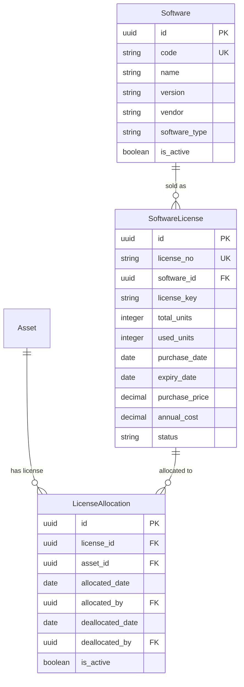

# 软件许可证管理模块 PRD

> 本文档定义 GZEAMS 平台软件许可证管理模块的功能需求和技术实现规范

---

## 文档信息

| 字段 | 说明 |
|------|------|
| **功能名称** | 软件许可证管理 (Software License Management) |
| **功能代码** | SOFTWARE_LICENSE_MANAGEMENT |
| **文档版本** | 2.0.0 (简化版) |
| **创建日期** | 2026-01-24 |
| **维护人** | Claude Code |
| **审核状态** | ✅ 草稿 |

---

## 目录

1. [需求概述](#1-需求概述)
2. [后端实现](#2-后端实现)
3. [前端实现](#3-前端实现)
4. [API接口](#4-api接口)
5. [权限设计](#5-权限设计)
6. [测试用例](#6-测试用例)
7. [实施计划](#7-实施计划)
8. [附录](#8-附录)

---

## 1. 需求概述

### 1.1 业务背景

**业务场景**:
软件是企业的重要资产，许可证管理涉及合规性和成本控制。企业需要：

- **许可证目录管理**: 维护软件产品清单和版本信息
- **许可证购买与分配**: 跟踪许可证数量和使用情况
- **到期提醒**: 及时续保即将过期的许可证
- **合规报告**: 统计软件资产使用率和合规状态

**现状分析**:
| 现状 | 问题 | 影响 |
|------|------|------|
| 缺少软件许可证统一管理 | 无法跟踪许可证数量和分配 | 软件资产审计困难 |
| 无到期提醒机制 | 许可证过期导致服务中断 | 业务连续性风险 |
| 缺少使用率统计 | 无法优化许可证采购 | 成本浪费 |

### 1.2 目标用户

| 用户角色 | 使用场景 | 核心需求 |
|---------|---------|----------|
| **IT管理员** | 管理软件许可证、分配给资产 | 需要完整的许可证台账、到期提醒、使用率统计 |
| **财务人员** | 软件资产成本核算、续保预算 | 需要许可证费用统计、到期报表 |
| **采购人员** | 软件采购、续保决策 | 需要使用率报告、合规建议 |

### 1.3 功能范围

#### 1.3.1 本次实现范围

- ✅ **软件目录管理**: 软件产品、版本、厂商信息
- ✅ **许可证管理**: 许可证购买、数量、有效期、状态
- ✅ **许可证分配**: 将许可证分配给具体资产
- ✅ **到期提醒**: 30天内即将过期的许可证列表
- ✅ **合规报告**: 使用率统计、过度分配预警

#### 1.3.2 不在范围内

- ❌ IT设备硬件配置管理 (使用Asset.custom_fields存储)
- ❌ 配置变更审计日志 (系统级功能)
- ❌ IT专用维护记录 (使用通用维护记录功能)

### 1.4 相关文档

| 文档 | 说明 | 关键章节 |
|------|------|----------|
| [Asset Model](../../../backend/apps/assets/models.py) | 基础资产模型(含custom_fields) | §Asset |
| [PRD模板](../common_base_features/00_core/PRD_TEMPLATE.md) | PRD编写规范 | 全部 |
| [后端基类](../common_base_features/00_core/backend.md) | 公共基类实现 | §2 |

---

## 2. 后端实现

### 2.1 公共模型引用

> ✅ 本模块所有组件必须继承以下公共基类

| 组件类型 | 基类 | 引用路径 | 自动获得功能 |
|---------|------|---------|-------------|
| **Model** | `BaseModel` | `apps.common.models.BaseModel` | 组织隔离、软删除、审计字段、custom_fields |
| **Serializer** | `BaseModelSerializer` | `apps.common.serializers.base.BaseModelSerializer` | 公共字段序列化、custom_fields序列化 |
| **ViewSet** | `BaseModelViewSetWithBatch` | `apps.common.viewsets.base.BaseModelViewSetWithBatch` | 组织过滤、软删除、批量操作 |
| **Filter** | `BaseModelFilter` | `apps.common.filters.base.BaseModelFilter` | 时间范围过滤、用户过滤 |
| **Service** | `BaseCRUDService` | `apps.common.services.base_crud.BaseCRUDService` | 统一CRUD方法 |

### 2.2 数据模型设计

#### 2.2.1 ER图



#### 2.2.2 软件目录模型

```python
# backend/apps/software_licenses/models.py

from django.db import models
from django.core.validators import MinValueValidator
from apps.common.models import BaseModel


class Software(BaseModel):
    """
    Software Catalog Model

    Defines software products available for license management.
    """

    class Meta:
        db_table = 'software_catalog'
        verbose_name = 'Software'
        verbose_name_plural = 'Software Catalog'
        ordering = ['name']
        indexes = [
            models.Index(fields=['organization', 'code']),
            models.Index(fields=['organization', 'vendor']),
        ]

    SOFTWARE_TYPE_CHOICES = [
        ('os', 'Operating System'),
        ('office', 'Office Suite'),
        ('professional', 'Professional Software'),
        ('development', 'Development Tool'),
        ('security', 'Security Software'),
        ('database', 'Database'),
        ('other', 'Other'),
    ]

    code = models.CharField(
        max_length=50,
        unique=True,
        db_index=True,
        help_text='Software code (e.g., WIN11, OFF365)'
    )
    name = models.CharField(
        max_length=200,
        help_text='Software name'
    )
    version = models.CharField(
        max_length=50,
        blank=True,
        help_text='Software version'
    )
    vendor = models.CharField(
        max_length=200,
        blank=True,
        help_text='Software vendor'
    )
    software_type = models.CharField(
        max_length=50,
        choices=SOFTWARE_TYPE_CHOICES,
        default='other',
        help_text='Software type'
    )
    license_type = models.CharField(
        max_length=50,
        blank=True,
        help_text='License type (perpetual, subscription, OEM, volume)'
    )
    category = models.ForeignKey(
        'assets.AssetCategory',
        on_delete=models.SET_NULL,
        null=True,
        blank=True,
        related_name='software_items',
        help_text='Related asset category'
    )
    is_active = models.BooleanField(
        default=True,
        help_text='Whether this software is actively tracked'
    )

    def __str__(self):
        return f"{self.name} {self.version}".strip()
```

#### 2.2.3 软件许可证模型

```python
class SoftwareLicense(BaseModel):
    """
    Software License Model

    Tracks software license purchases, allocations, and expirations.
    """

    class Meta:
        db_table = 'software_licenses'
        verbose_name = 'Software License'
        verbose_name_plural = 'Software Licenses'
        ordering = ['-created_at']
        indexes = [
            models.Index(fields=['organization', 'software']),
            models.Index(fields=['organization', 'status']),
            models.Index(fields=['organization', 'expiry_date']),
        ]

    STATUS_CHOICES = [
        ('active', 'Active'),
        ('expired', 'Expired'),
        ('suspended', 'Suspended'),
        ('revoked', 'Revoked'),
    ]

    license_no = models.CharField(
        max_length=100,
        unique=True,
        db_index=True,
        help_text='License number'
    )
    software = models.ForeignKey(
        Software,
        on_delete=models.CASCADE,
        related_name='licenses',
        help_text='Associated software'
    )
    license_key = models.CharField(
        max_length=500,
        blank=True,
        help_text='License key/serial (encrypted)'
    )

    # License Quantity
    total_units = models.IntegerField(
        default=1,
        validators=[MinValueValidator(1)],
        help_text='Total licensed units'
    )
    used_units = models.IntegerField(
        default=0,
        validators=[MinValueValidator(0)],
        help_text='Currently allocated units'
    )

    # License Period
    purchase_date = models.DateField(
        help_text='License purchase date'
    )
    expiry_date = models.DateField(
        null=True,
        blank=True,
        help_text='License expiration date (null for perpetual)'
    )

    # Financial
    purchase_price = models.DecimalField(
        max_digits=14,
        decimal_places=2,
        null=True,
        blank=True,
        help_text='License purchase price'
    )
    annual_cost = models.DecimalField(
        max_digits=14,
        decimal_places=2,
        null=True,
        blank=True,
        help_text='Annual maintenance/subscription cost'
    )

    # Status
    status = models.CharField(
        max_length=50,
        choices=STATUS_CHOICES,
        default='active',
        help_text='License status'
    )

    # License Details
    license_type = models.CharField(
        max_length=50,
        blank=True,
        help_text='License type (perpetual, subscription, OEM, volume)'
    )
    agreement_no = models.CharField(
        max_length=100,
        blank=True,
        help_text='Enterprise agreement number'
    )
    vendor = models.ForeignKey(
        'assets.Supplier',
        on_delete=models.SET_NULL,
        null=True,
        blank=True,
        related_name='software_licenses',
        help_text='License vendor/supplier'
    )

    # Notes
    notes = models.TextField(
        blank=True,
        help_text='License notes'
    )

    def __str__(self):
        return f"{self.license_no} - {self.software.name}"

    def is_expired(self):
        """Check if license is expired."""
        if self.expiry_date is None:
            return False  # Perpetual license
        from django.utils import timezone
        return timezone.now().date() > self.expiry_date

    def available_units(self):
        """Get available license units."""
        return self.total_units - self.used_units

    def utilization_rate(self):
        """Get license utilization rate as percentage."""
        if self.total_units == 0:
            return 0
        return (self.used_units / self.total_units) * 100
```

#### 2.2.4 许可证分配模型

```python
class LicenseAllocation(BaseModel):
    """
    Software License Allocation Model

    Tracks which assets are assigned which software licenses.
    """

    class Meta:
        db_table = 'license_allocations'
        verbose_name = 'License Allocation'
        verbose_name_plural = 'License Allocations'
        ordering = ['-created_at']
        indexes = [
            models.Index(fields=['organization', 'license']),
            models.Index(fields=['organization', 'asset']),
            models.Index(fields=['organization', 'license', 'asset']),
        ]
        unique_together = [['organization', 'license', 'asset']]

    license = models.ForeignKey(
        SoftwareLicense,
        on_delete=models.CASCADE,
        related_name='allocations',
        help_text='Allocated license'
    )
    asset = models.ForeignKey(
        'assets.Asset',
        on_delete=models.CASCADE,
        related_name='software_allocations',
        help_text='Asset with this software'
    )

    allocated_date = models.DateField(
        help_text='Allocation date'
    )
    allocated_by = models.ForeignKey(
        'accounts.User',
        on_delete=models.SET_NULL,
        null=True,
        blank=True,
        related_name='license_allocations',
        help_text='User who made the allocation'
    )

    allocation_key = models.CharField(
        max_length=500,
        blank=True,
        help_text='Specific license key for this allocation (encrypted)'
    )

    # Deallocation fields
    deallocated_date = models.DateField(
        null=True,
        blank=True,
        help_text='Deallocation date'
    )
    deallocated_by = models.ForeignKey(
        'accounts.User',
        on_delete=models.SET_NULL,
        null=True,
        blank=True,
        related_name='license_deallocations',
        help_text='User who deallocated'
    )

    is_active = models.BooleanField(
        default=True,
        help_text='Whether this allocation is active'
    )
    notes = models.TextField(
        blank=True,
        help_text='Allocation notes'
    )

    def __str__(self):
        status = "Active" if self.is_active else "Inactive"
        return f"{self.license.software.name} -> {self.asset.asset_name} ({status})"

    def save(self, *args, **kwargs):
        is_new = self.pk is None

        # Update license usage on create (only if active)
        if is_new and self.is_active:
            self.license.used_units += 1
            self.license.save()

        super().save(*args, **kwargs)
```

### 2.3 序列化器

```python
# backend/apps/software_licenses/serializers.py

from rest_framework import serializers
from apps.common.serializers.base import BaseModelSerializer
from .models import Software, SoftwareLicense, LicenseAllocation


class SoftwareSerializer(BaseModelSerializer):
    """Software Catalog Serializer"""

    class Meta(BaseModelSerializer.Meta):
        model = Software
        fields = BaseModelSerializer.Meta.fields + [
            'code', 'name', 'version', 'vendor', 'software_type',
            'license_type', 'category', 'is_active',
        ]


class SoftwareLicenseSerializer(BaseModelSerializer):
    """Software License Serializer"""
    software_name = serializers.CharField(source='software.name', read_only=True)
    software_version = serializers.CharField(source='software.version', read_only=True)
    available_units = serializers.IntegerField(read_only=True)
    utilization_rate = serializers.FloatField(read_only=True)
    is_expired = serializers.BooleanField(read_only=True)

    class Meta(BaseModelSerializer.Meta):
        model = SoftwareLicense
        fields = BaseModelSerializer.Meta.fields + [
            'license_no', 'software', 'software_name', 'software_version',
            'license_key', 'total_units', 'used_units', 'available_units',
            'utilization_rate', 'purchase_date', 'expiry_date', 'is_expired',
            'purchase_price', 'annual_cost', 'status', 'license_type',
            'agreement_no', 'vendor', 'notes',
        ]
        extra_kwargs = {
            'license_key': {'write_only': True},
        }


class LicenseAllocationSerializer(BaseModelSerializer):
    """License Allocation Serializer"""
    software_name = serializers.CharField(source='license.software.name', read_only=True)
    asset_name = serializers.CharField(source='asset.asset_name', read_only=True)
    asset_code = serializers.CharField(source='asset.asset_code', read_only=True)
    allocated_by_name = serializers.CharField(source='allocated_by.username', read_only=True)
    deallocated_by_name = serializers.CharField(source='deallocated_by.username', read_only=True)

    class Meta(BaseModelSerializer.Meta):
        model = LicenseAllocation
        fields = BaseModelSerializer.Meta.fields + [
            'license', 'software_name', 'asset', 'asset_name', 'asset_code',
            'allocated_date', 'allocated_by', 'allocated_by_name',
            'deallocated_date', 'deallocated_by', 'deallocated_by_name',
            'allocation_key', 'is_active', 'notes',
        ]
```

### 2.4 过滤器

```python
# backend/apps/software_licenses/filters.py

from django_filters import rest_framework as filters
from apps.common.filters.base import BaseModelFilter
from .models import Software, SoftwareLicense, LicenseAllocation


class SoftwareFilter(BaseModelFilter):
    """Software Filter"""

    software_type = filters.CharFilter(field_name='software_type')
    vendor = filters.CharFilter(lookup_expr='icontains')

    class Meta(BaseModelFilter.Meta):
        model = Software
        fields = BaseModelFilter.Meta.fields + [
            'software_type', 'vendor', 'is_active',
        ]


class SoftwareLicenseFilter(BaseModelFilter):
    """Software License Filter"""

    status = filters.CharFilter()
    software = filters.CharFilter(field_name='software__code')
    expiring_soon = filters.BooleanFilter(method='filter_expiring_soon')

    def filter_expiring_soon(self, queryset, name, value):
        """Filter licenses expiring within 30 days."""
        if value:
            from django.utils import timezone
            from datetime import timedelta
            delta = timezone.now().date() + timedelta(days=30)
            return queryset.filter(
                expiry_date__lte=delta,
                expiry_date__gte=timezone.now().date(),
                status='active'
            )
        return queryset

    class Meta(BaseModelFilter.Meta):
        model = SoftwareLicense
        fields = BaseModelFilter.Meta.fields + [
            'software', 'status', 'expiry_date',
        ]


class LicenseAllocationFilter(BaseModelFilter):
    """License Allocation Filter"""

    is_active = filters.BooleanFilter()
    software = filters.CharFilter(field_name='license__software__code')

    class Meta(BaseModelFilter.Meta):
        model = LicenseAllocation
        fields = BaseModelFilter.Meta.fields + [
            'license', 'asset', 'is_active',
        ]
```

### 2.5 ViewSet

```python
# backend/apps/software_licenses/viewsets.py

from rest_framework import permissions, status
from rest_framework.decorators import action
from rest_framework.response import Response
from apps.common.viewsets.base import BaseModelViewSetWithBatch
from apps.common.permissions.base import IsOrganizationMember
from .models import Software, SoftwareLicense, LicenseAllocation
from .serializers import (
    SoftwareSerializer, SoftwareLicenseSerializer, LicenseAllocationSerializer
)
from .filters import SoftwareFilter, SoftwareLicenseFilter, LicenseAllocationFilter


# Base permission classes
BASE_PERMISSION_CLASSES = [permissions.IsAuthenticated, IsOrganizationMember]


class SoftwareViewSet(BaseModelViewSetWithBatch):
    """Software Catalog ViewSet"""
    queryset = Software.objects.select_related('organization').all()
    permission_classes = BASE_PERMISSION_CLASSES
    filterset_class = SoftwareFilter
    search_fields = ['name', 'vendor', 'version', 'category']
    ordering_fields = ['created_at', 'updated_at', 'name', 'vendor', 'version']
    ordering = ['name', 'version']

    def get_serializer_class(self):
        """Return appropriate serializer based on action."""
        # Simplified - use single serializer for all actions
        return SoftwareSerializer


class SoftwareLicenseViewSet(BaseModelViewSetWithBatch):
    """Software License ViewSet"""
    queryset = SoftwareLicense.objects.select_related(
        'software', 'organization'
    ).all()
    permission_classes = BASE_PERMISSION_CLASSES
    filterset_class = SoftwareLicenseFilter
    search_fields = ['software__name', 'license_key', 'vendor_reference']
    ordering_fields = ['created_at', 'updated_at', 'expiry_date', 'software__name']
    ordering = ['-created_at']

    def get_serializer_class(self):
        """Return appropriate serializer based on action."""
        return SoftwareLicenseSerializer

    @action(detail=False, methods=['get'])
    def expiring(self, request):
        """
        Get licenses expiring within 30 days.

        GET /api/software-licenses/expiring/
        """
        from django.utils import timezone
        from datetime import timedelta

        thirty_days_from_now = timezone.now().date() + timedelta(days=30)
        queryset = self.get_queryset().filter(
            expiry_date__lte=thirty_days_from_now,
            expiry_date__gte=timezone.now().date(),
            status='active'
        )

        page = self.paginate_queryset(queryset)
        if page is not None:
            serializer = self.get_serializer(page, many=True)
            return self.get_paginated_response(serializer.data)

        serializer = self.get_serializer(queryset, many=True)
        return Response({
            'success': True,
            'data': serializer.data
        })

    @action(detail=False, methods=['get'])
    def compliance_report(self, request):
        """
        Get software compliance report.

        GET /api/software-licenses/compliance-report/
        """
        from django.utils import timezone
        from datetime import timedelta

        queryset = self.get_queryset().filter(status='active')
        total_licenses = queryset.count()

        # Expiring within 30 days
        thirty_days_from_now = timezone.now().date() + timedelta(days=30)
        expiring_licenses = queryset.filter(
            expiry_date__lte=thirty_days_from_now
        ).count()

        # Over-utilized licenses
        over_utilized = []
        for license in queryset:
            if license.utilization_rate() > 100:
                over_utilized.append({
                    'license_no': license.license_no,
                    'software': license.software.name,
                    'utilization': round(license.utilization_rate(), 1)
                })

        return Response({
            'success': True,
            'data': {
                'total_licenses': total_licenses,
                'expiring_licenses': expiring_licenses,
                'over_utilized': over_utilized
            }
        })


class LicenseAllocationViewSet(BaseModelViewSetWithBatch):
    """License Allocation ViewSet"""
    queryset = LicenseAllocation.objects.select_related(
        'license', 'license__software', 'asset',
        'allocated_by', 'deallocated_by', 'organization'
    ).all()
    permission_classes = BASE_PERMISSION_CLASSES
    filterset_class = LicenseAllocationFilter
    search_fields = ['asset__asset_code', 'asset__asset_name', 'license__software__name']
    ordering_fields = ['created_at', 'updated_at', 'allocated_date', 'deallocated_date']
    ordering = ['-allocated_date']

    def get_serializer_class(self):
        """Return appropriate serializer based on action."""
        return LicenseAllocationSerializer

    def perform_create(self, serializer):
        """Validate license availability before allocation."""
        license_obj = serializer.validated_data['license']

        if license_obj.available_units() <= 0:
            return Response(
                {
                    'success': False,
                    'error': {
                        'code': 'NO_AVAILABLE_LICENSES',
                        'message': 'No available licenses for this software'
                    }
                },
                status=status.HTTP_400_BAD_REQUEST
            )

        serializer.save(
            allocated_by=self.request.user,
            allocated_date=timezone.now().date()
        )

    @action(detail=True, methods=['post'])
    def deallocate(self, request, pk=None):
        """
        Deallocate a license from an asset.

        POST /api/license-allocations/{id}/deallocate/

        Request body:
        {
            "notes": "Optional notes about deallocation"
        }
        """
        from datetime import date

        allocation = self.get_object()

        if allocation.deallocated_date is not None:
            return Response({
                'success': False,
                'error': {
                    'code': 'VALIDATION_ERROR',
                    'message': 'License is already deallocated'
                }
            }, status=400)

        # Update allocation
        allocation.deallocated_date = date.today()
        allocation.deallocated_by = request.user
        allocation.is_active = False
        allocation.notes = request.data.get('notes', allocation.notes)
        allocation.save()

        # Update license usage
        if allocation.license.used_units > 0:
            allocation.license.used_units -= 1
            allocation.license.save()

        serializer = self.get_serializer(allocation)
        return Response({
            'success': True,
            'message': 'License deallocated successfully',
            'data': serializer.data
        })
```

### 2.6 Service层

```python
# backend/apps/software_licenses/services.py

from apps.common.services.base_crud import BaseCRUDService
from .models import Software, SoftwareLicense, LicenseAllocation


class SoftwareLicenseService(BaseCRUDService):
    """Software License Service"""

    def __init__(self):
        super().__init__(SoftwareLicense)

    def get_expiring_licenses(self, organization_id: str, days: int = 30):
        """Get licenses expiring within specified days."""
        from django.utils import timezone
        from datetime import timedelta

        delta = timezone.now().date() + timedelta(days=days)

        return self.model_class.objects.filter(
            organization_id=organization_id,
            expiry_date__lte=delta,
            status='active'
        )

    def get_over_utilized_licenses(self, organization_id: str):
        """Get licenses with utilization over 100%."""
        licenses = self.model_class.objects.filter(
            organization_id=organization_id,
            status='active'
        )

        over_utilized = []
        for license in licenses:
            if license.utilization_rate() > 100:
                over_utilized.append(license)

        return over_utilized

    def allocate_license(self, license_id: str, asset_id: str,
                         allocated_by: str, allocation_key: str = None,
                         notes: str = None):
        """Allocate a license to an asset."""
        from django.utils import timezone

        license = self.get(license_id)

        if license.available_units() <= 0:
            raise ValueError('No available licenses')

        from apps.assets.models import Asset
        asset = Asset.objects.get(id=asset_id)

        allocation = LicenseAllocation.objects.create(
            organization_id=license.organization_id,
            license_id=license_id,
            asset_id=asset_id,
            allocated_by_id=allocated_by,
            allocated_date=timezone.now().date(),
            allocation_key=allocation_key,
            notes=notes or '',
            created_by_id=allocated_by
        )

        return allocation

    def deallocate_license(self, allocation_id: str, deallocated_by: str):
        """Deallocate a license from an asset."""
        from datetime import date

        allocation = LicenseAllocation.objects.get(id=allocation_id)

        if allocation.is_active and allocation.license.used_units > 0:
            allocation.license.used_units -= 1
            allocation.license.save()

        allocation.is_active = False
        allocation.deallocated_date = date.today()
        allocation.deallocated_by_id = deallocated_by
        allocation.save()

        return allocation
```

### 2.7 文件结构

```
backend/apps/software_licenses/
├── __init__.py
├── models.py              # Software, SoftwareLicense, LicenseAllocation models
├── serializers.py         # Model serializers
├── viewsets.py            # API viewsets
├── filters.py             # Query filters
├── services.py            # Business logic services
├── urls.py                # URL routing
├── admin.py               # Django admin configuration
└── tests/                 # Test cases
    ├── __init__.py
    ├── test_models.py
    ├── test_viewsets.py
    └── test_services.py
```

---

## 3. 前端实现

### 3.1 公共组件引用

#### 3.1.1 页面组件清单

| 组件名 | 组件路径 | 用途 | Props | Events |
|--------|---------|------|-------|--------|
| BaseListPage | @/components/common/BaseListPage.vue | 列表页面 | title, fetchMethod, columns | row-click, create |
| BaseFormPage | @/components/common/BaseFormPage.vue | 表单页面 | title, submitMethod, rules | submit-success |
| AllocationDialog | @/components/software_licenses/AllocationDialog.vue | 许可证分配对话框 | license | allocated |

### 3.2 API封装

```javascript
// frontend/src/api/software_licenses.ts

import request from '@/utils/request'

export const softwareApi = {
    /**
     * Get software catalog list
     */
    list(params?: any) {
        return request({
            url: '/api/software/',
            method: 'get',
            params
        })
    },

    get(id: string) {
        return request({
            url: `/api/software/${id}/`,
            method: 'get'
        })
    },

    create(data: any) {
        return request({
            url: '/api/software/',
            method: 'post',
            data
        })
    },

    update(id: string, data: any) {
        return request({
            url: `/api/software/${id}/`,
            method: 'put',
            data
        })
    }
}

export const softwareLicenseApi = {
    /**
     * Get software licenses list
     */
    list(params?: any) {
        return request({
            url: '/api/licenses/',
            method: 'get',
            params
        })
    },

    get(id: string) {
        return request({
            url: `/api/licenses/${id}/`,
            method: 'get'
        })
    },

    create(data: any) {
        return request({
            url: '/api/licenses/',
            method: 'post',
            data
        })
    },

    update(id: string, data: any) {
        return request({
            url: `/api/licenses/${id}/`,
            method: 'put',
            data
        })
    },

    /**
     * Get expiring licenses
     */
    expiring(params?: any) {
        return request({
            url: '/api/licenses/expiring/',
            method: 'get',
            params
        })
    },

    /**
     * Get compliance report
     */
    complianceReport() {
        return request({
            url: '/api/licenses/compliance-report/',
            method: 'get'
        })
    }
}

export const licenseAllocationApi = {
    /**
     * Get license allocations list
     */
    list(params?: any) {
        return request({
            url: '/api/license-allocations/',
            method: 'get',
            params
        })
    },

    create(data: any) {
        return request({
            url: '/api/license-allocations/',
            method: 'post',
            data
        })
    },

    /**
     * Deallocate a license
     */
    deallocate(id: string, data?: any) {
        return request({
            url: `/api/license-allocations/${id}/deallocate/`,
            method: 'post',
            data
        })
    }
}
```

### 3.3 路由配置

```javascript
// frontend/src/router/modules/software_licenses.ts

export default {
    path: '/software-licenses',
    name: 'SoftwareLicenses',
    component: () => import('@/layouts/MainLayout.vue'),
    meta: {
        title: '软件许可证',
        icon: 'Key',
        order: 5
    },
    children: [
        {
            path: '',
            name: 'SoftwareLicenseList',
            component: () => import('@/views/software_licenses/SoftwareLicenseList.vue'),
            meta: { title: '许可证管理' }
        },
        {
            path: 'software',
            name: 'SoftwareCatalog',
            component: () => import('@/views/software_licenses/SoftwareCatalog.vue'),
            meta: { title: '软件目录' }
        },
        {
            path: 'allocations',
            name: 'LicenseAllocations',
            component: () => import('@/views/software_licenses/AllocationList.vue'),
            meta: { title: '分配记录' }
        }
    ]
}
```

---

## 4. API接口

### 4.1 标准CRUD端点

| 方法 | 端点 | 说明 |
|------|------|------|
| GET | `/api/software/` | 软件目录列表 |
| POST | `/api/software/` | 创建软件条目 |
| GET | `/api/software/{id}/` | 获取软件详情 |
| PUT | `/api/software/{id}/` | 更新软件 |
| DELETE | `/api/software/{id}/` | 软删除软件 |
| GET | `/api/licenses/` | 许可证列表 |
| POST | `/api/licenses/` | 创建许可证 |
| GET | `/api/licenses/{id}/` | 获取许可证详情 |
| PUT | `/api/licenses/{id}/` | 更新许可证 |
| DELETE | `/api/licenses/{id}/` | 软删除许可证 |
| GET | `/api/license-allocations/` | 获取分配列表 |
| POST | `/api/license-allocations/` | 分配许可证 |
| POST | `/api/license-allocations/{id}/deallocate/` | 解除分配 |

### 4.2 自定义端点

| 方法 | 端点 | 说明 |
|------|------|------|
| GET | `/api/licenses/expiring/` | 获取即将过期许可证(30天内) |
| GET | `/api/licenses/compliance-report/` | 获取合规报告 |

### 4.3 请求/响应示例

#### 4.3.1 创建许可证

**请求**:
```http
POST /api/licenses/ HTTP/1.1
Content-Type: application/json

{
    "license_no": "OFF365-2024-001",
    "software": "software-uuid",
    "license_key": "XXXXX-XXXXX-XXXXX-XXXXX",
    "total_units": 100,
    "purchase_date": "2024-01-01",
    "expiry_date": "2025-01-01",
    "purchase_price": 30000.00,
    "annual_cost": 5000.00,
    "license_type": "subscription",
    "notes": "Enterprise agreement"
}
```

**响应**:
```http
HTTP/1.1 201 Created
Content-Type: application/json

{
    "success": true,
    "message": "创建成功",
    "data": {
        "id": "license-uuid",
        "license_no": "OFF365-2024-001",
        "software_name": "Microsoft Office 365",
        "total_units": 100,
        "used_units": 0,
        "available_units": 100,
        "utilization_rate": 0.0,
        "status": "active"
    }
}
```

#### 4.3.2 分配许可证

**请求**:
```http
POST /api/license-allocations/ HTTP/1.1
Content-Type: application/json

{
    "license": "license-uuid",
    "asset": "asset-uuid",
    "allocation_key": "XXXXX-XXXXX-XXXXX",
    "notes": "分配给财务部"
}
```

---

## 5. 权限设计

### 5.1 权限定义

| 权限代码 | 说明 | 角色 |
|---------|------|------|
| `software.view` | 查看软件目录 | 所有用户 |
| `software.add` | 创建软件条目 | IT管理员 |
| `software.change` | 编辑软件条目 | IT管理员 |
| `software.delete` | 删除软件条目 | IT管理员 |
| `license.view` | 查看许可证 | IT管理员、财务人员 |
| `license.add` | 创建许可证 | IT管理员、采购人员 |
| `license.change` | 编辑许可证 | IT管理员 |
| `license.allocate` | 分配许可证 | IT管理员 |
| `allocation.view` | 查看分配记录 | IT管理员 |
| `allocation.delete` | 解除分配 | IT管理员 |

---

## 6. 测试用例

### 6.1 后端单元测试

```python
# backend/apps/software_licenses/tests/test_models.py

import pytest
from django.test import TestCase
from apps.software_licenses.models import Software, SoftwareLicense, LicenseAllocation
from apps.assets.models import Asset, AssetCategory
from apps.organizations.models import Organization
from apps.accounts.models import User


class SoftwareLicenseModelTest(TestCase):
    """Software License Model Tests"""

    def setUp(self):
        """Set up test data"""
        self.unique_suffix = "test1234"
        self.org = Organization.objects.create(
            name=f'Test Organization {self.unique_suffix}',
            code=f'TESTORG_{self.unique_suffix}'
        )
        self.user = User.objects.create_user(
            username=f'testuser_{self.unique_suffix}',
            email=f'test{self.unique_suffix}@example.com',
            organization=self.org
        )

        self.software = Software.objects.create(
            organization=self.org,
            code='OFF365',
            name='Microsoft Office 365',
            version='2021',
            vendor='Microsoft',
            software_type='office',
            created_by=self.user
        )

    def test_license_utilization_rate(self):
        """Test license utilization calculation"""
        license = SoftwareLicense.objects.create(
            organization=self.org,
            license_no='LIC-001',
            software=self.software,
            total_units=10,
            used_units=7,
            purchase_date='2026-01-01',
            created_by=self.user
        )

        self.assertEqual(license.utilization_rate(), 70.0)
        self.assertEqual(license.available_units(), 3)

    def test_is_expired(self):
        """Test license expiration check"""
        from django.utils import timezone

        # Perpetual license
        perpetual_license = SoftwareLicense.objects.create(
            organization=self.org,
            license_no='LIC-002',
            software=self.software,
            total_units=1,
            purchase_date='2026-01-01',
            expiry_date=None,
            created_by=self.user
        )
        self.assertFalse(perpetual_license.is_expired())

        # Expired license
        expired_license = SoftwareLicense.objects.create(
            organization=self.org,
            license_no='LIC-003',
            software=self.software,
            total_units=1,
            purchase_date='2020-01-01',
            expiry_date='2023-01-01',
            created_by=self.user
        )
        self.assertTrue(expired_license.is_expired())

    def test_allocation_updates_usage(self):
        """Test that allocation updates license usage"""
        from django.utils import timezone

        category = AssetCategory.objects.create(
            organization=self.org,
            code='PC',
            name='Computer'
        )
        asset = Asset.objects.create(
            organization=self.org,
            asset_code='PC001',
            asset_name='Test PC',
            asset_category=category,
            purchase_price=5000,
            purchase_date='2026-01-01',
            created_by=self.user
        )

        license = SoftwareLicense.objects.create(
            organization=self.org,
            license_no='LIC-004',
            software=self.software,
            total_units=5,
            used_units=0,
            purchase_date='2026-01-01',
            created_by=self.user
        )

        # Create allocation
        LicenseAllocation.objects.create(
            organization=self.org,
            license=license,
            asset=asset,
            allocated_date=timezone.now().date(),
            allocated_by=self.user,
            created_by=self.user
        )

        # Refresh and check
        license.refresh_from_db()
        self.assertEqual(license.used_units, 1)
```

### 6.2 API测试

```python
# backend/apps/software_licenses/tests/test_viewsets.py

import pytest
from django.test import TestCase
from rest_framework.test import APIClient
from apps.software_licenses.models import Software, SoftwareLicense
from apps.organizations.models import Organization
from apps.accounts.models import User


class SoftwareLicenseViewSetTest(TestCase):
    """Software License API Tests"""

    def setUp(self):
        """Set up test data"""
        self.client = APIClient()
        self.unique_suffix = "api5678"

        self.org = Organization.objects.create(
            name=f'Test Organization {self.unique_suffix}',
            code=f'TESTORG_{self.unique_suffix}'
        )
        self.user = User.objects.create_user(
            username=f'testuser_{self.unique_suffix}',
            email=f'test{self.unique_suffix}@example.com',
            organization=self.org
        )
        self.client.force_authenticate(user=self.user)

        self.software = Software.objects.create(
            organization=self.org,
            code='WIN11',
            name='Windows 11',
            version='Pro',
            created_by=self.user
        )

    def test_create_license(self):
        """Test creating software license"""
        url = '/api/licenses/'
        data = {
            'license_no': 'LIC-001',
            'software': str(self.software.id),
            'total_units': 10,
            'purchase_date': '2026-01-01',
            'expiry_date': '2027-01-01'
        }

        response = self.client.post(url, data)

        self.assertEqual(response.status_code, 201)
        self.assertEqual(response.data['data']['total_units'], 10)

    def test_expiring_endpoint(self):
        """Test expiring licenses endpoint"""
        from django.utils import timezone
        from datetime import timedelta

        # Create license expiring in 15 days
        SoftwareLicense.objects.create(
            organization=self.org,
            license_no='LIC-EXP001',
            software=self.software,
            total_units=1,
            purchase_date='2026-01-01',
            expiry_date=timezone.now().date() + timedelta(days=15),
            status='active',
            created_by=self.user
        )

        url = '/api/licenses/expiring/'
        response = self.client.get(url)

        self.assertEqual(response.status_code, 200)
        self.assertGreater(len(response.data['data']), 0)

    def test_compliance_report(self):
        """Test compliance report endpoint"""
        # Create over-utilized license
        SoftwareLicense.objects.create(
            organization=self.org,
            license_no='LIC-OVER',
            software=self.software,
            total_units=10,
            used_units=12,
            purchase_date='2026-01-01',
            status='active',
            created_by=self.user
        )

        url = '/api/licenses/compliance-report/'
        response = self.client.get(url)

        self.assertEqual(response.status_code, 200)
        self.assertGreater(len(response.data['data']['over_utilized']), 0)
```

---

## 7. 实施计划

### 7.1 开发任务分解

| 阶段 | 任务 | 负责人 | 工作量 |
|------|------|--------|--------|
| **1. 后端模型** | 创建Software/SoftwareLicense/LicenseAllocation模型 | 后端开发 | 2h |
| **2. 序列化器** | 编写所有Serializer | 后端开发 | 1h |
| **3. 业务逻辑** | 实现Service层 | 后端开发 | 1.5h |
| | 实现ViewSet | 后端开发 | 2h |
| | 配置URL路由 | 后端开发 | 0.5h |
| **4. 前端页面** | 软件许可证管理页 | 前端开发 | 4h |
| | 软件目录页面 | 前端开发 | 2h |
| | 分配记录页面 | 前端开发 | 2h |
| | 分配对话框组件 | 前端开发 | 2h |
| **5. 测试** | 后端单元测试 | 后端开发 | 2h |
| | 前端组件测试 | 前端开发 | 1.5h |
| | 集成测试 | 测试工程师 | 1.5h |
| **6. 联调** | 前后端联调 | 全栈 | 2h |
| **7. 上线** | 代码审查+部署 | Team | 2h |

**总工作量**: 约 26 小时 (相比原IT资产管理模块减少55%)

### 7.2 里程碑

| 里程碑 | 交付物 | 预计时间 |
|--------|--------|----------|
| M1: 后端完成 | Model/ViewSet/Service/测试 | D+5 |
| M2: 前端完成 | 所有页面和组件 | D+11 |
| M3: 联调完成 | 集成测试 | D+13 |
| M4: 上线 | 生产环境部署 | D+14 |

### 7.3 简化说明

| 原PRD功能 | 当前处理方式 | 理由 |
|----------|-------------|------|
| ITAssetInfo扩展表 | ❌ 移除 | 使用Asset.custom_fields存储硬件配置 |
| 配置变更历史 | ❌ 移除 | 系统级审计日志，不应在业务模块 |
| IT维护记录 | ❌ 移除 | 改为通用维护记录功能 |
| 软件许可证管理 | ✅ 保留 | 核心功能，独立业务价值 |

---

## 8. 附录

### 8.1 相关文档

| 文档 | 说明 |
|------|------|
| [PRD模板](../common_base_features/00_core/PRD_TEMPLATE.md) | PRD编写规范 |
| [Asset Model](../../../backend/apps/assets/models.py) | 基础资产模型 |

### 8.2 变更历史

| 版本 | 日期 | 变更内容 | 作者 |
|------|------|----------|------|
| 2.0.0 | 2026-01-24 | 简化版本：移除ITAssetInfo/配置变更/IT维护，聚焦许可证管理 | Claude Code |
| 1.0.0 | 2026-01-21 | 初始版本(IT资产管理) | Claude Code |

### 8.3 快速检查清单

#### 后端检查清单

- [ ] Model 继承 BaseModel
- [ ] Serializer 继承 BaseModelSerializer
- [ ] ViewSet 继承 BaseModelViewSetWithBatch
- [ ] Filter 继承 BaseModelFilter
- [ ] Service 继承 BaseCRUDService
- [ ] 单元测试覆盖率 > 80%
- [ ] API 响应格式符合规范

#### 前端检查清单

- [ ] 使用公共页面组件(BaseListPage/BaseFormPage)
- [ ] API 调用封装在 @/api/ 目录
- [ ] 组件测试覆盖率 > 80%

---

**文档结束**
