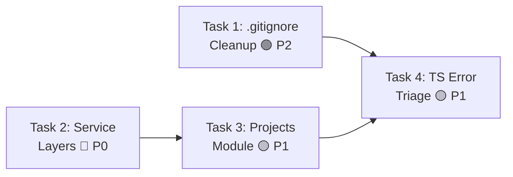

# Sprint 0: Technical Debt Cleanup — Implementation Plan

> **Version**: v1.0
> **Date**: 2026-03-23
> **Source PRD**: [prd-architecture-analysis-and-next-steps-2026-03-23.md](../prd/prd-architecture-analysis-and-next-steps-2026-03-23.md)
> **Total Estimated Time**: ~12 hours
> **Team**: 1 full-stack developer
> **Prerequisites**: Docker services running (PostgreSQL + Redis), Node.js 18+

---

## 1. Sprint 0 Overview

Based on the architecture analysis, Sprint 0 focuses on cleaning up technical debt before feature development begins. The PRD identified four critical areas:

| # | Task | Priority | Est. Time | Impact |
|---|------|:--------:|:---------:|--------|
| 1 | Root Directory Cleanup & `.gitignore` Update | P2 🟢 | 1.5h | Codebase hygiene |
| 2 | Add Service Layer to 4 Backend Modules | P0 🔴 | 5h | Business logic encapsulation |
| 3 | Complete `projects` Module | P1 🟡 | 2h | Feature completeness |
| 4 | TypeScript Error Triage | P1 🟡 | 3.5h | Build stability & DX |

### Dependency Map



> [!IMPORTANT]
> Task 1 and Task 2 are independent and can run in parallel. Task 3 depends on Task 2 patterns. Task 4 should run last.

---

## 2. Task 1: Root Directory Cleanup & `.gitignore`

**Priority**: P2 🟢 | **Time**: 1.5 hours | **Risk**: Low

### 2.1 Temporary Files to Clean (65 files identified)

#### Category A: Temporary Test/Verification Scripts (20 files)
| File | Type | Purpose |
|------|------|---------|
| `check_api_endpoints.py` | Python | API endpoint verification |
| `check_api_endpoints_simple.py` | Python | Simplified endpoint check |
| `verify_department_endpoints.py` | Python | Department endpoint verification |
| `create_test_data.py` | Python | Test data creation script |
| `fix_all_extended.py` | Python | Extended file fixer |
| `fix_all_files.py` | Python | Batch file fixer |
| `fix_all_metadata.py` | Python | Metadata fixer |
| `fix_all_source_files.py` | Python | Source file fixer |
| `fix_entry_points.py` | Python | Entry point fixer |
| `inspect_field_rendering.py` | Python | Field rendering inspector |
| `run_browser_test.py` | Python | Browser test runner |
| `run_edge_test.py` | Python | Edge browser test runner |
| `run_playwright_test.py` | Python | Playwright test runner |
| `run_selenium_test.py` | Python | Selenium test runner |
| `check_asset_fields.spec.ts` | TypeScript | Asset field checker |
| `check_business_objects.spec.ts` | TypeScript | Business object checker |
| `check_images_field_debug.spec.ts` | TypeScript | Image field debugger |
| `check_login_page.spec.ts` | TypeScript | Login page checker |
| `debug_layout_designer.spec.ts` | TypeScript | Layout designer debugger |
| `images_field_simple.spec.ts` | TypeScript | Simple image field test |

#### Category B: Temporary Verification Spec Files (5 files)
| File | Type |
|------|------|
| `verify_dynamic_routing.spec.ts` | Dynamic routing verification |
| `verify_dynamic_routing_with_login.spec.ts` | Dynamic routing with login |
| `verify_full_migration.spec.ts` | Full migration verification |
| `verify_images_field_fix.spec.ts` | Image field fix verification |
| `verify_images_upload.spec.ts` | Image upload verification |

#### Category C: Temporary Data/Config Dumps (19 files)
| File | Type |
|------|------|
| `cookies.txt`, `cookies_test.txt` | Session data |
| `token_response.json`, `test-token.json` | Auth tokens |
| `login_response.json` | Login response dump |
| `git_log.txt`, `git_log_utf8.txt` | Git log exports |
| `_tmp_asset_fields.json` | Temp asset field data |
| `metadata_Asset.json` | Asset metadata dump |
| `metadata_AssetCategory.json` | Category metadata dump |
| `metadata_AssetLoan.json` | Loan metadata dump |
| `metadata_AssetPickup.json` | Pickup metadata dump |
| `metadata_AssetReturn.json` | Return metadata dump |
| `metadata_AssetTransfer.json` | Transfer metadata dump |
| `metadata_Consumable.json` | Consumable metadata dump |
| `metadata_ConsumableCategory.json` | Consumable category dump |
| `metadata_ConsumableStock.json` | Stock metadata dump |
| `metadata_Department.json` | Department metadata dump |
| `metadata_InventoryTask.json` | Inventory task dump |
| `metadata_Location.json` | Location metadata dump |
| `metadata_Maintenance.json` | Maintenance metadata dump |
| `metadata_Organization.json` | Organization metadata dump |
| `metadata_PurchaseRequest.json` | Purchase request dump |
| `metadata_Supplier.json` | Supplier metadata dump |
| `metadata_endpoints_analysis.json` | Endpoint analysis dump |

#### Category D: Temporary Screenshots/Images (6 files)
| File | Description |
|------|-------------|
| `business-object-list.png` | UI screenshot |
| `login-after.png` | Login page screenshot |
| `login-before.png` | Login page screenshot |
| `login-filled.png` | Login form screenshot |
| `login_page.png` | Login page screenshot |
| `tmp-asset-edit-495b.png` | Temp asset edit screenshot |
| `tmp-field-def-list-asset.png` | Temp field definition screenshot |

#### Category E: Temporary HTML Pages (2 files)
| File | Description |
|------|-------------|
| `admin_page.html` | Captured admin page |
| `dashboard.html` | Captured dashboard page |

#### Category F: PowerShell Scripts (3 files)
| File | Description |
|------|-------------|
| `check_active_layout.ps1` | Active layout checker |
| `check_correct_endpoints.ps1` | Endpoint checker |
| `create_summary_report.ps1` | Report generator |

### 2.2 `.gitignore` Patterns to Add

```gitignore
# ============================================================
# Root-level temporary scripts & data (Sprint 0 cleanup)
# ============================================================

# Temp verification/check/fix scripts
/verify_*.py
/verify_*.js
/verify_*.spec.ts
/check_*.py
/check_*.js
/check_*.spec.ts
/fix_*.py
/inspect_*.py
/run_browser_test.py
/run_edge_test.py
/run_playwright_test.py
/run_puppeteer_test.js
/run_selenium_test.py
/create_test_data.py
/create_summary_report.ps1
/check_correct_endpoints.ps1
/check_active_layout.ps1

# Temp data/config dumps
/cookies*.txt
/token_response.json
/login_response.json
/metadata_*.json
/metadata_endpoints_analysis.json
/_tmp_*
/git_log*.txt

# Temp screenshots/images
/business-object-list.png
/login-*.png
/login_page.png
/tmp-*.png

# Temp HTML pages
/admin_page.html
/dashboard.html

# Temp spec files at root
/images_field_simple.spec.ts
/debug_layout_designer.spec.ts

# Playwright/test artifacts at root
/playwright-report/
/test-results/
/test-screenshots/
/screenshots/
/browser_test_env/

# ============================================================
# Backend temporary files
# ============================================================
/backend/create_demo_data*.py
/backend/create_final_demo*.py
/backend/create_more_demo.py
/backend/create_remaining_*.py
/backend/create_test_data.py
/backend/seed_minimum_demo_data.py
/backend/debug_*.py
/backend/verify_*.py
/backend/test_admin_inline.py
/backend/check_err.txt
/backend/consumables_error.txt
/backend/err.txt
/backend/migrate_err.txt
/backend/test_output*.txt

# ============================================================
# Frontend temporary files
# ============================================================
/frontend/fix*.cjs
/frontend/tmp_*
/frontend/extract_*.py
/frontend/refactor_*.py
/frontend/remove_unused.py
/frontend/replace_template.py
/frontend/new_template.txt
/frontend/build_error.txt
/frontend/lint_output.txt
/frontend/ts_errors*.txt
/frontend/tsc_errors*.txt
/frontend/tsc_output*.txt
/frontend/typecheck_output.txt
/frontend/test-results.txt
/frontend/playwright-report/
/frontend/test-results/
```

### 2.3 Execution Steps

| Step | Action | Time | Verification |
|:----:|--------|:----:|--------------|
| 1.1 | Audit root directory with `ls *.py *.spec.ts *.ps1 *.png *.json *.html *.txt` | 15m | Count ≥ 60 files |
| 1.2 | Append patterns to `.gitignore` (see above) | 30m | — |
| 1.3 | Add backend temp file patterns to `.gitignore` | 15m | — |
| 1.4 | Add frontend temp file patterns to `.gitignore` | 15m | — |
| 1.5 | Verify with `git status` that temp files are now ignored | 15m | Zero temp files in staged set |

> [!NOTE]
> Files are NOT deleted — only excluded from Git tracking. Developers can clean their local copies at their discretion.

---

## 3. Task 2: Add Service Layer to 4 Backend Modules

**Priority**: P0 🔴 | **Time**: 5 hours | **Risk**: Medium

### 3.1 Current State Analysis

| Module | Models | Serializers | ViewSets | Services | Tests | Gap |
|--------|:------:|:-----------:|:--------:|:--------:|:-----:|-----|
| `insurance` | ✅ 6 models (742 lines) | ✅ Complete | ✅ Complete | ❌ Missing | ✅ 748 lines | Service layer only |
| `leasing` | ✅ 5 models (642 lines) | ✅ Complete | ✅ Complete | ❌ Missing | — | Service layer only |
| `depreciation` | ✅ 3 models (246 lines) | ✅ Complete | ✅ Complete | ❌ Missing | — | Service layer only |
| `finance` | ✅ 3 models + signal (267 lines) | ✅ Complete | ✅ Complete | ❌ Missing | — | Service layer only |

> [!IMPORTANT]
> Contrary to the initial PRD assessment (which rated these at 55-60% complete), detailed analysis reveals these modules are **85-95% complete**. They have full models, serializers, viewsets, and URL configurations. The ONLY gap is the service layer.

### 3.2 Reference Pattern

All services must inherit from `BaseCRUDService`:
- **Source**: `apps/common/services/base_crud.py` (362 lines)
- **Best Example**: `apps/projects/services.py` (466 lines, 3 service classes)

```python
from apps.common.services.base_crud import BaseCRUDService
from .models import MyModel

class MyModelService(BaseCRUDService):
    def __init__(self):
        super().__init__(MyModel)

    # Business-specific methods...
```

### 3.3 Service Classes to Create

#### A. `insurance/services.py` — 5 Service Classes

| Service Class | Model | Key Methods |
|---------------|-------|-------------|
| `InsuranceCompanyService` | `InsuranceCompany` | `get_active_companies()`, `deactivate()` |
| `InsurancePolicyService` | `InsurancePolicy` | `activate()`, `cancel()`, `get_expiring_soon(days)`, `get_dashboard_stats()`, `_generate_payment_schedule()` |
| `PremiumPaymentService` | `PremiumPayment` | `record_payment(amount)`, `get_overdue_payments()` |
| `ClaimRecordService` | `ClaimRecord` | `approve(amount)`, `reject()`, `record_settlement()`, `close()` |
| `PolicyRenewalService` | `PolicyRenewal` | Base CRUD only |

#### B. `leasing/services.py` — 5 Service Classes

| Service Class | Model | Key Methods |
|---------------|-------|-------------|
| `LeaseContractService` | `LeaseContract` | `activate()`, `suspend()`, `terminate()`, `complete()`, `get_expiring_contracts()`, `get_dashboard_stats()` |
| `LeaseItemService` | `LeaseItem` | Base CRUD only |
| `RentPaymentService` | `RentPayment` | `record_payment()`, `get_overdue_payments()` |
| `LeaseReturnService` | `LeaseReturn` | `calculate_charges()` |
| `LeaseExtensionService` | `LeaseExtension` | `approve_extension()` (updates parent contract) |

#### C. `depreciation/services.py` — 3 Service Classes

| Service Class | Model | Key Methods |
|---------------|-------|-------------|
| `DepreciationConfigService` | `DepreciationConfig` | `get_config_for_category()` |
| `DepreciationRecordService` | `DepreciationRecord` | `get_asset_history()`, `get_period_summary()` |
| `DepreciationRunService` | `DepreciationRun` | `execute_run()`, `_calculate_period_depreciation()`, `_calculate_single_asset()` |

#### D. `finance/services.py` — 3 Service Classes

| Service Class | Model | Key Methods |
|---------------|-------|-------------|
| `FinanceVoucherService` | `FinanceVoucher` | `submit()`, `approve()`, `reject()`, `post_voucher()`, `reverse_voucher()` |
| `VoucherEntryService` | `VoucherEntry` | Base CRUD only |
| `VoucherTemplateService` | `VoucherTemplate` | `get_active_templates()`, `generate_voucher_from_template()` |

### 3.4 Execution Steps

| Step | Action | Time | Verification |
|:----:|--------|:----:|--------------|
| 2.1 | Read `BaseCRUDService` and `projects/services.py` patterns | 20m | Understand inheritance API |
| 2.2 | Create `insurance/services.py` (5 classes) | 1h | Import check passes |
| 2.3 | Create `leasing/services.py` (5 classes) | 1h | Import check passes |
| 2.4 | Create `depreciation/services.py` (3 classes) | 1h | Import check passes |
| 2.5 | Create `finance/services.py` (3 classes) | 45m | Import check passes |
| 2.6 | Verify all imports and `BaseCRUDService` inheritance | 30m | `docker-compose exec backend python -c "from apps.insurance.services import ..."` |

---

## 4. Task 3: Complete `projects` Module

**Priority**: P1 🟡 | **Time**: 2 hours | **Risk**: Low

### 4.1 Current State

The `projects` module is **95% complete** with rich implementations:
- ✅ `models.py` — 478 lines, 3 models (`AssetProject`, `ProjectAsset`, `ProjectMember`)
- ✅ `serializers.py` — Complete serializers for all 3 models
- ✅ `viewsets.py` — 211 lines, 3 viewsets with custom actions
- ✅ `services.py` — 466 lines, 3 service classes
- ✅ `filters.py` — Complete filter classes
- ✅ `tests/` — Test files present
- ✅ `INSTALLED_APPS` — Already registered in `settings/base.py`

### 4.2 Missing Files

| File | Status | Purpose |
|------|:------:|---------|
| `apps/projects/urls.py` | ❌ Missing | DRF router URL configuration |
| `apps/projects/admin.py` | ❌ Missing | Django admin model registration |
| `config/urls.py` entry | ❌ Missing | `path('api/projects/', include('apps.projects.urls'))` |

### 4.3 Files to Create

#### A. `apps/projects/urls.py`
- Register all 3 viewsets using DRF `DefaultRouter`
- URL patterns: `projects/`, `allocations/`, `members/`

#### B. `apps/projects/admin.py`
- Register `AssetProject`, `ProjectAsset`, `ProjectMember`
- Include inline displays (`ProjectAssetInline`, `ProjectMemberInline`)
- Configure list_display, list_filter, search_fields, fieldsets

#### C. `config/urls.py` — Add Route
- Add `path('api/projects/', include('apps.projects.urls'))` alongside other module routes

### 4.4 Execution Steps

| Step | Action | Time | Verification |
|:----:|--------|:----:|--------------|
| 3.1 | Read `projects/models.py` and `projects/viewsets.py` | 15m | Understand 3 models, 3 viewsets |
| 3.2 | Create `projects/urls.py` with DRF router | 15m | — |
| 3.3 | Create `projects/admin.py` with inlines | 30m | Follow `insurance/admin.py` pattern |
| 3.4 | Add route to `config/urls.py` | 10m | — |
| 3.5 | Run `manage.py check` to validate | 15m | `System check identified no issues` |
| 3.6 | Run `manage.py show_urls` to verify endpoints | 15m | `/api/projects/` visible |
| 3.7 | Run existing projects tests | 20m | `pytest apps/projects/tests/ -v` |

---

## 5. Task 4: TypeScript Error Triage

**Priority**: P1 🟡 | **Time**: 3.5 hours | **Risk**: Medium

### 5.1 Strategy

**Triage, not full fix.** Focus on:
1. Measuring current error count with `npx vue-tsc --noEmit`
2. Categorizing errors into blocking vs. non-blocking
3. Fixing the most impactful errors
4. Target: ≥50% error reduction and production build success

### 5.2 Expected Error Categories

| TS Code | Category | Severity | Description |
|---------|----------|:--------:|-------------|
| TS2304 | Missing type | 🔴 Blocking | Cannot find name `xxx` |
| TS2322 | Type mismatch | 🔴 Blocking | Type `A` is not assignable to type `B` |
| TS2345 | Argument type | 🟡 Medium | Argument not assignable to parameter |
| TS2339 | Property access | 🟡 Medium | Property does not exist on type |
| TS6133 | Unused variable | 🟢 Low | Declared but never read |
| TS7006 | Implicit any | 🟢 Low | Parameter implicitly has `any` type |
| TS2741 | Missing prop | 🟡 Medium | Property missing in type |
| TS2739 | Missing properties | 🟡 Medium | Type missing multiple properties |

### 5.3 Execution Steps

| Step | Action | Time | Verification |
|:----:|--------|:----:|--------------|
| 4.1 | Run `npx vue-tsc --noEmit` — capture error count and breakdown | 15m | Establish baseline |
| 4.2 | Categorize: blocking (TS2304/2322/2345) vs. warnings (TS6133/7006) | 30m | Error distribution report |
| 4.3 | Fix missing type imports and declarations | 1h | — |
| 4.4 | Fix component prop type mismatches | 45m | — |
| 4.5 | Add `// @ts-expect-error` for known third-party type issues | 15m | LogicFlow, Element Plus edge cases |
| 4.6 | Re-run `npx vue-tsc --noEmit` — measure improvement | 15m | Target ≥50% reduction |
| 4.7 | Run `npm run build` — verify production build | 15m | Must succeed with zero errors |

---

## 6. Execution Order (Recommended)

```
Hour 0  - 1.5   Task 1 .gitignore cleanup         (lowest risk, quick win)
Hour 1.5 - 6.5  Task 2 Service layers × 4 modules  (highest priority, most value)
Hour 6.5 - 8.5  Task 3 Projects module completion   (unlocks /api/projects/)
Hour 8.5 - 12   Task 4 TypeScript error triage       (improves DX)
```

---

## 7. Resources & Dependencies

| Resource | Purpose | Status |
|----------|---------|:------:|
| Docker (PostgreSQL + Redis) | Run backend tests & import checks | ⚠️ Verify running |
| Node.js 18+ | Frontend TypeScript checks & build | ✅ `.nvmrc` present |
| `BaseCRUDService` source | Pattern reference for all services | ✅ `apps/common/services/base_crud.py` |
| `projects/services.py` | Best implementation example (466 lines) | ✅ Available |
| `insurance/tests/test_api.py` | Existing test validation (748 lines) | ✅ Available |
| `pytest.ini` + `conftest.py` | Backend test configuration with fixtures | ✅ Available |

---

## 8. Success Criteria

| Metric | Target |
|--------|--------|
| Root temp file tracking | `git status` shows zero temp files in staged/tracking |
| New service files | 4 new `services.py` files with correct `BaseCRUDService` inheritance |
| Service class count | 16 new service classes total (5 + 5 + 3 + 3) |
| Projects module | Accessible via `/api/projects/` with `manage.py check` passing |
| TypeScript errors | ≥50% reduction from baseline, `npm run build` succeeds |
| Backend test regression | 100% of existing tests still passing |

---

## 9. Risk Assessment

| Risk | Impact | Likelihood | Mitigation |
|------|:------:|:----------:|------------|
| Service layer logic mismatches existing viewset logic | Medium | Low | Extract logic FROM viewsets, keep viewsets as thin wrappers |
| Projects module migration conflicts | Low | Low | Run `makemigrations --check` before and after |
| TypeScript fixes introduce runtime regressions | Medium | Medium | Run `npm run build` after each batch of fixes |
| Docker services not running locally | High | Medium | Use `docker-compose up -d` as first step |

---

## 10. Verification Commands

```bash
# Task 1: .gitignore verification
git status --short | grep -v "^?" | wc -l   # Count tracked temp files (should be 0)

# Task 2: Service layer verification
docker-compose exec backend python -c "
from apps.insurance.services import InsurancePolicyService
from apps.leasing.services import LeaseContractService
from apps.depreciation.services import DepreciationRunService
from apps.finance.services import FinanceVoucherService
print('All service imports successful')
"

# Task 3: Projects module verification
docker-compose exec backend python manage.py check
docker-compose exec backend python manage.py show_urls | grep projects
docker-compose exec backend pytest apps/projects/tests/ -v

# Task 4: TypeScript verification
cd frontend
npx vue-tsc --noEmit 2>&1 | tail -5        # Check error count
npm run build                                # Must succeed
```
