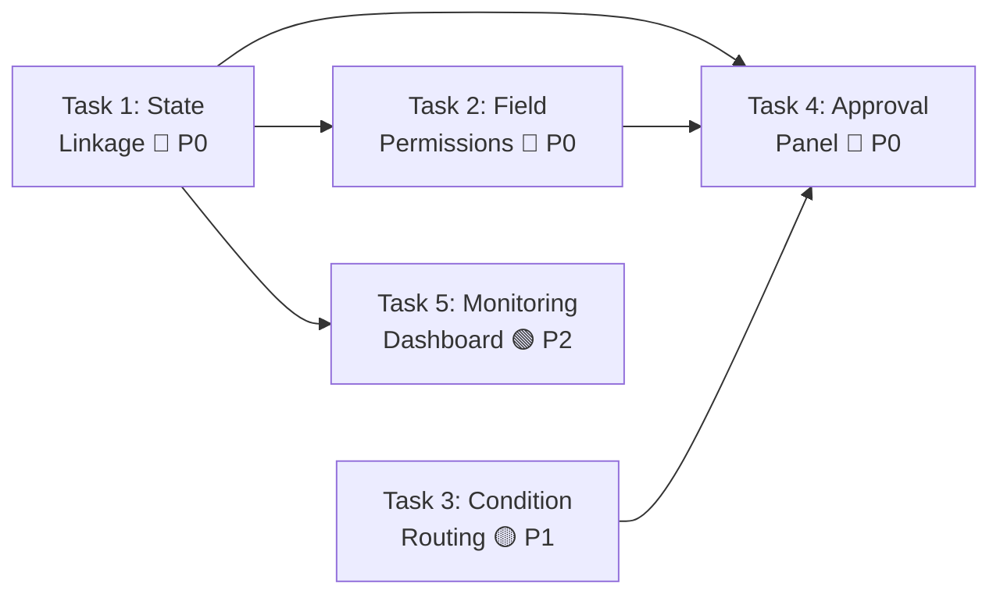

# Sprint 1: Workflow-Business Integration — Implementation Plan

> **Version**: v1.0
> **Date**: 2026-03-23
> **Prerequisite**: Sprint 0 (Technical Debt Cleanup) completed
> **Total Estimated Time**: ~24 hours
> **Team**: 1 full-stack developer
> **Prerequisites**: Docker services running (PostgreSQL + Redis), Node.js 18+

---

## 1. Sprint Overview

Sprint 1 bridges the gap between the existing workflow engine and actual business documents. Today the `WorkflowEngine`, models (`WorkflowDefinition`, `WorkflowInstance`, `WorkflowTask`, `WorkflowApproval`), and services (`condition_evaluator`, `approver_resolver`, `workflow_validation`) are **structurally complete** but **not wired** to business document lifecycle, field-level permissions are stored but not enforced, condition routing is basic, and the frontend has no approval interaction panel.

| # | Task | Priority | Est. Time | Impact |
|---|------|:--------:|:---------:|--------|
| 1 | Workflow–Business Document State Linkage | P0 🔴 | 7h | Core integration |
| 2 | Approval Field Permissions Enforcement | P0 🔴 | 5h | Data security |
| 3 | Conditional Routing Rules Enhancement | P1 🟡 | 4h | Routing flexibility |
| 4 | Frontend Approval Panel | P0 🔴 | 5h | User interaction |
| 5 | Monitoring Dashboard | P2 🟢 | 3h | Operational visibility |

### Dependency Map



> [!IMPORTANT]
> Task 1 is the foundation — all other tasks depend on it. Tasks 2 and 3 can run in parallel after Task 1. Task 4 depends on Tasks 1–3. Task 5 depends only on Task 1.

---

## 2. Task 1: Workflow–Business Document State Linkage

**Priority**: P0 🔴 | **Time**: 7 hours | **Risk**: High

### 2.1 Problem Statement

The `WorkflowInstance` model links to business objects via `business_object_code` + `business_id` (string fields), but:
- No automatic business document status update when workflow state changes (e.g., approved → asset status becomes "active")
- No callback mechanism when `WorkflowInstance.complete()` / `reject()` / `cancel()` fires
- Business documents have no `approval_status` field to reflect workflow progress
- No reverse lookup from business documents to their workflow instances

### 2.2 Current State

| Component | File | Status |
|-----------|------|--------|
| `WorkflowInstance.complete()` | [workflow_instance.py](file:///Users/abner/My_Project/HOOK_GZEAMS/backend/apps/workflows/models/workflow_instance.py#L336-L361) | ✅ Updates instance status, no business doc callback |
| `WorkflowInstance.reject()` | [workflow_instance.py](file:///Users/abner/My_Project/HOOK_GZEAMS/backend/apps/workflows/models/workflow_instance.py#L363-L381) | ✅ Updates instance status, no business doc callback |
| `WorkflowEngine.start_workflow()` | [workflow_engine.py](file:///Users/abner/My_Project/HOOK_GZEAMS/backend/apps/workflows/services/workflow_engine.py#L48-L152) | ✅ Creates instance, no business doc status change |
| `WorkflowEngine.execute_task()` | [workflow_engine.py](file:///Users/abner/My_Project/HOOK_GZEAMS/backend/apps/workflows/services/workflow_engine.py#L154-L233) | ✅ Processes tasks, no business doc callback |

### 2.3 Proposed Changes

#### A. Business Document Status Mixin

Create a reusable mixin that any business model can inherit to gain workflow-aware status tracking.

##### [NEW] `apps/common/mixins/workflow_status.py`

```python
class WorkflowStatusMixin(models.Model):
    """
    Mixin to add workflow-aware status tracking to business models.
    
    Adds approval_status field and methods to sync with WorkflowInstance state.
    """
    APPROVAL_STATUS_CHOICES = [
        ('draft', 'Draft'),
        ('pending_approval', 'Pending Approval'),
        ('approved', 'Approved'),
        ('rejected', 'Rejected'),
        ('cancelled', 'Cancelled'),
    ]
    
    approval_status = models.CharField(
        max_length=20,
        choices=APPROVAL_STATUS_CHOICES,
        default='draft',
        db_index=True,
    )
    workflow_instance_id = models.UUIDField(
        null=True, blank=True, db_index=True,
    )
    submitted_at = models.DateTimeField(null=True, blank=True)
    approved_at = models.DateTimeField(null=True, blank=True)
    
    class Meta:
        abstract = True
    
    def on_workflow_approved(self):
        """Hook for subclasses to implement business logic on approval."""
        pass
    
    def on_workflow_rejected(self):
        """Hook for subclasses to implement business logic on rejection."""
        pass
```

##### [NEW] `apps/workflows/services/business_state_sync.py`

A **BusinessStateSyncService** that:
1. Receives workflow state change events (via Django signals or direct call)
2. Resolves the target business model from `business_object_code`
3. Updates the business document's `approval_status` field
4. Calls model-specific hooks (`on_workflow_approved`, `on_workflow_rejected`)
5. Logs all state transitions in `WorkflowOperationLog`

```python
class BusinessStateSyncService:
    """
    Synchronizes workflow instance state changes to linked business documents.
    """
    # Map of workflow status → business approval_status
    STATUS_MAP = {
        'running': 'pending_approval',
        'pending_approval': 'pending_approval',
        'approved': 'approved',
        'rejected': 'rejected',
        'cancelled': 'cancelled',
        'terminated': 'cancelled',
    }
    
    def sync_business_status(self, instance: WorkflowInstance):
        """Update linked business document status based on workflow state."""
        ...
    
    def _resolve_business_model(self, business_object_code: str):
        """Resolve Django model class from business object code via ObjectRegistry."""
        ...
    
    def _get_business_object(self, model_class, business_id, org_id):
        """Retrieve the business document by ID."""
        ...
```

##### [MODIFY] `apps/workflows/services/workflow_engine.py`

Inject `BusinessStateSyncService` calls into:
- `start_workflow()` — set business doc to `pending_approval`
- `execute_task()` — on approve (if workflow completes) → `approved`; on reject → `rejected`
- `withdraw_instance()` — set business doc to `cancelled`
- `terminate_instance()` — set business doc to `cancelled`

##### [NEW] `apps/workflows/signals.py`

Define Django signals for workflow lifecycle events:
- `workflow_started` — fired after `start_workflow()` succeeds
- `workflow_completed` — fired after `complete()` succeeds  
- `workflow_rejected` — fired after `reject()` succeeds
- `workflow_cancelled` — fired after `cancel()` / `terminate()` succeeds

Signal handlers will call `BusinessStateSyncService.sync_business_status()`.

##### [MODIFY] `apps/workflows/viewsets/workflow_execution_viewsets.py`

Add a new endpoint to look up workflow status for a given business document:

```
GET /api/workflows/instances/by-business/?business_object_code=AssetPickup&business_id=<uuid>
```

Returns the active workflow instance (if any) for the given business document.

### 2.4 Execution Steps

| Step | Action | Time | Verification |
|:----:|--------|:----:|-------------|
| 1.1 | Create `WorkflowStatusMixin` in `apps/common/mixins/workflow_status.py` | 45m | Import check |
| 1.2 | Create `BusinessStateSyncService` in `apps/workflows/services/business_state_sync.py` | 1.5h | Unit tests |
| 1.3 | Create `apps/workflows/signals.py` with 4 lifecycle signals | 45m | Signal fires in test |
| 1.4 | Modify `WorkflowEngine` to emit signals on state changes | 1h | Integration test |
| 1.5 | Add signal handlers to invoke `BusinessStateSyncService` | 45m | End-to-end test |
| 1.6 | Add `by-business` lookup endpoint to `WorkflowInstanceViewSet` | 30m | API test |
| 1.7 | Create `makemigrations` for `WorkflowStatusMixin` fields (no model applies yet — mixin only) | 15m | `manage.py check` |
| 1.8 | Write comprehensive tests | 1.5h | `pytest apps/workflows/tests/` |

---

## 3. Task 2: Approval Field Permissions Enforcement

**Priority**: P0 🔴 | **Time**: 5 hours | **Risk**: Medium

### 3.1 Problem Statement

`WorkflowDefinition.form_permissions` already stores per-node field permissions as JSON:

```json
{
    "node_123": {
        "amount": "read_only",
        "department": "hidden",
        "description": "editable"
    }
}
```

Helper methods `get_form_permissions_for_node()` and `set_form_permissions_for_node()` exist on the model ([workflow_definition.py#L391-L414](file:///Users/abner/My_Project/HOOK_GZEAMS/backend/apps/workflows/models/workflow_definition.py#L391-L414)), but:

- **Backend**: No API enforcement — approvers can currently edit fields marked `read_only` or `hidden`
- **Backend**: No endpoint to return the form permissions for the current task's node
- **Frontend**: No component renders the form with permission-aware field states
- **Designer**: No UI to configure field permissions per approval node

### 3.2 Proposed Changes

#### A. Backend — Permission-Aware Task Detail API

##### [MODIFY] `apps/workflows/viewsets/workflow_execution_viewsets.py`

Extend the `WorkflowTaskViewSet.retrieve()` response to include resolved field permissions for the current node:

```json
{
    "success": true,
    "data": {
        "id": "task-uuid",
        "node_id": "node_123",
        "node_name": "Manager Approval",
        "status": "pending",
        "form_permissions": {
            "amount": "read_only",
            "department": "hidden",
            "description": "editable",
            "notes": "editable"
        },
        "business_data": { ... }
    }
}
```

##### [NEW] `apps/workflows/services/form_permission_service.py`

```python
class FormPermissionService:
    """
    Resolves and enforces field-level permissions for workflow tasks.
    """
    PERMISSION_LEVELS = ('editable', 'read_only', 'hidden')
    
    def get_permissions_for_task(self, task: WorkflowTask) -> dict:
        """
        Resolve field permissions for a specific task based on the 
        definition's form_permissions config and the task's node_id.
        
        Falls back to 'read_only' for all fields if no config is set 
        (safe default for approvers).
        """
        ...
    
    def validate_submission(self, task: WorkflowTask, submitted_data: dict) -> tuple:
        """
        Validate that submitted approval data doesn't modify read_only or hidden fields.
        
        Returns: (is_valid: bool, violations: list)
        """
        ...
    
    def filter_response_data(self, task: WorkflowTask, business_data: dict) -> dict:
        """
        Filter business data to remove hidden fields from the response.
        """
        ...
```

##### [MODIFY] `apps/workflows/viewsets/workflow_execution_viewsets.py`

- In `approve()` / `reject()` / `return_task()` actions, call `FormPermissionService.validate_submission()` before executing the task
- In `retrieve()`, call `FormPermissionService.filter_response_data()` to strip hidden fields

#### B. Backend — Permission Configuration Endpoint

##### [MODIFY] `apps/workflows/viewsets/workflow_definition_viewsets.py`

Add two actions to `WorkflowDefinitionViewSet`:

```
GET  /api/workflows/definitions/{id}/form-permissions/
PUT  /api/workflows/definitions/{id}/form-permissions/
```

- **GET**: Returns all node→field permission mappings + available fields (via `FieldDefinition` metadata for the linked `business_object_code`)
- **PUT**: Bulk-update form permissions for one or more nodes

#### C. Frontend — Field Permission Types

##### [MODIFY] `frontend/src/types/workflow.ts`

Add types for field permissions:

```typescript
export type FieldPermissionLevel = 'editable' | 'read_only' | 'hidden'

export interface NodeFieldPermissions {
    [fieldCode: string]: FieldPermissionLevel
}

export interface FormPermissionsConfig {
    [nodeId: string]: NodeFieldPermissions
}

export interface TaskWithPermissions extends WorkflowTask {
    form_permissions: NodeFieldPermissions
    business_data: Record<string, any>
}
```

### 3.3 Execution Steps

| Step | Action | Time | Verification |
|:----:|--------|:----:|-------------|
| 2.1 | Create `FormPermissionService` | 1.5h | Unit tests |
| 2.2 | Integrate into `WorkflowTaskViewSet.retrieve()` | 45m | API returns `form_permissions` |
| 2.3 | Add validation to approve/reject/return actions | 45m | Reject write to `read_only` fields |
| 2.4 | Add GET/PUT form-permissions endpoints to definition viewset | 1h | API test |
| 2.5 | Add frontend types | 15m | TypeScript compiles |
| 2.6 | Write tests | 45m | `pytest` passes |

---

## 4. Task 3: Conditional Routing Rules Enhancement

**Priority**: P1 🟡 | **Time**: 4 hours | **Risk**: Medium

### 4.1 Problem Statement

The `ConditionEvaluator` service ([condition_evaluator.py](file:///Users/abner/My_Project/HOOK_GZEAMS/backend/apps/workflows/services/condition_evaluator.py)) supports 13 operators and evaluates conditions only against `instance.variables`. Current gaps:

- **No edge-level conditions**: Conditions are stored only in node `properties.branches[]`, but LogicFlow convention also supports conditions on edge `properties`
- **No business-field-aware evaluation**: Conditions can only reference `instance.variables`, not the actual business document field values
- **No OR logic**: Multiple conditions within a branch use AND logic only; no support for OR groups
- **No formula/expression evaluation**: Simple comparison only — no support for computed expressions like `amount * quantity > 10000`
- **No fallback/default branch handling**: `_process_condition_node` checks `properties.defaultFlow` but doesn't resolve it properly

### 4.2 Proposed Changes

#### A. Enhanced Condition Evaluator

##### [MODIFY] `apps/workflows/services/condition_evaluator.py`

1. **Add OR group support**: Support `conditionGroups` with AND/OR logic between groups:

```json
{
    "conditionGroups": [
        {
            "logic": "and",
            "conditions": [
                { "field": "amount", "operator": "gt", "value": 5000 },
                { "field": "category", "operator": "eq", "value": "IT" }
            ]
        },
        {
            "logic": "and",
            "conditions": [
                { "field": "priority", "operator": "eq", "value": "urgent" }
            ]
        }
    ],
    "groupLogic": "or"
}
```

2. **Add business data resolution**: Allow conditions to reference business document fields via dotted prefix `business.field_name`, falling back to `instance.variables`:

```python
def _get_field_value(self, instance, field):
    """Get field value from instance variables OR business document."""
    if field.startswith('business.'):
        return self._get_business_field_value(instance, field[9:])
    return self._get_variable_value(instance, field)
```

3. **Add edge-level condition support**: When processing outgoing edges from condition nodes, check `edge.properties.conditions` in addition to node-level branches.

4. **Fix default branch resolution**: Properly handle the `defaultFlow` property by finding the edge marked as default.

#### B. Enhanced Condition Processing in Engine

##### [MODIFY] `apps/workflows/services/workflow_engine.py`

Update `_process_condition_node()` to:
1. Try edge-level conditions first (on outgoing edges from the condition node)
2. Fall back to node-level branch conditions  
3. Properly resolve default branch if no conditions match

#### C. Condition Validation Enhancement

##### [MODIFY] `apps/workflows/services/workflow_validation.py`

Add validation rules for:
- Condition nodes must have at least 2 outgoing edges (including default)
- Each non-default edge should have a condition configured
- Condition field references must be valid (exist in business object metadata or variables)

### 4.3 Execution Steps

| Step | Action | Time | Verification |
|:----:|--------|:----:|-------------|
| 3.1 | Add OR group logic to `ConditionEvaluator` | 1h | Unit test with OR/AND groups |
| 3.2 | Add business data field resolution | 45m | Unit test with mock business data |
| 3.3 | Add edge-level condition support | 45m | Unit test with edge conditions |
| 3.4 | Fix default branch handling in engine | 30m | Unit test with no-match scenario |
| 3.5 | Enhance condition validation | 30m | Validation catches invalid configs |
| 3.6 | Write integration tests | 30m | Full branch scenario passes |

---

## 5. Task 4: Frontend Approval Panel

**Priority**: P0 🔴 | **Time**: 5 hours | **Risk**: Medium

### 5.1 Problem Statement

The frontend has workflow API services ([workflow.ts](file:///Users/abner/My_Project/HOOK_GZEAMS/frontend/src/api/workflow.ts)), types ([workflow.ts](file:///Users/abner/My_Project/HOOK_GZEAMS/frontend/src/types/workflow.ts)), a stub store ([stores/workflow.ts](file:///Users/abner/My_Project/HOOK_GZEAMS/frontend/src/stores/workflow.ts)), and progress display components (`DocumentWorkflowProgress.vue`, `WorkflowProgress.vue`). However:

- **No approval action panel**: No UI for approvers to approve/reject/return tasks
- **No form with field permissions**: No dynamic form that respects `editable` / `read_only` / `hidden` permissions
- **No "My Approvals" page**: No dedicated page listing pending tasks with action capability
- **Store is a stub**: `useWorkflowStore` has a TODO comment and no real API calls

### 5.2 Current Frontend Components

| Component | File | Status |
|-----------|------|--------|
| `DocumentWorkflowProgress.vue` | `components/common/` | ✅ Display only |
| `DocumentWorkflowProgressBlock.vue` | `components/common/` | ✅ Display only |
| `WorkflowProgress.vue` | `views/workflow/components/` | ✅ Display only |
| `WorkflowDesigner.vue` | `components/workflow/` | ✅ Designer (LogicFlow) |
| `useWorkflowStore` | `stores/workflow.ts` | ❌ Stub only |
| `workflowNodeApi.approveNode()` | `api/workflow.ts` | ✅ API ready |
| `taskApi.approveTask()` | `api/workflow.ts` | ✅ API ready |

### 5.3 Proposed Changes

#### A. Approval Action Panel Component

##### [NEW] `frontend/src/components/workflow/ApprovalPanel.vue`

A reusable panel component that renders the approval interface for a given task:

- **Header**: Task info (node name, workflow name, business doc reference, priority badge, due date)
- **Business Data Form**: Dynamic form rendered via `DynamicForm` engine, applying field permissions from the API
  - `editable` fields → normal input state
  - `read_only` fields → disabled/readonly state with visual indicator
  - `hidden` fields → not rendered at all
- **Approval Timeline**: Condensed approval history (who approved/rejected at which node)
- **Action Bar**: Three buttons:
  - ✅ **Approve** (primary, green) — with optional comment textarea
  - ❌ **Reject** (danger, red) — with required comment textarea
  - ↩️ **Return** (warning, orange) — with required comment textarea + target node selector
- **Loading & Error States**: Skeleton loading, error boundaries, network error retry

```
┌──────────────────────────────────────────┐
│  📋 Manager Approval — Asset Pickup      │
│  LY-2024-001 | Priority: High | Due: 3d │
├──────────────────────────────────────────┤
│  ┌─── Business Document Form ─────────┐ │
│  │  Asset Name:   [MacBook Pro 16"] RO │ │
│  │  Amount:       [¥12,999]        RO │ │
│  │  Department:   ──── hidden ────     │ │
│  │  Notes:        [________________]   │ │
│  └────────────────────────────────────┘ │
├──────────────────────────────────────────┤
│  Timeline:                               │
│  ✅ Submit — Zhang San — 2024-01-15      │
│  ⏳ Manager Approval — (pending)         │
├──────────────────────────────────────────┤
│  Comment: [________________________]     │
│                                          │
│  [↩️ Return]   [❌ Reject]   [✅ Approve] │
└──────────────────────────────────────────┘
```

#### B. My Approvals Page

##### [NEW] `frontend/src/views/workflow/MyApprovals.vue`

Full-page view listing the user's pending, completed, and overdue tasks:

- **Tab Bar**: "Pending" (badge count) | "Completed Today" | "All History"
- **Task Cards**: Each card shows:
  - Workflow name + business doc reference
  - Current node name + approver info
  - Priority badge + due date
  - Quick approve/reject buttons (for simple cases)
  - Click to open `ApprovalPanel` in a drawer/dialog
- **Empty State**: Illustration with "No pending approvals" message
- **Pull-to-refresh**: For mobile-first experience (per NIIMBOT benchmark)

##### [NEW] `frontend/src/views/workflow/ApprovalDetail.vue`

Full-page detail view for a single approval task, embedding the `ApprovalPanel` component.

#### C. Workflow Store Enhancement

##### [MODIFY] `frontend/src/stores/workflow.ts`

Replace the stub store with a fully functional Pinia store:

```typescript
export const useWorkflowStore = defineStore('workflow', () => {
    // State
    const pendingTasks = ref<WorkflowTask[]>([])
    const pendingCount = ref(0)
    const currentTask = ref<TaskWithPermissions | null>(null)
    const loading = ref(false)
    
    // Actions
    async function fetchMyTasks() { ... }
    async function fetchTaskDetail(taskId: string) { ... }
    async function approveTask(taskId: string, comment?: string) { ... }
    async function rejectTask(taskId: string, comment: string) { ... }
    async function returnTask(taskId: string, comment: string) { ... }
    async function refreshPendingCount() { ... }
    
    return { pendingTasks, pendingCount, currentTask, loading, ... }
})
```

#### D. Composable for Field Permissions

##### [NEW] `frontend/src/composables/useFieldPermissions.ts`

```typescript
export function useFieldPermissions(permissions: Ref<NodeFieldPermissions>) {
    const isEditable = (fieldCode: string) => ...
    const isReadOnly = (fieldCode: string) => ...
    const isHidden = (fieldCode: string) => ...
    const visibleFields = computed(() => ...)
    
    return { isEditable, isReadOnly, isHidden, visibleFields }
}
```

#### E. Router Registration

##### [MODIFY] `frontend/src/router/`

Add routes:
- `/approvals` → `MyApprovals.vue`
- `/approvals/:taskId` → `ApprovalDetail.vue`

### 5.4 Execution Steps

| Step | Action | Time | Verification |
|:----:|--------|:----:|-------------|
| 4.1 | Create `useFieldPermissions` composable | 30m | Unit test |
| 4.2 | Rewrite `useWorkflowStore` with full API integration | 45m | Store test |
| 4.3 | Create `ApprovalPanel.vue` component | 1.5h | Visual test in browser |
| 4.4 | Create `MyApprovals.vue` page | 1h | Route loads, tabs work |
| 4.5 | Create `ApprovalDetail.vue` page | 30m | Route loads, panel renders |
| 4.6 | Register routes, add nav menu entries | 15m | Navigation works |
| 4.7 | Polish: loading states, error handling, responsive layout | 30m | Mobile-friendly |

---

## 6. Task 5: Monitoring Dashboard

**Priority**: P2 🟢 | **Time**: 3 hours | **Risk**: Low

### 6.1 Problem Statement

`WorkflowStatisticsViewSet` ([workflow_execution_viewsets.py#L614-L722](file:///Users/abner/My_Project/HOOK_GZEAMS/backend/apps/workflows/viewsets/workflow_execution_viewsets.py#L614-L722)) provides basic aggregate counts but:

- No time-series data for trend visualization
- No per-definition performance breakdown
- No bottleneck detection (slow approval nodes)
- No SLA tracking (overdue rate, avg approval time per node)
- No frontend dashboard component

### 6.2 Proposed Changes

#### A. Enhanced Statistics Backend

##### [MODIFY] `apps/workflows/viewsets/workflow_execution_viewsets.py`

Extend `WorkflowStatisticsViewSet` with additional endpoints:

```
GET /api/workflows/statistics/                    — Overview (existing, enhanced)
GET /api/workflows/statistics/trends/             — Daily/weekly instance trends 
GET /api/workflows/statistics/performance/        — Per-definition performance metrics
GET /api/workflows/statistics/bottlenecks/        — Slowest nodes by avg duration
GET /api/workflows/statistics/sla/                — SLA compliance metrics
```

**New fields in overview response**:

```json
{
    "total_instances": 150,
    "pending_instances": 23,
    "completed_instances": 112,
    "rejected_instances": 15,
    "my_pending_tasks": 5,
    "my_completed_tasks": 42,
    "my_overdue_tasks": 2,
    "average_completion_hours": 18.5,
    "approval_rate": 88.2,
    "overdue_rate": 8.7,
    "instances_by_status": { ... },
    "instances_by_definition": { ... },
    "trends_7d": [
        { "date": "2024-01-15", "started": 5, "completed": 3, "rejected": 1 },
        ...
    ],
    "top_bottleneck_nodes": [
        { "node_name": "Finance Approval", "avg_hours": 24.5, "count": 12 },
        ...
    ]
}
```

**Trends endpoint** response:

```json
{
    "period": "7d",
    "data": [
        { "date": "2024-01-15", "started": 5, "completed": 3, "rejected": 1 },
        { "date": "2024-01-16", "started": 8, "completed": 6, "rejected": 0 },
        ...
    ]
}
```

**Bottlenecks endpoint** response:

```json
{
    "bottlenecks": [
        {
            "node_name": "Finance Director Approval",
            "definition_name": "Asset Procurement",
            "avg_duration_hours": 36.2,
            "max_duration_hours": 72.0,
            "task_count": 15,
            "overdue_count": 5,
            "overdue_rate": 33.3
        }
    ]
}
```

#### B. Frontend Dashboard

##### [NEW] `frontend/src/views/workflow/WorkflowDashboard.vue`

Dashboard page with four widget sections, using Element Plus cards and minimal charting:

| Widget | Data Source | Visualization |
|--------|-----------|---------------|
| **Status Overview** | `/statistics/` | 4 stat cards (total, pending, approved, rejected) with color coding |
| **My Tasks Summary** | `/statistics/` | 3 stat cards (pending, overdue, completed today) |
| **7-Day Trends** | `/statistics/trends/` | Simple bar chart (Element Plus `el-progress` bars or CSS-only bars) |
| **Bottleneck Nodes** | `/statistics/bottlenecks/` | Table with progress bar showing avg time vs SLA threshold |

##### [NEW] `frontend/src/api/workflowStats.ts`

```typescript
export const workflowStatsApi = {
    getOverview: () => request.get('/workflows/statistics/'),
    getTrends: (period = '7d') => request.get('/workflows/statistics/trends/', { params: { period } }),
    getBottlenecks: () => request.get('/workflows/statistics/bottlenecks/'),
    getPerformance: () => request.get('/workflows/statistics/performance/'),
}
```

##### [MODIFY] `frontend/src/router/`

Add route: `/workflow/dashboard` → `WorkflowDashboard.vue`

### 6.3 Execution Steps

| Step | Action | Time | Verification |
|:----:|--------|:----:|-------------|
| 5.1 | Extend `WorkflowStatisticsViewSet` with trends/bottlenecks/SLA | 1.5h | API returns data |
| 5.2 | Create `workflowStatsApi.ts` | 15m | TypeScript compiles |
| 5.3 | Create `WorkflowDashboard.vue` with 4 widget sections | 1h | Visual test |
| 5.4 | Register route and add nav entry | 15m | Navigation works |

---

## 7. File Change Summary

### New Files (10)

| File | Module | Purpose |
|------|--------|---------|
| `apps/common/mixins/workflow_status.py` | common | Workflow-aware status mixin for business models |
| `apps/workflows/services/business_state_sync.py` | workflows | Sync workflow state → business doc status |
| `apps/workflows/services/form_permission_service.py` | workflows | Enforce field-level permissions |
| `apps/workflows/signals.py` | workflows | Workflow lifecycle Django signals |
| `frontend/src/components/workflow/ApprovalPanel.vue` | frontend | Approval action panel with form + actions |
| `frontend/src/views/workflow/MyApprovals.vue` | frontend | Pending approvals list page |
| `frontend/src/views/workflow/ApprovalDetail.vue` | frontend | Single approval detail page |
| `frontend/src/views/workflow/WorkflowDashboard.vue` | frontend | Monitoring dashboard page |
| `frontend/src/composables/useFieldPermissions.ts` | frontend | Field permission composable |
| `frontend/src/api/workflowStats.ts` | frontend | Statistics API service |

### Modified Files (7)

| File | Module | Changes |
|------|--------|---------|
| `apps/workflows/services/workflow_engine.py` | workflows | Add signal emission + business state sync calls |
| `apps/workflows/services/condition_evaluator.py` | workflows | OR groups, business data fields, edge conditions |
| `apps/workflows/services/workflow_validation.py` | workflows | Enhanced condition node validation |
| `apps/workflows/viewsets/workflow_execution_viewsets.py` | workflows | `by-business` lookup, permissions in task detail, enhanced stats |
| `apps/workflows/viewsets/workflow_definition_viewsets.py` | workflows | Form permissions GET/PUT endpoints |
| `frontend/src/types/workflow.ts` | frontend | Field permission types |
| `frontend/src/stores/workflow.ts` | frontend | Full store rewrite with API integration |

---

## 8. Execution Order (Recommended)

```
Hour 0  - 7    Task 1: State Linkage          (foundation, highest risk)
Hour 7  - 12   Task 2: Field Permissions       (security, depends on Task 1)
         +     Task 3: Condition Routing        (can parallel with Task 2)
Hour 12 - 17   Task 4: Approval Panel          (depends on Tasks 1-3)
Hour 17 - 20   Task 5: Dashboard               (independent after Task 1)
Hour 20 - 24   Buffer: Testing & polish         (integration tests, edge cases)
```

---

## 9. Verification Plan

### Automated Tests

```bash
# Backend unit tests for new services
docker-compose exec backend pytest apps/workflows/tests/ -v --tb=short

# Backend import verification
docker-compose exec backend python -c "
from apps.common.mixins.workflow_status import WorkflowStatusMixin
from apps.workflows.services.business_state_sync import BusinessStateSyncService
from apps.workflows.services.form_permission_service import FormPermissionService
print('All Sprint 1 imports successful')
"

# Frontend type check
cd frontend && npx vue-tsc --noEmit

# Frontend build
cd frontend && npm run build
```

### Manual Verification

1. **State Linkage**: Start a workflow for a business document → verify `approval_status` transitions through `pending_approval` → `approved` (or `rejected`)
2. **Field Permissions**: Configure `read_only` fields on an approval node → verify approvers cannot modify those fields via API
3. **Condition Routing**: Create a workflow with condition nodes → verify correct branch selection based on business data values
4. **Approval Panel**: Open a pending task → verify form renders with correct field states → approve/reject → verify timeline updates
5. **Dashboard**: Navigate to dashboard → verify statistics load correctly with trend charts and bottleneck table

---

## 10. Risk Assessment

| Risk | Impact | Likelihood | Mitigation |
|------|:------:|:----------:|------------|
| Business model resolution fails for dynamic objects | High | Medium | Use `ObjectRegistry` pattern from existing `system` module; add fallback to GenericForeignKey |
| Signal-based sync creates circular imports | Medium | Medium | Use lazy imports in signal handlers; register signals in `apps.py.ready()` |
| Field permission bypass via direct API call | High | Low | Enforce permissions at serializer level, not just frontend |
| Condition evaluator performance with complex OR groups | Low | Low | Add short-circuit evaluation; limit max condition depth to 3 |
| Frontend approval panel not aligning with NIIMBOT benchmark | Medium | Medium | Reference NIIMBOT mobile approval flow screenshots during implementation |

---

## 11. Success Criteria

| Metric | Target |
|--------|--------|
| Workflow state change → business doc `approval_status` sync | 100% of state transitions handled |
| Field permission enforcement | Zero `read_only` field modifications pass API validation |
| Condition routing with OR groups | All test scenarios pass (AND, OR, nested, default fallback) |
| Frontend approval panel | Task approve/reject/return works end-to-end |
| Dashboard metrics accuracy | Statistics match raw query results within 1% tolerance |
| New test coverage | ≥80% coverage on all new service classes |
| No regression | All existing workflow tests still pass |
