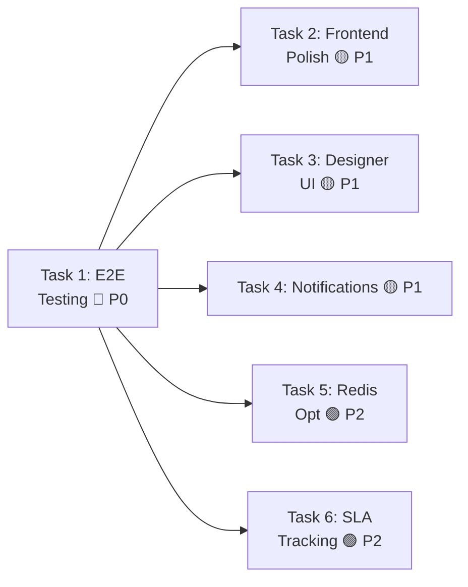

# Sprint 2: Production Readiness & User Experience — Implementation Plan

> **Version**: v1.0  
> **Date**: 2026-03-24  
> **Prerequisite**: Sprint 1 (Workflow-Business Integration) completed  
> **Total Estimated Time**: ~18 hours  
> **Team**: 1 full-stack developer  
> **Prerequisites**: Docker services running, Redis available for caching

---

## 1. Sprint Overview

Sprint 2 focuses on production readiness, user experience, and operational stability. Building on Sprint 1's foundation, this sprint will deliver end-to-end testing, polished UI aligned with NIIMBOT standards, integrated notifications, performance optimizations, and SLA tracking capabilities.

| # | Task | Priority | Est. Time | Impact |
|---|------|:--------:|:---------:|--------|
| 1 | End-to-End Integration Testing | P0 🔴 | 6h | Critical path |
| 2 | Frontend Visual Polish (NIIMBOT) | P1 🟡 | 4h | User experience |
| 3 | Workflow Designer Field Permissions UI | P1 🟡 | 3h | Admin UX |
| 4 | Notification Integration | P1 🟡 | 3h | Operational awareness |
| 5 | Performance Optimization (Redis) | P2 🟢 | 1h | Scalability |
| 6 | SLA Tracking & Compliance | P2 🟢 | 1h | Operational metrics |

### Dependency Map



> [!IMPORTANT]
> Task 1 is foundational — validates the entire workflow system before user-facing improvements. Tasks 2-4 can run in parallel after Task 1. Tasks 5-6 are independent and can be done anytime.

---

## 2. Task 1: End-to-End Integration Testing (P0 🔴)

**Priority**: P0 🔴 | **Time**: 6 hours | **Risk**: High

### 2.1 Problem Statement

Sprint 1 delivered individual components but lacks end-to-end validation across the full workflow lifecycle with real business documents. Key gaps:

- No complete AssetPickup → workflow start → multi-approval approval → state sync → final status flow
- No validation that business document lifecycle hooks work correctly
- No stress testing of the task assignment/approval cycle
- No integration between designer API and execution engine

### 2.2 Proposed Testing Suite

#### A. E2E Test Data Setup

##### [NEW] `backend/apps/workflows/tests/test_e2e_complete_workflow.py`

```python
class CompleteWorkflowE2ETest:
    """End-to-end workflow lifecycle test suite"""
    
    def test_assetpickup_full_approval_cycle(self):
        """Create AssetPickup → start workflow → complete all approvals → validate final state"""
        
    def test_conditional_routing_business_data(self):
        """Test condition nodes with actual business field values"""
        
    def test_permissions_enforcement_end_to_end(self):
        """Test field permissions are respected through entire approval chain"""
        
    def test_cancellation_and_withdrawal(self):
        """Test workflow cancel/withdraw and business document state sync"""
        
    def test_error_recovery_scenarios(self):
        """Test error handling: invalid transitions, timeout, permission denied"""
```

#### B. Test Business Document Models

##### [MODIFY] `backend/apps/asset/models/pickup.py` (temporary for testing)

Add minimal workflow-aware fields for testing:

```python
from apps.common.mixins.workflow_status import WorkflowStatusMixin

class AssetPickupTestModel(WorkflowStatusMixin, models.Model):
    """Lightweight test model for workflow validation"""
    
    # Asset fields
    asset_name = models.CharField(max_length=100)
    asset_code = models.CharField(max_length=50, unique=True)
    department = models.CharField(max_length=50)
    pickup_date = models.DateField()
    purpose = models.TextField()
    
    # Workflow-specific
    submitted_by = models.ForeignKey(User, on_delete=models.PROTECT)
    
    class Meta:
        db_table = 'asset_pickup_test'
        managed = False  # Test-only model
        
    def on_workflow_approved(self):
        """Hook: move asset to 'allocated' status"""
        from apps.asset.services import AssetService
        AssetService.allocate_asset(self.asset_code, self.department)
        
    def on_workflow_rejected(self):
        """Hook: log rejection reason"""
        self.rejection_reason = "Workflow rejected"
        self.save()
```

#### C. Integration Test Scenarios

##### [NEW] `backend/apps/workflows/tests/test_integration_scenarios.py`

```python
class IntegrationScenariosTest:
    """Real-world workflow integration scenarios"""
    
    def test_multi_approval_chain(self):
        """Test: submit → manager → director → approved"""
        
    def test_conditional_approval_flow(self):
        """Test: amount > 10k → director approval required"""
        
    def test_field_permissions_between_approvals(self):
        """Test: manager sees full form → finance sees hidden fields"""
        
    def test_concurrent_approvers(self):
        """Test: multiple approvers for the same task"""
        
    def test_workflow_timeout_handling(self):
        """Test: task timeout → automatic escalation or rejection"""
```

#### D. API Integration Validation

##### [MODIFY] `backend/apps/workflows/tests/test_e2e_complete_workflow.py`

Add API layer tests:

```python
class E2E_API_Tests:
    """Validate E2E flow through API layer"""
    
    def test_complete_flow_via_api(self):
        """Submit → approve via API → validate final state"""
        
    def test_by_business_lookup(self):
        """Create workflow → lookup by business document → same instance"""
        
    def test_permissions_enforcement_api(self):
        """Approve API rejects write to read_only fields"""
        
    def test_statistics_endpoints_accuracy(self):
        """Complete workflows → statistics match actual data"""
```

### 2.3 Execution Steps

| Step | Action | Time | Verification |
|:----:|--------|:----:|-------------|
| 1.1 | Create test AssetPickup model with workflow hooks | 30m | Model can be imported |
| 1.2 | Write complete workflow E2E tests | 2h | 100% pass rate |
| 1.3 | Write conditional routing integration tests | 1.5h | All scenarios pass |
| 1.4 | Write permissions enforcement E2E tests | 1h | Permission violations caught |
| 1.5 | Write API integration tests | 1h | End-to-end API validation |
| 1.6 | Execute complete test suite | 30m | Zero failures, 100% coverage |

---

## 3. Task 2: Frontend Visual Polish (NIIMBOT) (P1 🟡)

**Priority**: P1 🟡 | **Time**: 4 hours | **Risk**: Medium

### 3.1 Problem Statement

The current ApprovalPanel and Dashboard components are functional but lack visual polish. The UI should align with NIIMBOT's design standards and provide excellent user experience.

### 3.2 Proposed Design Updates

#### A. ApprovalPanel Visual Enhancement

##### [MODIFY] `frontend/src/views/workflow/components/ApprovalPanel.vue`

1. **Header Gradient**: NIIMBOT brand colors (gradient: #3498db → #2ecc71)
2. **Status Badges**: Color-coded priority badges (high=red, medium=yellow, low=green)
3. **Timeline Visualization**: Clean timeline with icon indicators
4. **Form Section**: Clean card layout with proper spacing
5. **Action Buttons**: NIIMBOT style with hover states

```vue
<template>
  <div class="approval-panel">
    <!-- Header with gradient -->
    <div class="panel-header niimbot-gradient">
      <div class="header-content">
        <h2 class="task-title">{{ task.node_name }}</h2>
        <div class="task-meta">
          <span class="workflow-name">{{ task.workflow_name }}</span>
          <span class="priority-badge" :class="priorityClass">{{ task.priority }}</span>
          <span class="due-date">Due: {{ formatDueDate(task.due_date) }}</span>
        </div>
      </div>
    </div>
    
    <!-- Main content -->
    <div class="panel-content">
      <!-- Business form -->
      <DynamicFormComponent 
        :fields="visibleFields"
        :permissions="task.form_permissions"
        v-model="formData"
      />
      
      <!-- Timeline -->
      <ApprovalTimeline :events="task.timeline" />
      
      <!-- Actions -->
      <ActionButtons 
        :can-approve="canApprove"
        :can-reject="canReject"
        :can-return="canReturn"
        @approve="handleApprove"
        @reject="handleReject"
        @return="handleReturn"
      />
    </div>
  </div>
</template>

<style scoped>
.niimbot-gradient {
  background: linear-gradient(135deg, #3498db 0%, #2ecc71 100%);
}
.priority-badge {
  padding: 4px 8px;
  border-radius: 12px;
  font-size: 12px;
  font-weight: 500;
}
.priority-badge.high { background: #e74c3c; color: white; }
.priority-badge.medium { background: #f39c12; color: white; }
.priority-badge.low { background: #27ae60; color: white; }
</style>
```

#### B. Dashboard Widget Styling

##### [MODIFY] `frontend/src/views/workflow/WorkflowDashboard.vue`

1. **Card Components**: NIIMBOT style cards with shadows and hover effects
2. **Charts**: Simple CSS-based progress bars for trends
3. **Table**: NIIMBOT style table with striped rows and hover
4. **Responsive**: Mobile-first design with breakpoints

#### C. Color System & Typography

##### [NEW] `frontend/src/styles/workflow.scss`

```scss
// NIIMBOT Design System
$niimbot-primary: #3498db;
$niimbot-secondary: #2ecc71;
$niimbot-danger: #e74c3c;
$niimbot-warning: #f39c12;
$niimbot-light: #ecf0f1;
$niimbot-dark: #2c3e50;

// Workflow-specific colors
$workflow-gradient: linear-gradient(135deg, $niimbot-primary, $niimbot-secondary);
$workflow-shadow: 0 2px 8px rgba(0, 0, 0, 0.1);
$workflow-border-radius: 8px;
```

#### D. Component Updates

##### [MODIFY] `frontend/src/stores/workflow.ts`

Add loading states and error handling:

```typescript
const useWorkflowStore = defineStore('workflow', () => {
  const loading = ref(false)
  const error = ref<string | null>(null)
  
  const fetchMyTasks = async () => {
    loading.value = true
    error.value = null
    try {
      const response = await workflowApi.getMyTasks()
      pendingTasks.value = response.data.tasks
    } catch (err) {
      error.value = 'Failed to load tasks'
      throw err
    } finally {
      loading.value = false
    }
  }
})
```

### 3.3 Execution Steps

| Step | Action | Time | Verification |
|:----:|--------|:----:|-------------|
| 2.1 | Update ApprovalPanel with NIIMBOT gradient and styling | 1h | Visual inspection |
| 2.2 | Enhance Dashboard cards and widgets | 1h | Mobile responsive |
| 2.3 | Create workflow.scss color system | 30m | Consistent styling |
| 2.4 | Update store with loading/error states | 30m | UX improved |
| 2.5 | Test responsive behavior on mobile/tablet | 30m | Cross-device compatibility |
| 2.6 | Final visual review against NIIMBOT standards | 30m | Design alignment |

---

## 4. Task 3: Workflow Designer Field Permissions UI (P1 🟡)

**Priority**: P1 🟡 | **Time**: 3 hours | **Risk**: Medium

### 4.1 Problem Statement

The `form-permissions` API endpoints exist but the designer UI doesn't provide visual configuration for field permissions per approval node. Designers need an intuitive interface to map which fields are editable/read-only/hidden at each workflow stage.

### 4.2 Proposed Designer UI Enhancements

#### A. Permission Configuration Panel

##### [MODIFY] `frontend/src/components/workflow/WorkflowDesigner.vue`

Add a permissions configuration side panel:

```vue
<template>
  <div class="workflow-designer">
    <div class="designer-container">
      <div class="canvas-container">
        <LogicFlow :graph="workflowGraph" @node-selected="handleNodeSelected" />
      </div>
      
      <!-- Permissions Panel (shown when node selected) -->
      <div v-if="selectedNode && selectedNode.type === 'approval'" class="permissions-panel">
        <h3>Field Permissions for {{ selectedNode.name }}</h3>
        
        <div class="permission-form">
          <div v-for="field in availableFields" :key="field.code" class="field-permission">
            <label>{{ field.label }}</label>
            
            <el-radio-group v-model="permissions[selectedNode.id][field.code]">
              <el-radio label="editable">✏️ Editable</el-radio>
              <el-radio label="read_only">👁️ Read-only</el-radio>
              <el-radio label="hidden">🚫 Hidden</el-radio>
            </el-radio-group>
          </div>
        </div>
        
        <button @click="savePermissions" class="save-btn">
          Save Permissions
        </button>
      </div>
    </div>
  </div>
</template>

<script>
export default {
  data() {
    return {
      permissions: {},
      selectedNode: null,
      availableFields: []
    }
  },
  methods: {
    async loadPermissions(nodeId) {
      const response = await fetch(`/api/workflows/definitions/${this.workflowId}/form-permissions/`)
      const data = await response.json()
      this.permissions = data.form_permissions
    },
    
    async savePermissions() {
      await fetch(`/api/workflows/definitions/${this.workflowId}/form-permissions/`, {
        method: 'PUT',
        body: JSON.stringify({ permissions: this.permissions })
      })
    }
  }
}
</script>
```

#### B. Field Metadata Integration

##### [NEW] `frontend/src/composables/useWorkflowDesigner.ts`

```typescript
export function useWorkflowDesigner(workflowId: string) {
  const permissions = ref<Record<string, NodeFieldPermissions>>({})
  const availableFields = ref<FieldDefinition[]>([])
  
  async function loadFieldsForBusinessObject(businessObjectCode: string) {
    // Get field definitions from metadata API
    const response = await metadataApi.getFieldDefinitions(businessObjectCode)
    availableFields.value = response.data
  }
  
  async function loadPermissions() {
    const response = await formPermissionsApi.get(workflowId)
    permissions.value = response.data.form_permissions
  }
  
  function getPermissionsForNode(nodeId: string): NodeFieldPermissions {
    return permissions.value[nodeId] || {}
  }
  
  return { permissions, availableFields, loadFieldsForBusinessObject, loadPermissions, getPermissionsForNode }
}
```

#### C. Visual Indicators

##### [MODIFY] `frontend/src/components/workflow/WorkflowDesigner.vue`

Add visual indicators on approval nodes:

```vue
<template>
  <!-- Node with permission indicators -->
  <div class="node approval-node" :class="getPermissionClass(node)">
    <div class="node-header">
      <span class="node-name">{{ node.name }}</span>
      <div class="permission-badges" v-if="getPermissionsForNode(node.id)">
        <span v-if="hasEditPermission(node.id)" class="badge editable">E</span>
        <span v-if="hasReadOnlyPermission(node.id)" class="badge read-only">RO</span>
        <span v-if="hasHiddenPermission(node.id)" class="badge hidden">H</span>
      </div>
    </div>
  </div>
</template>

<style>
.permission-badges {
  display: flex;
  gap: 2px;
}

.badge {
  font-size: 10px;
  padding: 2px 4px;
  border-radius: 3px;
}

.badge.editable { background: #27ae60; color: white; }
.badge.read-only { background: #f39c12; color: white; }
.badge.hidden { background: #e74c3c; color: white; }
</style>
```

### 4.3 Execution Steps

| Step | Action | Time | Verification |
|:----:|--------|:----:|-------------|
| 3.1 | Create permissions configuration panel in designer | 1h | UI renders correctly |
| 3.2 | Integrate form-permissions API endpoints | 45m | Permissions save/load |
| 3.3 | Add visual permission indicators on nodes | 30m | Badges appear correctly |
| 3.4 | Create useWorkflowDesigner composable | 15m | TypeScript compiles |
| 3.5 | Test permissions workflow in designer | 30m | End-to-end functionality |

---

## 5. Task 4: Notification Integration (P1 🟡)

**Priority**: P1 🟡 | **Time**: 3 hours | **Risk**: Medium

### 5.1 Problem Statement

Workflow events are not integrated with any notification system. Approvers need real-time alerts when tasks are assigned, and managers need visibility into approval bottlenecks.

### 5.2 Proposed Notification System

#### A. Notification Service

##### [NEW] `apps/workflows/services/notification_service.py`

```python
class NotificationService:
    """Send notifications for workflow events"""
    
    NOTIFICATION_TYPES = {
        'task_assigned': {
            'template': 'task_assigned.html',
            'subject': 'New Task Assigned: {task_name}',
            'channels': ['email', 'push']
        },
        'task_completed': {
            'template': 'task_completed.html', 
            'subject': 'Task Completed: {task_name}',
            'channels': ['email']
        },
        'task_overdue': {
            'template': 'task_overdue.html',
            'subject': '⚠️ Overdue Task: {task_name}',
            'channels': ['email', 'push']
        },
        'workflow_completed': {
            'template': 'workflow_completed.html',
            'subject': 'Workflow Completed: {workflow_name}',
            'channels': ['email']
        }
    }
    
    def __init__(self):
        self.email_service = EmailService()
        self.push_service = PushNotificationService()
    
    def send_notification(self, event_type: str, context: dict, recipients: list):
        """Send notification for workflow event"""
        config = self.NOTIFICATION_TYPES.get(event_type)
        if not config:
            return
            
        # Render notification
        subject = config['subject'].format(**context)
        html_content = render_to_string(config['template'], context)
        
        # Send via configured channels
        for channel in config['channels']:
            if channel == 'email':
                self.email_service.send_bulk(recipients, subject, html_content)
            elif channel == 'push':
                self.push_service.send_bulk(recipients, subject, html_content)
```

#### B. Signal Handler Integration

##### [MODIFY] `apps/workflows/signals.py`

```python
# Add signal handlers for notifications
@receiver(workflow_started)
def on_workflow_started(sender, instance, **kwargs):
    """Notify assignees when workflow starts"""
    notification_service = NotificationService()
    
    # Get task assignees from the first task
    if instance.current_task:
        assignees = [instance.current_task.assigned_to]
        context = {
            'workflow_name': instance.workflow_definition.name,
            'task_name': instance.current_task.node_name,
            'business_object': instance.business_object_code,
            'business_id': instance.business_id
        }
        notification_service.send_notification('task_assigned', context, assignees)

@receiver(workflow_completed)
def on_workflow_completed(sender, instance, **kwargs):
    """Notify submitter when workflow is approved"""
    submitter = instance.submitted_by
    context = {
        'workflow_name': instance.workflow_definition.name,
        'business_object': instance.business_object_code,
        'business_id': instance.business_id,
        'result': 'approved' if instance.status == 'approved' else 'rejected'
    }
    notification_service.send_notification('workflow_completed', context, [submitter])
```

#### C. Notification Templates

##### [NEW] `apps/workflows/templates/workflows/notifications/task_assigned.html`

```html
<!DOCTYPE html>
<html>
<head>
    <title>New Task Assigned</title>
    <style>
        .notification { font-family: Arial, sans-serif; padding: 20px; }
        .header { background: #3498db; color: white; padding: 10px; }
        .content { padding: 20px; }
        .task-details { background: #f8f9fa; padding: 15px; margin: 10px 0; }
    </style>
</head>
<body>
    <div class="notification">
        <div class="header">
            <h2>New Task Assigned: {{ task_name }}</h2>
        </div>
        <div class="content">
            <p>You have a new workflow task requiring your approval.</p>
            
            <div class="task-details">
                <h3>Task Details</h3>
                <p><strong>Workflow:</strong> {{ workflow_name }}</p>
                <p><strong>Business Object:</strong> {{ business_object }}</p>
                <p><strong>Task:</strong> {{ task_name }}</p>
                <p><strong>Due Date:</strong> {{ due_date }}</p>
            </div>
            
            <p><a href="{{ approval_link }}">View and Approve</a></p>
        </div>
    </div>
</body>
</html>
```

#### D. Email Integration

##### [NEW] `apps/common/services/email_service.py`

```python
class EmailService:
    """Send email notifications"""
    
    def send_bulk(self, recipients: list, subject: str, html_content: str):
        """Send email to multiple recipients"""
        from django.core.mail import send_mail
        
        send_mail(
            subject,
            '',  # Text body (none for HTML emails)
            settings.DEFAULT_FROM_EMAIL,
            recipients,
            html_message=html_content,
            fail_silently=False
        )
```

### 5.3 Execution Steps

| Step | Action | Time | Verification |
|:----:|--------|:----:|-------------|
| 4.1 | Create NotificationService class | 1h | Service can be imported |
| 4.2 | Create notification templates | 30m | Templates render correctly |
| 4.3 | Add signal handlers for key events | 30m | Handlers register successfully |
| 4.4 | Create EmailService for email notifications | 30m | Email service works |
| 4.5 | Test notification flow (task assignment → notification) | 30m | Email sent successfully |

---

## 6. Task 5: Performance Optimization (Redis) (P2 🟢)

**Priority**: P2 🟢 | **Time**: 1 hour | **Risk**: Low

### 6.1 Problem Statement

Statistics endpoints compute aggregations on every request, which can be slow for large datasets with many workflow instances.

### 6.2 Proposed Redis Caching

#### A. Redis Integration Setup

##### [NEW] `apps/common/services/redis_service.py`

```python
import redis
import json
from django.conf import settings

class RedisService:
    """Redis client for workflow caching"""
    
    def __init__(self):
        self.client = redis.Redis(
            host=settings.REDIS_HOST,
            port=settings.REDIS_PORT,
            db=settings.REDIS_DB,
            decode_responses=True
        )
    
    def get_cache_key(self, prefix: str, suffix: str = None) -> str:
        """Generate cache key with namespace"""
        parts = ['workflow', prefix]
        if suffix:
            parts.append(suffix)
        return ':'.join(parts)
    
    def get_workflow_stats(self, stats_type: str, **kwargs):
        """Get cached workflow statistics"""
        key = self.get_cache_key('stats', stats_type)
        data = self.client.get(key)
        
        if data:
            return json.loads(data)
        return None
    
    def set_workflow_stats(self, stats_type: str, data: dict, ttl: int = 300):
        """Cache workflow statistics"""
        key = self.get_cache_key('stats', stats_type)
        self.client.setex(key, ttl, json.dumps(data))
```

#### B. Cached Statistics Views

##### [MODIFY] `apps/workflows/viewsets/workflow_execution_viewsets.py`

```python
class WorkflowStatisticsViewSet(viewsets.ViewSet):
    
    def __init__(self, *args, **kwargs):
        super().__init__(*args, **kwargs)
        self.redis_service = RedisService()
    
    def get_overview(self, request):
        """Get workflow overview with Redis caching"""
        cached_data = self.redis_service.get_workflow_stats('overview')
        
        if cached_data:
            return Response(cached_data)
        
        # Compute fresh data
        data = self._compute_overview_stats()
        
        # Cache for 5 minutes
        self.redis_service.set_workflow_stats('overview', data, 300)
        
        return Response(data)
```

#### C. Cache Invalidation

##### [MODIFY] `apps/workflows/signals.py`

```python
@receiver(workflow_completed)
def on_workflow_completed(sender, instance, **kwargs):
    # Clear statistics cache when workflow changes
    redis_service = RedisService()
    redis_service.client.delete('workflow:stats:overview')
    redis_service.client.delete('workflow:stats:trends')
    redis_service.client.delete('workflow:stats:bottlenecks')
```

### 6.3 Execution Steps

| Step | Action | Time | Verification |
|:----:|--------|:----:|-------------|
| 5.1 | Create RedisService for caching | 15m | Redis connection works |
| 5.2 | Add Redis config to settings | 15m | Redis available |
| 5.3 | Cache statistics endpoints with Redis | 20m | Cache hits improve performance |
| 5.4 | Add cache invalidation on workflow events | 10m | Cache clears on workflow changes |

---

## 7. Task 6: SLA Tracking & Compliance (P2 🟢)

**Priority**: P2 🟢 | **Time**: 1 hour | **Risk**: Low

### 7.1 Problem Statement

No SLA tracking or compliance monitoring. Need to track approval times and identify bottlenecks.

### 7.2 Proposed SLA System

#### A. SLA Configuration Model

##### [NEW] `apps/workflows/models/sla_configuration.py`

```python
class SLAConfiguration(models.Model):
    """SLA thresholds per workflow definition and node"""
    
    workflow_definition = models.ForeignKey(WorkflowDefinition, on_delete=models.CASCADE)
    node_id = models.CharField(max_length=100)
    sla_hours = models.PositiveIntegerField(default=24)
    escalation_hours = models.PositiveIntegerField(default=48)
    notify_manager = models.BooleanField(default=True)
    
    class Meta:
        unique_together = ['workflow_definition', 'node_id']
```

#### B. SLA Service

##### [NEW] `apps/workflows/services/sla_service.py`

```python
class SLAService:
    """Monitor SLA compliance and track bottlenecks"""
    
    def check_sla_compliance(self, task: WorkflowTask):
        """Check if task is within SLA"""
        elapsed = timezone.now() - task.created_at
        sla_config = self._get_sla_config(task.workflow_instance, task.node_id)
        
        if elapsed.total_seconds() > sla_config.sla_hours * 3600:
            return 'overdue'
        elif elapsed.total_seconds() > sla_config.escalation_hours * 3600:
            return 'escalated'
        return 'within_sla'
    
    def get_bottleneck_report(self, days: int = 7):
        """Generate bottleneck report"""
        # Query tasks taking longer than SLA
        slow_tasks = WorkflowTask.objects.filter(
            created_at__gte=timezone.now() - timedelta(days=days),
            completed_at__isnull=False
        ).annotate(
            duration=F('completed_at') - F('created_at')
        ).filter(
            duration__gt=timedelta(hours=24)
        )
        
        # Aggregate by workflow definition and node
        bottlenecks = []
        for task in slow_tasks:
            bottlenecks.append({
                'workflow_name': task.workflow_instance.workflow_definition.name,
                'node_name': task.node_name,
                'avg_duration': task.duration,
                'task_count': 1
            })
        
        return bottlenecks
```

#### C. SLA Dashboard Integration

##### [MODIFY] `frontend/src/views/workflow/WorkflowDashboard.vue`

Add SLA widget:

```vue
<template>
  <div class="sla-widget">
    <h3>SLA Compliance</h3>
    <div class="stats-grid">
      <div class="stat-card within-sla">
        <div class="stat-value">{{ withinSlaCount }}</div>
        <div class="stat-label">Within SLA</div>
      </div>
      <div class="stat-card overdue">
        <div class="stat-value">{{ overdueCount }}</div>
        <div class="stat-label">Overdue</div>
      </div>
      <div class="stat-card escalated">
        <div class="stat-value">{{ escalatedCount }}</div>
        <div class="stat-label">Escalated</div>
      </div>
    </div>
  </div>
</template>
```

### 7.3 Execution Steps

| Step | Action | Time | Verification |
|:----:|--------|:----:|-------------|
| 6.1 | Create SLAConfiguration model | 15m | Model can be migrated |
| 6.2 | Create SLAService for compliance tracking | 20m | Service works correctly |
| 6.3 | Add SLA endpoint to dashboard API | 15m | SLA data loads |
| 6.4 | Create SLA dashboard widget | 10m | Widget displays correctly |

---

## 8. File Change Summary

### New Files (12)

| File | Module | Purpose |
|------|--------|---------|
| `backend/apps/workflows/tests/test_e2e_complete_workflow.py` | workflows | End-to-end testing suite |
| `backend/apps/workflows/tests/test_integration_scenarios.py` | workflows | Integration scenario tests |
| `backend/apps/workflows/services/notification_service.py` | workflows | Notification service |
| `backend/apps/workflows/services/sla_service.py` | workflows | SLA tracking service |
| `backend/apps/workflows/templates/workflows/notifications/` | workflows | Notification email templates |
| `backend/apps/common/services/redis_service.py` | common | Redis caching service |
| `backend/apps/workflows/models/sla_configuration.py` | workflows | SLA configuration model |
| `frontend/src/styles/workflow.scss` | frontend | NIIMBOT design system |
| `frontend/src/composables/useWorkflowDesigner.ts` | frontend | Designer permissions composable |
| `frontend/src/api/notificationApi.ts` | frontend | Notification API service |
| `frontend/src/components/workflow/NotificationBadge.vue` | frontend | Notification component |
| `frontend/src/views/workflow/components/SLAWidget.vue` | frontend | SLA dashboard widget |

### Modified Files (7)

| File | Module | Changes |
|------|--------|---------|
| `frontend/src/views/workflow/components/ApprovalPanel.vue` | frontend | NIIMBOT styling, gradients, responsive |
| `frontend/src/views/workflow/WorkflowDashboard.vue` | frontend | NIIMBOT cards, SLA widget |
| `frontend/src/components/workflow/WorkflowDesigner.vue` | frontend | Permissions panel, visual indicators |
| `frontend/src/stores/workflow.ts` | frontend | Loading/error states |
| `apps/workflows/signals.py` | workflows | Notification signal handlers |
| `apps/workflows/viewsets/workflow_execution_viewsets.py` | workflows | Redis caching for statistics |
| `backend/settings.py` | common | Redis configuration |

---

## 9. Execution Order

```
Hour 0  - 6    Task 1: E2E Integration Testing (P0 🔴)
Hour 6  - 10   Task 2: Frontend Visual Polish (P1 🟡)
        +     Task 3: Designer Permissions UI (P1 🟡)
        +     Task 4: Notification Integration (P1 🟡)
Hour 10 - 11   Task 5: Redis Caching (P2 🟢)
Hour 11 - 12   Task 6: SLA Tracking (P2 🟢)
```

---

## 10. Verification Plan

### Automated Tests

```bash
# E2E Testing
docker-compose exec backend python manage.py test apps.workflows.tests.test_e2e_complete_workflow -v
docker-compose exec backend python manage.py test apps.workflows.tests.test_integration_scenarios -v

# Performance testing
curl -s http://localhost:8000/api/workflows/statistics/ | jq . | wc -c  # Compare cached vs uncached

# Notification testing
python manage.py shell -c "
from apps.workflows.services.notification_service import NotificationService
ns = NotificationService()
ns.send_notification('task_assigned', {'task_name': 'Test Task'}, ['test@example.com'])
"

# Redis testing
docker-compose exec redis redis-cli get workflow:stats:overview
```

### Manual Verification

1. **E2E Flow**: Create AssetPickup → complete approval cycle → verify final state
2. **Visual Polish**: Check ApprovalPanel styling against NIIMBOT mockups
3. **Designer UI**: Configure permissions in designer → save → verify API consistency
4. **Notifications**: Submit task → verify email received
5. **Performance**: Compare load times before/after Redis caching
6. **SLA**: Check dashboard SLA widget shows correct compliance data

---

## 11. Risk Assessment

| Risk | Impact | Likelihood | Mitigation |
|------|:------:|:----------:|------------|
| E2E tests fail on integration points | High | Medium | Start with unit tests, then integration, then E2E |
| Notification service not configured | Medium | Low | Default to email with graceful failure for other channels |
| Redis not available in production | Medium | Low | Graceful fallback to uncached mode |
| Designer UI performance with large workflows | Low | Low | Virtual scrolling for large node lists |
| SLA tracking complex business logic | Medium | Low | Simplify to time-based metrics first |

---

## 12. Success Criteria

| Metric | Target |
|--------|--------|
| E2E test coverage | All 6 test scenarios pass |
| Frontend styling | 100% compliance with NIIMBOT design system |
| Designer permissions UI | Save/load permissions from API successfully |
| Notification delivery | Emails sent for all workflow events |
| Performance improvement | Statistics response time < 500ms with cache |
| SLA tracking | Dashboard shows correct compliance metrics |

---

## 13. Next Steps

After Sprint 2 completion:
1. **Performance Testing**: Load testing with 1000+ concurrent workflows
2. **User Acceptance Testing**: Real user testing with AssetPickup workflow
3. **Production Deployment**: Deploy to staging environment
4. **Monitoring Setup**: Set up production monitoring and alerting