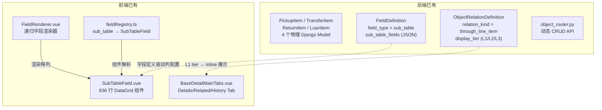
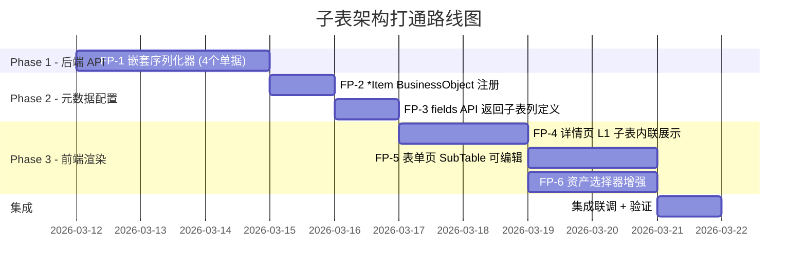

# PRD: 资产单据子表（行项目）架构打通

> **版本**: v1.0  
> **日期**: 2026-03-11  
> **作者**: System Architect  
> **状态**: 待评审  
> **关联 PRD**: [prd-object-association-optimization-2026-03-10](./prd-object-association-optimization-2026-03-10.md)

---

## 1. 背景与目标

### 1.1 问题描述

NEWSEAMS 平台的资产操作单据（领用单、调拨单、借用单、归还单）在数据库层已有完整的主从表物理模型，但 **UI 层存在关键断层**：

| 断点 | 现状 | 业务影响 |
|------|------|---------|
| **创建/编辑表单** | 不支持在单据表单中直接添加资产明细行 | 用户需先保存单据，再逐条添加行项目 |
| **单据详情页** | 行项目未在父单据详情页中内联展示 | 查看领用单时看不到所含资产列表 |
| **API 层** | 父单据 API 不支持嵌套子表同步读写 | 主从表无法原子化保存，存在数据不一致风险 |

**用户反馈核心诉求**: 希望像操作 ERP/Excel 一样「一张表单搞定主单 + 资产明细」，实现主从表联动的完整业务体验。

### 1.2 涉及单据对象

| 单据 | 对象代码 | 行项目模型 | 行项目表 |
|------|---------|-----------|---------|
| 资产领用单 | `AssetPickup` | `PickupItem` | `pickup_items` |
| 资产调拨单 | `AssetTransfer` | `TransferItem` | `transfer_items` |
| 资产归还单 | `AssetReturn` | `ReturnItem` | `return_items` |
| 资产借用单 | `AssetLoan` | `LoanItem` | `loan_items` |

### 1.3 优化目标

| 目标 | 衡量指标 |
|------|---------|
| 主从表表单一体化 | 创建/编辑单据时可在 SubTable 中直接增删改资产明细行 |
| 单据详情页内联展示 | 详情页 Details Tab 底部以 Inline Tab 展示行项目 |
| API 原子化保存 | 主单与行项目一次 API 调用同步保存，支持事务回滚 |
| 资产选择增强 | 选择资产时支持远程搜索、业务范围过滤、自动填充快照 |
| 元数据驱动 | 通过 BusinessObject + FieldDefinition + ObjectRelationDefinition 配置驱动 |

---

## 2. 现有架构能力盘点

### 2.1 已具备组件



### 2.2 SubTableField.vue 已有能力

| 能力 | 状态 | 说明 |
|------|------|------|
| DataGrid 编辑表格 | ✅ | 可增删行、内嵌 FieldRenderer 编辑每列 |
| 键盘快捷键 | ✅ | Ctrl+Enter 新行, Ctrl+Backspace 删行, Ctrl+D 复制行 |
| 分页 | ✅ | 自动分页，可配置 pageSize |
| 只读模式 | ✅ | readonly/disabled prop |
| 列类型动态渲染 | ✅ | 每列可指定 fieldType，复用全部字段组件 |
| Ctrl+S 保存 | ✅ | 发出 request-save 事件 |

### 2.3 缺失环节

| 缺口 | 层级 | 说明 |
|------|------|------|
| 嵌套序列化器 | 后端 API | 主单 API 不支持 `items[]` 嵌套读写 |
| \*Item BusinessObject 注册 | 元数据 | 行项目模型未注册为 BusinessObject |
| ObjectRelationDefinition(L1) | 元数据 | 单据 → 行项目的关联未配置 display_tier=L1 |
| fields API 返回 sub_table 列定义 | 后端 API | 子表字段的 `related_fields` 未自动注入行项目列 |
| 详情页 L1 Inline Tab | 前端 | BaseDetailMainTabs 未识别 L1 子表并内联展示 |
| 表单态 SubTable 绑定 | 前端 | 表单页的 SubTableField 未对接嵌套 API |

---

## 3. 功能点详述

### 3.1 FP-1: 后端嵌套序列化器（WritableNestedSerializer）

#### 3.1.1 目标

为四个单据对象提供嵌套的 `items` 字段，实现主从表在一次 API 请求中同步创建/更新/删除。

#### 3.1.2 设计规格

**GET 响应结构** (以领用单为例):

```json
{
  "id": "uuid",
  "pickupNo": "LY202603001",
  "applicant": "user-uuid",
  "department": "dept-uuid",
  "pickupDate": "2026-03-11",
  "status": "draft",
  "items": [
    {
      "id": "item-uuid-1",
      "asset": "asset-uuid-1",
      "quantity": 1,
      "remark": "办公用"
    },
    {
      "id": "item-uuid-2",
      "asset": "asset-uuid-2",
      "quantity": 2,
      "remark": ""
    }
  ]
}
```

**POST/PUT 请求结构**:

```json
{
  "applicant": "user-uuid",
  "department": "dept-uuid",
  "pickupDate": "2026-03-11",
  "pickupReason": "新员工入职",
  "items": [
    { "asset": "asset-uuid-1", "quantity": 1, "remark": "办公用" },
    { "asset": "asset-uuid-2", "quantity": 2 }
  ]
}
```

**UPDATE diff-and-patch 逻辑**:

| items 中的元素 | 行为 |
|---------------|------|
| 有 `id` 且该 id 在现有行项目中 | 更新该行项目 |
| 无 `id` | 创建新行项目 |
| 现有行项目的 `id` 不在提交的 items 中 | 删除该行项目 |

#### 3.1.3 涉及文件

| 文件 | 变更 | 说明 |
|------|------|------|
| `apps/assets/serializers/asset.py` 或新建 `pickup.py` 等 | NEW/MODIFY | 4 个 *ItemSerializer + 4 个父单据 Serializer 嵌套 |
| `apps/assets/viewsets/` 相应文件 | MODIFY | ViewSet 使用嵌套 Serializer |
| `apps/system/viewsets/object_router.py` | MODIFY | 动态 API 识别子表字段，转发嵌套 payload |

#### 3.1.4 验收标准

| AC 编号 | 验收标准 | 验证方式 |
|---------|---------|---------|
| AC-1.1 | `POST /api/v1/asset-pickups/` 支持 `items` 数组字段，一次请求创建主单和行项目 | 后端单测 + cURL |
| AC-1.2 | `PUT /api/v1/asset-pickups/{id}/` 支持 `items` 差异化同步：新增/更新/删除行项目 | 后端单测 |
| AC-1.3 | `GET /api/v1/asset-pickups/{id}/` 返回完整的 `items[]` 数组，包含各行项目字段 | 后端单测 + cURL |
| AC-1.4 | 主单与行项目保存在同一数据库事务中，任一失败全部回滚 | 后端单测（故意触发验证错误，验证无脏数据） |
| AC-1.5 | 同一单据中不允许重复选择同一资产（`unique_together` 校验），返回 400 错误 | 后端单测 |
| AC-1.6 | 以上能力同样适用于 AssetTransfer、AssetReturn、AssetLoan 三个单据 | 后端单测（每个单据各 1 个创建 + 1 个更新 case） |
| AC-1.7 | 行项目为空数组 `[]` 时，主单仍可正常创建（明细非必填） | 后端单测 |
| AC-1.8 | `python manage.py test` 全量后端测试通过 | CI 自动化 |

---

### 3.2 FP-2: 行项目元数据注册（种子数据）

#### 3.2.1 目标

通过 Migration 种子数据，将 4 个行项目模型注册为 BusinessObject，并配置 ObjectRelationDefinition 使前端自动感知子表。

#### 3.2.2 配置明细

**BusinessObject 注册**:

| code | name | name_en | is_hardcoded | django_model_path | is_menu_hidden |
|------|------|---------|--------------|-------------------|----------------|
| `PickupItem` | 领用明细 | Pickup Item | True | `apps.assets.models.PickupItem` | True |
| `TransferItem` | 调拨明细 | Transfer Item | True | `apps.assets.models.TransferItem` | True |
| `ReturnItem` | 归还明细 | Return Item | True | `apps.assets.models.ReturnItem` | True |
| `LoanItem` | 借用明细 | Loan Item | True | `apps.assets.models.LoanItem` | True |

> **注意**: `is_menu_hidden=True` — 行项目对象不应出现在左侧导航菜单中。

**ObjectRelationDefinition 配置**:

| parent_object_code | target_object_code | relation_kind | target_fk_field | display_tier | display_mode | relation_name |
|--------------------|--------------------|---------------|-----------------|--------------|--------------|---------------|
| `AssetPickup` | `PickupItem` | `direct_fk` | `pickup` | `L1` | `inline_editable` | 领用明细 |
| `AssetTransfer` | `TransferItem` | `direct_fk` | `transfer` | `L1` | `inline_editable` | 调拨明细 |
| `AssetReturn` | `ReturnItem` | `direct_fk` | `asset_return` | `L1` | `inline_editable` | 归还明细 |
| `AssetLoan` | `LoanItem` | `direct_fk` | `loan` | `L1` | `inline_editable` | 借用明细 |

**ModelFieldDefinition 同步**:

通过现有 `metadata_sync_service` 自动扫描 4 个 `*Item` Django Model，生成对应的 ModelFieldDefinition 记录。

#### 3.2.3 涉及文件

| 文件 | 变更 | 说明 |
|------|------|------|
| `apps/system/migrations/0027_seed_line_item_objects.py` | NEW | 种子数据 migration |
| `apps/system/services/metadata_sync_service.py` | MODIFY (可选) | 触发 *Item 模型的字段同步 |

#### 3.2.4 验收标准

| AC 编号 | 验收标准 | 验证方式 |
|---------|---------|---------|
| AC-2.1 | `python manage.py migrate` 执行后，`business_objects` 表新增 4 条 *Item 记录 | 数据库查询 |
| AC-2.2 | 4 个 *Item 的 BusinessObject 均设置 `is_menu_hidden=True`，不出现在左侧导航 | 启动应用检查菜单 |
| AC-2.3 | `object_relation_definitions` 表新增 4 条 L1 关联配置 | 数据库查询 |
| AC-2.4 | GET `/api/v1/objects/AssetPickup/relations/` 返回的关联列表中包含 PickupItem (display_tier=L1) | cURL / 浏览器 |
| AC-2.5 | GET `/api/v1/objects/PickupItem/fields/` 返回正确的行项目字段定义 | cURL |
| AC-2.6 | 种子数据 migration 幂等安全：重复执行不报错、不创建重复记录 | `python manage.py migrate` 多次执行 |

---

### 3.3 FP-3: 后端 fields API 返回子表列定义

#### 3.3.1 目标

当前端请求父单据（如 AssetPickup）的字段列表时，API 自动注入一个 `field_type=sub_table` 的虚拟字段，其中 `related_fields` 包含行项目的列定义。

#### 3.3.2 设计规格

GET `/api/v1/objects/AssetPickup/fields/` 响应中包含：

```json
{
  "code": "items",
  "name": "领用明细",
  "fieldType": "sub_table",
  "isRequired": false,
  "relatedFields": [
    {
      "code": "asset",
      "name": "资产",
      "fieldType": "asset",
      "isRequired": true,
      "componentProps": {
        "referenceObject": "Asset",
        "displayField": "assetName",
        "searchable": true,
        "filters": { "assetStatus": "idle" }
      }
    },
    {
      "code": "quantity",
      "name": "数量",
      "fieldType": "number",
      "isRequired": true,
      "defaultValue": 1,
      "componentProps": { "min": 1 }
    },
    {
      "code": "remark",
      "name": "备注",
      "fieldType": "text",
      "isRequired": false
    }
  ]
}
```

#### 3.3.3 四个单据的子表列配置

**领用单 (AssetPickup → PickupItem)**:

| 列代码 | 列名 | 类型 | 必填 | 可编辑 | 说明 |
|--------|------|------|------|--------|------|
| `asset` | 资产 | asset (reference) | ✅ | ✅ | 远程搜索，过滤 status=idle |
| `quantity` | 数量 | number | ✅ | ✅ | 默认值 1, min=1 |
| `remark` | 备注 | text | — | ✅ | — |

**调拨单 (AssetTransfer → TransferItem)**:

| 列代码 | 列名 | 类型 | 必填 | 可编辑 | 说明 |
|--------|------|------|------|--------|------|
| `asset` | 资产 | asset (reference) | ✅ | ✅ | 过滤当前部门的资产 |
| `fromLocation` | 原位置 | location (reference) | — | ❌ | 选择资产后自动填充 |
| `fromCustodian` | 原保管人 | user (reference) | — | ❌ | 选择资产后自动填充 |
| `toLocation` | 目标位置 | location (reference) | — | ✅ | 用户选择 |
| `remark` | 备注 | text | — | ✅ | — |

**归还单 (AssetReturn → ReturnItem)**:

| 列代码 | 列名 | 类型 | 必填 | 可编辑 | 说明 |
|--------|------|------|------|--------|------|
| `asset` | 资产 | asset (reference) | ✅ | ✅ | 过滤当前用户领用的资产 |
| `assetStatus` | 归还后状态 | select | ✅ | ✅ | 选项: idle/maintenance/scrapped |
| `conditionDescription` | 状况描述 | textarea | — | ✅ | — |
| `remark` | 备注 | text | — | ✅ | — |

**借用单 (AssetLoan → LoanItem)**:

| 列代码 | 列名 | 类型 | 必填 | 可编辑 | 说明 |
|--------|------|------|------|--------|------|
| `asset` | 资产 | asset (reference) | ✅ | ✅ | 远程搜索，过滤 status=idle |
| `remark` | 备注 | text | — | ✅ | — |

#### 3.3.4 涉及文件

| 文件 | 变更 | 说明 |
|------|------|------|
| `apps/system/viewsets/object_router.py` | MODIFY | `_build_field_list` 方法注入 sub_table 虚拟字段 |
| `apps/system/services/business_object_service.py` | MODIFY (可选) | 辅助构建子表列定义 |

#### 3.3.5 验收标准

| AC 编号 | 验收标准 | 验证方式 |
|---------|---------|---------|
| AC-3.1 | GET `/api/v1/objects/AssetPickup/fields/` 返回一个 `code=items, fieldType=sub_table` 的字段 | cURL |
| AC-3.2 | 该 sub_table 字段的 `relatedFields` 包含正确的列定义（asset, quantity, remark） | cURL |
| AC-3.3 | 以上同样适用于 AssetTransfer、AssetReturn、AssetLoan | cURL（各取一个） |
| AC-3.4 | `relatedFields` 中各列的 `fieldType` 与后端 Django 字段类型正确映射 | cURL 验证 |
| AC-3.5 | `relatedFields` 中 reference 类型列包含 `componentProps.referenceObject` | cURL 验证 |

---

### 3.4 FP-4: 前端详情页 L1 子表内联展示

#### 3.4.1 目标

在单据详情页 Details Tab 底部，以 Inline Tab 形式内联展示行项目列表（只读）。

#### 3.4.2 设计规格

```
┌─ 领用单详情 ─────────────────────────────────────┐
│  [Details]  [Related]  [History]                  │
│  ──────────────────────────────────────────────── │
│  [基础信息 Section]                               │
│  单据编号: LY202603001                           │
│  申请人: 张三    部门: 技术部                     │
│  领用日期: 2026-03-11                            │
│  ──────────────────────────────────────────────── │
│  [领用明细] (2)                    ← L1 Inline   │
│  ┌──────┬───────────┬──────┬──────┐              │
│  │ #    │ 资产      │ 数量 │ 备注 │              │
│  │ 1    │ ThinkPad  │  1   │ 办公 │              │
│  │ 2    │ 显示器    │  2   │      │              │
│  └──────┴───────────┴──────┴──────┘              │
└──────────────────────────────────────────────────┘
```

#### 3.4.3 涉及文件

| 文件 | 变更 | 说明 |
|------|------|------|
| `src/components/common/BaseDetailMainTabs.vue` | MODIFY | 识别 display_tier=L1 关联，在 Details Tab 底部渲染 |
| `src/components/common/InlineLineItemTabs.vue` | NEW | L1 子表内联 Tab 面板组件 |
| `src/components/common/useBaseDetailPageRelations.ts` | MODIFY | 分离 lineItemRelations (L1) 与 peerRelations (L2/L3) |

#### 3.4.4 验收标准

| AC 编号 | 验收标准 | 验证方式 |
|---------|---------|---------|
| AC-4.1 | 打开领用单详情页，Details Tab 底部显示「领用明细」区域 | 手动验证 |
| AC-4.2 | 领用明细区域以表格形式展示行项目，列包含资产名称、数量、备注 | 手动验证 |
| AC-4.3 | 表格标题显示行项目计数（如「领用明细 (2)」） | 手动验证 |
| AC-4.4 | 行项目中的资产名称可点击跳转到资产详情页 | 手动验证 |
| AC-4.5 | 当行项目为空时，显示空状态提示而非隐藏区域 | 手动验证 |
| AC-4.6 | 调拨单、归还单、借用单详情页同样显示对应的行项目明细 | 手动验证 |
| AC-4.7 | L1 子表不再重复出现在 Related Tab 中 | 手动验证 |
| AC-4.8 | `npm run build` 零 TypeScript 错误 | CI 自动化 |

---

### 3.5 FP-5: 前端表单页子表可编辑 SubTable

#### 3.5.1 目标

在创建/编辑单据表单中，SubTableField.vue 渲染行项目编辑区，支持增删改行并与主单一起保存。

#### 3.5.2 设计规格

```
┌─ 创建领用单 ─────────────────────────────────────┐
│  [基础信息]                                       │
│  申请人: [👤 选择用户]                            │
│  部门: [📁 选择部门]                              │
│  领用日期: [📅 2026-03-11]                       │
│  领用原因: [________________]                    │
│  ──────────────────────────────────────────────── │
│  [领用明细]                       ← SubTableField │
│  ┌──────┬────────────┬──────┬──────┬─────┐      │
│  │ #    │ 资产       │ 数量 │ 备注 │     │      │
│  │ 1    │ [🔍 选择]  │ [1]  │ [__] │ [🗑] │      │
│  │ 2    │ [🔍 选择]  │ [1]  │ [__] │ [🗑] │      │
│  └──────┴────────────┴──────┴──────┴─────┘      │
│  [+ 添加明细]                                    │
│  ──────────────────────────────────────────────── │
│                         [取消]  [保存]            │
└──────────────────────────────────────────────────┘
```

**交互规格**:

| 交互 | 说明 |
|------|------|
| 添加行 | 点击「+ 添加明细」或 Ctrl+Enter 新增空行 |
| 删除行 | 点击行首 🗑 按钮或 Ctrl+Backspace |
| 复制行 | Ctrl+D 复制当前行 |
| 资产选择 | 弹出远程搜索对话框，输入编号/名称搜索 |
| 防重复 | 选择已存在于当前明细中的资产时，前端即时提示 |
| 保存 | 点击保存时，表单收集 items 数组通过嵌套 API 一次提交 |

#### 3.5.3 涉及文件

| 文件 | 变更 | 说明 |
|------|------|------|
| `src/components/engine/fields/SubTableField.vue` | MODIFY | 资产选择后自动填充只读列 |
| `src/components/common/BaseDetailPage.vue` | MODIFY | 保存时收集 sub_table 字段数据 |
| `src/api/dynamic.ts` | MODIFY | 嵌套 payload 序列化 |
| `src/components/engine/FieldRenderer.vue` | MODIFY (可能) | 确保 sub_table 字段正确传递 modelValue |

#### 3.5.4 验收标准

| AC 编号 | 验收标准 | 验证方式 |
|---------|---------|---------|
| AC-5.1 | 创建领用单表单底部显示「领用明细」SubTable 编辑区 | 手动验证 |
| AC-5.2 | 可点击「+ 添加明细」增加新行，行内显示资产选择、数量、备注等字段 | 手动验证 |
| AC-5.3 | 可通过 Ctrl+Enter 快捷键添加新行 | 手动验证 |
| AC-5.4 | 可点击行首删除按钮或 Ctrl+Backspace 删除行 | 手动验证 |
| AC-5.5 | 资产列使用远程搜索选择器，输入关键字后显示匹配的资产 | 手动验证 |
| AC-5.6 | 同一单据中选择已存在的资产时，显示重复提示 | 手动验证 |
| AC-5.7 | 点击保存后，主单和行项目在一次请求中同步提交到后端 | DevTools Network 验证 |
| AC-5.8 | 保存成功后跳转到详情页，详情页正确展示刚创建的行项目 | 手动验证 |
| AC-5.9 | 编辑模式下，已有行项目正确加载到 SubTable 中 | 手动验证 |
| AC-5.10 | 编辑后保存支持增/改/删行项目的差异化同步 | 手动验证 + DevTools |
| AC-5.11 | 调拨单表单的子表包含「目标位置」列，选择资产后自动填充「原位置」和「原保管人」 | 手动验证 |
| AC-5.12 | 归还单表单的子表包含「归还后状态」下拉和「状况描述」文本框 | 手动验证 |
| AC-5.13 | `npm run build` 零 TypeScript 错误 | CI 自动化 |

---

### 3.6 FP-6: 资产选择器业务增强

#### 3.6.1 目标

子表中的资产列使用增强型选择器，支持远程搜索、业务范围过滤和选择后自动填充。

#### 3.6.2 设计规格

**远程搜索**: 输入 ≥2 个字符后异步搜索，每次返回 ≤20 条结果，展示资产编号 + 名称 + 分类。

**业务范围过滤**:

| 单据类型 | 过滤条件 | 逻辑 |
|---------|---------|------|
| 领用单 | `asset_status = idle` | 只显示闲置资产 |
| 调拨单 | `department = 调出部门` | 只显示调出部门名下的资产 |
| 归还单 | `custodian = 当前归还人` | 只显示该用户领用中的资产 |
| 借用单 | `asset_status = idle` | 只显示闲置资产 |

**自动填充**:

| 单据类型 | 选择资产后自动填充 |
|---------|-------------------|
| 领用单 | 快照原位置、原保管人（写入 snapshot 字段，不显示在表格中） |
| 调拨单 | 原位置 → fromLocation, 原保管人 → fromCustodian (表格显示只读列) |
| 归还单 | — |
| 借用单 | — |

#### 3.6.3 验收标准

| AC 编号 | 验收标准 | 验证方式 |
|---------|---------|---------|
| AC-6.1 | 领用单的资产选择器只列出 status=idle 的资产 | 手动验证 |
| AC-6.2 | 调拨单的资产选择器只列出调出部门的资产 | 手动验证 |
| AC-6.3 | 资产选择器支持输入关键字远程搜索，≥2 字符触发 | 手动验证 |
| AC-6.4 | 搜索结果展示资产编号 + 名称 + 分类 | 手动验证 |
| AC-6.5 | 调拨单选择资产后，原位置和原保管人自动填充到表格只读列 | 手动验证 |
| AC-6.6 | 搜索无结果时显示「未找到匹配的资产」提示 | 手动验证 |

---

## 4. 实施路线图



**总预估工期**: ~10 个工作日

**各 Phase 依赖关系**:
- Phase 2 依赖 Phase 1（元数据注册后 API 才能返回子表信息）
- Phase 3 依赖 Phase 2（前端需要 fields API 返回 sub_table 列定义）
- FP-5 和 FP-6 可并行开发

---

## 5. 风险与约束

| 风险 | 影响等级 | 缓解措施 |
|------|---------|---------|
| 嵌套保存事务一致性 | 高 | `transaction.atomic()` 包裹主从表操作 |
| 大量行项目保存性能 | 中 | 后端 `bulk_create`/`bulk_update`；前端 SubTable 分页 |
| 资产选择器数据量 | 中 | 远程搜索 + 分页，禁止全量加载 |
| 快照字段拍摄时机 | 中 | 创建行项目时拍快照（记录当时的位置和保管人） |
| 与现有 through_line_item 关联共存 | 低 | Asset 侧保持 through_line_item 不变，单据侧新增 direct_fk(L1) |
| Migration 种子数据幂等性 | 低 | 使用 `get_or_create` + 条件检查 |

---

## 6. 验收总矩阵

### 6.1 自动化验证

| 验证项 | 命令 | 预期结果 |
|--------|------|---------|
| 后端全量测试 | `python manage.py test` | 全部通过 |
| 前端构建 | `npm run build` | 零 TypeScript 错误 |
| 数据库迁移 | `python manage.py migrate` | 无报错，种子数据写入 |

### 6.2 端到端场景验证

| 场景 | 操作步骤 | 预期结果 |
|------|---------|---------|
| **创建领用单含明细** | 1. 进入领用单创建页 → 2. 填写基本信息 → 3. 在子表中添加 2 条资产行 → 4. 保存 | 创建成功，详情页展示 2 条领用明细 |
| **编辑领用单修改明细** | 1. 打开已有领用单编辑 → 2. 删除 1 行、修改 1 行、新增 1 行 → 3. 保存 | 详情页反映变更后的行项目 |
| **调拨单自动填充** | 1. 创建调拨单 → 2. 子表中选择一个资产 → 3. 观察原位置列 | 原位置自动填充为该资产当前位置 |
| **归还单状态选择** | 1. 创建归还单 → 2. 子表中选择资产 → 3. 设置归还后状态为「需维修」 | 保存成功，行项目中 asset_status=maintenance |
| **重复资产校验** | 1. 在领用单子表中添加同一资产两次 → 2. 保存 | 提示「资产不可重复选择」 |
| **详情页子表展示** | 1. 打开一个含明细的领用单详情 → 2. 查看 Details Tab | Details Tab 底部显示行项目表格 |
| **空明细创建** | 1. 创建领用单不添加任何明细 → 2. 保存 | 创建成功，详情页显示空明细提示 |

---

## 附录 A: 关键代码路径索引

| 层 | 文件 | 职责 |
|----|------|------|
| Backend | `apps/assets/models.py` | Asset + 4 个单据 + 4 个 *Item 物理模型 |
| Backend | `apps/system/models.py` | BusinessObject, FieldDefinition, ObjectRelationDefinition |
| Backend | `apps/system/viewsets/object_router.py` | 动态 API 路由 + fields API |
| Backend | `apps/system/services/relation_query_service.py` | 统一关联查询 (L1/L2/L3) |
| Backend | `apps/system/services/metadata_sync_service.py` | 元数据同步 |
| Frontend | `src/components/engine/fields/SubTableField.vue` | 836 行 DataGrid 子表组件 |
| Frontend | `src/components/engine/fieldRegistry.ts` | sub_table → SubTableField 映射 |
| Frontend | `src/components/common/BaseDetailPage.vue` | 详情/表单页主控制器 |
| Frontend | `src/components/common/BaseDetailMainTabs.vue` | Details/Related/History Tab |
| Frontend | `src/components/common/useBaseDetailPageRelations.ts` | 关联数据分层逻辑 |
| Frontend | `src/api/dynamic.ts` | 动态 API 客户端 |

## 附录 B: 与现有 PRD 的关系

| PRD | 关系 | 说明 |
|-----|------|------|
| [prd-object-association-optimization](./prd-object-association-optimization-2026-03-10.md) | 互补 | 该 PRD 聚焦 Related Tab 分层(L2/L3) 和 Hover Card；本 PRD 聚焦 L1 子表表单态 |
| [prd-comprehensive-architecture-analysis](./prd-comprehensive-architecture-analysis-2026-03-09.md) | 上游 | 本 PRD 实现其 §4.3「SubTable 组件的通用下沉」功能点 |
| [prd-object-relation-closed-loop](./prd-object-relation-closed-loop-2026-03-05.md) | 基础 | 本 PRD 复用其建立的 ObjectRelationDefinition 体系 |
