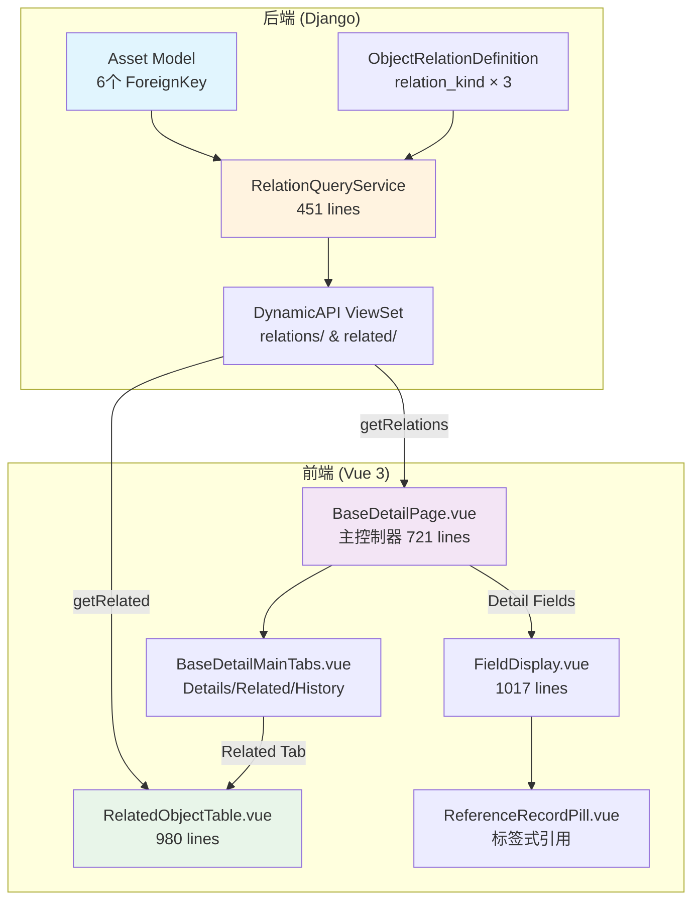
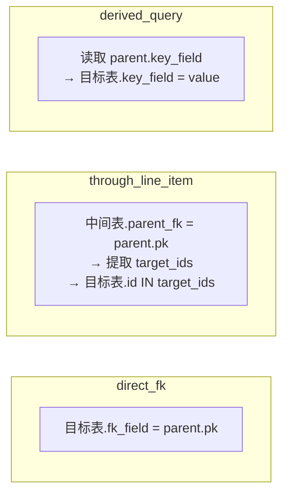
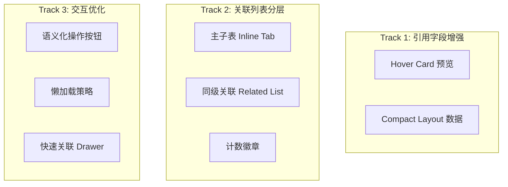

# PRD: 主从对象关联方法与关联显示优化

> **版本**: v1.0  
> **日期**: 2026-03-10  
> **作者**: System Architect  
> **状态**: 待评审

---

## 1. 背景与目标

### 1.1 问题描述

NEWSEAMS 平台当前已实现了基本的对象关联体系，包括：
- **正向引用 (Forward Reference)**: 资产 → 地址(Location)、供应商(Supplier)、部门(Department) 等
- **反向关联 (Reverse Relations)**: 资产 ← 领用单(AssetPickup)、调拨单(AssetTransfer)、借用单(AssetLoan) 等
- **穿透关联 (Through Relations)**: 通过行项目表(PickupItem/TransferItem)建立的间接关联

但在**实际业务使用**中，当前效果存在以下不足：

1. **正向引用字段**仅显示为 `ReferenceRecordPill`（名称标签），无法快速预览关联对象的关键信息
2. **反向关联列表**展示过于扁平，缺乏业务上下文（如资产的领用记录与维保记录展示方式完全相同）
3. **主子表关系**（如领用单 → 领用明细）与同级对象关联混为一谈，没有体现层级差异
4. **关联计数**不直观，无法在详情页快速感知"这台资产有几条领用记录"
5. **关联操作**缺乏业务语义，仅提供通用"新建"按钮

### 1.2 优化目标

参考 Salesforce 的 Related List / Lookup / Master-Detail 模式，实现：

| 目标 | 衡量指标 |
|------|---------|
| 正向引用字段可快速预览 | 悬浮显示关联对象的 Compact Layout 摘要 |
| 反向关联列表分层展示 | 按业务语义分组并显示计数徽章 |
| 主子表紧耦合显示 | 详情页内 Tab 直接展示明细行项目 |
| 关联操作语义化 | "添加领用" / "创建维保" 替代通用"新建" |
| 性能可控 | 关联列表懒加载，非活动 Tab 不请求 |

---

## 2. 现状架构分析

### 2.1 全栈关联架构纵览



### 2.2 后端关联模型

#### 2.2.1 Asset 正向引用 (ForeignKey)

| 字段 | 目标模型 | on_delete | 业务含义 |
|------|---------|-----------|---------|
| `asset_category` | AssetCategory | PROTECT | 资产分类 |
| `supplier` | Supplier | SET_NULL | 供应商 |
| `location` | Location | SET_NULL | 存放地址 |
| `department` | Department | SET_NULL | 使用部门 |
| `custodian` | User | SET_NULL | 保管人 |
| `user` | User | SET_NULL | 实际使用人 |

#### 2.2.2 Asset 反向关联 (related_name)

| 来源模型 | related_name | 关联类型 | 业务含义 |
|----------|-------------|---------|---------|
| AssetStatusLog | `status_logs` | direct_fk | 状态变更日志 |
| PickupItem | `pickup_items` | through_line_item | 领用明细 |
| TransferItem | `transfer_items` | through_line_item | 调拨明细 |
| ReturnItem | `return_items` | through_line_item | 归还明细 |
| LoanItem | `loan_items` | through_line_item | 借用明细 |
| Maintenance | (lifecycle) | direct_fk | 维保记录 |
| InventoryItem | (inventory) | direct_fk | 盘点条目 |
| InsuredAsset | (insurance) | direct_fk | 保险记录 |

#### 2.2.3 RelationQueryService 三种关联查询策略



### 2.3 前端关联渲染链路

#### 2.3.1 正向引用字段渲染

```
DetailField(type=reference)
  → FieldRenderer.vue (line 161: isReferenceDisplay)
    → FieldDisplay.vue (line 48: isReferenceDisplay)
      → ReferenceRecordPill.vue
        - label: 引用对象的 name 字段
        - secondary: 引用对象的 code 字段
        - href: /objects/{objectCode}/{id}
        - 异步水合: referenceResolver.resolveMany()
```

**当前效果**: 仅显示一个可点击的 Pill 标签，如 `[📎 总部大楼 A1-301]`

**问题**: 
- 无法看到引用对象的其他关键字段（如地址的楼层、房间类型；供应商的联系电话）
- 点击后跳转离开当前页面，打断操作流

#### 2.3.2 反向关联列表渲染

```
BaseDetailPage.vue
  └─ watch(objectCode) → fetchRuntimeRelations()
       └─ dynamicApi.getRelations(objectCode) → runtimeRelations[]
  └─ BaseDetailMainTabs.vue
       └─ "Related" Tab
            └─ groupedReverseRelationSections (按 group_key 分组)
                 └─ 可折叠的分组面板
                      └─ RelatedObjectTable.vue (每个 relation 一个实例)
                           └─ loadRelatedListModel() → 列定义
                           └─ fetchRecords() → 分页数据
                           └─ FieldRenderer → 每个单元格
```

**当前效果**: Related Tab 下按 group_key（业务单据/流程/财务等）分组，每组下面是折叠面板内嵌列表表格。

**问题**:
1. **所有关联等权展示** — 领用明细(through 关系)和维保记录(direct 关系)用完全相同的 UI 卡片
2. **分组键全靠推断** — `_infer_relation_group_key()` 基于字符串匹配，不可干预
3. **无关联计数预览** — 进入 Related Tab 前无法知道每种关联有多少条
4. **全量加载** — Related Tab 一次挂载所有 `RelatedObjectTable`，即使未展开的分组也发起请求
5. **操作按钮语义不足** — "新建"需要上下文理解，不如"添加领用"直观

---

## 3. 优化方案

### 3.1 方案总览



---

### 3.2 Track 1: 正向引用字段增强 — Hover Card 预览

#### 3.2.1 目标

鼠标悬浮在引用字段（如 "存放地址"、"供应商"）上时，弹出浮层显示关联对象的关键字段摘要，类似 Salesforce 的 Hover Detail。

#### 3.2.2 涉及文件变更

| 文件 | 变更类型 | 说明 |
|------|---------|------|
| `ReferenceRecordPill.vue` | MODIFY | 添加 hover 触发逻辑，加载 Compact Layout 数据 |
| `ReferenceHoverCard.vue` | NEW | 新建悬浮预览卡片组件 |
| `dynamic.ts` | MODIFY | 新增 `getCompactDetail()` API 方法 |
| `object_router.py` | MODIFY | 新增 `compact/` endpoint 返回紧凑字段 |

#### 3.2.3 设计规格

```
┌─────────────────────────────────┐
│  📎 总部大楼 A1-301              │  ← ReferenceRecordPill (existing)
│  ┌───────────────────────────┐  │
│  │  存放地址详情               │  │  ← ReferenceHoverCard (new)
│  │  ─────────────────────────│  │
│  │  名称: 总部大楼 A1-301     │  │
│  │  楼层类型: 房间 (Room)     │  │
│  │  完整路径: 总部 > A栋 > 3F  │  │
│  │  ─────────────────────────│  │
│  │  [查看详情]  [编辑]         │  │
│  └───────────────────────────┘  │
└─────────────────────────────────┘
```

#### 3.2.4 数据获取策略

- **延迟加载**: hover 300ms 后才发起请求，移出取消
- **缓存**: 同一 session 内同一 `objectCode + recordId` 只请求一次
- **Compact Layout**: 后端根据对象的 Compact Layout 配置返回 ≤6 个摘要字段

---

### 3.3 Track 2: 反向关联列表分层展示

#### 3.3.1 目标

根据 `relation_kind` 和业务语义将关联列表分为三个层级，给予不同的 UI 权重。

#### 3.3.2 三层展示模型

| 层级 | 关联类型 | UI 位置 | 示例 |
|------|---------|---------|------|
| **L1 — 主子明细** | `through_line_item` | 详情页 Details Tab 底部内嵌 | 领用明细行项目、调拨明细行项目 |
| **L2 — 业务关联** | `direct_fk` (高频) | Related Tab 顶部，默认展开 | 维保记录、状态变更日志 |
| **L3 — 扩展关联** | `direct_fk` (低频) / `derived_query` | Related Tab 折叠分组 | 保险记录、财务凭证 |

#### 3.3.3 L1 主子表 — Inline Tab 设计

对于 `through_line_item` 类的关联（主单 → 明细行），在 Details Tab **底部**新增子表 Tab 面板，而非放入 Related Tab。

```
┌─ Details Tab ───────────────────────────────┐
│  [基础信息 Section]                           │
│  [财务信息 Section]                           │
│  ──────────────────────────────────────────  │
│  ┌─ 明细行项目 ──────────────────────────┐   │
│  │  领用明细 (3)  │  调拨明细 (1)  │       │   │
│  │  ┌─────────────────────────────────┐  │   │
│  │  │ 资产编号 │ 资产名称 │ 数量 │ 备注│  │   │
│  │  │ ZC001   │ ThinkPad │  1  │     │  │   │
│  │  │ ZC002   │ 显示器   │  2  │     │  │   │
│  │  └─────────────────────────────────┘  │   │
│  │  [+ 添加明细]                          │   │
│  └───────────────────────────────────────┘   │
└─────────────────────────────────────────────┘
```

涉及文件变更:

| 文件 | 变更类型 | 说明 |
|------|---------|------|
| `BaseDetailMainTabs.vue` | MODIFY | Details Tab 底部渲染 L1 子表 |
| `useBaseDetailPageRelations.ts` | MODIFY | 分离 `lineItemRelations` 与 `peerRelations` |
| `InlineLineItemTabs.vue` | NEW | 新建 L1 主子表内嵌组件 |
| `ObjectRelationDefinition` | MODIFY | 新增 `display_tier` 字段 (L1/L2/L3) |

#### 3.3.4 L2/L3 Business Related Lists — 计数徽章

在 Related Tab 的分组标题上显示该分组下所有关联的**记录总数**，让用户在不展开分组的情况下快速了解关联数据量。

```
┌─ Related Tab ───────────────────────────────┐
│                                              │
│  ▼ 业务单据 (12)                              │
│  ┌───────────────────────────────────────┐   │
│  │ 📋 维保记录 (5)        [+ 创建维保]     │   │
│  │ ┌────────────────────────────────┐    │   │
│  │ │  <table: 5 rows>              │    │   │
│  │ └────────────────────────────────┘    │   │
│  │ 📋 状态变更日志 (7)     [查看全部]      │   │
│  │ ┌────────────────────────────────┐    │   │
│  │ │  <table: 3 rows, +4 more>     │    │   │
│  │ └────────────────────────────────┘    │   │
│  └───────────────────────────────────────┘   │
│                                              │
│  ▶ 财务 (2)                                   │
│  ▶ 保险 (0)                                   │
│  ▶ 盘点库存 (8)                               │
└─────────────────────────────────────────────┘
```

涉及文件变更:

| 文件 | 变更类型 | 说明 |
|------|---------|------|
| `dynamic.ts` | MODIFY | 新增 `getRelationCounts()` 批量返回各关联计数 |
| `object_router.py` | MODIFY | 新增 `relation-counts/` 端点 |
| `RelationQueryService` | MODIFY | 新增 `count_relations()` 方法 |
| `BaseDetailMainTabs.vue` | MODIFY | 分组标题显示聚合计数 |
| `DetailRelatedManager.vue` | MODIFY | 每个 RelatedObjectTable 标题带单独计数 |

---

### 3.4 Track 3: 交互与性能优化

#### 3.4.1 语义化操作按钮

根据 `ObjectRelationDefinition.extra_config` 中可新增 `action_label_i18n` 配置，替换通用 "新建" 按钮：

| 原始按钮 | 优化后 | 配置方式 |
|---------|-------|---------|
| `+ 新建` (对维保记录) | `+ 创建维保工单` | `extra_config.action_label_i18n` |
| `+ 新建` (对领用明细) | `+ 添加资产` | `extra_config.action_label_i18n` |
| `+ 新建` (对状态日志) | 无按钮 (只读) | `display_mode = inline_readonly` |

涉及文件变更:

| 文件 | 变更类型 | 说明 |
|------|---------|------|
| `RelatedObjectTable.vue` | MODIFY | 读取 `action_label_i18n` 配置渲染按钮文本 |
| `relation_query_service.py` | MODIFY | `list_relations` 返回 `action_label` 字段 |
| 相关 migration | NEW | 填充 action_label 种子数据 |

#### 3.4.2 懒加载策略 (Lazy Loading)

**当前问题**: Related Tab 挂载时，所有分组（即使未展开）的 `RelatedObjectTable` 都会发送 `fetchRecords()` 请求。

**优化方案**: 

```typescript
// RelatedObjectTable.vue - 新增 prop
interface RelatedObjectTableProps {
  // ... existing props
  deferInitialFetch?: boolean  // 当 true 时，不在 mount 时立即加载
}

// 配合 DetailRelatedManager.vue 中的展开状态
// 未展开的分组传递 deferInitialFetch=true
// 展开时 watch isExpanded → fetchRecords()
```

涉及文件变更:

| 文件 | 变更类型 | 说明 |
|------|---------|------|
| `RelatedObjectTable.vue` | MODIFY | 新增 `deferInitialFetch` prop，控制初始请求时机 |
| `BaseDetailMainTabs.vue` | MODIFY | 未展开分组传递 `deferInitialFetch=true` |
| `DetailRelatedManager.vue` | MODIFY | 同上 |

#### 3.4.3 快速关联 Drawer

点击"查看详情"时，不跳转页面，而是在右侧滑出 Drawer 展示关联记录的详情。

```
┌─ 资产详情页 ────────────┬─── Drawer ─────────────┐
│                         │  维保工单 WB202603001    │
│  [资产基础信息]           │  ──────────────────────  │
│  [相关列表]              │  状态: 进行中            │
│                         │  维保类型: 预防性维护     │
│  维保记录 (5)            │  计划日期: 2026-03-15    │
│  ┌──────────────────┐   │  负责人: 张三             │
│  │ WB001 ← 点击行    │   │  ──────────────────────  │
│  │ WB002             │   │  [编辑]  [关闭]          │
│  └──────────────────┘   │                          │
└─────────────────────────┴──────────────────────────┘
```

涉及文件变更:

| 文件 | 变更类型 | 说明 |
|------|---------|------|
| `RelatedRecordDrawer.vue` | NEW | 新建右侧滑出详情抽屉组件 |
| `RelatedObjectTable.vue` | MODIFY | `record-click` 事件改为打开 Drawer 而非路由跳转 |
| `BaseDetailMainTabs.vue` | MODIFY | 挂载 `RelatedRecordDrawer` |

---

## 4. 具体业务场景映射

### 4.1 资产卡片详情页 (Asset Detail)

以资产为核心对象，优化前后对比：

#### 优化前

```
[Details Tab]
  - 基础信息 Section (asset_name, asset_code, ...)
  - 财务信息 Section (purchase_price, ...)
  - 使用信息 Section
    - location: [📎 总部大楼 A1-301]     ← 仅 Pill
    - supplier: [📎 联想科技]              ← 仅 Pill
    - department: [📎 技术部]              ← 仅 Pill

[Related Tab]
  ▼ 业务单据
    📋 领用明细 (3)   → RelatedObjectTable
    📋 调拨明细 (1)   → RelatedObjectTable  
    📋 归还明细 (0)   → RelatedObjectTable
    📋 借用明细 (2)   → RelatedObjectTable
  ▼ 流程协同 ...
  ▼ 财务 ...
```

#### 优化后

```
[Details Tab]
  - 基础信息 Section
  - 财务信息 Section
  - 使用信息 Section
    - location: [📎 总部大楼 A1-301] → hover 显示完整路径+楼层类型
    - supplier: [📎 联想科技]        → hover 显示联系人+电话+地址
    - department: [📎 技术部]        → hover 显示部门编码+负责人
  ─────────────────────────────
  [明细行项目 Inline Tabs]           ← L1 主子表
    领用明细(3) | 调拨明细(1) | 归还明细(0) | 借用明细(2)
    <inline editable table>

[Related Tab]  (仅 L2/L3)
  ▼ 业务单据 (12)                    ← 带计数徽章
    📋 维保记录 (5)   [+ 创建维保]    ← 语义化按钮
    📋 状态日志 (7)   (只读)
  ▶ 财务 (2)                         ← 未展开，不加载
  ▶ 保险 (0)                         ← 显示为空，跳过
  ▶ 盘点库存 (8)

[History Tab]
  (不变)
```

### 4.2 领用单详情页 (AssetPickup Detail)

| 区域 | 优化前 | 优化后 |
|------|-------|-------|
| 申请人字段 | `[📎 张三]` | hover 显示工号、部门、联系方式 |
| 部门字段 | `[📎 技术部]` | hover 显示部门编码、人数 |
| 领用明细 | Related Tab 里的 table | Details Tab 底部 Inline Tab，可直接增减行 |
| 审批记录 | Related Tab 里的 table | Related Tab，带审批人 hover |

---

## 5. 实施路线图

### Phase 1: 基础增强 (Sprint 1, ~4天)

| 功能点 | 工作量 | 优先级 |
|-------|-------|-------|
| 关联计数 API (`relation-counts/`) | 1d | P0 |
| Related Tab 分组计数徽章 | 0.5d | P0 |
| 关联列表懒加载 (`deferInitialFetch`) | 0.5d | P0 |
| 语义化操作按钮 (`action_label_i18n`) | 1d | P1 |
| 空关联分组折叠/隐藏策略 | 0.5d | P1 |

### Phase 2: 引用增强 (Sprint 2, ~4天)

| 功能点 | 工作量 | 优先级 |
|-------|-------|-------|
| Compact Detail API (`compact/`) | 1d | P0 |
| `ReferenceHoverCard.vue` 组件 | 1.5d | P0 |
| Hover 数据缓存层 | 0.5d | P1 |
| `ReferenceRecordPill` 集成 hover | 1d | P0 |

### Phase 3: 主子表分层 (Sprint 3, ~5天)

| 功能点 | 工作量 | 优先级 |
|-------|-------|-------|
| `display_tier` 字段 + migration | 0.5d | P0 |
| `InlineLineItemTabs.vue` 组件 | 2d | P0 |
| `useBaseDetailPageRelations` 分层逻辑 | 1d | P0 |
| `BaseDetailMainTabs` 集成 L1 子表 | 1d | P0 |
| 种子数据填充 (Asset 相关 tier 配置) | 0.5d | P1 |

### Phase 4: 交互优化 (Sprint 4, ~3天)

| 功能点 | 工作量 | 优先级 |
|-------|-------|-------|
| `RelatedRecordDrawer.vue` 组件 | 1.5d | P1 |
| 行点击打开 Drawer 而非跳转 | 0.5d | P1 |
| Drawer 内联编辑能力 | 1d | P2 |

---

## 6. 验证计划

### 6.1 自动化测试

| 测试类型 | 描述 | 命令 |
|---------|------|------|
| 后端单测 | `RelationQueryService.count_relations()` | `python manage.py test apps.system.tests.test_object_router_relations` |
| 后端单测 | Compact Detail endpoint 返回正确字段 | `python manage.py test apps.system.tests.test_object_router_runtime_and_batch_get` |
| 前端构建 | 零 TypeScript 错误 | `npm run build` |
| 前端 E2E | 资产详情页 Related Tab 分组计数 | Playwright 脚本 |

### 6.2 手动验证

1. **Hover Card**: 打开资产详情 → 悬浮 "存放地址" 字段 → 应弹出地址摘要卡片
2. **计数徽章**: 打开有关联数据的资产 → 切换到 Related Tab → 各分组标题应显示数字
3. **懒加载**: 打开 Related Tab → DevTools Network → 折叠状态的分组不应发送请求
4. **主子表**: 打开领用单详情 → Details Tab 底部应显示 "领用明细" 内嵌表格
5. **语义按钮**: 维保记录的新建按钮应显示 "创建维保工单"

---

## 7. 风险与约束

| 风险 | 影响 | 缓解措施 |
|------|------|---------|
| Hover Card 请求频率过高 | 后端压力增大 | 300ms 延迟 + LRU 缓存 + debounce |
| 主子表分层改动涉及多处 | 回归风险 | 通过 `display_tier` 字段渐进式迁移，默认值保持现有行为 |
| 历史数据无 tier 配置 | 显示异常 | 默认 tier = L2 (现有行为)，仅明确配置的改为 L1/L3 |
| 移动端适配 | Hover Card 不适用 | 移动端降级为 click 弹出模式 |

---

## 附录 A: 关键代码路径索引

| 层 | 文件 | 行数 | 职责 |
|----|------|------|------|
| Backend | `apps/assets/models.py` | 1437 | Asset + 6个操作模型定义 |
| Backend | `apps/system/services/relation_query_service.py` | 451 | 统一关联查询 |
| Backend | `apps/system/models.py` | — | `ObjectRelationDefinition` 模型 |
| Frontend | `src/components/common/BaseDetailPage.vue` | 721 | 详情页主控制器 |
| Frontend | `src/components/common/BaseDetailMainTabs.vue` | 399 | Details/Related/History 三 Tab |
| Frontend | `src/components/common/RelatedObjectTable.vue` | 980 | 关联列表渲染 |
| Frontend | `src/components/common/FieldDisplay.vue` | 1017 | 字段类型统一渲染 |
| Frontend | `src/components/common/ReferenceRecordPill.vue` | — | 引用字段标签 |
| Frontend | `src/components/common/useBaseDetailPageRelations.ts` | 144 | 关联数据组合逻辑 |
| Frontend | `src/api/dynamic.ts` | 543 | 动态 API 客户端 |
