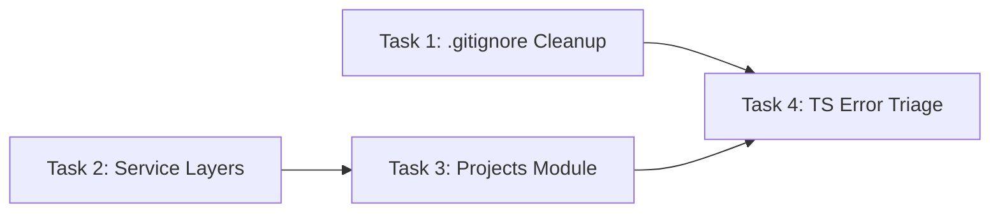

# Sprint 0: Technical Debt Cleanup — Detailed Execution Plan

> **Total Estimated Time**: ~12 hours  
> **Team**: 1 full-stack developer  
> **Prerequisites**: Docker services running (PostgreSQL + Redis), Node.js 18+  
> **Deliverables**: Cleaner repo, complete service layers, projects module online, TS errors triaged

---

## Priority & Dependency Map



> [!IMPORTANT]
> Task 1 (Cleanup) and Task 2 (Services) are independent and can run in parallel.
> Task 3 depends on Task 2 patterns. Task 4 should run last.

---

## Task 1: Root Directory Cleanup & `.gitignore` 🟢 P2

**Estimated Time**: 1.5 hours  
**Risk**: Low — cosmetic changes, no logic impact  

| Step | Action | Time | Notes |
|:----:|--------|:----:|-------|
| 1.1 | Audit root directory: list all non-essential files | 15m | `ls *.py *.spec.ts *.ps1 *.png *.json *.html *.txt` |
| 1.2 | Update `.gitignore` with comprehensive patterns | 30m | See patterns below |
| 1.3 | Update `backend/.gitignore` (if exists) or add temp patterns | 15m | Exclude `create_*.py`, `debug_*.py`, `verify_*.py`, `seed_*.py`, `*.txt` error logs |
| 1.4 | Update `frontend/.gitignore` (if exists) or add temp patterns | 15m | Exclude `fix*.cjs`, `tmp_*`, `*_errors*.txt`, `*_output*.txt` |
| 1.5 | Verify with `git status` that temp files are ignored | 15m | Confirm no temp files in tracked set |

**`.gitignore` additions** (root level):
```gitignore
# Root-level temp scripts & data
/verify_*.py
/check_*.py
/fix_*.py
/inspect_*.py
/run_*.py
/create_*.py
/*.spec.ts
/*.ps1
/cookies*.txt
/token_*.json
/login_*.json
/metadata_*.json
/git_log*.txt
/_tmp_*
/*.html
/business-object-list.png
/login-*.png
/login_page.png
/tmp-*.png
```

---

## Task 2: Add Service Layer to 4 Backend Modules 🔴 P0

**Estimated Time**: 5 hours  
**Risk**: Medium — new code, must follow `BaseCRUDService` conventions exactly  
**Reference**: [BaseCRUDService](file:///Users/abner/My_Project/HOOK_GZEAMS/backend/apps/common/services/base_crud.py), [projects/services.py](file:///Users/abner/My_Project/HOOK_GZEAMS/backend/apps/projects/services.py) (best example)

| Step | Action | Time | Notes |
|:----:|--------|:----:|-------|
| 2.1 | Read `BaseCRUDService` and `projects/services.py` for patterns | 20m | Understand inheritance API |
| 2.2 | Create `insurance/services.py` — 3 service classes | 1h | `InsuranceCompanyService`, `InsurancePolicyService`, `ClaimRecordService` |
| 2.3 | Create `leasing/services.py` — 3 service classes | 1h | `LeasingContractService`, `RentPaymentService`, `LeaseReturnService` |
| 2.4 | Create `depreciation/services.py` — 1 service class | 45m | `DepreciationService` with `run_monthly()`, `calculate_asset()` |
| 2.5 | Create `finance/services.py` — 2 service classes | 45m | `FinanceVoucherService`, `VoucherTemplateService` |
| 2.6 | Verify imports and class structure for all 4 files | 30m | `python -c "from apps.insurance.services import ..."` |

**Each service follows this template**:
```python
from apps.common.services.base_crud import BaseCRUDService
from .models import MyModel

class MyModelService(BaseCRUDService):
    def __init__(self):
        super().__init__(MyModel)

    # Business-specific methods...
```

**Service methods to implement per module**:

| Module | Service | Key Methods |
|--------|---------|-------------|
| **insurance** | `InsurancePolicyService` | `activate(policy_id)`, `cancel(policy_id)`, `get_expiring_soon(days)`, `get_dashboard_stats(org_id)` |
| **insurance** | `ClaimRecordService` | `approve(claim_id, amount)`, `reject(claim_id)`, `record_settlement(claim_id, data)`, `close(claim_id)` |
| **leasing** | `LeasingContractService` | `activate(contract_id)`, `terminate(contract_id)`, `get_expiring_contracts(days)` |
| **leasing** | `RentPaymentService` | `record_payment(payment_id, amount)`, `get_overdue_payments(org_id)` |
| **depreciation** | `DepreciationService` | `run_monthly_depreciation(org_id, year, month)`, `calculate_asset_depreciation(asset_id)`, `get_summary(org_id)` |
| **finance** | `FinanceVoucherService` | `post_voucher(voucher_id)`, `reverse_voucher(voucher_id)` |

---

## Task 3: Complete `projects` Module 🟡 P1

**Estimated Time**: 2 hours  
**Risk**: Low — module already 95% complete with models + serializers + services + viewsets + tests  
**Gap**: Missing `admin.py`, `urls.py`, `apps.py`; not registered in `config/urls.py`

| Step | Action | Time | Notes |
|:----:|--------|:----:|-------|
| 3.1 | Read `projects/models.py` to understand model classes | 15m | 15,364 bytes, multiple models |
| 3.2 | Create `projects/apps.py` with proper AppConfig | 10m | `class ProjectsConfig(AppConfig)` |
| 3.3 | Create `projects/admin.py` with model registrations | 20m | Follow `insurance/admin.py` pattern |
| 3.4 | Create `projects/urls.py` with DRF router | 15m | Register all viewsets |
| 3.5 | Add `apps.projects` to `INSTALLED_APPS` in settings | 10m | Check if already present first |
| 3.6 | Add `path('api/projects/', ...)` to `config/urls.py` | 10m | —  |
| 3.7 | Run existing projects tests to verify | 20m | `pytest apps/projects/tests/ -v` |
| 3.8 | Run Django check and verify URL resolution | 20m | `python manage.py check` + `python manage.py show_urls` |

---

## Task 4: TypeScript Error Triage 🟡 P1

**Estimated Time**: 3.5 hours  
**Risk**: Medium — large error surface, need to prioritize blocking errors  
**Strategy**: Triage, not full fix. Focus on compilation-blocking errors only.

| Step | Action | Time | Notes |
|:----:|--------|:----:|-------|
| 4.1 | Run `npx vue-tsc --noEmit` and capture full output | 15m | Get current error count and categories |
| 4.2 | Categorize errors: blocking vs warnings vs strict-mode | 30m | Focus on TS2304/TS2322/TS2345 first |
| 4.3 | Fix missing type imports and `any` type errors | 1h | These are the most common blocking errors |
| 4.4 | Fix component prop type mismatches | 45m | Usually casting or interface alignment |
| 4.5 | Add `// @ts-expect-error` for known third-party type issues | 15m | LogicFlow, Element Plus edge cases |
| 4.6 | Re-run `npx vue-tsc --noEmit` to measure improvement | 15m | Target: ≥50% error reduction |
| 4.7 | Run `npm run build` to verify production build works | 15m | Must not regress |

---

## Execution Order (Recommended)

```
Hour 1-1.5    Task 1: .gitignore cleanup (lowest risk, quick win)
Hour 1.5-6.5  Task 2: Service layers for 4 modules (highest priority, most value)
Hour 6.5-8.5  Task 3: Projects module completion (unlocks a new business module)
Hour 8.5-12   Task 4: TypeScript error triage (improves developer experience)
```

---

## Resources & Support Required

| Resource | Purpose | Status |
|----------|---------|--------|
| Docker (PostgreSQL + Redis) | Run backend tests | ⚠️ Must verify running |
| Node.js 18+ | Frontend TypeScript checks | ✅ Confirmed (`.nvmrc` present) |
| `BaseCRUDService` source | Pattern reference for services | ✅ Available at `apps/common/services/base_crud.py` |
| `projects/services.py` (18,968 bytes) | Best example of service implementation | ✅ Available |
| `insurance/tests/test_api.py` (748 lines) | Existing test validation | ✅ Available |
| Backend test config | `pytest.ini` + `conftest.py` | ✅ Available with fixtures |

---

## Success Criteria

| Metric | Target |
|--------|--------|
| Backend test pass rate | 100% of existing tests still passing |
| New service files | 4 new `services.py` files with correct `BaseCRUDService` inheritance |
| Projects module | Accessible via `/api/projects/` with `manage.py check` passing |
| Root temp file tracking | `git status` shows zero temp files in staged/tracking |
| TypeScript errors | ≥50% reduction from current count, `npm run build` succeeds |

---

## Risk Assessment

| Risk | Impact | Mitigation |
|------|--------|------------|
| Service layer logic doesn't match existing viewset logic | Medium | Extract logic FROM viewsets into services, keeping viewsets as thin wrappers |
| Projects module migration conflicts | Low | Run `makemigrations --check` before and after |
| TypeScript fixes introduce runtime regressions | Medium | Run `npm run build` after each batch of fixes |
| Docker services not running locally | High (blocks tests) | Use `docker-compose up -d` as first step |
