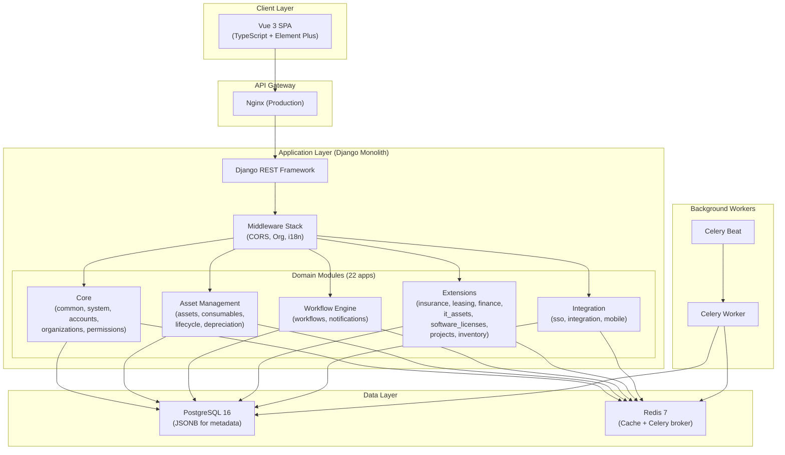
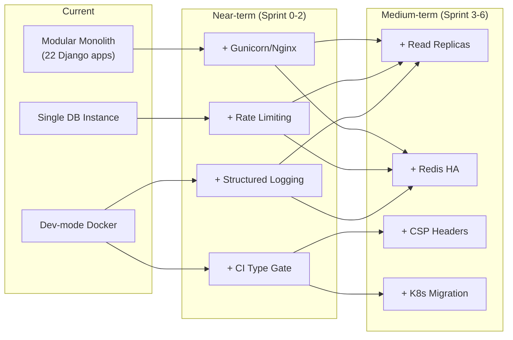

# GZEAMS — Comprehensive Architectural Analysis Report

> **Date**: 2026-03-24  
> **Project**: Hook Fixed Assets Management System (GZEAMS)  
> **Version**: Sprint 4 Complete  
> **Analyst**: Senior Software Architect Review

---

## 1. Architecture Overview

### 1.1 Technology Stack

| Layer | Technology | Version | Status |
|-------|-----------|---------|:------:|
| **Backend Framework** | Django + DRF | 5.x / 3.15 | ✅ Mature |
| **Frontend Framework** | Vue 3 (Composition API) | 3.x + TypeScript | ✅ Modern |
| **UI Library** | Element Plus | Latest | ✅ Stable |
| **State Management** | Pinia | Latest | ✅ Good |
| **Database** | PostgreSQL | 16-alpine | ✅ Enterprise |
| **Cache / Message Broker** | Redis | 7-alpine | ✅ Reliable |
| **Task Queue** | Celery (worker + beat) | Latest | ✅ Production-ready |
| **API Docs** | drf-spectacular (OpenAPI 3) | Latest | ✅ Auto-generated |
| **Auth** | SimpleJWT (Bearer tokens) | Latest | ✅ Standard |
| **Build** | Vite | Latest | ✅ Fast |
| **Container** | Docker Compose | v2 | ⚠️ Dev-only config |

### 1.2 System Architecture Pattern

GZEAMS follows a **modular monolith** pattern — single Django deployment with 22 domain-separated apps under `backend/apps/`, sharing a common database. This is appropriate for the project's scale and team size.



### 1.3 Key Architectural Patterns

| Pattern | Implementation | Assessment |
|---------|---------------|:----------:|
| **Multi-tenancy** | `Organization` FK + `TenantManager` auto-filter on every model | ✅ Excellent |
| **Soft Delete** | `is_deleted` + `deleted_at` + `soft_delete()` on `BaseModel` | ✅ Solid |
| **Metadata-Driven Engine** | `BusinessObject` + `FieldDefinition` + `PageLayout` → dynamic CRUD | ✅ Innovative |
| **Unified Routing** | `/api/system/objects/{code}/` for all business entities | ✅ Low-code ready |
| **Audit Trail** | `created_by`, `updated_by`, `deleted_by`, timestamps on every record | ✅ Complete |
| **UUID Primary Keys** | All models use `UUIDField` PK | ✅ Distributed-ready |
| **JSONB Extensions** | `custom_fields` on `BaseModel` for dynamic data | ✅ Flexible |
| **Signal-based Integration** | Workflow lifecycle signals → business doc sync | ✅ Decoupled |

### 1.4 Codebase Scale

| Metric | Value |
|--------|-------|
| Backend Python (excl. migrations) | ~161,000 lines |
| Frontend TypeScript + Vue | ~28,700+ lines |
| Backend Django apps | 22 |
| Frontend API service files | 30 |
| Frontend Pinia stores | 9 |
| Backend test files | 136 |
| Frontend test files | 184 |
| Docker services | 5 (db, redis, backend, celery_worker, celery_beat) |

---

## 2. Code Quality & Technical Debt

### 2.1 Strengths

- **Strong base class hierarchy**: `BaseModel` → `BaseModelSerializer` → `BaseModelViewSet` → `BaseCRUDService` → `BaseModelFilter` eliminates boilerplate across all 22 apps.
- **Consistent API patterns**: Custom exception handler + `StandardResultsSetPagination` + CamelCase rendering enforce uniform response shapes.
- **Well-separated concerns**: Model/Serializer/ViewSet/Service/Filter layers per module.
- **Dual manager pattern**: `TenantManager` for business data, `GlobalMetadataManager` for system metadata — prevents accidental tenant data leakage.

### 2.2 Design Pattern Usage

| Pattern | Where | Quality |
|---------|-------|:-------:|
| Template Method | `BaseModel.soft_delete()`, ViewSet lifecycle hooks | ✅ |
| Strategy | `ConditionEvaluator` with pluggable operators | ✅ |
| Adapter | `BasePlatformAdapter` for SSO (WeChat/DingTalk/Feishu) | ✅ |
| Observer | Django signals for workflow lifecycle events | ✅ |
| Registry | `ObjectRegistry` for dynamic model resolution | ✅ |
| Mixin | `WorkflowStatusMixin`, `BatchOperationMixin` | ✅ |
| Service Layer | `BaseCRUDService` encapsulates business logic away from ViewSets | ✅ |

### 2.3 Technical Debt Inventory

| Category | Severity | Description |
|----------|:--------:|-------------|
| **Root file pollution** | 🟡 Medium | ~60+ temp files (scripts, JSON dumps, HTML) in project root and ~25 in `backend/` root. These are development artifacts (debug scripts, demo data generators) that should be removed. |
| **TypeScript errors** | 🔴 High | 33 `vue-tsc` errors: 3 in workflow views (type mismatches), 30 in test specs (incomplete mock objects). Blocks CI/CD type-checking. |
| **Unregistered routes** | 🔴 High | 3 Sprint 4 workflow views (`WorkflowDefinitionList`, `WorkflowInstanceList`, `TaskList`) exist in `src/views/workflows/` but have **no route entries** — users cannot navigate to them. |
| **Duplicate view directories** | 🟡 Medium | `src/views/workflow/` (singular, 8 components, registered) and `src/views/workflows/` (plural, 3 components, unregistered) create confusion. |
| **Demo data scripts** | 🟡 Medium | 12 `create_*_demo*.py` scripts in `backend/` root — should be consolidated into Django management commands or removed. |
| **Chinese comments** | 🟡 Medium | Workflow view files (`WorkflowDefinitionList.vue`, etc.) contain Chinese comments, violating the AGENTS.md rule requiring English-only comments. |
| **Hardcoded test codes** | 🟡 Medium | PRD §6.1 reports 88.9% test pass rate (720/810) due to `IntegrityError` from hardcoded codes like `CAT001`. Tests need `_make_unique_code()`. |

---

## 3. Performance & Scalability

### 3.1 Database Design Efficiency

| Aspect | Implementation | Assessment |
|--------|---------------|:----------:|
| **Connection pooling** | `conn_max_age=600` + `conn_health_checks=True` via `dj-database-url` | ✅ Good |
| **Indexing** | Global indexes on `created_at`, `is_deleted` via `BaseModel.Meta` | ✅ Good |
| **JSONB usage** | `custom_fields` for dynamic metadata — avoids expensive EAV joins | ✅ Good |
| **UUID PKs** | All models use UUID — eliminates auto-increment contention | ✅ Good |
| **N+1 queries** | No evidence of `select_related`/`prefetch_related` usage in base ViewSet | ⚠️ Risk |

### 3.2 API Performance

| Aspect | Implementation | Assessment |
|--------|---------------|:----------:|
| **Caching** | Redis via `django_redis` with `gzeams` key prefix | ✅ Configured |
| **Pagination** | `StandardResultsSetPagination` (PAGE_SIZE=20) on all endpoints | ✅ Enforced |
| **Filtering** | `DjangoFilterBackend` + `SearchFilter` + `OrderingFilter` globally | ✅ Efficient |
| **Celery tasks** | 30-min time limit, JSON serialization, result tracking | ✅ Good |
| **Query optimization** | No read-replica or database-level caching evident | 🟡 Acceptable for current scale |

### 3.3 Scalability Considerations

| Dimension | Current State | Recommendation |
|-----------|:------------:|----------------|
| **Horizontal scaling** | Single backend container | Add Gunicorn with multiple workers first; eventual K8s HPA |
| **Database scaling** | Single PostgreSQL instance | Add read replicas for reporting/dashboard queries |
| **Cache strategy** | Redis single-instance | Redis Sentinel or Cluster for HA |
| **Static files** | Django serves in dev; no CDN | Configure S3/CDN for production media/static |
| **Celery scaling** | Single worker container | Add `--concurrency` flag; separate workers by queue priority |

### 3.4 Known Issues & Risks

1. **Docker uses `runserver` in production** — The `docker-compose.yml` runs `python manage.py runserver 0.0.0.0:8000` which is single-threaded and not production-safe. Must switch to Gunicorn/Uvicorn.
2. **No connection pooling middleware** — While `conn_max_age=600` helps, no PgBouncer or Django-level pooling for high concurrency.
3. **Redis single-instance** — Celery broker and cache share the same Redis (different DBs: 0/1/2). A Redis failure takes down both caching and background tasks.
4. **No request rate limiting** — DRF throttling is not configured in `REST_FRAMEWORK` settings.

---

## 4. Security Assessment

### 4.1 Authentication & Authorization

| Mechanism | Implementation | Assessment |
|-----------|---------------|:----------:|
| **Auth method** | JWT (SimpleJWT) with Bearer tokens | ✅ Industry standard |
| **Token lifetime** | Access: 2 hours, Refresh: 7 days | ✅ Reasonable |
| **Token rotation** | `ROTATE_REFRESH_TOKENS=True`, `BLACKLIST_AFTER_ROTATION=True` | ✅ Secure |
| **Password validation** | 4 Django validators (similarity, length, common, numeric) | ✅ Standard |
| **Custom user model** | `accounts.User` with custom fields | ✅ Best practice |
| **Org-level isolation** | `OrganizationMiddleware` + `TenantManager` auto-filter | ✅ Excellent |
| **Permission framework** | Dedicated `permissions` app with `IsAuthenticated` default | ✅ Good |

### 4.2 API Security

| Measure | Implementation | Assessment |
|---------|---------------|:----------:|
| **CORS** | `corsheaders` with strict prod config (raises `ImproperlyConfigured` if not set) | ✅ Excellent |
| **CSRF** | Django middleware enabled, cookie secure in prod | ✅ Good |
| **SSL** | `SECURE_SSL_REDIRECT=True` in production | ✅ Enforced |
| **HSTS** | `SECURE_HSTS_SECONDS=31536000` with preload | ✅ Maximum |
| **XSS protection** | `SECURE_BROWSER_XSS_FILTER=True`, `SECURE_CONTENT_TYPE_NOSNIFF=True` | ✅ Good |
| **Clickjacking** | `XFrameOptionsMiddleware` in middleware stack | ✅ Standard |
| **Rate limiting** | ❌ Not configured in `REST_FRAMEWORK` | 🔴 Missing |
| **Input sanitization** | DRF serializer validation; no explicit XSS sanitization on JSONB fields | ⚠️ Risk |

### 4.3 Health Endpoint Security

The production settings enforce:
- IP allowlist for `/api/health/metrics/` via `HEALTH_METRICS_ALLOWLIST`
- Token requirement via `HEALTH_METRICS_TOKEN`
- Both raise `ImproperlyConfigured` if not set in production

**Assessment**: ✅ Well-designed production hardening

### 4.4 Security Gaps

| Gap | Severity | Recommendation |
|-----|:--------:|----------------|
| No DRF throttling | 🔴 High | Add `DEFAULT_THROTTLE_CLASSES` and `DEFAULT_THROTTLE_RATES` to `REST_FRAMEWORK` |
| No JSONB field sanitization | 🟡 Medium | Add input sanitization for `custom_fields` JSONB to prevent stored XSS |
| `SECRET_KEY` fallback value | 🟡 Medium | `dev-secret-key-change-in-production` default should raise in prod settings |
| No Content Security Policy | 🟡 Medium | Add `django-csp` middleware for production |

---

## 5. Frontend Architecture

### 5.1 Component Structure

```
frontend/src/
├── api/           (30 service files — dedicated API layer per domain)
├── components/    (shared components: engine, designer, common, workflow)
├── composables/   (Vue composables: field permissions, formulas, metadata, etc.)
├── stores/        (9 Pinia stores: user, org, workflow, branding, etc.)
├── views/         (page components organized by domain)
├── types/         (TypeScript type definitions)
├── utils/         (date formatting, validation, i18n, etc.)
├── layouts/       (MainLayout, AuthLayout)
├── router/        (centralized routing — 635 lines)
├── locales/       (i18n translations)
├── platform/      (platform-level layout utilities)
├── contracts/     (API contract types)
├── constants/     (application constants)
├── directives/    (custom Vue directives)
└── adapters/      (API response adapters)
```

### 5.2 State Management (Pinia)

| Store | File | Responsibility |
|-------|------|----------------|
| `user` | `stores/user.ts` (3.5KB) | Auth state, login/logout, profile |
| `org` | `stores/org.ts` (0.9KB) | Current organization context |
| `workflow` | `stores/workflow.ts` (8.5KB) | Full approval lifecycle (Sprint 1 rewrite) |
| `menu` | `stores/menu.ts` (16KB) | Dynamic menu system |
| `branding` | `stores/branding.ts` (6.2KB) | Theme customization |
| `notification` | `stores/notification.ts` (6.8KB) | In-app notification state |
| `locale` | `stores/locale.ts` (3.9KB) | i18n locale management |
| `featureFlag` | `stores/featureFlag.ts` (3.6KB) | Feature toggle system |
| `dict` | `stores/dict.ts` (0.7KB) | Dictionary lookups |

**Assessment**: ✅ Well-organized with clear separation per domain. The `menu` store at 16KB is the largest and may warrant splitting if complexity grows.

### 5.3 API Layer

The API layer follows a consistent pattern with 30 dedicated service files. A notable strength is the `dynamic.ts` module (26KB) that provides the `createObjectClient()` factory for the unified routing system.

**Strengths:**
- Dedicated service file per domain — no god-file
- `base.ts` provides shared request utilities
- Adapter pattern for transforming responses

**Issues:**
- Duplicate API files: `workflow.ts` (7.8KB) and `workflows.ts` (1.3KB) — confusing
- Some API calls use raw `request.get()` while others use class-based services

### 5.4 Routing

The router (`index.ts`, 635 lines) supports:
- **Unified dynamic routes**: `/objects/:code` for all business entities
- **Legacy alias routes**: Backward-compatible redirects from old paths
- **Workflow routes**: `/workflow/*` (singular) as primary, `/workflows/*` as aliases
- **Lazy loading**: All routes use dynamic `import()` for code splitting

**Issues:**
- 3 Sprint 4 views are NOT registered (see §2.3)
- Router file is 635 lines — approaching maintenance threshold

---

## 6. Deployment Readiness

### 6.1 Production Configuration

| Item | Status | Detail |
|------|:------:|--------|
| **WSGI/ASGI server** | 🔴 Missing | Docker Compose uses `manage.py runserver` — must use Gunicorn |
| **SSL/TLS** | ✅ Configured | `SECURE_SSL_REDIRECT`, HSTS headers in `production.py` |
| **Nginx** | 🔴 Missing | No Nginx container or config in Docker Compose |
| **Static file serving** | 🔴 Missing | No `whitenoise` or Nginx config for production static files |
| **Container health checks** | ✅ Good | Health check via `/api/health/live/` on backend, `pg_isready`, `redis-cli ping` |
| **Environment separation** | ✅ Good | Split settings: `base.py`, `development.py`, `production.py`, `test.py` |
| **Secret management** | ⚠️ Partial | `.env` file with defaults — production should use vault/secrets manager |
| **Log management** | ⚠️ Basic | File + console logging; no structured JSON, no log aggregation |
| **Backup strategy** | 🔴 Missing | No PostgreSQL backup configuration or cron |

### 6.2 CI/CD Pipeline

| Item | Status |
|------|:------:|
| GitHub repository | ✅ Configured |
| `.github/` directory | ✅ Present (workflows likely exist) |
| `codecov.yml` | ✅ Present |
| Test infrastructure | ✅ pytest (backend), Vitest/Playwright (frontend) |
| Type checking gate | 🔴 Blocked (33 errors in `vue-tsc`) |
| Lint config | ✅ `.flake8` for backend |

### 6.3 API Integration Patterns

- **OpenAPI 3**: Auto-generated via `drf-spectacular` at `/api/schema/`, with Swagger UI at `/api/docs/` and ReDoc at `/api/redoc/`
- **CamelCase translation**: `djangorestframework-camel-case` auto-converts between Python snake_case and JS camelCase
- **SSO adapters**: WeChat Work, DingTalk, Feishu (via `BasePlatformAdapter`)
- **Integration module**: Dedicated `apps/integration/` for external API calls with audit logging

---

## 7. Monitoring & Logging

### 7.1 Health Checks

| Endpoint | Purpose |
|----------|---------|
| `GET /api/health/` | Full system health (DB, Redis, Celery) |
| `GET /api/health/live/` | Liveness probe (container is alive) |
| `GET /api/health/ready/` | Readiness probe (can serve requests) |
| `GET /api/health/metrics/` | Detailed metrics (IP-restricted, token-protected in prod) |

**Assessment**: ✅ Well-designed 4-layer health system suitable for Kubernetes or load balancer integration.

### 7.2 Logging

```python
# Current config (base.py)
LOGGING = {
    'handlers': {
        'console': { 'formatter': 'verbose' },
        'file':    { 'filename': 'logs/django.log' },
    },
    'loggers': {
        'django': { 'level': 'INFO' },
        'apps':   { 'level': 'DEBUG', 'handlers': ['console', 'file'] },
    },
}
```

**Gaps:**
- No structured (JSON) logging for log aggregation (ELK/Datadog)
- No request-level tracing (correlation IDs)
- No per-app log level configuration
- File handler without rotation (will grow unbounded)

---

## 8. Recommendations

### 8.1 Critical (Before Production)

| # | Item | Effort | Impact |
|:-:|------|:------:|:------:|
| 1 | **Replace `runserver` with Gunicorn** in Docker Compose | 1h | 🔴 |
| 2 | **Add Nginx reverse proxy** container for static files, SSL termination, request buffering | 3h | 🔴 |
| 3 | **Add DRF throttling** (`DEFAULT_THROTTLE_CLASSES`) to prevent API abuse | 1h | 🔴 |
| 4 | **Fix 33 TypeScript errors** to unblock CI type-checking | 3h | 🔴 |
| 5 | **Register 3 workflow routes** so Sprint 4 UI is reachable | 30m | 🔴 |

### 8.2 High Priority (Sprint 0–1)

| # | Item | Effort | Impact |
|:-:|------|:------:|:------:|
| 6 | **Delete temp files** (~60 root + ~25 backend) and update `.gitignore` | 30m | 🟡 |
| 7 | **Fix production `SECRET_KEY`** — raise `ImproperlyConfigured` if using default | 15m | 🟡 |
| 8 | **Add `select_related`/`prefetch_related`** in base ViewSet `get_queryset()` for FK-heavy models | 2h | 🟡 |
| 9 | **Consolidate demo data scripts** into Django management commands | 2h | 🟡 |
| 10 | **Fix test data isolation** — use UUID-based test codes instead of hardcoded `CAT001` | 4h | 🟡 |

### 8.3 Scalability Improvements (Sprint 2+)

| # | Item | Effort | Impact |
|:-:|------|:------:|:------:|
| 11 | **Add PostgreSQL read replica** for dashboard/reporting queries | 4h | 🟢 |
| 12 | **Add structured JSON logging** for production log aggregation | 2h | 🟢 |
| 13 | **Add request correlation IDs** via middleware for distributed tracing | 2h | 🟢 |
| 14 | **Add log rotation** (use `RotatingFileHandler` or external log driver) | 1h | 🟢 |
| 15 | **Add Redis Sentinel** or separate Redis instances for cache vs Celery | 3h | 🟢 |
| 16 | **Add Content Security Policy** via `django-csp` | 1h | 🟢 |
| 17 | **Add PgBouncer** connection pooling for high-concurrency workloads | 2h | 🟢 |

### 8.4 Architecture Evolution Summary



---

## 9. Overall Assessment

| Dimension | Score | Notes |
|-----------|:-----:|-------|
| **Architecture Design** | 8/10 | Strong metadata-driven engine, clean multi-tenancy, well-layered base classes |
| **Code Quality** | 7/10 | Good patterns, but temp file pollution and Chinese comments need cleanup |
| **Security** | 7/10 | Solid JWT + CORS + HSTS, but missing rate limiting and JSONB sanitization |
| **Performance** | 6/10 | Redis caching configured, but no query optimization, no connection pooling middleware |
| **Testing** | 6/10 | 136 backend + 184 frontend test files exist, but 88.9% pass rate and 33 TS errors |
| **Deployment Readiness** | 4/10 | Health checks excellent, but `runserver` in Docker, no Nginx, no backup strategy |
| **Frontend Architecture** | 7/10 | Clean store/API/component separation, but route gaps and duplicate directories |
| **Monitoring** | 5/10 | Health endpoints good, logging too basic for production |

### Overall: **6.5/10** — Strong foundation with clear path to production readiness

The GZEAMS codebase demonstrates sophisticated architectural decisions (metadata engine, multi-tenancy, signal-based workflow integration) that are above average for a project at this stage. The primary gap is in **operational readiness** — the code is well-designed but the deployment pipeline needs hardening before production use. The Sprint 0 cleanup items (temp files, TS errors, route registration) and the production infrastructure items (Gunicorn, Nginx, rate limiting) are the critical blockers.

---

*Report generated: 2026-03-24*
